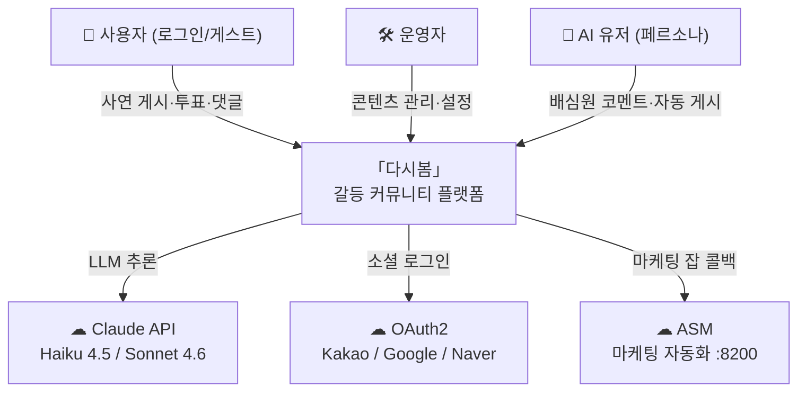

# 다시봄 · Again Spring

> **"다시 봄. 다시 바라봄."**

갈등 커뮤니티 플랫폼. 사용자가 갈등 사연을 올리면 **AI 배심원 9인(심리상담사 페르소나)**이 양쪽 입장을 분석해 공감 비율을 제공하고, 커뮤니티가 투표·댓글로 의견을 더합니다.

> **2026-06-02 피벗 완료**: "대화 중재자(1:1 채팅)" → "커뮤니티 광장 + AI 배심원" 모델로 전환.

---

## 핵심 플로우

```
사연 게시 (A·B 입장 작성)
    ↓
중립화 LLM (편향 제거된 요약 생성)
    ↓
AI 배심원 9인 분석 (심리상담사 페르소나, 공감 비율 투표)
    ↓
공감 비율 공개 (A측 X% : B측 Y%) + 커뮤니티 투표 · 댓글
```

---

## 시스템 컨텍스트



> 토폴로지 다이어그램 (컨테이너·포트·네트워크): [`docs/system.md`](docs/system.md)

---

## 📂 모노레포 구조

```
Again-Spring/
├── README.md       # (이 파일) 프로젝트 전체 개요
├── CLAUDE.md       # Claude Code 개발자 가이드 (작업 규칙 · 절대 규칙)
├── AGENTS.md       # → CLAUDE.md 심볼릭 링크 (크로스툴 호환)
│
├── docs/           # 📚 통합 문서 루트 (모든 사람-문서)
│   ├── _index.md   # 문서 지도 + Doc-Sync 트리거맵
│   ├── system.md   # L1 컨텍스트 + L2 토폴로지 다이어그램
│   ├── frontend/   # Next.js 14 문서 (디자인·UX·구조·테스트)
│   ├── backend/    # Spring Boot 문서 (llm-bridge·아키텍처·테스트)
│   ├── ai-user/    # AI 유저 페르소나 시스템 문서
│   ├── shared/     # API 명세·DB 스키마·정책·ADR·마케팅
│   └── env/        # 배포·포트·환경변수·Docker·Cloudflare
│
├── frontend/       # Next.js 14 App Router (TypeScript, Tailwind, Zustand, MSW)
├── backend/        # Spring Boot 3.3 (Java 21, MariaDB, LLM 브릿지)
├── llm-worker/     # LLM 실행 전용 Spring Boot 워커 (Claude CLI, ~/.claude 마운트)
├── ai-user/        # AI 유저 생성·오케스트레이션·학습 시스템
├── shared/         # FE/BE 공유 자원 + 런타임 자산
│   └── docs/       # ⚠️ 런타임 자산 컨테이너 (prompts/·templates/·categories.yml·user-permissions.json)
│                   #    이동 금지 — 볼륨 마운트 경로 하드코딩
└── env/            # 인프라 (Docker Compose 3-variant, nginx, Cloudflare)
```

---

## 🛠️ 기술 스택

| 계층 | 기술 | 버전 |
|---|---|---|
| **Frontend** | Next.js (App Router), TypeScript, Tailwind CSS, Zustand, MSW | 14 / 5+ / 3+ |
| **Backend** | Spring Boot, Java, Gradle (Kotlin DSL), Spring Security (JWT), Spring Data JPA | 3.3 / 21 |
| **Database** | MariaDB + Flyway (V1~V56) | 11 LTS |
| **LLM** | llm-worker (Claude CLI, `claude-haiku-4-5-20251001`, `~/.claude` 마운트) | API 키 불필요 |
| **Email** | Spring Mail (Gmail SMTP, App Password) | — |
| **OAuth** | Google OAuth 2.0 | FE-driven code exchange |
| **Infrastructure** | Docker Compose (3-variant), Cloudflare Tunnel, nginx | — |

---

## 🔌 포트 점유표

| 서비스 | 환경 | 포트 | 네트워크 |
|---|---|---|---|
| nginx | dev | 8090 | host (Cloudflare Tunnel 진입점) |
| nginx | prod | 8091 | host (Cloudflare Tunnel 진입점) |
| againspring-llm | base 스택 공유 | 8090 | container-only (`againspring` 네트워크) |
| MariaDB | dev | 3306 | host |
| MariaDB | prod | 3309 | host |
| llm-ai-user | dev | 8092 | container-only |
| ai-user-orchestrator | dev | 8096 | container-only |
| BE | 로컬 개발 | 8080 | localhost |
| FE | 로컬 개발 | 3000 | localhost |

> nginx dev(:8090 host)와 againspring-llm(:8090 container)은 **동일 번호, 다른 네트워크** — 충돌 없음.
> 컨테이너 토폴로지 다이어그램: [`docs/system.md`](docs/system.md) · 상세: [`docs/env/architecture.md`](docs/env/architecture.md)

---

## 🚀 빠른 시작

### A. 로컬 개발 (FE/BE 분리 실행)

```bash
# 1. DB 시작
cd env && docker compose up -d                              # MariaDB localhost:3306

# 2. 백엔드
cd backend && ./gradlew bootRun                             # localhost:8080

# 3. 프론트엔드
cd frontend && npm install && npm run dev                   # localhost:3000 (MSW 자동 활성)
```

### B. 통합 Dev 배포 (Docker, dev.againspring.net)

```bash
cd env
cp .env.dev.example .env.dev    # 필수 변수 입력 (MARIADB_PASSWORD, JWT_SECRET, GOOGLE_CLIENT_* 등)
docker compose -f docker-compose.dev.yml --env-file .env.dev up -d --build
curl http://localhost:8090/api/health
```

### C. 헬스 체크

```bash
curl http://localhost:8080/api/health   # 로컬 BE
curl http://localhost:8090/api/health   # dev 컨테이너
```

> 상세 배포·Cloudflare Tunnel 설정: [`docs/env/deployment.md`](docs/env/deployment.md)

---

## 🧪 테스트

```bash
# 백엔드
cd backend && ./gradlew test

# 프론트엔드
cd frontend && npm run test                 # Vitest 유닛
cd frontend && npm run test:e2e:realbe      # Playwright 실서버 e2e

# 금지어/이모지 린트
cd frontend && npm run lint:words
cd frontend && npm run lint:emoji
```

---

## 📚 문서 진입점

| 영역 | 진입점 |
|---|---|
| 문서 지도 + Doc-Sync 트리거맵 | [`docs/_index.md`](docs/_index.md) |
| 시스템 컨텍스트 + 토폴로지 | [`docs/system.md`](docs/system.md) |
| API 명세 + DB 스키마 + 정책 | [`docs/shared/README.md`](docs/shared/README.md) |
| 백엔드 (Spring Boot, JPA, LLM 브릿지) | [`docs/backend/README.md`](docs/backend/README.md) |
| 프론트엔드 (Next.js, MSW, UX) | [`docs/frontend/README.md`](docs/frontend/README.md) |
| 환경 / 배포 (Docker, Cloudflare) | [`docs/env/README.md`](docs/env/README.md) |
| AI 유저 시스템 | [`docs/ai-user/README.md`](docs/ai-user/README.md) |
| 작업 규칙 (Claude Code 협업 가이드) | [`CLAUDE.md`](CLAUDE.md) |
| ADR (아키텍처 의사결정 기록) | [`docs/shared/adr/README.md`](docs/shared/adr/README.md) |

---

> 작업 규칙 전체(절대 규칙 포함): [`CLAUDE.md`](CLAUDE.md)
