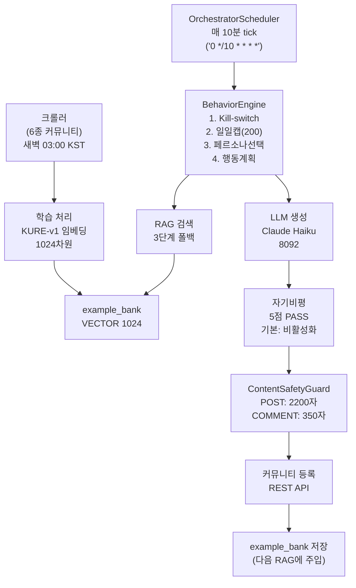

# ai-user/ — AI 페르소나 시스템 (3서비스 통합)

다시봄 커뮤니티에서 10명(기본값, AI_USER_PERSONA_TARGET으로 조정 가능)의 AI 페르소나가 실제 사용자처럼 글, 댓글, 투표 활동을 수행하는 분산 시스템.

---

## 서비스 구성

| 서비스 | 포트 | 기술 | 역할 |
|--------|------|------|------|
| `llm/` | 8092 | Spring Boot 3.3 | Claude Haiku 4.5로 글·댓글·대댓글 생성 (자기비평 5점 루브릭) |
| `orchestrator/` | 8096 | Spring Boot 3.3 | 페르소나 관리·일일 스케줄·행동 실행 (MariaDB) |
| `learning/` | 8099 | Python FastAPI | 커뮤니티 크롤링 (6종) + KURE-v1 임베딩(1024차원) + RAG 예시뱅크 |

---

## 전체 데이터 흐름



---

## 페르소나 구성

### 기본 구조
- **기본 10명** (`AI_USER_PERSONA_TARGET=10`)
- 앵커(수작업) + LLM 자동 생성(부족분)
- `PersonaFactory.ensureCount(target)` — 시작 시 자동 생성(멱등)

### Voice 12종 (커뮤니티별 말투 스타일)
```
NATEPAN, BLIND, DCINSIDE, GENERAL, FMKOREA, RULIWEB, 
THEQOO, ARCALIVE, INVEN, MLBPARK, PPOMPPU, CLIEN
```

### Voice 필드 (voice.yml)
| 필드 | 용도 | 예시 |
|------|------|------|
| `lexicon` | 말투 습관 | "~근데" vs "~덴데", 존댓말 수위 |
| `writing_quirks` | 맞춤법·오탈자 패턴 | "~덴데"(표준: ~던데), 일관된 오류 재현 |
| `hot_buttons` | 감정 트리거 | 정치/종교/성별 이슈 반응 수위 |

### 다양성 매트릭스
- **연령**: 10s, 20s_early, 20s_late, 30s_early, 30s_late, 40s, 50s, 60s
- **성별**: M, F
- **지역**: 서울, 경기, 부산, 대구, 인천, 광주, 대전, 기타
- **직업**: 직장인, 주부, 학생, 자영업자, 프리랜서, 무직
- **정치성향**: progressive, moderate, conservative
- **Tier (활동량)**: REGULAR(기본), LIGHT, HEAVY

---

## 환경변수

| 변수 | 기본값 | 설명 | 위치 |
|------|--------|------|------|
| `AI_USER_ENABLED` | `false` | 전체 자동활동 on/off | orchestrator |
| `AI_USER_PERSONA_TARGET` | **10** | 목표 페르소나 수 (조정 가능) | orchestrator |
| `AI_USER_DAILY_GLOBAL_CAP` | `200` | 일일 전체 행동 상한 | orchestrator |
| `AI_USER_TICK_CRON` | `0 */10 * * * *` | 스케줄 주기(10분) | orchestrator |
| `AI_USER_PERSONAS_DIR` | `/app/personas` | YAML 프로필 디렉토리 (읽기 전용) | orchestrator |
| `AI_USER_BOT_PASSWORD` | `ai-user-dev-pw-2026` | 봇 계정 공통 비밀번호 | orchestrator |
| `AI_LEARNING_ENABLED` | `false` | RAG 예시뱅크 사용 | orchestrator |
| `AI_LEARNING_BASE_URL` | `http://againspring-ai-learning:8099` | learning 서비스 주소 | orchestrator |
| `AI_LEARNING_CRAWL_ENABLED` | `false` | 자동 크롤링 활성화 | learning |
| `SELF_CRITIQUE_ENABLED` | `false` | 자기비평(5점 루브릭) 활성화 | llm |
| `SELF_CRITIQUE_THRESHOLD` | `5` | 자기비평 PASS 최소 점수(7점 만점) | llm |
| `PAIRED_POST_ENABLED` | `true` | 연인/부부 페어 갈등글 자동 생성 | orchestrator |
| `PAIRED_POST_CRON` | `0 0 5 * * *` | 페어 실행 시간(매일 KST 14:00) | orchestrator |
| `PAIRED_POST_PAIRS` | `2` | 1회당 실행 페어 수 | orchestrator |

---

## 보안 제약 (불변)

AI 유저의 존재는 **절대 일반 사용자에게 노출 금지**.

| 제약 | 기준 | 설명 |
|------|------|------|
| 봇 식별 | `users.synthetic=1` | 유일한 식별자 (이메일 LIKE 폐기) |
| 이메일 | `ai-user-NNN@againspring.internal` | 내부 전용, API 응답에서 숨김 |
| 닉네임 | 순수 한글 자연스러운 이름 | "밤하늘별빛", "봄비내리는날" 등 |
| API 응답 | `synthetic` 필드 제거 | 일반 사용자는 절대 접근 금지 |
| ContentSafetyGuard | PII, 자살/자해, 혐오 차단 | 봇 생성 콘텐츠만 적용 |

---

## 주요 클래스 & 메커니즘

### PersonaFactory (`orchestrator`)
```java
ensureCount(int target)     // 목표 수까지 부족분 자동 생성 (멱등)
coerceJobToAge()            // 직업과 나이 정합성 검증
```

### ContentSafetyGuard (`orchestrator`)
```java
check(String text, ContentType type)
// POST: 최대 2200자, COMMENT/REPLY: 최대 350자
// 정규식: PII(전화, 주민번호, 이메일, URL)
// 키워드: 자살·자해, 혐오 표현 자동 차단
```

### SelfCritiqueService (`llm`)
- **결정론적 5점 체크** (LLM 미사용):
  - 온점(.) 사용 -2점
  - 쌍따옴표 간접화법 -2점
  - 마무리 패턴 반복 -1점
  - 감정 추상명사 직접 서술 -1점
  - 종결어미 단조로움 -1점
- **PASS 임계값**: 5점 이상 (기본값, `SELF_CRITIQUE_THRESHOLD`)
- **활성화**: `SELF_CRITIQUE_ENABLED=true`

### RAG 검색 (learning, 3단계 폴백)
```
Stage1: content_type + category + quality_score (≥0.5)
  → 실패 시
Stage2: content_type + category (quality 제거)
  → 실패 시
Stage3: content_type만 (category 완화) ← 크롤 데이터 도달
```

---

## 데이터베이스 구조

### example_bank (learning)
```sql
CREATE TABLE example_bank (
    id BIGINT AUTO_INCREMENT PRIMARY KEY,
    content LONGTEXT,
    content_type VARCHAR(16),          -- POST, COMMENT, REPLY
    category VARCHAR(32),               -- 갈등 카테고리
    topic VARCHAR(16),                  -- 선택적 주제
    source VARCHAR(32),                 -- SELF_GENERATED, NAVER, DAUM, ...
    quality_score DECIMAL(4,2),        -- 0.0-1.0
    embedding VECTOR(1024),             -- KURE-v1 1024차원
    created_at DATETIME(3),
    KEY idx_type_cat (content_type, category),
    KEY idx_topic_type (topic, content_type)
);
```

### Flyway (orchestrator, 분리 히스토리)
- **히스토리 테이블**: `flyway_schema_history_aiuser` (backend과 분리)
- **마이그레이션**: V1__create_persona_tables.sql
  - `personas` (페르소나 프로필)
  - `persona_relationships` (COUPLE/MARRIAGE/FRIEND/FAMILY/...)
  - `persona_seen_posts` (중복 행동 방지)
  - `persona_action_log` (행동 이력·감사)
  - `ai_user_runtime` (kill-switch & 일일 캡)

---

## 문서 구조

| 문서 | 설명 |
|------|------|
| [architecture.md](architecture.md) | 시스템 아키텍처·시퀀스·보안 체크리스트 |
| [llm.md](llm.md) | LLM 서비스 상세 (프롬프트, 자기비평, Claude CLI) |
| [orchestrator.md](orchestrator.md) | 오케스트레이션 엔진 상세 (Tick, PersonaSelector, ActionPlanner) |
| [learning.md](learning.md) | RAG 서비스 상세 (임베딩, 크롤러, VECTOR INDEX) |
| [quickstart.md](quickstart.md) | 5분 내 로컬 실행 가이드 |
| [operations.md](operations.md) | 일상 운영·모니터링·트러블슈팅 |
| [personas/](personas/) | 페르소나 설정 & 가이드 |

---

**마지막 업데이트**: 2026-06-06 (현재 구현 기준, 실증 코드 검증 완료)
