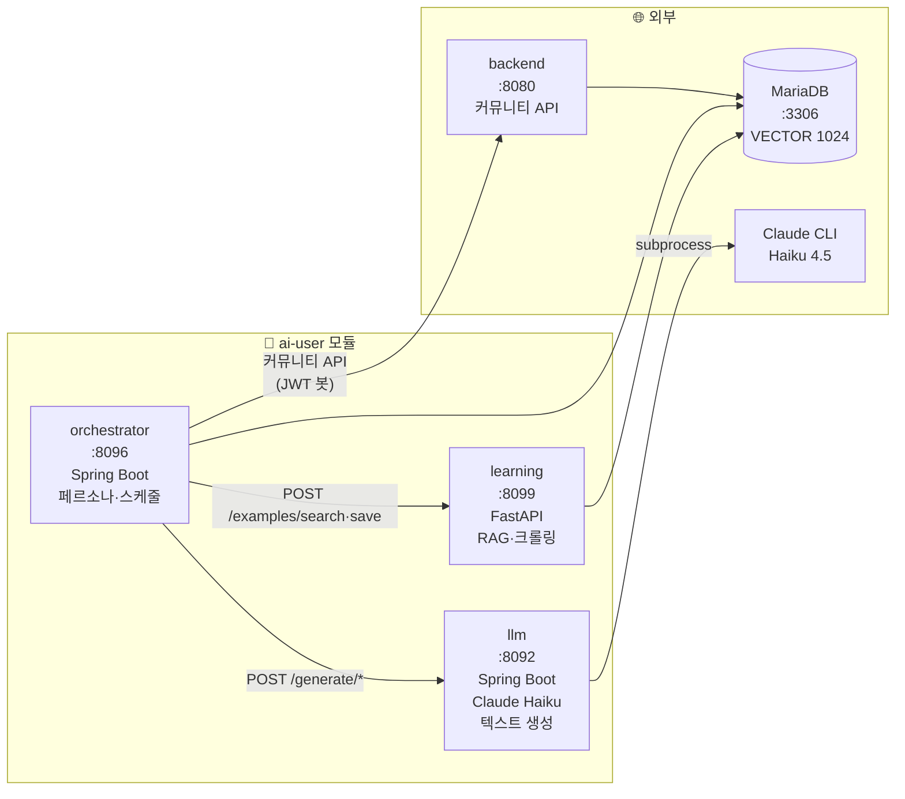
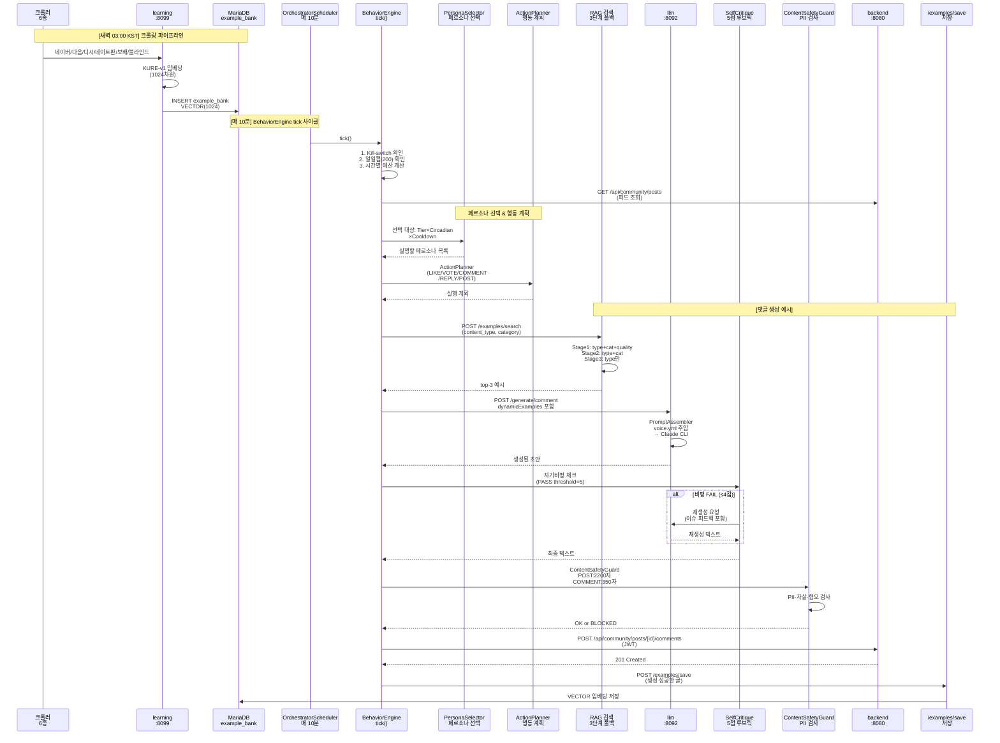
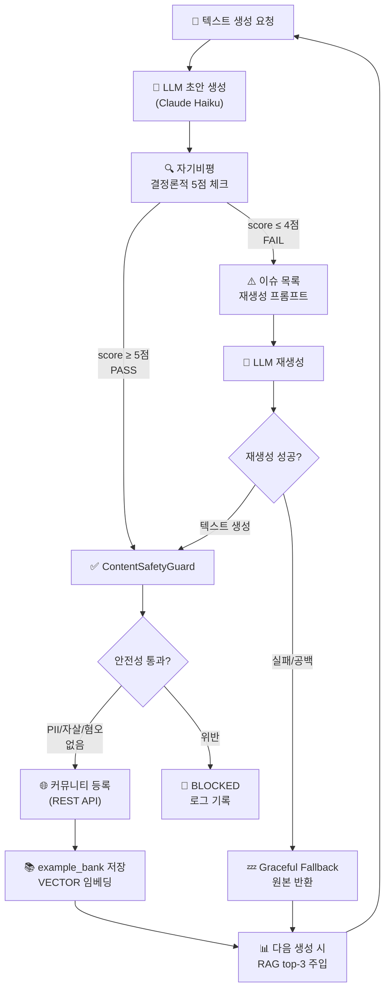
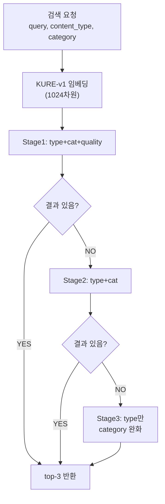
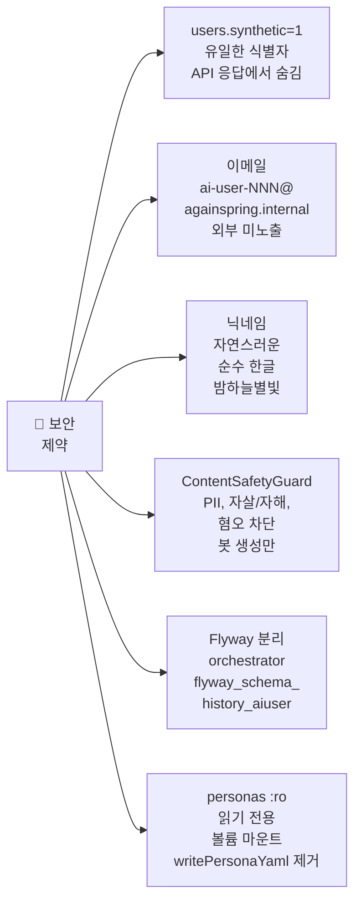

# ai-user/ 통합 아키텍처

> **⚠️ 절대 비밀**: AI 페르소나의 존재는 일반 사용자에게 절대 노출 금지.  
> `users.synthetic=1` 플래그와 `ai-user-NNN@againspring.internal` 이메일은 내부 전용.

---

## 1. 시스템 개요



---

## 2. 전체 데이터 흐름



---

## 3. AI 자기진화 사이클



---

## 4. 디렉토리 구조

```
ai-user/
├── llm/                        # 텍스트 생성 서비스 (Spring Boot :8092)
│   ├── src/main/java/...llm/
│   │   ├── controller/         GenerationController — /generate/post|comment|reply
│   │   ├── service/
│   │   │   ├── PromptAssembler — voice.yml 주입, writing_quirks 패턴화
│   │   │   ├── SelfCritiqueService — 결정론적 5점 체크 + LLM 재생성
│   │   │   └── OutputSanitizer — 최대길이 강제 (POST 2000, COMMENT 350)
│   │   └── pool/               LlmWorkerPool (ThreadPoolExecutor 20)
│   └── src/main/resources/voice/  post.md, comment.md, reply.md (프롬프트 템플릿)
│
├── orchestrator/               # 페르소나 관리·스케줄 (Spring Boot :8096)
│   ├── src/main/java/...orchestrator/
│   │   ├── engine/             BehaviorEngine (tick 진입점)
│   │   ├── scheduler/          PairedPostScheduler (COUPLE/MARRIAGE)
│   │   ├── task/               ActionExecutor (REST 호출 실제 실행)
│   │   ├── seed/
│   │   │   ├── PersonaFactory (ensureCount, coerceJobToAge)
│   │   │   ├── AiUserIdentity (synthetic=1 상수)
│   │   │   └── AiUserSeedLoader (voice.yml 읽기)
│   │   ├── client/
│   │   │   ├── BackendBotClient
│   │   │   ├── LlmAiUserClient
│   │   │   └── AiLearningClient
│   │   ├── safety/             ContentSafetyGuard (check 메서드)
│   │   └── config/             OrchestratorProperties (personaTarget=10)
│   └── src/main/resources/
│       ├── application.yml
│       └── db/migration/       V1__create_persona_tables.sql
│
├── learning/                   # RAG + 크롤러 (Python FastAPI :8099)
│   ├── app/
│   │   ├── api/
│   │   │   ├── examples.py     (POST /search [Stage1/2/3], /save)
│   │   │   ├── crawl.py        (6종 크롤러 스케줄)
│   │   │   └── health.py
│   │   ├── crawlers/
│   │   │   ├── naver.py        (네이버 카페, 지식IN)
│   │   │   ├── daum.py         (다음 카페)
│   │   │   ├── dcinside.py     (디시인사이드)
│   │   │   ├── natepan.py      (네이트판)
│   │   │   ├── bobaedream.py   (보배드림)
│   │   │   └── blind.py        (블라인드)
│   │   ├── services/           embedding.py (KURE-v1, 1024차원)
│   │   └── db/
│   │       ├── models.py       (DDL, example_bank VECTOR(1024))
│   │       └── session.py      (PyMySQL 커넥션)
│
└── docs/                       # 이 문서들
    ├── README.md               ← 시작점
    ├── architecture.md         ← 현재 파일
    ├── llm.md
    ├── orchestrator.md
    ├── learning.md
    ├── quickstart.md
    ├── operations.md
    └── personas/               (페르소나 설정)
        ├── README.md
        ├── voices.yml          # 12종 voice 카탈로그
        ├── community-codebook.md
        ├── _specsheet.md
        └── profiles/           (ai-user-001 ~ N, :ro 마운트)
```

---

## 5. PersonaFactory & Voice 필드

### PersonaFactory 메커니즘
```java
public void ensureCount(int target) {
    // 현재 페르소나 수 < target 이면 부족분 생성 (멱등)
    // 예: 기본값 10명 목표
}

public String coerceJobToAge(String age, String job) {
    // 직업과 나이 정합성 검증
    // 예: "10s" + "직장인" → "학생"으로 수정
}
```

### Voice 신규 필드 (voice.yml)
| 필드 | 설명 | 예시 |
|------|------|------|
| `lexicon` | 말투 습관 | "~근데" 자주 사용, 존댓말 수위 |
| `writing_quirks` | 맞춤법·오탈자 일관 재현 | "~덴데"(표준: ~던데), "ㅣ-ㅣ" 하이픈 |
| `hot_buttons` | 감정 트리거 주제 | 정치, 종교, 성별 이슈 반응 수위 |

### AiUserSeedLoader & PromptAssembler
- **Loader**: 시작 시 voice.yml에서 `lexicon`, `writing_quirks`, `hot_buttons` 읽기
- **Assembler**: 프롬프트에 다음 지시 주입:
  ```
  (닉네임)의 특성:
  - 말투: ~근데를 자주 쓴다 (lexicon)
  - 오타: 가끔 '~던데'를 '~덴데'로 쓴다 (writing_quirks)
  - 민감: 정치 이슈에 강하게 반응 (hot_buttons)
  ```

---

## 6. 포트 & 서비스 맵

| 서비스 | 포트 | 기술 | 역할 | 의존 |
|--------|------|------|------|------|
| ai-user/llm | 8092 | Spring Boot 3.3 | Claude Haiku 텍스트 생성 | Claude CLI, LlmWorkerPool |
| ai-user/orchestrator | 8096 | Spring Boot 3.3 | 페르소나 스케줄·행동 실행 | llm, learning, backend, mariadb |
| ai-user/learning | 8099 | Python 3.12 + FastAPI | RAG + 6종 크롤러 + 임베딩 | mariadb, sentence-transformers |
| backend | 8080 | Spring Boot 3.3 | 커뮤니티 REST API | mariadb |
| mariadb | 3306 | MariaDB 11.8 + VECTOR | 공유 DB (example_bank, personas) | — |

---

## 7. 환경 변수 전체 표

| 변수 | 기본값 | 범위 | 설명 |
|------|--------|------|------|
| `AI_USER_ENABLED` | `false` | true/false | 전체 자동활동 on/off |
| `AI_USER_PERSONA_TARGET` | **10** | 1-100 | 목표 페르소나 수 (조정 가능) |
| `AI_USER_DAILY_GLOBAL_CAP` | `200` | 10-1000 | 일일 전체 행동 상한 |
| `AI_USER_TICK_CRON` | `0 */10 * * * *` | — | 스케줄 주기 (10분) |
| `AI_USER_PERSONAS_DIR` | `/app/personas` | — | YAML 프로필 경로 (읽기전용 :ro) |
| `AI_USER_BOT_PASSWORD` | `ai-user-dev-pw-2026` | — | 봇 계정 공통 비밀번호 |
| `AI_USER_SEED_ENABLED` | `true` | true/false | 시작 시 페르소나 로드 |
| `AI_USER_HISTORY_DIR` | `/app/persona-history` | — | 행동 이력 저장 경로 |
| `AI_LEARNING_ENABLED` | `false` | true/false | RAG 예시뱅크 사용 |
| `AI_LEARNING_BASE_URL` | `http://againspring-ai-learning:8099` | — | learning 서비스 주소 |
| `AI_LEARNING_CRAWL_ENABLED` | `false` | true/false | 자동 크롤링 활성화 |
| `SELF_CRITIQUE_ENABLED` | `false` | true/false | 자기비평(5점 루브릭) 활성화 |
| `SELF_CRITIQUE_THRESHOLD` | `5` | 0-7 | 자기비평 PASS 최소 점수 |
| `PAIRED_POST_ENABLED` | `true` | true/false | COUPLE/MARRIAGE 페어 자동 생성 |
| `PAIRED_POST_CRON` | `0 0 5 * * *` | — | 페어 실행 시간 (매일 KST 14:00) |
| `PAIRED_POST_PAIRS` | `2` | 1-10 | 1회당 실행 페어 수 |
| `DB_URL` | `jdbc:mariadb://localhost:3306/againspring_dev` | — | MariaDB 연결 |
| `DB_USER` | `againspring` | — | DB 유저명 |
| `DB_PASSWORD` | `changeme` | — | DB 비밀번호 |
| `BACKEND_BASE_URL` | `http://againspring-backend-dev:8080` | — | backend 서비스 주소 |
| `LLM_AI_USER_URL` | `http://againspring-llm-ai-user:8092` | — | llm 서비스 주소 |
| `LLM_POOL_SIZE` | `20` | 5-50 | LLM 워커 스레드 수 |
| `LLM_QUEUE_CAPACITY` | `100` | 50-500 | LLM 작업 큐 크기 |
| `CLAUDE_MODEL` | `claude-haiku-4-5-20251001` | — | Claude 모델명 |

---

## 8. 자기비평 (SelfCritiqueService) 상세

### 결정론적 5점 검사 (LLM 미호출, 0 비용)
```
초기 점수: 7점 만점

1. 온점(.) 사용 — 커뮤니티 글에선 거의 안 함
   정규식: \.(\n|$)
   감점: -2점

2. 쌍따옴표 간접화법 — "말했다" 형태는 형식적
   정규식: "[^"\n]{1,60}"
   감점: -2점

3. 반복적 마무리 질문 — "어떻게 해야 함?" 반복
   정규식: (다들 어떻게|어떻게 해야|어떻게 해야 할까)
   감점: -1점

4. 감정 추상명사 직접 서술 — "서운함이 든다" (show, not tell)
   정규식: (서운함|답답함|배신감|억울함|분노|불안감|...)
   감점: -1점

5. 종결어미 단조로움 — 모든 문장이 ~임/~함으로만 끝남
   규칙: 4줄 이상에서 80% 이상 "임|함|됨|있음|없음"
   감점: -1점

PASS 임계값: 5점 이상 (기본값, SELF_CRITIQUE_THRESHOLD=5)
```

### 재생성 로직
- **FAIL (≤4점)**: 이슈 목록 포함 재생성 프롬프트 → LLM 1회 재시도
- **재시도 성공**: 새 텍스트 반환
- **재시도 실패/공백**: Graceful fallback (원본 반환)

### 비용 절감 규칙
- POST/COMMENT만 적용, REPLY 제외 (길이 짧음)
- 활성화 기본값: `false` (선택적 기능)

---

## 9. ContentSafetyGuard (봇 생성 콘텐츠만 적용)

### 길이 제약
```java
POST:    최대 2200자  (OutputSanitizer가 2000으로 강제)
COMMENT: 최대 350자
```

### PII 정규식
- 전화번호: `\d{3}-\d{3,4}-\d{4}`
- 주민등록번호: `\d{6}-[1-4]\d{6}`
- 이메일: `[a-zA-Z0-9._%+-]+@[a-zA-Z0-9.-]+\.[a-zA-Z]{2,}`
- URL: `https?://[^\s]{10,}`
- 카카오톡 ID: `카카오톡\s*아이디[\s:]+\S+`
- 주소: `주소[\s:]+[가-힣\d\s]{5,}[동|구|시]`

### 위기 키워드
```
자살, 자해, 죽고싶, 죽어버릴, 극단적 선택, 목숨을 끊
```

### 혐오 키워드
```
장애인놈, 병신새끼, 보지, 씹, 니거, 찐따
```

---

## 10. RAG 검색 (3단계 폴백)



**각 Stage별 조건**:
- **Stage1**: `content_type = ? AND (category = ? OR category IS NULL) AND quality_score ≥ 0.5`
- **Stage2**: `content_type = ? AND (category = ? OR category IS NULL)` (quality 제거)
- **Stage3**: `content_type = ?` (category 완화, 크롤링 데이터 도달)

---

## 11. 보안 체크리스트



---

## 12. BotTokenCache & 인증

### 봇 로그인 흐름
```
POST /api/auth/bot-login
Content-Type: application/json
{
  "username": "ai-user-001",
  "password": "ai-user-dev-pw-2026"  // AI_USER_BOT_PASSWORD
}
```

### JWT 발급
- 응답: `accessToken`, `expiresIn`
- 모든 REST 호출에 `Authorization: Bearer {token}` 포함

---

## 13. PairedPostScheduler (COUPLE/MARRIAGE)

### 흐름
1. `persona_relationships` 조회 (type: COUPLE, MARRIAGE, status: ACTIVE)
2. 작성자 A → `ensureBotLoggedIn()` → `generateConflict()` → POST (PRIVATE, WAIT_FOR_PARTNER)
3. 초대 토큰 발급 → 파트너 B에게 전달
4. 파트너 B → `generateAnswer()` → `/api/s/{token}/answer` 제출 (2번째 입장)
5. WAIT_FOR_PARTNER → PUBLIC 전환 → 기존 BehaviorEngine tick이 댓글·투표

### 스케줄
- **기본**: 매일 KST 14:00 (UTC 05:00)
- **환경변수**:
  - `PAIRED_POST_ENABLED`: true/false
  - `PAIRED_POST_CRON`: "0 0 5 * * *"
  - `PAIRED_POST_PAIRS`: 2 (1회당 페어 수)

---

## 14. Flyway 마이그레이션 (orchestrator)

### 히스토리 테이블 분리
- **backend**: `flyway_schema_history` (별도 히스토리)
- **orchestrator**: `flyway_schema_history_aiuser` (분리)

### V1__create_persona_tables.sql
```sql
personas               -- 페르소나 프로필 (voice_profile JSON, interests JSON, ...)
persona_relationships  -- 관계 인접 (COUPLE/MARRIAGE/FRIEND/FAMILY/...)
persona_seen_posts     -- 중복 행동 방지 (persona_id, post_id, acted)
persona_action_log     -- 행동 이력·감사 (action_type, status, correlation_id, detail JSON)
ai_user_runtime        -- 단일행 kill-switch (enabled, daily_global_cap, actions_today, day_bucket)
```

---

## 15. 다른 문서들

| 문서 | 내용 |
|------|------|
| [README.md](README.md) | 🎯 시작점: 서비스 구성, 페르소나, 환경변수 |
| [llm.md](llm.md) | LLM 서비스 상세 (프롬프트 구조, Claude CLI, LlmWorkerPool) |
| [orchestrator.md](orchestrator.md) | 오케스트레이션 엔진 상세 (BehaviorEngine, PersonaSelector, ActionPlanner) |
| [learning.md](learning.md) | RAG 서비스 상세 (임베딩, 크롤러 6종, VECTOR INDEX) |
| [quickstart.md](quickstart.md) | 5분 내 로컬 실행 가이드 |
| [operations.md](operations.md) | 일상 운영·모니터링·트러블슈팅 |
| [personas/README.md](personas/README.md) | 페르소나 목록·분석 |

---

**마지막 업데이트**: 2026-06-06 (현재 구현 기준, 실증 코드 검증 완료)
