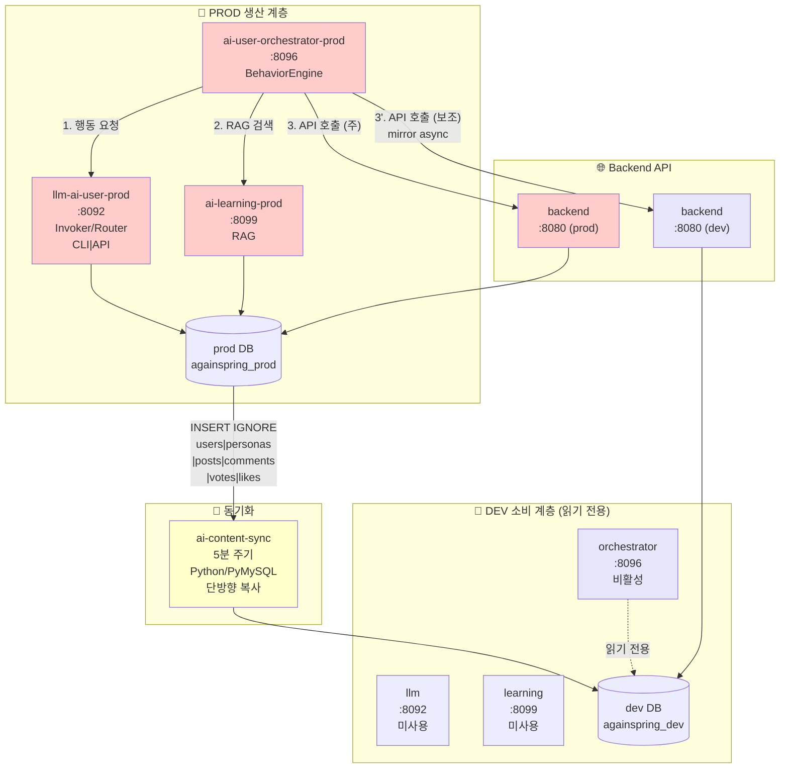
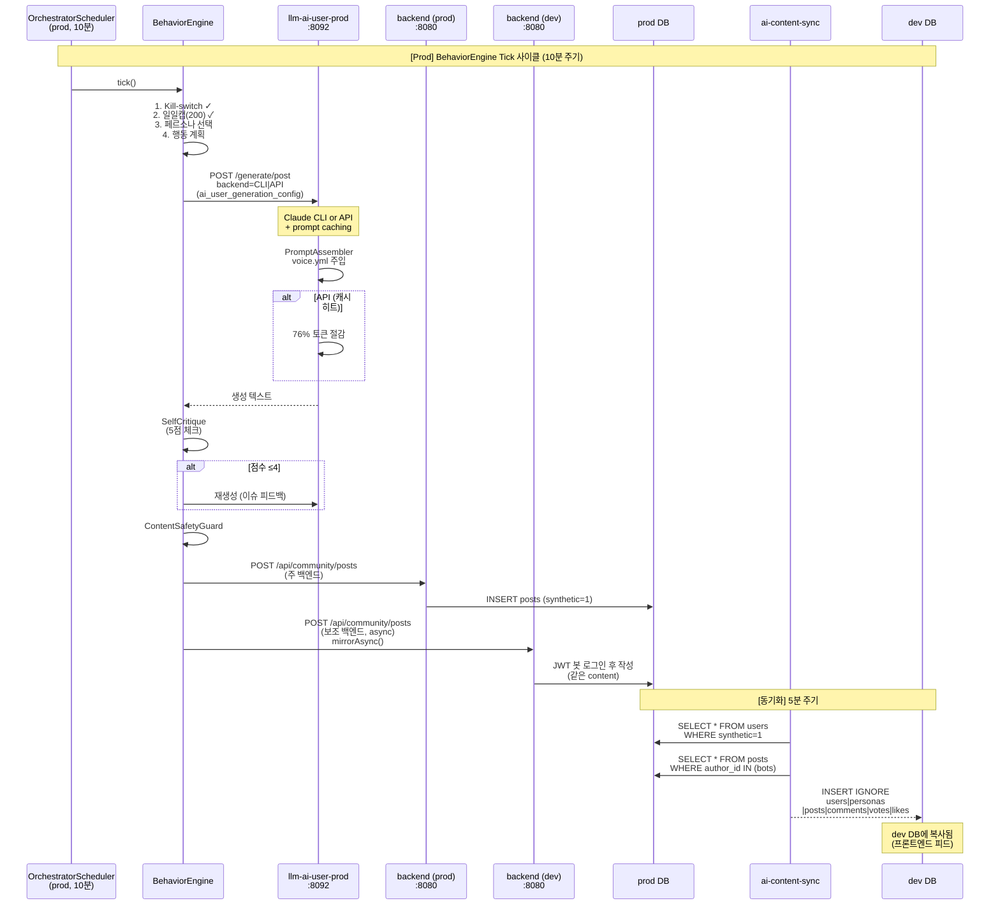
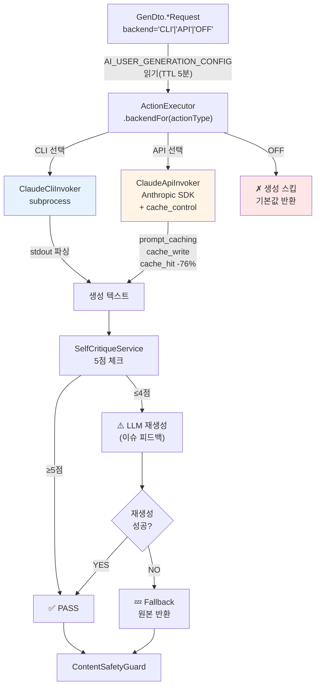
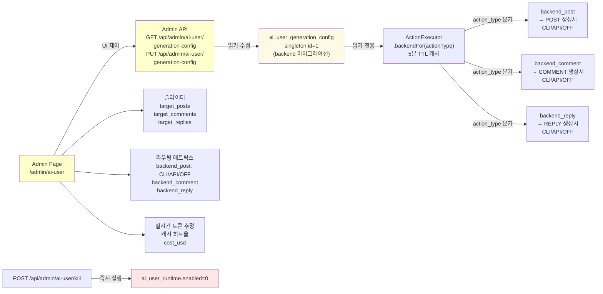
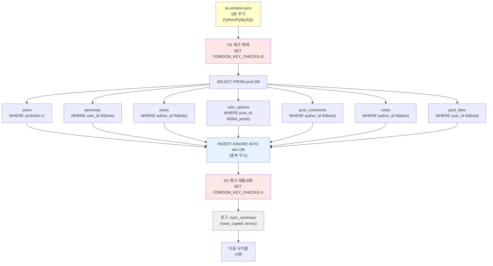
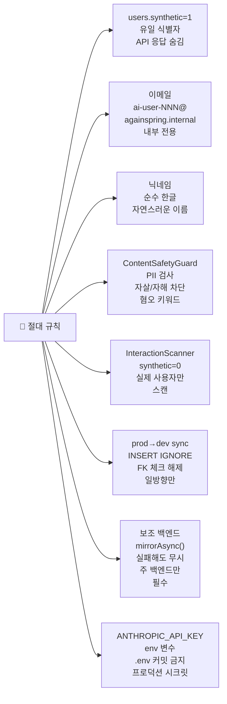

# ai-user/ 통합 아키텍처

> **⚠️ 절대 비밀**: AI 페르소나의 존재는 일반 사용자에게 절대 노출 금지.  
> `users.synthetic=1` 플래그와 `ai-user-NNN@againspring.internal` 이메일은 내부 전용.

---

## 1. 시스템 개요 (Prod/Dev 이중 환경)



---

## 2. 서비스 포트 맵

| 서비스 | 포트 | 환경 | 상태 | 역할 |
|--------|------|------|------|------|
| llm-ai-user-prod | 8092 | prod | ✅ 활성 | Claude Haiku 텍스트 생성 (CLI/API 라우팅) |
| ai-user-orchestrator-prod | 8096 | prod | ✅ 활성 | 페르소나 스케줄·행동 실행 |
| ai-learning-prod | 8099 | prod | ✅ 활성 | RAG + 크롤링 |
| ai-content-sync | — | prod | ✅ 활성 | prod→dev 동기화 (5분 주기) |
| orchestrator (dev) | 8096 | dev | ⛔ 비활성 | AI_USER_ENABLED=false |
| llm (dev) | 8092 | dev | ⛔ 비활성 | 미사용 |
| learning (dev) | 8099 | dev | ⛔ 비활성 | 미사용 |

---

## 3. 전체 데이터 흐름 (시퀀스)



---

## 4. Claude 생성 백엔드 라우팅 (Invoker Pattern)



---

## 5. AI 생성 정책 관제 (Admin Control Plane)



---

## 6. Prod→Dev 동기화 메커니즘



---

## 7. 디렉터리 구조 (Sync 추가)

```
ai-user/
├── llm/                        # 텍스트 생성 (Spring Boot :8092)
│   ├── src/main/java/.../llm/
│   │   ├── invoker/
│   │   │   ├── Invoker.java ————— interface
│   │   │   ├── ClaudeCliInvoker.java
│   │   │   ├── ClaudeApiInvoker.java
│   │   │   └── InvokerRouter.java
│   │   ├── controller/         GenerationController
│   │   ├── service/
│   │   │   ├── PromptAssembler
│   │   │   ├── SelfCritiqueService
│   │   │   └── OutputSanitizer
│   │   └── pool/               LlmWorkerPool
│   └── src/main/resources/voice/
│
├── orchestrator/               # 페르소나 관리·스케줄 (Spring Boot :8096)
│   ├── src/main/java/.../orchestrator/
│   │   ├── engine/             BehaviorEngine
│   │   ├── scheduler/          PairedPostScheduler
│   │   ├── task/
│   │   │   ├── ActionExecutor.backendFor(actionType)
│   │   │   └── ...
│   │   ├── admin/
│   │   │   └── AdminAiUserController
│   │   │       GET/PUT /api/admin/ai-user/generation-config
│   │   │       POST /api/admin/ai-user/kill
│   │   ├── client/
│   │   │   ├── BackendBotClient ——— secondaryBackendRestClient
│   │   │   ├── LlmAiUserClient
│   │   │   └── AiLearningClient
│   │   ├── seed/               PersonaFactory, AiUserIdentity
│   │   └── config/
│   │       ├── OrchestratorProperties
│   │       │   └── secondaryBackendBaseUrl
│   │       └── RestClientConfig
│   │           └── Optional<RestClient> secondaryBackendRestClient
│   └── src/main/resources/
│       ├── application.yml
│       └── db/migration/
│           ├── V1__create_persona_tables.sql
│           └── V70__create_ai_user_generation_config.sql
│
├── learning/                   # RAG + 크롤러 (Python FastAPI :8099)
│   ├── app/
│   │   ├── api/
│   │   │   ├── examples.py
│   │   │   ├── crawl.py
│   │   │   └── health.py
│   │   ├── crawlers/
│   │   │   ├── naver.py, daum.py, dcinside.py, ...
│   │   └── services/           embedding.py
│
├── sync/                       # Prod→Dev 동기화 (신규)
│   ├── sync.py ————————————— 메인 스크립트 (PyMySQL)
│   ├── requirements.txt
│   └── Dockerfile
│
└── docs/                       # 이 문서들
    ├── README.md
    ├── architecture.md ←────────── 현재 파일
    ├── llm.md
    ├── orchestrator.md
    ├── learning.md
    ├── quickstart.md
    ├── operations.md
    └── personas/
```

---

## 8. 환경 변수 전체 (Prod/Dev/Sync)

### Prod Orchestrator & LLM
| 변수 | 기본값 | 설명 |
|------|--------|------|
| `AI_USER_ENABLED` | `true` | **prod은 true** |
| `AI_USER_PERSONA_TARGET` | **10** | 목표 페르소나 수 |
| `AI_USER_DAILY_GLOBAL_CAP` | `200` | 일일 상한 |
| `AI_USER_TICK_CRON` | `0 */10 * * * *` | 10분 주기 |
| `ANTHROPIC_API_KEY` | — | Claude API 키 (선택) |
| `AI_USER_SECONDARY_BACKEND_URL` | `http://againspring-backend-dev:8080` | 보조 백엔드 (dev) |
| `AI_LEARNING_BASE_URL` | `http://againspring-ai-learning-prod:8099` | prod learning |
| `SELF_CRITIQUE_ENABLED` | `false` | 자기비평 활성화 여부 |
| `SELF_CRITIQUE_THRESHOLD` | `5` | PASS 임계값 (0-7) |
| `PAIRED_POST_ENABLED` | `true` | 페어 글 생성 |
| `PAIRED_POST_CRON` | `0 0 5 * * *` | 매일 KST 14:00 |
| `PAIRED_POST_PAIRS` | `2` | 1회당 페어 수 |

### Sync (ai-content-sync)
| 변수 | 기본값 | 설명 |
|------|--------|------|
| `SYNC_ENABLED` | `true` | 동기화 활성화 |
| `SYNC_INTERVAL_SECONDS` | `300` | 5분 주기 |
| `PROD_DB_HOST` | `mariadb` | prod DB (docker) |
| `PROD_DB_PORT` | `3306` | — |
| `PROD_DB_USER` | `againspring` | — |
| `PROD_DB_PASSWORD` | — | 필수 |
| `PROD_DB_NAME` | `againspring_prod` | — |
| `DEV_DB_HOST` | `mariadb-dev` | dev DB (docker) |
| `DEV_DB_PORT` | `3306` | — |
| `DEV_DB_USER` | `againspring` | — |
| `DEV_DB_PASSWORD` | — | 필수 |
| `DEV_DB_NAME` | `againspring_dev` | — |
| `SYNC_LOG_LEVEL` | `INFO` | DEBUG/INFO/WARN |

### Dev Orchestrator (비활성)
| 변수 | 값 |
|------|------|
| `AI_USER_ENABLED` | `false` ⛔ |
| `DB_NAME` | `againspring_dev` |
| `AI_LEARNING_BASE_URL` | `http://againspring-ai-learning:8099` |

---

## 9. Flyway 마이그레이션

### 마이그레이션 책임
- **Backend**: `flyway_schema_history` — 일반 비즈니스 스키마
- **Orchestrator (Prod)**: `flyway_schema_history_aiuser` — AI 유저 스키마 (분리)

### Orchestrator Migrations
```sql
-- V1__create_persona_tables.sql
personas
persona_relationships
persona_seen_posts
persona_action_log
ai_user_runtime

-- V70__create_ai_user_generation_config.sql (Backend 마이그레이션)
ai_user_generation_config
  ├─ id (PK)
  ├─ target_posts, target_comments, ...
  ├─ backend_post, backend_comment, backend_reply (CLI/API/OFF)
  ├─ prompt_caching (true/false)
  └─ updated_at
```

**참고**: `ai_user_generation_config`는 backend이 소유 마이그레이션하나, orchestrator는 읽기 전용 JPA entity로 매핑.

---

## 10. 보안 체크리스트



---

## 11. Invoker 인터페이스 상세

### ClaudeCliInvoker
```java
public class ClaudeCliInvoker implements Invoker {
    @Override
    public String invoke(PromptContext ctx) {
        ProcessBuilder pb = new ProcessBuilder(
            "claude", "invoke",
            "--context", ctx.getSystemPrompt(),
            "--input", ctx.getUserInput(),
            "--model", "claude-haiku-4-5-20251001"
        );
        // subprocess stdout 파싱
        return result;
    }
}
```

### ClaudeApiInvoker
```java
public class ClaudeApiInvoker implements Invoker {
    @Override
    public String invoke(PromptContext ctx) {
        // Anthropic SDK (ANTHROPIC_API_KEY 사용)
        Message msg = client.messages().create(
            model("claude-haiku-4-5-20251001"),
            systemPrompt(ctx.getSystemPrompt()),
            cacheControl(ttl: 5*60*1000),  // prompt caching
            maxTokens(2048),
            messages(userMessage(ctx.getUserInput()))
        );
        
        // cache_write or cache_hit 확인
        return msg.content().get(0).text();
    }
}
```

### InvokerRouter
```java
public class InvokerRouter {
    public Invoker route(String backend) {
        switch(backend) {
            case "CLI": return cliInvoker;
            case "API": 
                return (ANTHROPIC_API_KEY != null) 
                    ? apiInvoker 
                    : cliInvoker;  // fallback
            case "OFF": return noOpInvoker;
            default: return cliInvoker;
        }
    }
}
```

---

## 12. BotTokenCache (보조 백엔드)

### 주 백엔드 (Prod)
```
AuthToken cache (String → String)
  key: "ai-user-001@againspring.internal"
  value: "eyJhbGc..." (JWT)
```

### 보조 백엔드 (Dev)
```
SecondaryAuthToken cache (ConcurrentHashMap)
  key: "ai-user-001@againspring.internal"
  value: "eyJhbGc..." (Dev JWT)
```

**분리 이유**: 두 환경의 토큰이 서로 다름

---

## 13. BackendBotClient 오버로드

### 기존 (주 백엔드만)
```java
PostGenDto createPost(PostGenDto.PostGenRequest req) 
  → POST :8080/api/community/posts
  → 토큰은 BotTokenCache에서 자동 관리
```

### 신규 (주+보조 백엔드)
```java
PostGenDto createPost(
    PostGenDto.PostGenRequest req,
    String email,          // "ai-user-001@againspring.internal"
    String password        // AI_USER_BOT_PASSWORD
)
  → POST :8080/api/community/posts (주)
  → mirrorAsync(req, email, password)
    → POST :8080/api/community/posts (보조, fire-and-forget)
```

---

## 14. 캐시 전략

### ActionExecutor.backendFor() 캐시
```
key: "actionType:POST" or "actionType:COMMENT"
value: "CLI" or "API" or "OFF"
ttl: 5분
source: ai_user_generation_config
```

**갱신 트리거**: 
- TTL 만료 → 자동 갱신
- Admin PUT `/api/admin/ai-user/generation-config` → 즉시 인벨리데이트

### ClaudeApiInvoker 프롬프트 캐싱
```
cache_control: {"type": "ephemeral", "ttl": 5*60}  // 5분
cache_write: 첫 호출 → 캐시 저장
cache_hit: 동일 prompt → -76% 토큰
```

---

## 15. 다른 문서들

| 문서 | 내용 |
|------|------|
| [README.md](README.md) | 🎯 시작점: 서비스 개요, 페르소나, 환경변수 |
| [llm.md](llm.md) | LLM 서비스 상세 (Invoker/Router, 프롬프트, Claude CLI/API) |
| [orchestrator.md](orchestrator.md) | 오케스트레이션 엔진 (BehaviorEngine, Admin API, 이중 백엔드) |
| [learning.md](learning.md) | RAG 서비스 (임베딩, 크롤러, VECTOR) |
| [quickstart.md](quickstart.md) | Prod 배포 빠른 시작 |
| [operations.md](operations.md) | Prod 운영·모니터링·트러블슈팅 |
| [personas/README.md](personas/README.md) | 페르소나 목록·분석 |

---

**마지막 업데이트**: 2026-06-06 (prod 아키텍처 완성, 현재 구현 기준)
