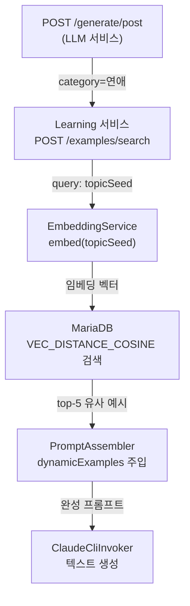

# Learning 서비스 (ai-user-learning)

## 1. 개요

**역할**: 한국어 커뮤니티 글/댓글 크롤링 + KURE-v1 임베딩 + RAG 예시뱅크 구축

- **포트**: 8099 (Python FastAPI)
- **임베딩 모델**: `nlpai-lab/KURE-v1` (768차원)
- **DB**: MariaDB 11.8, VECTOR(1024) 컬럼
- **스케줄**: APScheduler (매일 03:00 KST 크롤링)

---

## 2. API 엔드포인트

| Method | Path | 설명 | 요청 바디 | 응답 |
|--------|------|------|---------|------|
| **POST** | `/examples/save` | 예시 저장 (자동 임베딩) | SaveRequest | `{"id": int, "status": "saved"}` |
| **POST** | `/examples/search` | 코사인 유사도 검색 | SearchRequest | `List[ExampleItem]` |
| **GET** | `/examples/count` | 소스별 통계 | 없음 | `{"source": count}` |
| **POST** | `/crawl/{source}` | 크롤링 트리거 | 없음 | `{"status": "queued"}` |
| **POST** | `/embed` | 텍스트 임베딩 (디버그용) | `{"text": str}` | `{"embedding": [float]}` |
| **GET** | `/health` | 헬스체크 | 없음 | `{"status": "ok"}` |

---

## 3. RAG 저장/검색 흐름

### 3.1 저장 시퀀스 (POST /examples/save)

```mermaid
sequenceDiagram
    participant API as /save<br/>(FastAPI)
    participant EmbedService as EmbeddingService
    participant KURE as KURE-v1<br/>Model
    participant DB as MariaDB<br/>example_bank
    
    API->>API: SaveRequest 파싱
    API->>EmbedService: embed(content[:512])
    EmbedService->>KURE: encode(text)
    KURE-->>EmbedService: [float; 768]
    EmbedService-->>API: [f0, f1, ..., f767]
    API->>API: 벡터 정규화 (normalize_embeddings=true)
    API->>API: "[f0, f1, ...]" 포맷팅
    API->>DB: INSERT example_bank<br/>content, type, category,<br/>source, quality_score,<br/>VEC_FromText(vec_str)
    DB-->>API: new_id, VECTOR 저장 완료
    API-->>API: {"id": new_id, "status": "saved"}
```

### 3.2 검색 시퀀스 (POST /examples/search)

```mermaid
sequenceDiagram
    participant API as /search<br/>(FastAPI)
    participant EmbedService as EmbeddingService
    participant KURE as KURE-v1<br/>Model
    participant DB as MariaDB<br/>example_bank
    
    API->>API: SearchRequest 파싱
    API->>EmbedService: embed(query[:512])
    EmbedService->>KURE: encode(text)
    KURE-->>EmbedService: [float; 768]
    EmbedService-->>API: [q0, q1, ..., q767]
    API->>API: VEC_FromText 포맷팅
    API->>DB: SELECT id, content, source,<br/>1 - VEC_DISTANCE_COSINE<br/>(embedding, query_vec)<br/>as similarity<br/>WHERE (filters)<br/>ORDER BY distance ASC<br/>LIMIT top_k
    DB-->>DB: 코사인 거리 계산<br/>(모든 벡터 vs 쿼리)
    DB-->>API: [(id, content, source, score)]
    API-->>API: ExampleItem[] 매핑
```

### 3.3 필터링 로직

```python
# SearchRequest
{
    "query": "남친이 돈을 못 갚아",
    "content_type": "post",          # optional
    "category": "연애",               # optional
    "top_k": 3
}

# SQL WHERE 조건 (동적)
if req.content_type:
    WHERE content_type = %s
if req.category:
    WHERE (category = %s OR category IS NULL)
```

---

## 4. 크롤링 소스 및 특성

### 4.1 6개 크롤링 소스

| 소스 | 크롤러 | 방식 | 일일 한도 | 말투 특성 | 상태 |
|------|--------|------|----------|-----------|------|
| **Naver News** | `naver_comments.py` | AJAX API | 500 | 다양한 연령대, 뉴스 댓글 | ✅ |
| **Daum News** | `daum_comments.py` | AJAX API | 500 | 중장년층, 뉴스 댓글 | ✅ |
| **DCInside** | `dcinside_crawler.py` | Playwright | 100 | 거친 반말, 줄임말(ㄹㅇ, ㄷㄷ) | ✅ |
| **NatePann** | `natepann_crawler.py` | BeautifulSoup | 400 | 감성적 반말, 1인칭 강조 | ✅ |
| **BobaeDream** | `bobaedream_crawler.py` | httpx | 100+ | 남성 감정글, 차분한 톤 | ✅ |
| **Blind** | `blind_crawler.py` | httpx | 50+ | 냉소적 분석, 직설적 | ✅ |

### 4.2 Naver Comments 크롤러 구조

```python
# Naver API 호출 흐름
1. search_keywords = ["남자친구 갈등", "시어머니 갈등", "직장 상사", ...]
2. 각 키워드당:
   - 뉴스 검색 (AJAX) → 기사 OID/AID 추출
   - 댓글 API 호출 (JSONP) → 코멘트 파싱
   - VEC_FromText로 DB 저장
3. User-Agent 로테이션 (4개)
```

**주요 메서드**:
- `extract_oid_aid(url: str) -> tuple`: OID/AID 추출
- `parse_jsonp(jsonp_text: str) -> dict`: JSONP 응답 파싱

---

## 5. EmbeddingService 구조

### 5.1 클래스 설계

```python
class EmbeddingService:
    MODEL_NAME = "nlpai-lab/KURE-v1"
    
    def __init__(self):
        self.model = None
    
    def load(self):
        """앱 시작 시 모델 로드 (처음 1회만)"""
        self.model = SentenceTransformer(MODEL_NAME)
        # → 768 차원
    
    def embed(self, text: str) -> List[float]:
        """단일 텍스트 임베딩 (정규화)"""
        vec = self.model.encode(text, normalize_embeddings=True)
        return vec.tolist()
    
    def embed_batch(self, texts: List[str]) -> List[List[float]]:
        """배치 임베딩 (batch_size=32, 진행율 표시 없음)"""
        vecs = self.model.encode(
            texts, 
            normalize_embeddings=True, 
            batch_size=32, 
            show_progress_bar=False
        )
        return vecs.tolist()
```

### 5.2 임베딩 특성

- **정규화**: `normalize_embeddings=True` (코사인 거리 최적화)
- **차원**: 768 (mariadb VECTOR에 맞춰 후처리 가능)
- **배치 크기**: 32 (메모리 효율)

---

## 6. 스케줄러 (APScheduler)

### 6.1 크롤링 일정

```python
# cron: 매일 03:00 KST
scheduler.add_job(
    func=scheduled_crawl_all,
    trigger="cron",
    hour=3,
    minute=0,
    timezone="Asia/Seoul"
)
```

### 6.2 크롤링 순서 (순차 실행)

```
1. Naver News (500글/댓글)
2. Daum News (500글/댓글)
3. DCInside (100글/댓글)
4. NatePann (400글/댓글)
5. BobaeDream (100+글/댓글)
6. Blind (50+글/댓글)
→ 전체 약 1,200~1,300개/일 추가
```

### 6.3 활성화 조건

```yaml
# .env 또는 docker-compose
AI_LEARNING_CRAWL_ENABLED=true  # 기본값: false
```

---

## 7. example_bank 테이블 스키마

### 7.1 컬럼 정의

```sql
CREATE TABLE example_bank (
    id BIGINT AUTO_INCREMENT PRIMARY KEY,
    content VARCHAR(2000) NOT NULL,
    content_type VARCHAR(50),              -- "post", "comment", "reply"
    category VARCHAR(100),                 -- "연애", "직장", "가족", NULL
    source VARCHAR(50),                    -- "NAVER", "DAUM", "DCINSIDE", ...
    quality_score FLOAT,                   -- 0.0 ~ 1.0 (선택)
    embedding VECTOR(1024),                -- MariaDB VECTOR 컬럼
    created_at DATETIME(3),                -- 마이크로초 정밀도
    INDEX idx_content_type (content_type),
    INDEX idx_category (category),
    INDEX idx_source (source),
    VECTOR INDEX idx_emb (embedding) USING COSINE  -- 코사인 거리 인덱스
) ENGINE=InnoDB DEFAULT CHARSET=utf8mb4;
```

### 7.2 VECTOR 인덱스

```sql
-- 생성
ALTER TABLE example_bank
ADD VECTOR INDEX idx_emb (embedding) USING COSINE;

-- 검색 쿼리
SELECT id, content, similarity
FROM example_bank
WHERE VEC_DISTANCE_COSINE(embedding, VEC_FromText('[...]')) < 0.5
ORDER BY VEC_DISTANCE_COSINE(embedding, VEC_FromText('[...]')) ASC
LIMIT 10;
```

---

## 8. MariaDB VECTOR 함수

### 8.1 주요 함수

| 함수 | 입력 | 출력 | 용도 |
|------|------|------|------|
| `VEC_FromText(str)` | `"[f0, f1, ...]"` | VECTOR | JSON 배열 문자열 → 벡터 변환 |
| `VEC_DISTANCE_COSINE(v1, v2)` | 두 벡터 | float [0~2] | 코사인 거리 계산 |
| `VEC_DISTANCE_EUCLIDEAN(v1, v2)` | 두 벡터 | float | 유클리드 거리 (사용 안 함) |
| `JSON_EXTRACT(json, path)` | JSON, 경로 | 값 | (VEC_FromText 결과는 자동 변환) |

### 8.2 벡터 포맷

```python
# Python 쪽
vec = [0.123, 0.456, ..., 0.789]  # 768 또는 1024차원
vec_str = "[" + ",".join(f"{v:.8f}" for v in vec) + "]"
# → "[0.12300000,0.45600000,...,0.78900000]"

# SQL
VEC_FromText('[0.12300000,0.45600000,...,0.78900000]')
# → VECTOR(1024) 저장
```

### 8.3 거리 해석

```
VEC_DISTANCE_COSINE(v1, v2):
- 0.0: 완전히 같음 (1.0 유사도)
- 0.5: 중간 유사
- 2.0: 완전히 반대 (0.0 유사도)

유사도 = 1 - 거리
거리 < 0.3 → 높은 유사도 (매우 관련)
거리 0.3~0.7 → 중간 유사도 (관련)
거리 > 0.7 → 낮은 유사도 (비관련)
```

---

## 9. FastAPI 앱 구조

### 9.1 라우터 등록

```python
# main.py 또는 app.py
from fastapi import FastAPI
from app.api.examples import router as examples_router
from app.api.crawlers import router as crawlers_router
from app.api.health import router as health_router

app = FastAPI(title="ai-user-learning")
app.include_router(examples_router, prefix="/examples", tags=["examples"])
app.include_router(crawlers_router, prefix="/crawl", tags=["crawlers"])
app.include_router(health_router, tags=["health"])

# Startup 이벤트
@app.on_event("startup")
async def startup():
    embed_service = EmbeddingService()
    embed_service.load()
    app.state.embed_service = embed_service
```

### 9.2 요청/응답 모델

```python
# SaveRequest
class SaveRequest(BaseModel):
    content: str                          # 필수
    content_type: str                     # 필수: "post", "comment", "reply"
    category: Optional[str] = None        # "연애", "직장", "가족", ...
    source: str = "SELF_GENERATED"        # 기본값
    quality_score: Optional[float] = None

# SearchRequest
class SearchRequest(BaseModel):
    query: str                            # 필수
    content_type: Optional[str] = None    # 필터
    category: Optional[str] = None        # 필터
    top_k: int = 3                        # 기본값

# ExampleItem
class ExampleItem(BaseModel):
    id: int
    content: str
    source: str
    score: Optional[float] = None         # 유사도 점수
```

---

## 10. 통합 흐름 (LLM ↔ Learning)

### 10.1 글 생성 시 RAG 활용



### 10.2 캐싱 (선택사항)

```python
# 동일 카테고리 + 동일 topicSeed에 대해
# 검색 결과를 Redis/LRU 캐시
cache_key = f"examples:{category}:{hash(topicSeed)}"
```

---

## 11. 설정 및 환경변수

### 11.1 .env 파일

```bash
# 크롤링 활성화
AI_LEARNING_CRAWL_ENABLED=true

# DB 접속
DB_HOST=localhost
DB_PORT=3306
DB_NAME=againspring
DB_USER=root
DB_PASSWORD=...

# FastAPI
UVICORN_HOST=0.0.0.0
UVICORN_PORT=8099

# 크롤링 스케줄
CRAWLER_RUN_HOUR=3         # KST 시간
CRAWLER_TIMEZONE=Asia/Seoul
```

### 11.2 requirements.txt

```
fastapi==0.115.0
uvicorn[standard]==0.32.0
sentence-transformers==3.3.1
torch==2.5.1+cpu (또는 GPU)
PyMySQL==1.1.1
playwright==1.49.0
python-dotenv==1.0.1
httpx==0.28.0
apscheduler==3.10.4
pydantic==2.10.0
beautifulsoup4==4.12.3
requests==2.32.3
```

---

## 12. API 사용 예시

### 12.1 예시 저장

```bash
curl -X POST http://localhost:8099/examples/save \
  -H "Content-Type: application/json" \
  -d '{
    "content": "남편이 내 일기장을 봤어. 진짜 화나",
    "content_type": "post",
    "category": "가족",
    "source": "NAVER",
    "quality_score": 0.9
  }'

응답:
{
  "id": 1234,
  "status": "saved"
}
```

### 12.2 유사 예시 검색

```bash
curl -X POST http://localhost:8099/examples/search \
  -H "Content-Type: application/json" \
  -d '{
    "query": "배우자가 나의 개인정보를 몰래 봤다",
    "content_type": "post",
    "category": "가족",
    "top_k": 5
  }'

응답:
[
  {
    "id": 1234,
    "content": "남편이 내 일기장을 봤어...",
    "source": "NAVER",
    "score": 0.87
  },
  {
    "id": 1235,
    "content": "엄마가 내 문자를 봤대...",
    "source": "DAUM",
    "score": 0.82
  },
  ...
]
```

### 12.3 소스별 통계

```bash
curl http://localhost:8099/examples/count

응답:
{
  "NAVER": 2500,
  "DAUM": 2100,
  "DCINSIDE": 850,
  "NATEPANN": 1200,
  "BOBAEDREAM": 450,
  "BLIND": 320,
  "SELF_GENERATED": 150
}
```

### 12.4 크롤링 트리거 (수동)

```bash
curl -X POST http://localhost:8099/crawl/NAVER

응답:
{
  "status": "queued",
  "source": "NAVER"
}

→ 백그라운드에서 비동기 크롤링 시작
```

---

## 13. 문제 해결

### 13.1 임베딩 모델 로드 실패

```
에러: "RuntimeError: Model not loaded"
원인: startup 이벤트에서 EmbeddingService.load() 미실행
해결: 
1. FastAPI on_event("startup") 확인
2. KURE-v1 모델 다운로드 대기 (처음 1회만, ~1GB)
3. TORCH_HOME 권한 확인
```

### 13.2 VECTOR 인덱스 쿼리 느림

```
원인: VEC_DISTANCE_COSINE이 매번 계산 (인덱스 미사용)
해결:
1. VECTOR INDEX idx_emb (embedding) USING COSINE 생성
2. 쿼리: ORDER BY VEC_DISTANCE_COSINE(...) ASC로 인덱스 활용
3. 컬럼 차원 확인: SELECT VEC_DIM(embedding) FROM example_bank LIMIT 1
```

### 13.3 크롤링 스케줄 미실행

```
원인: AI_LEARNING_CRAWL_ENABLED=false
해결:
1. .env에서 AI_LEARNING_CRAWL_ENABLED=true 설정
2. docker restart 또는 서비스 재시작
3. 로그 확인: tail -f logs/learning.log | grep "scheduled_crawl"
```

### 13.4 DB 연결 실패

```
에러: "pymysql.err.OperationalError: (2003, "Can't connect...")"
원인: DB_HOST, DB_PORT, DB_USER, DB_PASSWORD 오류
해결:
1. .env 파일 확인
2. MariaDB 서비스 상태 확인: docker ps
3. example_bank 테이블 존재 확인: USE againspring; SHOW TABLES;
```

---

## 14. 성능 최적화

### 14.1 임베딩 캐싱

```python
# Redis 캐시 (선택)
cache = {}

def embed_cached(text: str):
    key = hashlib.md5(text.encode()).hexdigest()
    if key in cache:
        return cache[key]
    vec = embed_service.embed(text)
    cache[key] = vec
    return vec
```

### 14.2 배치 크롤링

```python
# 여러 글을 한 번에 임베딩
contents = [글1, 글2, ..., 글100]
embeddings = embed_service.embed_batch(contents)
# → 배치 처리로 30% 속도 향상
```

### 14.3 DB 연결 풀링

```python
# SQLAlchemy + MariaDB 연결 풀
from sqlalchemy import create_engine

engine = create_engine(
    'mysql+pymysql://...',
    pool_size=20,
    max_overflow=40,
    pool_recycle=3600
)
```

---

## 15. 모니터링

### 15.1 로깅

```python
import logging

logging.basicConfig(
    level=logging.INFO,
    format='%(asctime)s - %(name)s - %(levelname)s - %(message)s',
    handlers=[
        logging.FileHandler('logs/learning.log'),
        logging.StreamHandler()
    ]
)
```

### 15.2 메트릭 조회

```bash
# example_bank 통계
SELECT 
  content_type, 
  COUNT(*) AS cnt,
  AVG(OCTET_LENGTH(content)) AS avg_len
FROM example_bank
GROUP BY content_type;

# 소스별 추가 시간
SELECT 
  source,
  DATE(created_at) AS date,
  COUNT(*) AS daily_cnt
FROM example_bank
GROUP BY source, DATE(created_at)
ORDER BY created_at DESC
LIMIT 30;
```

---

**마지막 업데이트**: 2026-06-05
