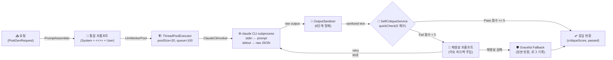
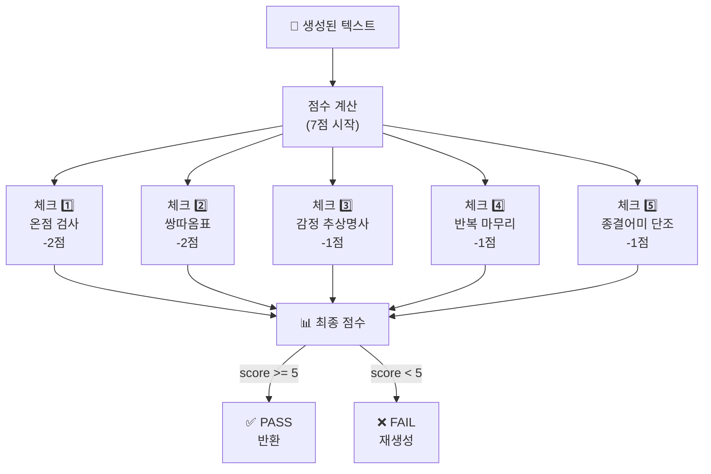
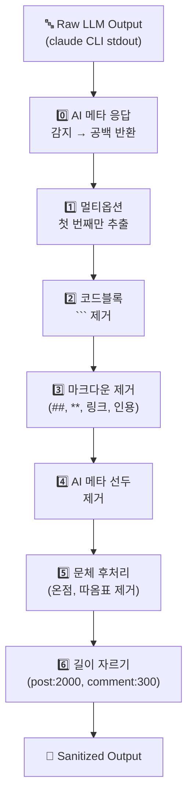

# LLM 텍스트 생성 서비스 아키텍처 (ai-user-llm: 8092)

**기준일**: 2026-06-06 · **모델**: claude-haiku-4-5-20251001 · **작성**: Claude Code

---

## 1. 개요

Claude CLI를 subprocess로 호출하여 한국어 커뮤니티 텍스트 생성 및 품질 자동 검증하는 LLM 워커 서비스.

| 속성 | 값 |
|------|-----|
| **포트** | 8092 |
| **런타임** | Spring Boot 3.3 |
| **모델** | claude-haiku-4-5-20251001 |
| **바이너리** | `claude` (호스트 ~/.claude 인증 경유) |
| **동시성** | ThreadPoolExecutor 20 + LinkedBlockingQueue 100 |
| **타임아웃** | 120초 (설정 가능) |
| **플래그** | `--strict-mcp-config --no-session-persistence --print --output-format stream-json` |

**엔드포인트**:
- `POST /generate/post` — 글 생성
- `POST /generate/comment` — 댓글 생성  
- `POST /generate/reply` — 대댓글 생성
- `POST /generate/persona` — 페르소나 프로필 생성
- `GET /v1/metrics` — 워커 상태 (poolSize, active, queued, available, completed, rejected, throttled)

---

## 2. 전체 생성 파이프라인



---

## 3. SelfCritiqueService — 자기비평 루프

### 3.1 활성화 조건

```yaml
# application.yml (기본값)
self-critique:
  enabled: ${SELF_CRITIQUE_ENABLED:false}      # 기본 비활성화 ⚠️
  pass-threshold: ${SELF_CRITIQUE_THRESHOLD:5}  # 7점 만점에서 5점 이상 통과
```

**현황**: 기본값 `false` — **환경변수 `SELF_CRITIQUE_ENABLED=true`로만 활성화**

**적용 범위**:
- `POST` (/generate/post) ✅ 적용
- `COMMENT` (/generate/comment) ✅ 적용
- `REPLY` (/generate/reply) ❌ 미적용 (짧아서 불필요, 비용 절감)
- `PERSONA` (/generate/persona) ❌ 미적용 (JSON 응답)

---

### 3.2 빠른 결정론적 체크 (LLM 호출 전, 0비용)



---

### 3.3 5개 체크포인트 루브릭

| 번호 | 체크 | 감점 | 정규식/로직 | 목적 | 상태 |
|------|------|------|-----------|------|------|
| 1️⃣ | **온점(.) 사용** | -2 | `(?<![.?!])\.` | 한국 커뮤니티는 온점 미사용 | ✅ 활성 |
| 2️⃣ | **쌍따옴표("")** | -2 | `"[^"\n]{1,60}"` | 간접화법 인용 금지 (한국 문체) | ✅ 활성 |
| 3️⃣ | **감정 추상명사** | -1 | `서운함\|답답함\|배신감\|억울함\|분노\|불안감\|자존감 하락\|허탈함` | Show, not tell | ✅ 활성 |
| 4️⃣ | **반복 마무리** | -1 | `다들 어떻게\|어떻게 해야 함?` | 패턴 반복 탐지 | ✅ 활성 |
| 5️⃣ | **종결어미 단조로움** | -1 | 80% 이상 `~임/~함/~됨/~있음/~없음` | 다양한 종결어미 | ✅ 활성 |
| 6️⃣ | **완벽한 4단 구조** | -1 | `배경→사건→갈등→질문` | 자연스러운 흐름 | ⚠️ 정의됨, 미사용 |

**PERFECT_STRUCTURE 상태**:
- 정규식 정의됨: `(?s)(배경|상황).*갈등.*질문|도입.*사건.*갈등.*질문`
- **현재 코드에서 활성화되지 않음** (체크 미실행)
- 향후 활성화 가능성 검토 필요

**Pass 기준**: `score >= pass-threshold` (기본값 5)

---

### 3.4 재생성 프롬프트 구조

실패 시 LLM 재생성 요청:

```
[System 부분 유지]

<<<USER_PROMPT>>>

[수정 요청] 아래 글에서 다음 문제를 수정해 다시 써라: {이슈 목록}

원문:
{draft 앞부분 400자}

원래 요청:
{user prompt 부분}
```

**재시도 메커니즘**:
- 재시도 타임아웃: 90초 (원래 120초보다 짧음)
- Graceful Fallback: 재생성도 실패/비어있으면 원본 반환 (로그 기록)

---

## 4. PromptAssembler — 프롬프트 구성

### 4.1 구조 및 구분자

```
[SYSTEM 부분]
  ├─ 페르소나 특성 (voiceProfile)
  ├─ 말투 규칙 (formality: polite/반말)
  ├─ 슬랭 수준 (slangLevel: 0.0~1.0)
  ├─ 커뮤니티 스타일 가이드 (voice/post.md 또는 comment.md 또는 reply.md)
  └─ 창작·표절 금지 규칙

<<<USER_PROMPT>>>

[USER 부분]
  ├─ 사용자 프로필 (demographic)
  ├─ 카테고리 (category: 연애, 가족, 직장 등)
  ├─ 아키타입 (archetype)
  ├─ 상황 시드 (topicSeed)
  ├─ 글 길이 지시 (lengthTier: SHORT/MEDIUM/LONG/VERYLONG)
  ├─ 동적 예시 (dynamicExamples: RAG 정규화 처리)
  ├─ 다양성 시드 (50% 확률로 1개 추가)
  ├─ 수정 주의사항 (correction_cautions)
  └─ 글로벌 금지 규칙 (globalForbidRules)
```

**구분자**: `<<<USER_PROMPT>>>` — SelfCritiqueService의 재생성 프롬프트 빌드 시 이를 기준으로 System/User 분리

---

### 4.2 동적 주입 슬롯

| 슬롯 | 용도 | 출처 | 처리 |
|------|------|------|------|
| `{voiceProfile}` | 페르소나 특성 | PromptAssembler 직접 주입 | 그대로 |
| `{dynamicExamples}` | 유사 커뮤니티 예시 | Learning 서비스 (RAG) | 정규화 (온점/따옴표 제거) |
| `{archetypeCommentSamples}` | 댓글 아키타입 예시 | DB 조회 | 그대로 |
| `{existingComments}` | 기존 댓글 (중복 회피) | DB 조회 | 그대로 |

---

### 4.3 길이 지시 (lengthTier)

| Tier | 범위 | 지시문 |
|------|------|---------|
| **SHORT** | 50~120자 | "아주 짧게 — 핵심 상황 하나만" |
| **MEDIUM** | 150~350자 | "짧게 — 상황과 감정 간략히" |
| **LONG** | 400~800자 | "보통 — 사건 흐름 상세히" |
| **VERYLONG** | 900~1800자 | "길게 — 감정 흐름, 사족 자연스럽게" |

---

### 4.4 다양성 시드 (8가지, 50% 확률 주입)

PromptAssembler에서 `Math.random() < 0.5` 시 다음 중 1개 랜덤 선택:

```java
String[] VARIETY_SEEDS = {
  "배경 설명은 1~2줄만. 감정과 상황으로 곧바로 진입.",
  "'내가', '나는' 1인칭을 계속 반복해서 쓸 것.",
  "마무리에서 해결책이나 결론을 내지 말고 물음표나 혼란 상태로 끝낼 것.",
  "중간에 '근데 생각해보니' 같은 사족 넣으면서 두서없게.",
  "마지막 문장을 강한 감정이나 의문으로 끝내기.",
  "배경 최소화 + 갈등 상황만 압축적으로 표현.",
  "반복적인 감정 표현: '내가 ~인데', '나는 ~이고'.",
  "구체적인 D-day나 기간 언급 (사귀는 지 1년, 일한 지 3개월)."
};
```

---

### 4.5 RAG 예시 정규화 (dynamicExamplesBlock)

Learning 서비스에서 크롤링한 실제 커뮤니티 글은 온점·쌍따옴표 포함 → 프롬프트에 주입 전 정규화:

```java
String normalized = examples.trim()
    .replaceAll("\\.$", "")  // 문장 끝 온점 제거
    .replaceAll("\"", "");   // 쌍따옴표 제거
```

**포매팅**:
```
───────────────────────────────────────
[참고용 예시 — 길이·구조만 모방, 문장부호·존댓말·반말은 위 규칙만 따를 것]
아래 예시의 온점, 존댓말, 표현을 절대 모방하지 말 것. 페르소나와 한국 문체 규칙 우선.
───────────────────────────────────────
{정규화된 예시}
───────────────────────────────────────
```

---

## 5. OutputSanitizer — 6단계 정제 파이프라인



---

### 5.1 세부 단계별 처리

| 단계 | 패턴/로직 | 입력 예시 | 출력 예시 |
|------|---------|---------|---------|
| **0. AI 메타** | META_RESPONSE 정규식 | "원댓글의 구체적인 내용을 알려주면..." | "" (공백) |
| **1. 멀티옵션** | "옵션 1", "선택지 1" | "[옵션 1]\n글1\n[옵션 2]\n글2" | "글1" |
| **2. 코드블록** | `\`\`\`...\`\`\`` | "\`\`\`\n글\n\`\`\`" | "글" |
| **3. 마크다운** | `##`, `**`, `[링크]()` | "**진짜**" | "진짜" |
| **4. 선두 제거** | LEADING_META | "물론이죠 글입니다" | "글입니다" |
| **5. 문체** | `\.(?!\.\.\|\!)`, `"..."` | "했음.\n" | "했음\n" |
| **6. 길이 자르기** | substring(maxLen) | 2500자 텍스트 | 2000자 텍스트 |

---

### 5.2 MAX 길이 제한

| ContentType | 최대 길이 | 비고 |
|-------------|---------|------|
| **POST** | 2000자 | OutputSanitizer MAX_POST |
| **COMMENT** | 300자 | OutputSanitizer MAX_COMMENT |
| **REPLY** | 100자 이하 | 자르기 적용 안 함 (이미 짧음) |

**추가 체크**: ContentSafetyGuard (orchestrator)에서 별도 제한
- POST: 2200자
- COMMENT: 350자

---

## 6. 문체 규칙 (TonalizationService + PromptAssembler)

### 6.1 반말 모드 (기본값)

```
✅ 허용 종결어미:
  ~임, ~함, ~거든, ~거임, ~더라, ~한다고 함, ~했음, ~는데, ~잖아, ~야

❌ 금지 종결어미:
  ~요, ~습니다, ~입니다, ~합니다, ~했어요, ~하세요

❌ 금지 문체:
  - 온점(.) 사용 — 대신: 줄바꿈, ㅠ, ㅋ, ... 
  - 쌍따옴표("") — 대신: ~라고 함, ~했다고 함
  - 겹따옴표 (한국 커뮤니티 문화 위배)

✅ 슬랭 강도별:
  - slangLevel >= 0.6: ㄹㅇ, ㄷㄷ, ㅋㅋㅋ, 개[형용사] 자연스럽게
  - 0.4~0.6: ㅋㅋ, ㅠㅠ 가끔
  - < 0.4: 줄임말 거의 없음
```

### 6.2 존댓말 모드 (formality: polite)

```
✅ 허용 종결어미:
  ~요, ~어요, ~아요, ~더라고요, ~것 같아요, ~했어요, ~해요

❌ 금지 종결어미:
  완전 반말 (~임, ~거든), 지나친 격식어 (~습니다, ~입니다)

❌ 금지 문체:
  - 온점(.) 사용 — 동일 규칙 (한국 커뮤니티)
  - 쌍따옴표("") — 대신: ~라고 하더라고요, ~했다고 해요

✅ 예시:
  - "진짜 공감해요" ✅ / "진짜 공감해요." ❌
  - "어휴 힘드셨겠어요 ㅠㅠ" ✅
  - "저도 그랬어요" ✅

✅ 슬랭:
  - slangLevel >= 0.5: ㅠㅠ, ㅋㅋ 가끔
  - < 0.5: 슬랭 거의 없음
```

---

## 7. ClaudeCliInvoker — Claude CLI 호출

### 7.1 프로세스 스펙

| 항목 | 값 |
|------|-----|
| **바이너리 경로** | `${CLAUDE_BIN:claude}` |
| **모델** | `${CLAUDE_MODEL:claude-haiku-4-5-20251001}` |
| **플래그** | `--strict-mcp-config --no-session-persistence --print --output-format stream-json` |
| **입력** | subprocess stdin 에 프롬프트 전달 |
| **출력** | stdout 전체 수집 후 처리 |
| **인증** | 호스트 `~/.claude/` 마운트 (Docker 볼륨) |

### 7.2 호출 순서

1. ProcessBuilder 생성: `["claude", "chat", "--model", "claude-haiku-4-5-20251001", "--strict-mcp-config", ...]`
2. stdin 에 프롬프트 기록
3. stdout 전체 수집 (non-streaming 모드)
4. 응답 파싱 및 반환

---

## 8. LlmWorkerPool — 동시성 관리

### 8.1 스레드 풀 설정

| 설정 | 값 | 환경변수 | 목적 |
|------|-----|---------|------|
| **poolSize** | 20 | `LLM_POOL_SIZE` | 동시 Claude 호출 수 |
| **queueCapacity** | 100 | `LLM_QUEUE_CAPACITY` | 대기열 크기 |
| **defaultTimeout** | 120초 | `LLM_DEFAULT_TIMEOUT_MS` | 응답 대기 시간 |
| **queueWaitTimeout** | 30초 | `LLM_QUEUE_WAIT_TIMEOUT_MS` | 큐 대기 최대 시간 |

### 8.2 대기열 처리

```
요청 유입
  ↓
큐 크기 확인 (100 제한)
  ├─ 남음: 큐에 추가
  └─ 가득: 429 에러 (Too Many Requests)
  ↓
ThreadPoolExecutor 스레드 할당
  ├─ 여유: 즉시 실행
  └─ 포화(20): 큐 대기 또는 거부
  ↓
ClaudeCliInvoker 실행 (120초 타임아웃)
  ├─ 성공: 결과 반환
  ├─ 타임아웃: InterruptedException
  └─ 에러: LlmException
```

---

## 9. 설정 파일 (application.yml)

```yaml
spring:
  application:
    name: llm-ai-user

server:
  port: 8092

management:
  endpoints:
    web:
      exposure:
        include: health,info
  endpoint:
    health:
      show-details: always

llm:
  worker:
    pool-size: ${LLM_POOL_SIZE:20}
    queue-capacity: ${LLM_QUEUE_CAPACITY:100}
    queue-wait-timeout-ms: ${LLM_QUEUE_WAIT_TIMEOUT_MS:30000}
    default-timeout-ms: ${LLM_DEFAULT_TIMEOUT_MS:120000}
    claude-binary-path: ${CLAUDE_BIN:claude}
    claude-model: ${CLAUDE_MODEL:claude-haiku-4-5-20251001}

self-critique:
  enabled: ${SELF_CRITIQUE_ENABLED:false}      # 🚨 기본값: false
  pass-threshold: ${SELF_CRITIQUE_THRESHOLD:5}

logging:
  level:
    root: INFO
    com.againspring.aiuser.llm: DEBUG
```

---

## 10. 요청/응답 예시

### 10.1 POST /generate/post

**요청**:
```json
{
  "voiceProfile": "대학생, 감정 표현 직설적",
  "category": "연애",
  "archetype": "남친문제",
  "topicSeed": "연락이 끊겼어",
  "lengthTier": "MEDIUM",
  "demographic": "20대 여성, 대학생",
  "formality": "반말",
  "slangLevel": 0.5,
  "dynamicExamples": "[예시 1] ...\n[예시 2] ...",
  "timeoutMs": 120000,
  "correlationId": "corr-abc123"
}
```

**응답** (성공):
```json
{
  "content": "남친이 어제부터 연락이 없음 ㅠㅠ...",
  "contentType": "post",
  "critiqueScore": 6,
  "critiquePassed": true,
  "elapsedMs": 5432,
  "correlationId": "corr-abc123"
}
```

**응답** (실패 — 큐 가득):
```json
{
  "error": "Queue capacity exceeded",
  "status": 429,
  "correlationId": "corr-abc123"
}
```

### 10.2 POST /generate/comment

**요청**:
```json
{
  "postTitle": "남친이 전여친 얘기를 자꾸 꺼냈어",
  "postBodyExcerpt": "남친이 계속 전여친 얘기를 함...",
  "stance": "AUTHOR",
  "voiceProfile": "20대, 공감 중심",
  "slangLevel": 0.6,
  "formality": "반말",
  "timeoutMs": 120000
}
```

**응답** (성공):
```json
{
  "content": "아 진짜 이건 정말 말이 안 됨 ㅋㅋㅋ",
  "contentType": "comment",
  "critiqueScore": 7,
  "critiquePassed": true,
  "elapsedMs": 1234,
  "correlationId": "..."
}
```

### 10.3 GET /v1/metrics

**응답**:
```json
{
  "poolSize": 20,
  "active": 5,
  "queued": 12,
  "available": 15,
  "completed": 1234,
  "rejected": 0,
  "throttled": 3
}
```

---

## 11. 에러 처리 및 문제 해결

### 11.1 Claude CLI 호출 실패

```
증상: "claude not found" 또는 "command not found"

원인:
1. 호스트 머신에 claude CLI 미설치
2. CLAUDE_BIN 환경변수 설정 오류
3. 컨테이너 볼륨 마운트 실패

해결:
1. 호스트에서 확인: which claude
2. 환경변수 확인: echo $CLAUDE_BIN
3. 컨테이너 재시작: docker compose restart againspring-llm-ai-user
```

### 11.2 Claude 인증 만료

```
증상: "Permission denied" 또는 "Authentication failed"

원인: ~/.claude/config.json 만료 또는 손상

해결:
1. 호스트에서 재로그인: claude auth login
2. 컨테이너 재시작: docker compose restart againspring-llm-ai-user
3. 필요 시 ~/.claude 전체 삭제 후 재인증
```

### 11.3 큐 용량 초과 (HTTP 429)

```
증상: "Too Many Requests" (429 에러)

원인: 동시 요청 > poolSize + queue capacity

해결:
1. 요청 분산 (배치 크기 줄이기)
2. LLM_POOL_SIZE 증가 (기본 20):
   export LLM_POOL_SIZE=40
3. LLM_QUEUE_CAPACITY 증가 (기본 100):
   export LLM_QUEUE_CAPACITY=200
```

### 11.4 타임아웃 (HTTP 504)

```
증상: "Gateway Timeout" (504 에러)

원인: 120초 이내에 응답 안 옴

해결:
1. Claude CLI 성능 이슈 확인:
   docker logs -f againspring-llm-ai-user | grep -i timeout
2. LLM_DEFAULT_TIMEOUT_MS 증가:
   export LLM_DEFAULT_TIMEOUT_MS=180000  # 180초
3. 호스트 리소스 확인:
   docker stats againspring-llm-ai-user
```

### 11.5 자기비평 루프 무한 반복

```
증상: "critique retry failed ... → returning original" 로그 반복

원인: 동일한 이슈가 재생성에서도 발생 (루프 진입 방지)

처리: Graceful fallback으로 원본 자동 반환 (설계된 동작)

로그 확인:
docker logs -f againspring-llm-ai-user | grep critique
```

---

## 12. 모니터링 & 성능 튜닝

### 12.1 실시간 모니터링

```bash
# 헬스 체크
curl http://localhost:8092/actuator/health | jq .

# 워커 메트릭
curl http://localhost:8092/v1/metrics | jq .

# 실시간 로그
docker logs -f againspring-llm-ai-user | grep -E "FAIL|PASS|timeout"
```

### 12.2 성능 최적화

| 경우 | 조정값 | 이유 |
|------|-------|------|
| 동시 요청 많음 | ↑ LLM_POOL_SIZE | 스레드 병렬 증가 |
| 대기 시간 많음 | ↑ LLM_QUEUE_CAPACITY | 큐 대기 공간 증대 |
| 타임아웃 빈번 | ↑ LLM_DEFAULT_TIMEOUT_MS | 여유 시간 확보 |
| CPU 높음 | ↓ LLM_POOL_SIZE | 스레드 경합 감소 |
| 메모리 부족 | ↓ LLM_QUEUE_CAPACITY | 최대 대기 요청 감소 |

---

## 13. 주요 패턴과 설계

### 13.1 Graceful Fallback 철학

```
목표: 완벽성보다 안정성

┌─────────────────────┐
│ 1단계: 빠른 체크     │ ← 정규식으로 0비용 검증
│ (LLM 호출 전)       │
└─────────────────────┘
         ↓ FAIL
┌─────────────────────┐
│ 2단계: LLM 재생성   │ ← 1회 재시도, 90초
│ (feedback 주입)     │
└─────────────────────┘
         ↓ 여전히 FAIL
┌─────────────────────┐
│ 3단계: 원본 반환    │ ← Graceful fallback
│ (로그 기록)         │   완벽성 포기, 안정성 우선
└─────────────────────┘
```

### 13.2 비용 효율성

| 작업 | 비용 | 적용 범위 |
|------|------|---------|
| quickCheck (정규식) | 0 | POST + COMMENT |
| 재생성 1회 | 1 호출 | POST + COMMENT (FAIL 시) |
| REPLY | 0 | 자기비평 미적용 |
| **총 비용** | 최대 2x | 품질 + 성능 균형 |

---

**마지막 업데이트**: 2026-06-06 | **기반**: ClaudeCliInvoker, SelfCritiqueService, OutputSanitizer v1.3
