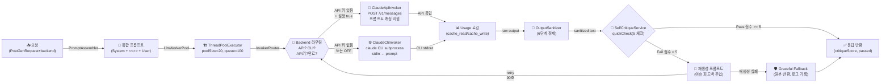
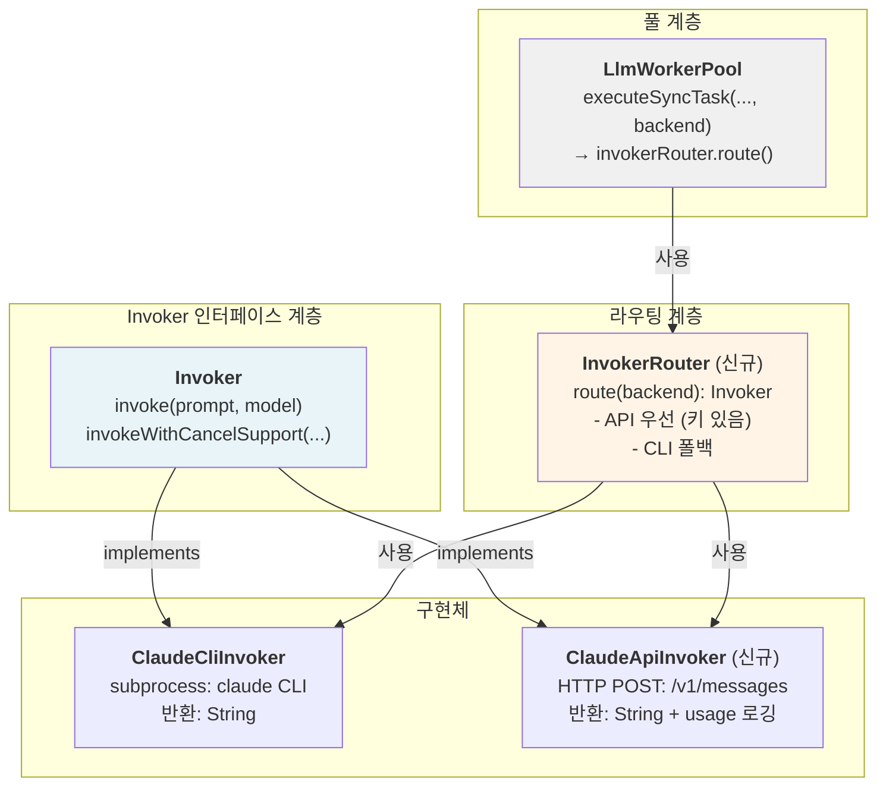
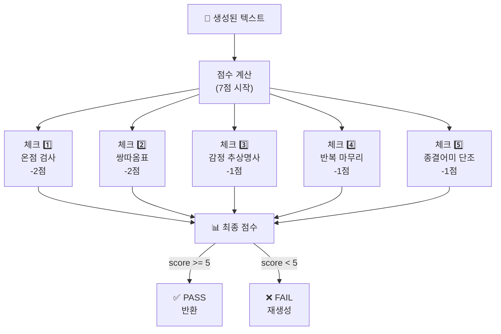

# LLM 텍스트 생성 서비스 아키텍처 (ai-user-llm: 8092)

**기준일**: 2026-06-06 · **모델**: claude-haiku-4-5-20251001 · **작성**: Claude Code
**상태**: Invoker 인터페이스 계층 구현 (CLI + Anthropic API 양방향 지원)

---

## 1. 개요

Claude CLI 또는 Anthropic Messages API를 통해 한국어 커뮤니티 텍스트 생성 및 품질 자동 검증하는 LLM 워커 서비스.

| 속성 | 값 |
|------|-----|
| **포트** | 8092 |
| **런타임** | Spring Boot 3.3 |
| **모델** | claude-haiku-4-5-20251001 |
| **백엔드** | **CLI (기본) / Anthropic API (옵션)** — InvokerRouter 자동 분기 |
| **CLI 바이너리** | `claude` (호스트 ~/.claude 인증 경유) |
| **API 인증** | `ANTHROPIC_API_KEY` 환경변수 (없으면 자동 CLI 폴백) |
| **동시성** | ThreadPoolExecutor 20 + LinkedBlockingQueue 100 |
| **타임아웃** | 120초 (설정 가능) |
| **플래그** | `--strict-mcp-config --no-session-persistence --print --output-format stream-json` (CLI만) |
| **프롬프트 캐싱** | ✅ 활성화 가능 (Anthropic API) — System 블록에 `cache_control: {type:"ephemeral"}` |

**엔드포인트**:
- `POST /generate/post` — 글 생성 (backend 파라미터 선택 가능)
- `POST /generate/comment` — 댓글 생성 (backend 파라미터 선택 가능)
- `POST /generate/reply` — 대댓글 생성 (backend 파라미터 선택 가능)
- `POST /generate/persona` — 페르소나 프로필 생성
- `GET /v1/metrics` — 워커 상태 (poolSize, active, queued, available, completed, rejected, throttled)

---

## 2. 전체 생성 파이프라인



---

## 3. Invoker 계층 — 엔드포인트 추상화

### 3.0 계층 구조



### 3.1 Invoker 인터페이스

```java
public interface Invoker {
    /**
     * 동기 호출 (기본)
     * @param prompt 통합 프롬프트
     * @param model 모델명
     * @return LLM 응답 텍스트
     */
    String invoke(String prompt, String model) throws LlmException;
    
    /**
     * 취소 지원 호출 (향후 확장용)
     * @param prompt 통합 프롬프트
     * @param model 모델명
     * @param inv CancelableInvocation 핸들
     * @return LLM 응답 텍스트
     */
    String invokeWithCancelSupport(String prompt, String model, CancelableInvocation inv) throws Exception;
}
```

---

### 3.2 ClaudeCliInvoker (기존, Invoker 구현 추가)

**프로세스 호출**:
```bash
claude chat \
  --model claude-haiku-4-5-20251001 \
  --strict-mcp-config \
  --no-session-persistence \
  --print \
  --output-format stream-json \
  --verbose \
  --include-partial-messages
```

**프롬프트 구분**:
```
[System 부분]

<<<USER_PROMPT>>>

[User 부분]
```

**특징**:
- stdin에 프롬프트 전달
- stdout 전체 수집 (비스트리밍 모드)
- 인증: 호스트 `~/.claude` 마운트 (환경변수 불필요)

---

### 3.3 ClaudeApiInvoker (신규)

**엔드포인트**: `POST https://api.anthropic.com/v1/messages`

**헤더**:
```
x-api-key: {ANTHROPIC_API_KEY}
anthropic-version: 2023-06-01
content-type: application/json
```

**프롬프트 구분**:
```
[System 부분]

<<<USER_PROMPT>>>

[User 부분]
```

**요청 바디**:
```json
{
  "model": "claude-haiku-4-5-20251001",
  "max_tokens": 2000,
  "system": [
    {
      "type": "text",
      "text": "[System 부분]",
      "cache_control": {
        "type": "ephemeral"
      }
    }
  ],
  "messages": [
    {
      "role": "user",
      "content": "[User 부분]"
    }
  ]
}
```

**프롬프트 캐싱 동작**:

| 호출 단계 | cache_write | cache_read | 비용 절감 |
|---------|-----------|-----------|---------|
| **첫 호출** | ✅ 시스템 프롬프트 적재 | — | — |
| 시스템 토큰 | ~5,800 | — | (기록됨) |
| **이후 호출** | — | ✅ 캐시 히트 | ~76% |
| 입력 비용 | — | cache_read_input_tokens | (입력 비용 대폭 절감) |

**응답 파싱 (usage 로깅)**:
```java
// 응답에서 usage 추출
response.usage.input_tokens
response.usage.output_tokens
response.usage.cache_read_input_tokens      // cache 히트 시만
response.usage.cache_creation_input_tokens  // cache_write 시만

// 로깅 예시
log.info("LLM API: input={}, output={}, cache_read={}, cache_write={}",
    input, output, cacheRead, cacheWrite);
```

**특징**:
- HTTP 요청 기반 (안정성 ↑)
- 프롬프트 캐싱으로 비용 76% 절감
- 실측: 입력 $1/Mtok, 출력 $5/Mtok (Haiku)

---

### 3.4 InvokerRouter (신규)

```java
public class InvokerRouter {
    private final ClaudeCliInvoker cliInvoker;
    private final ClaudeApiInvoker apiInvoker;
    private final String apiKey;
    private final boolean apiEnabled;
    
    /**
     * 요청 backend에 따라 적절한 Invoker 반환
     * @param backend "API" | "CLI" | null | "OFF"
     * @return ClaudeApiInvoker (조건 만족 시) 또는 ClaudeCliInvoker
     */
    public Invoker route(String backend) {
        // API 키 없으면 CLI로 자동 폴백
        if (!apiKey || !apiKey.trim().isEmpty()) {
            return cliInvoker;
        }
        
        // 명시적 OFF → CLI
        if ("OFF".equalsIgnoreCase(backend)) {
            return cliInvoker;
        }
        
        // 명시적 API + 설정 활성화 → API 선택
        if ("API".equalsIgnoreCase(backend) && apiEnabled) {
            return apiInvoker;
        }
        
        // 기본: CLI
        return cliInvoker;
    }
}
```

**라우팅 로직**:
1. `ANTHROPIC_API_KEY` 환경변수 확인
   - 없으면 무조건 CLI (기존 동작 유지)
2. `llm.api.enabled: true` 설정 확인
3. 요청 `backend` 필드 확인:
   - `"API"` → API 선택 (조건 만족 시)
   - `"CLI"` 또는 null → CLI 선택
   - `"OFF"` → CLI 선택

---

## 4. SelfCritiqueService — 자기비평 루프

### 4.1 활성화 조건

```yaml
# application.yml (기본값)
self-critique:
  enabled: ${SELF_CRITIQUE_ENABLED:false}      # 기본 비활성화 ⚠️
  pass-threshold: ${SELF_CRITIQUE_THRESHOLD:5}  # 7점 만점에서 5점 이상 통과
```

**현황**: 기본값 `false` — **환경변수 `SELF_CRITIQUE_ENABLED=true`로만 활성화**

**적용 범위**:
- `POST` (/generate/post) ✅ 적용
- `COMMENT` (/generate/comment) ✅ 적용
- `REPLY` (/generate/reply) ❌ 미적용 (짧아서 불필요, 비용 절감)
- `PERSONA` (/generate/persona) ❌ 미적용 (JSON 응답)

---

### 4.2 빠른 결정론적 체크 (LLM 호출 전, 0비용)



---

### 4.3 5개 체크포인트 루브릭

| 번호 | 체크 | 감점 | 정규식/로직 | 목적 | 상태 |
|------|------|------|-----------|------|------|
| 1️⃣ | **온점(.) 사용** | -2 | `(?<![.?!])\.` | 한국 커뮤니티는 온점 미사용 | ✅ 활성 |
| 2️⃣ | **쌍따옴표("")** | -2 | `"[^"\n]{1,60}"` | 간접화법 인용 금지 (한국 문체) | ✅ 활성 |
| 3️⃣ | **감정 추상명사** | -1 | `서운함\|답답함\|배신감\|억울함\|분노\|불안감\|자존감 하락\|허탈함` | Show, not tell | ✅ 활성 |
| 4️⃣ | **반복 마무리** | -1 | `다들 어떻게\|어떻게 해야 함?` | 패턴 반복 탐지 | ✅ 활성 |
| 5️⃣ | **종결어미 단조로움** | -1 | 80% 이상 `~임/~함/~됨/~있음/~없음` | 다양한 종결어미 | ✅ 활성 |
| 6️⃣ | **완벽한 4단 구조** | -1 | `배경→사건→갈등→질문` | 자연스러운 흐름 | ⚠️ 정의됨, 미사용 |

**PERFECT_STRUCTURE 상태**:
- 정규식 정의됨: `(?s)(배경|상황).*갈등.*질문|도입.*사건.*갈등.*질문`
- **현재 코드에서 활성화되지 않음** (체크 미실행)
- 향후 활성화 가능성 검토 필요

**Pass 기준**: `score >= pass-threshold` (기본값 5)

---

### 4.4 재생성 프롬프트 구조

실패 시 LLM 재생성 요청:

```
[System 부분 유지]

<<<USER_PROMPT>>>

[수정 요청] 아래 글에서 다음 문제를 수정해 다시 써라: {이슈 목록}

원문:
{draft 앞부분 400자}

원래 요청:
{user prompt 부분}
```

**재시도 메커니즘**:
- 재시도 타임아웃: 90초 (원래 120초보다 짧음)
- Graceful Fallback: 재생성도 실패/비어있으면 원본 반환 (로그 기록)

---

## 5. PromptAssembler — 프롬프트 구성

### 5.1 구조 및 구분자

```
[SYSTEM 부분]
  ├─ 페르소나 특성 (voiceProfile)
  ├─ 말투 규칙 (formality: polite/반말)
  ├─ 슬랭 수준 (slangLevel: 0.0~1.0)
  ├─ 커뮤니티 스타일 가이드 (voice/post.md 또는 comment.md 또는 reply.md)
  └─ 창작·표절 금지 규칙

<<<USER_PROMPT>>>

[USER 부분]
  ├─ 사용자 프로필 (demographic)
  ├─ 카테고리 (category: 연애, 가족, 직장 등)
  ├─ 아키타입 (archetype)
  ├─ 상황 시드 (topicSeed)
  ├─ 글 길이 지시 (lengthTier: SHORT/MEDIUM/LONG/VERYLONG)
  ├─ 동적 예시 (dynamicExamples: RAG 정규화 처리)
  ├─ 다양성 시드 (50% 확률로 1개 추가)
  ├─ 수정 주의사항 (correction_cautions)
  └─ 글로벌 금지 규칙 (globalForbidRules)
```

**구분자**: `<<<USER_PROMPT>>>` — SelfCritiqueService의 재생성 프롬프트 빌드 시 이를 기준으로 System/User 분리

---

### 5.2 동적 주입 슬롯

| 슬롯 | 용도 | 출처 | 처리 |
|------|------|------|------|
| `{voiceProfile}` | 페르소나 특성 | PromptAssembler 직접 주입 | 그대로 |
| `{dynamicExamples}` | 유사 커뮤니티 예시 | Learning 서비스 (RAG) | 정규화 (온점/따옴표 제거) |
| `{archetypeCommentSamples}` | 댓글 아키타입 예시 | DB 조회 | 그대로 |
| `{existingComments}` | 기존 댓글 (중복 회피) | DB 조회 | 그대로 |

---

### 5.3 길이 지시 (lengthTier)

| Tier | 범위 | 지시문 |
|------|------|---------|
| **SHORT** | 50~120자 | "아주 짧게 — 핵심 상황 하나만" |
| **MEDIUM** | 150~350자 | "짧게 — 상황과 감정 간략히" |
| **LONG** | 400~650자 | "보통 — 사건 흐름 상세히" |
| **VERYLONG** | 650~950자 | "길게 — 감정 흐름, 사족 자연스럽게 (backend 1000자 제한 §6.3)" |

---

### 5.4 다양성 시드 (8가지, 50% 확률 주입)

PromptAssembler에서 `Math.random() < 0.5` 시 다음 중 1개 랜덤 선택:

```java
String[] VARIETY_SEEDS = {
  "배경 설명은 1~2줄만. 감정과 상황으로 곧바로 진입.",
  "'내가', '나는' 1인칭을 계속 반복해서 쓸 것.",
  "마무리에서 해결책이나 결론을 내지 말고 물음표나 혼란 상태로 끝낼 것.",
  "중간에 '근데 생각해보니' 같은 사족 넣으면서 두서없게.",
  "마지막 문장을 강한 감정이나 의문으로 끝내기.",
  "배경 최소화 + 갈등 상황만 압축적으로 표현.",
  "반복적인 감정 표현: '내가 ~인데', '나는 ~이고'.",
  "구체적인 D-day나 기간 언급 (사귀는 지 1년, 일한 지 3개월)."
};
```

---

### 5.5 RAG 예시 정규화 (dynamicExamplesBlock)

Learning 서비스에서 크롤링한 실제 커뮤니티 글은 온점·쌍따옴표 포함 → 프롬프트에 주입 전 정규화:

```java
String normalized = examples.trim()
    .replaceAll("\\.$", "")  // 문장 끝 온점 제거
    .replaceAll("\"", "");   // 쌍따옴표 제거
```

**포매팅**:
```
───────────────────────────────────────
[참고용 예시 — 길이·구조만 모방, 문장부호·존댓말·반말은 위 규칙만 따를 것]
아래 예시의 온점, 존댓말, 표현을 절대 모방하지 말 것. 페르소나와 한국 문체 규칙 우선.
───────────────────────────────────────
{정규화된 예시}
───────────────────────────────────────
```

---

## 6. OutputSanitizer — 6단계 정제 파이프라인


---

### 6.1 세부 단계별 처리

| 단계 | 패턴/로직 | 입력 예시 | 출력 예시 |
|------|---------|---------|---------|
| **0. AI 메타** | META_RESPONSE 정규식 | "원댓글의 구체적인 내용을 알려주면..." | "" (공백) |
| **1. 멀티옵션** | "옵션 1", "선택지 1" | "[옵션 1]\n글1\n[옵션 2]\n글2" | "글1" |
| **2. 코드블록** | `\`\`\`...\`\`\`` | "\`\`\`\n글\n\`\`\`" | "글" |
| **3. 마크다운** | `##`, `**`, `[링크]()` | "**진짜**" | "진짜" |
| **4. 선두 제거** | LEADING_META | "물론이죠 글입니다" | "글입니다" |
| **5. 문체** | `\.(?!\.\.\|\!)`, `"..."` | "했음.\n" | "했음\n" |
| **6. 길이 자르기** | substring(maxLen) | 1500자 텍스트 | 1000자 텍스트 |

---

### 6.2 MAX 길이 제한

| ContentType | 최대 길이 | 비고 |
|-------------|---------|------|
| **POST** | **1000자** | OutputSanitizer MAX_POST — backend `PostCreateRequest @Size(max=1000)`와 일치 (2026-06-11) |
| **COMMENT** | 300자 | OutputSanitizer MAX_COMMENT |
| **REPLY** | 100자 이하 | 자르기 적용 안 함 (이미 짧음) |

**추가 체크**: ContentSafetyGuard (orchestrator)에서 별도 제한
- POST: 2200자
- COMMENT: 350자

---

### 6.3 "---" 구분선 처리 — 글 절단 근본 수정 (2026-06-11)

**증상**: 글 Sonnet 승격 시 prod 글 ~50%가 문장 중간에서 절단 ("어젯밤에 남친이 게임"만 22자). Haiku는 0%.

**원인 (stop_reason 직접 캡처로 규명)**: 모델 출력은 정상(`stop_reason=end_turn`, 1286자). 범인은
OutputSanitizer 3단계의 `\n---\n.*$` 삭제 규칙 — **Sonnet은 "제목\n\n---\n\n본문" 형태로 쓰는 습관**이라
본문 1200자가 통째로 날아갔다. Haiku는 `---`를 안 써서 안 드러났던 잠복 버그.

**수정**:
- 첫 `---` 구분선 뒤가 길면(본문, ≥40자) **구분선만 제거하고 보존**, 짧으면(AI 메타) 뒤를 삭제 (`HR_LINE` 패턴)
- `trimIncompleteEnding` 종결어미 통일·확장 — "느낌이었음"(었음 계열) 오판 + "화**요**일"의 "요"를
  한글 `\w` 미인식으로 종결 오매칭하던 버그 동반 수정 (`ENDING_ALT`/`COMPLETE_ENDING`/`ENDING_FINDER`)
- 길이 정책 정합: `lengthInstruction` VERYLONG "900~1800자" → **650~950자** (backend 1000자 제한 위반 방지),
  `MAX_POST` 2000→1000. 본문 보존하니 드러난 잠복 모순.
- orchestrator `executePost`에 **최소길이 재생성 가드** (`ai-user.min-post-chars`, 기본 50 — 제목만 남는 절단 방어)

**검증**: `OutputSanitizerHrTest` 5종 + dev sonnet 글 19건 절단 0·1000초과 0·400거부 0.
`ClaudeApiInvoker`에 `stop_reason` 로깅 추가 (max_tokens 절단 모니터링).

---

## 7. 문체 규칙 (TonalizationService + PromptAssembler)

### 7.1 반말 모드 (기본값)

```
✅ 허용 종결어미:
  ~임, ~함, ~거든, ~거임, ~더라, ~한다고 함, ~했음, ~는데, ~잖아, ~야

❌ 금지 종결어미:
  ~요, ~습니다, ~입니다, ~합니다, ~했어요, ~하세요

❌ 금지 문체:
  - 온점(.) 사용 — 대신: 줄바꿈, ㅠ, ㅋ, ... 
  - 쌍따옴표("") — 대신: ~라고 함, ~했다고 함
  - 겹따옴표 (한국 커뮤니티 문화 위배)

✅ 슬랭 강도별:
  - slangLevel >= 0.6: ㄹㅇ, ㄷㄷ, ㅋㅋㅋ, 개[형용사] 자연스럽게
  - 0.4~0.6: ㅋㅋ, ㅠㅠ 가끔
  - < 0.4: 줄임말 거의 없음
```

### 7.2 존댓말 모드 (formality: polite)

```
✅ 허용 종결어미:
  ~요, ~어요, ~아요, ~더라고요, ~것 같아요, ~했어요, ~해요

❌ 금지 종결어미:
  완전 반말 (~임, ~거든), 지나친 격식어 (~습니다, ~입니다)

❌ 금지 문체:
  - 온점(.) 사용 — 동일 규칙 (한국 커뮤니티)
  - 쌍따옴표("") — 대신: ~라고 하더라고요, ~했다고 해요

✅ 예시:
  - "진짜 공감해요" ✅ / "진짜 공감해요." ❌
  - "어휴 힘드셨겠어요 ㅠㅠ" ✅
  - "저도 그랬어요" ✅

✅ 슬랭:
  - slangLevel >= 0.5: ㅠㅠ, ㅋㅋ 가끔
  - < 0.5: 슬랭 거의 없음
```

---

## 8. LlmWorkerPool — 동시성 관리

### 8.1 스레드 풀 설정

| 설정 | 값 | 환경변수 | 목적 |
|------|-----|---------|------|
| **poolSize** | 20 | `LLM_POOL_SIZE` | 동시 Claude 호출 수 |
| **queueCapacity** | 100 | `LLM_QUEUE_CAPACITY` | 대기열 크기 |
| **defaultTimeout** | 120초 | `LLM_DEFAULT_TIMEOUT_MS` | 응답 대기 시간 |
| **queueWaitTimeout** | 30초 | `LLM_QUEUE_WAIT_TIMEOUT_MS` | 큐 대기 최대 시간 |

### 8.2 executeSyncTask 오버로드

**기존 (CLI 전용)**:
```java
String executeSyncTask(
    String prompt,
    String model,
    long timeoutMs,
    String corrId
) throws LlmException
```

**신규 (backend 선택)**:
```java
String executeSyncTask(
    String prompt,
    String model,
    long timeoutMs,
    String corrId,
    String backend  // "API" | "CLI" | null → InvokerRouter.route()
) throws LlmException
```

GenerationController에서 요청 backend 필드를 직접 pool에 전달:
```java
// 예: POST /generate/post
String content = pool.executeSyncTask(
    prompt,
    model,
    timeoutMs,
    correlationId,
    request.getBackend()  // 요청에서 전달된 backend
);
```

### 8.3 대기열 처리 흐름

```
요청 유입
  ↓
큐 크기 확인 (100 제한)
  ├─ 남음: 큐에 추가
  └─ 가득: 429 에러 (Too Many Requests)
  ↓
ThreadPoolExecutor 스레드 할당
  ├─ 여유: 즉시 실행
  └─ 포화(20): 큐 대기 또는 거부
  ↓
InvokerRouter.route(backend) → 적절한 Invoker 반환
  ├─ API 조건 만족: ClaudeApiInvoker (프롬프트 캐싱 활성화)
  └─ CLI: ClaudeCliInvoker
  ↓
Invoker.invoke() 실행 (120초 타임아웃)
  ├─ 성공: 결과 반환
  ├─ 타임아웃: InterruptedException
  └─ 에러: LlmException
```

---

## 9. 설정 파일 (application.yml)

```yaml
spring:
  application:
    name: llm-ai-user

server:
  port: 8092

management:
  endpoints:
    web:
      exposure:
        include: health,info
  endpoint:
    health:
      show-details: always

llm:
  worker:
    pool-size: ${LLM_POOL_SIZE:20}
    queue-capacity: ${LLM_QUEUE_CAPACITY:100}
    queue-wait-timeout-ms: ${LLM_QUEUE_WAIT_TIMEOUT_MS:30000}
    default-timeout-ms: ${LLM_DEFAULT_TIMEOUT_MS:120000}
    claude-binary-path: ${CLAUDE_BIN:claude}
    claude-model: ${CLAUDE_MODEL:claude-haiku-4-5-20251001}
  post-model: ${LLM_POST_MODEL:}               # 글(POST)+partner 전용 모델 (빈 값=claude-model 폴백)
  api:
    prompt-caching: ${LLM_API_PROMPT_CACHING:true}        # user-block cache_control 캐싱
    cache-ttl: ${LLM_API_CACHE_TTL:5m}                    # 5m(GA) | 1h(beta — clcocloud Kiro 오라우팅 유발)
    refusal-retries: ${LLM_API_REFUSAL_RETRIES:2}         # clcocloud 거절 노드 재시도 (§18)
    refusal-fallback-model: ${LLM_API_REFUSAL_FALLBACK_MODEL:claude-sonnet-4-6}  # 재시도 소진 시 폴백

self-critique:
  enabled: ${SELF_CRITIQUE_ENABLED:false}      # 🚨 기본값: false (compose dev/prod는 true)
  pass-threshold: ${SELF_CRITIQUE_THRESHOLD:5}
  extra-cliches: ${SELF_CRITIQUE_EXTRA_CLICHES:}  # 추가 AI 상투구 (쉼표 구분 리터럴, 무배포 등록)

anthropic:
  api-key: ${ANTHROPIC_API_KEY:-}              # Anthropic API 키 (DB system_setting 우선)

logging:
  level:
    root: INFO
    com.againspring.aiuser.llm: DEBUG
```

**환경변수**:

| 변수 | 기본값 | 설명 |
|------|-------|------|
| `LLM_API_PROMPT_CACHING` | `true` | user-block 캐싱 (clcocloud 간헐 무시 §16) |
| `LLM_API_CACHE_TTL` | `5m` | 캐시 TTL — `1h`은 직접 API 전용 (§16) |
| `LLM_POST_MODEL` | (빈 값) | 글+partner 전용 모델 (compose 기본 sonnet) |
| `LLM_API_REFUSAL_RETRIES` | `2` | clcocloud 거절 재시도 (§18) |
| `LLM_API_REFUSAL_FALLBACK_MODEL` | `claude-sonnet-4-6` | 거절 폴백 모델 (§18) |
| `ANTHROPIC_API_KEY` | (없음) | API 키 (DB system_setting 우선, 없으면 CLI 폴백) |
| `LLM_POOL_SIZE` | `20` | 스레드 풀 크기 |
| `LLM_QUEUE_CAPACITY` | `100` | 대기열 크기 |
| `LLM_DEFAULT_TIMEOUT_MS` | `120000` | 타임아웃 (ms) |
| `SELF_CRITIQUE_ENABLED` | `false` (compose는 true) | 자기비평 활성화 |
| `SELF_CRITIQUE_EXTRA_CLICHES` | (빈 값) | 추가 AI 상투구 (§15) |
| `CLAUDE_BIN` | `claude` | Claude CLI 바이너리 경로 |
| `CLAUDE_MODEL` | `claude-haiku-4-5-20251001` | 댓글/대댓글 모델 |

---

## 10. DTO 변경: backend 필드

**영향받는 DTO**:
- `PostGenRequest` — `private String backend` 추가
- `CommentGenRequest` — `private String backend` 추가
- `ReplyGenRequest` — `private String backend` 추가

**backend 값**:
- `"API"` — Anthropic API 사용 (조건 만족 시, 아니면 자동 CLI 폴백)
- `"CLI"` 또는 `null` — Claude CLI 사용
- `"OFF"` — 강제 CLI 사용

**예**:
```json
{
  "voiceProfile": "대학생, 감정 표현 직설적",
  "backend": "API",
  ...
}
```

---

## 11. 요청/응답 예시

### 11.1 POST /generate/post (backend 파라미터 포함)

**요청**:
```json
{
  "voiceProfile": "대학생, 감정 표현 직설적",
  "category": "연애",
  "archetype": "남친문제",
  "topicSeed": "연락이 끊겼어",
  "lengthTier": "MEDIUM",
  "demographic": "20대 여성, 대학생",
  "formality": "반말",
  "slangLevel": 0.5,
  "backend": "API",
  "dynamicExamples": "[예시 1] ...\n[예시 2] ...",
  "timeoutMs": 120000,
  "correlationId": "corr-abc123"
}
```

**응답** (성공):
```json
{
  "content": "남친이 어제부터 연락이 없음 ㅠㅠ...",
  "contentType": "post",
  "critiqueScore": 6,
  "critiquePassed": true,
  "elapsedMs": 5432,
  "correlationId": "corr-abc123"
}
```

**응답** (실패 — 큐 가득):
```json
{
  "error": "Queue capacity exceeded",
  "status": 429,
  "correlationId": "corr-abc123"
}
```

### 11.2 POST /generate/comment

**요청**:
```json
{
  "postTitle": "남친이 전여친 얘기를 자꾸 꺼냈어",
  "postBodyExcerpt": "남친이 계속 전여친 얘기를 함...",
  "stance": "AUTHOR",
  "voiceProfile": "20대, 공감 중심",
  "slangLevel": 0.6,
  "formality": "반말",
  "timeoutMs": 120000
}
```

**응답** (성공):
```json
{
  "content": "아 진짜 이건 정말 말이 안 됨 ㅋㅋㅋ",
  "contentType": "comment",
  "critiqueScore": 7,
  "critiquePassed": true,
  "elapsedMs": 1234,
  "correlationId": "..."
}
```

### 11.3 GET /v1/metrics

**응답**:
```json
{
  "poolSize": 20,
  "active": 5,
  "queued": 12,
  "available": 15,
  "completed": 1234,
  "rejected": 0,
  "throttled": 3
}
```

---

## 12. 에러 처리 및 문제 해결

### 12.1 Claude CLI 호출 실패

```
증상: "claude not found" 또는 "command not found"

원인:
1. 호스트 머신에 claude CLI 미설치
2. CLAUDE_BIN 환경변수 설정 오류
3. 컨테이너 볼륨 마운트 실패

해결:
1. 호스트에서 확인: which claude
2. 환경변수 확인: echo $CLAUDE_BIN
3. 컨테이너 재시작: docker compose restart againspring-llm-ai-user
```

### 12.2 Claude 인증 만료

```
증상: "Permission denied" 또는 "Authentication failed"

원인: ~/.claude/config.json 만료 또는 손상

해결:
1. 호스트에서 재로그인: claude auth login
2. 컨테이너 재시작: docker compose restart againspring-llm-ai-user
3. 필요 시 ~/.claude 전체 삭제 후 재인증
```

### 12.3 API 키 설정 오류

```
증상: "Unauthorized" 또는 "Invalid API Key" (401 에러)

원인:
1. ANTHROPIC_API_KEY 환경변수 없음 또는 오타
2. API 키 만료 또는 잘못된 형식

해결:
1. 환경변수 확인:
   echo $ANTHROPIC_API_KEY
2. 키 재발급 (Anthropic 콘솔에서):
   https://console.anthropic.com/account/keys
3. 컨테이너 재시작:
   docker compose restart againspring-llm-ai-user
4. API 키 없으면 CLI 자동 폴백:
   backend: null 또는 "CLI" 요청
```

### 12.4 프롬프트 캐싱 히트 실패

```
증상: cache_read_input_tokens가 0 (캐시 미히트)

원인:
1. LLM_API_PROMPT_CACHING: false (비활성화)
2. System 프롬프트 변경됨
3. 처음 호출 (항상 cache_write)

해결:
1. 설정 확인:
   echo $LLM_API_PROMPT_CACHING
2. System 프롬프트 안정화 (변경 최소화)
3. 로그 확인:
   docker logs -f againspring-llm-ai-user | grep "cache_"
```

### 12.5 큐 용량 초과 (HTTP 429)

```
증상: "Too Many Requests" (429 에러)

원인: 동시 요청 > poolSize + queue capacity

해결:
1. 요청 분산 (배치 크기 줄이기)
2. LLM_POOL_SIZE 증가 (기본 20):
   export LLM_POOL_SIZE=40
3. LLM_QUEUE_CAPACITY 증가 (기본 100):
   export LLM_QUEUE_CAPACITY=200
```

### 12.6 타임아웃 (HTTP 504)

```
증상: "Gateway Timeout" (504 에러)

원인: 120초 이내에 응답 안 옴

해결:
1. Claude CLI 성능 이슈 확인:
   docker logs -f againspring-llm-ai-user | grep -i timeout
2. LLM_DEFAULT_TIMEOUT_MS 증가:
   export LLM_DEFAULT_TIMEOUT_MS=180000  # 180초
3. 호스트 리소스 확인:
   docker stats againspring-llm-ai-user
```

### 12.7 자기비평 루프 무한 반복

```
증상: "critique retry failed ... → returning original" 로그 반복

원인: 동일한 이슈가 재생성에서도 발생 (루프 진입 방지)

처리: Graceful fallback으로 원본 자동 반환 (설계된 동작)

로그 확인:
docker logs -f againspring-llm-ai-user | grep critique
```

---

## 13. 모니터링 & 성능 튜닝

### 13.1 실시간 모니터링

```bash
# 헬스 체크
curl http://localhost:8092/actuator/health | jq .

# 워커 메트릭
curl http://localhost:8092/v1/metrics | jq .

# 실시간 로그
docker logs -f againspring-llm-ai-user | grep -E "FAIL|PASS|timeout"
```

### 13.2 성능 최적화

| 경우 | 조정값 | 이유 |
|------|-------|------|
| 동시 요청 많음 | ↑ LLM_POOL_SIZE | 스레드 병렬 증가 |
| 대기 시간 많음 | ↑ LLM_QUEUE_CAPACITY | 큐 대기 공간 증대 |
| 타임아웃 빈번 | ↑ LLM_DEFAULT_TIMEOUT_MS | 여유 시간 확보 |
| CPU 높음 | ↓ LLM_POOL_SIZE | 스레드 경합 감소 |
| 메모리 부족 | ↓ LLM_QUEUE_CAPACITY | 최대 대기 요청 감소 |

---

## 14. 주요 패턴과 설계

### 14.1 Graceful Fallback 철학

```
목표: 완벽성보다 안정성

┌─────────────────────┐
│ 1단계: 빠른 체크     │ ← 정규식으로 0비용 검증
│ (LLM 호출 전)       │
└─────────────────────┘
         ↓ FAIL
┌─────────────────────┐
│ 2단계: LLM 재생성   │ ← 1회 재시도, 90초
│ (feedback 주입)     │
└─────────────────────┘
         ↓ 여전히 FAIL
┌─────────────────────┐
│ 3단계: 원본 반환    │ ← Graceful fallback
│ (로그 기록)         │   완벽성 포기, 안정성 우선
└─────────────────────┘
```

### 14.2 비용 효율성

| 작업 | 백엔드 | 비용 | 적용 범위 |
|------|-------|------|---------|
| quickCheck (정규식) | CLI/API | 0 | POST + COMMENT |
| System 프롬프트 cache_write | API | ~5,800 토큰 | 첫 호출 |
| System 프롬프트 cache_read | API | ~1,400 토큰 (76% 절감) | 이후 호출 |
| 재생성 1회 | CLI/API | 1 호출 | POST + COMMENT (FAIL 시) |
| REPLY | CLI/API | 0 (자기비평 미적용) | — |
| **총 비용 (CLI)** | CLI | 최대 2x | 품질 + 성능 균형 |
| **총 비용 (API + 캐싱)** | API | 1회: 2x, 이후: ~0.5x | 비용 76% 절감 |

**프롬프트 캐싱 ROI**:
- 시스템 프롬프트 크기: ~5,800 토큰
- 캐시 히트율: 입력 토큰 76% 절감
- Haiku 단가: 입력 $1/Mtok, 출력 $5/Mtok
- 월 1,000 요청 기준: **약 $3~5 절감**

### 14.3 Backend 선택 가이드

| 시나리오 | 권장 | 이유 |
|--------|------|------|
| **개발/테스트** | CLI | 무료, 호스트 인증 경유 |
| **프로덕션 (고빈도)** | API + 캐싱 | 비용 76% 절감, 안정성 ↑ |
| **프로덕션 (저빈도)** | CLI | 충분한 성능, API 키 관리 불필요 |
| **하이브리드** | InvokerRouter (자동 폴백) | API 우선, CLI 폴백 — 최선의 선택 |

**선택 방법**:
```json
{
  "backend": "API"    // Anthropic API 시도 (키 없으면 CLI 폴백)
}
```

또는:
```json
{
  "backend": null     // CLI 강제 (기본값)
}
```


## 15. 문체 현실화 (2026-06-11)

AI 유저 출력이 "AI투"로 수렴하고 같은 페르소나가 반복하는 문제의 대응 (orchestrator·learning과 공동 작업).

**프롬프트 블록 (PromptAssembler — 전부 USER 섹션, 캐시 prefix 불변)**
- `recentOutputs`: 이 페르소나의 최근 출력 목록 + "같은 시작·말버릇·전개 반복 시 실격" 지시. post/comment/reply 전부.
- `styleExamples`: voice 소스 크롤 코퍼스의 랜덤 문체 샘플 ("종결어미·호흡만 모방, 내용 모방 금지"). comment/reply.
- `modeHint`: 오케스트레이터가 샘플링한 반응 모드·길이 지시 — 고정 "50~150자"·"초단문 15~40자"를 대체.
- reply 프롬프트의 "정말/진짜 강조 반복 자연스러움"·"💚 이모지" 하드코딩 제거 (AI투 직접 권장이었음).

**모델 분리 (S5)**
- `llm.post-model` (`LLM_POST_MODEL`, compose 기본 `claude-sonnet-4-6`): 글(POST)+partner 생성만 모델 오버라이드. 댓글/대댓글은 `CLAUDE_MODEL`(Haiku) 유지. 빈 값 = 비활성. SelfCritique 재생성도 동일 모델 승계.
- ClaudeApiInvoker usage 로그에 `model=` 필드 추가 — 응답이 실제 처리된 모델 확인용.

**SelfCritique 추가 체크 (S4)**
- ⑧ AI 상투구 (정말 공감/힘내세요/응원합니다/마음이 느껴/충분히~/그렇군요 등) −2
- ⑨ "진짜"·"정말" 합산 3회 이상 −1 / ⑩ ㅠ·ㅜ 묶음 3회 이상 −1
- `self-critique.extra-cliches` (`SELF_CRITIQUE_EXTRA_CLICHES`, 쉼표 구분 리터럴): 운영 중 발견한 상투구를 재배포 없이 추가.

**voice/*.md 가이드 개정**
- comment: 고정 "공감 먼저→경험→조언" 구조 해체 → [반응 모드] 지시 최우선. 상투구 금지 목록 추가.
- reply: "정말/진짜 반복 자연스러움" 규칙 삭제 → 강조어 변주 규칙. 💚 제거.
- post: AI 티 패턴 섹션 추가 (진짜/정말 2회 초과 금지, 시작 다양화, 문장 길이 변주).
- ⚠️ 반영 절차: DB `ai_prompt_template`이 우선이므로 가이드 수정 시 **DB 갱신 + `POST /internal/prompts/reload` 필수** (배포 전 DB 내용과 diff — admin 수동 편집 보존).


## 16. 프롬프트 캐싱 복원 — 프록시 안전형 (2026-06-11, 캐싱 P1)

**경위**: 06-07 system 2블록 캐싱(85~87% 히트) → 06-10 clcocloud가 system 필드 요청을 Kiro로 오라우팅하는
버그 우회(5fba9ae4) 때 캐싱까지 제거됨(0%) → 06-11 user-block 방식으로 복원.

**구조 (`ClaudeApiInvoker.buildRequestBody`)**: system 필드는 계속 미사용. user content를 2블록으로 분리 —
- block1 = `<instructions>\n` + PERSONA_SECTION 앞 정적 prefix + **cache_control(ephemeral)** ← 타입별 공통, 4.3~5.5k tok
- block2 = 페르소나 섹션 + `</instructions>` + 유저 요청 ← 가변
- 두 블록을 이으면 기존 단일 블록과 의미 동일 → 모델 동작 불변 (`ClaudeApiInvokerCacheTest`)

**TTL 정책 (프로브 실측 2026-06-11, `ai-user/tools/cache-probe.py`)**:
- 기본 **5m (GA)** — beta 헤더 불필요, clcocloud 패스스루 확인 (write 8063 → read 8100)
- ⚠️ **1h TTL의 anthropic-beta 헤더는 clcocloud에서 Kiro 오라우팅을 유발** ("저는 Kiro" 응답 + model 필드 위조 실측)
  → `LLM_API_CACHE_TTL=1h`는 직접 api.anthropic.com 전환 시에만 사용
- Haiku 최소 캐시 prefix 4096토큰 — 미달 시 조용히 스킵 (실측: 3.9k input 프롬프트에서 write=0).
  인보커가 정적부 4,800자 미만이면 WARN. **voice 가이드 축소 시 주의.**

**설정**: `llm.api.prompt-caching`(기본 true) · `llm.api.cache-ttl`(기본 5m)
**측정**: `python3 ai-user/tools/api-usage-report.py [--container ... --since 24h]` — 일별·모델별 히트율·과금등가·절감률

**🔴 정산 결론 (2026-06-12, prod 8.5h 실측)**: **clcocloud 캐싱은 신뢰 불가 — 사실상 절감 없음.**
07:15~08:36엔 캐싱 존중(read 발생)하다가 **08:36 이후 완전 무시**(input≈8000인데 write=0). 같은 날
재프로브도 동일 프롬프트 2연속 둘 다 write/read=0. 우리 코드는 정상(07:15 히트가 증명) — 순수
**프록시측 간헐 비활성**. 게다가 prod 호출 간격 ~13분 ≫ 5m TTL이라 켜져 있어도 히트율 낮음(dev 90%는
5분내 버스트 워밍). → **캐싱은 "되면 보너스", 신뢰 절감 경로는 토큰 다이어트(§17).** `prompt-caching=true`는
유지(무시되면 무해, Sonnet 글은 최소 1024tok라 여전히 기회). 청구 절감 최종 증빙은 크레딧 소모 속도.


## 17. 토큰 다이어트 (2026-06-12)

**배경**: clcocloud 캐싱 신뢰불가 정산(§16 — 간헐 작동, 실현 절감 6%→0%) → 호출마다 전액 과금되는
정적 prefix 자체를 축소. 문체 현실화(§15)의 런타임 동적 주입(styleExamples·recentOutputs·modeHint·
페르소나 예시 풀)이 정적 예시를 대체하므로 가능해짐.

**내용**:
- voice 가이드 4종: 예시 모음 섹션 삭제, 규칙·AI투 금지목록·REACT 지시 보존 —
  comment 3,698→1,920c · reply 3,618→1,477c · post 4,378→1,662c · partner 4,179→1,416c
- buildSystem 코어: ❌/✅ 예시 각 1개로 압축 (규칙 무손실, −~600c)
- ActionExecutor: 글 dynamicExamples 항목당 350자 컷 (최대 ~5k tok 폭주 방지)
- ClaudeApiInvoker: prefix 4096tok 미달 WARN→DEBUG (다이어트로 의도된 상태)

**실측 절감** (dev): 글(sonnet) input등가 7.7~8.6k → **평균 4,984 tok (−40%)** ·
댓글 prefix 동일조건 비교 4,724 → 2,765 tok (**−1,959 tok, −41%**).
절단 0 · 1000자 초과 0 · critique FAIL 0.

**한글 토큰 비율 정정**: 실측 ~1.8 tok/char (이전 기록 0.87은 오류) — 다이어트 후에도
comment prefix가 4096tok을 넘어 Haiku 캐시 기회는 보존됨.

⚠️ 가이드를 다시 늘릴 땐 DB `ai_prompt_template` 갱신 절차(§16) 필수.

## 18. clcocloud 거절 노드 대응 — 재시도 + 모델 폴백 (2026-06-12)

**증상**: dev·prod 댓글/대댓글(Haiku)이 일제히 FAILED — 모델이 "I appreciate you testing my consistency"·
"I can't help with this request"·"죄송하지만 저는 이 요청…" 류 영어/한국어 메타 거절만 반환. Sonnet(글)은 정상.

**진단 (실측)**: 프롬프트로 우회 불가 — **assistant prefill조차 무시**(진짜 Claude면 prefill을 이어가므로
프록시가 자체 거절 응답을 주입한다는 결정적 증거), 모델명 alias(`claude-haiku-4-5`)도 1/4만 통과 →
**clcocloud Haiku 풀에 거절 노드가 확률적으로 혼입**. 시간대별로 전면 거절↔정상 변덕. **운영 방침: CLI 전환
금지, clcocloud API 유지.**

**대응 (`ClaudeApiInvoker.invoke`)**:
- 거절(`PROVIDER_ERROR`) **한정** 재시도 — `llm.api.refusal-retries`(기본 2). 거절 외 오류는 즉시 전파
- 재시도 소진 시 폴백 모델 1회 승격 — `llm.api.refusal-fallback-model`(기본 `claude-sonnet-4-6`, 거절 0% 실측)
- clcocloud 정상 시 재시도 미발동(추가 비용 0). 거절 1회당 input ~5k tok 추가 과금은 감수(생성 중단보다 우선)
- `invokeWithCancelSupport`도 `invoke()` 경유 → 동일 재시도·폴백 적용

**LLM 거절문 게시 차단 보강 (절대규칙 #7)**: 과거 시그니처 미스로 거절문이 가드 2계층을 통과해 게시됨
(dev 63건·prod 1건 정화). `LlmErrorSignature`(llm) + `ContentSafetyGuard.LLM_ERROR_SIGNATURES`(orchestrator)에
12종 동시 보강: `can't help with this`·`role-play as`·`이 요청을 도와드릴 수 없`·`이 프롬프트는` 등.
**오염 루프 차단**: 게시→history→`recentOutputs` 재주입 경로에서 후속 생성까지 거절시키던 문제 →
`ActionExecutor.loadRecentBodies`에 `ContentSafetyGuard` 통과분만 사용하는 필터 추가.

**라이브 증명** (prod 04:22): Haiku 3연속 거절(input 5037×3) → Sonnet 폴백 성공 → 대댓글 게시.

---

**마지막 업데이트**: 2026-06-12 | **버전**: Invoker 인터페이스 계층 v1.0
**기반**: ClaudeCliInvoker, ClaudeApiInvoker, InvokerRouter, SelfCritiqueService, OutputSanitizer
