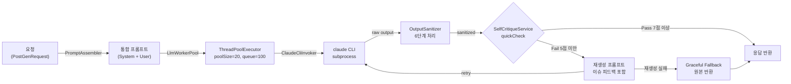
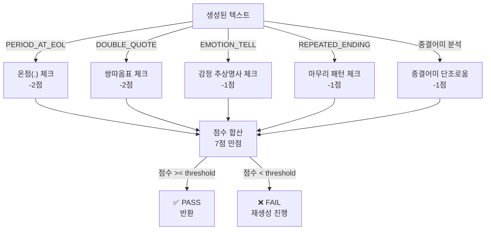
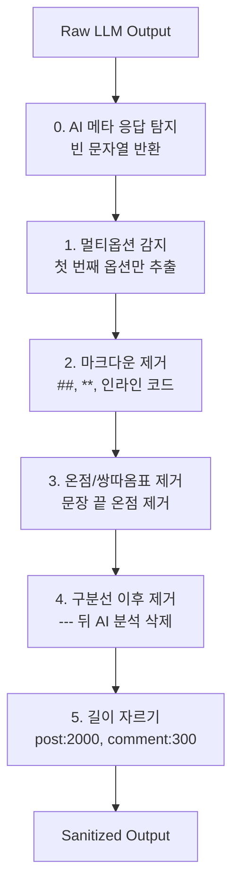

# LLM 텍스트 생성 서비스 (ai-user-llm)

## 1. 개요

**역할**: Claude CLI(claude-haiku-4-5-20251001)를 subprocess로 호출해 한국어 커뮤니티 텍스트 생성 및 품질 검증

- **포트**: 8092 (Spring Boot 3.3)
- **모델**: `claude-haiku-4-5-20251001`
- **엔드포인트**: POST `/generate/post`, `/generate/comment`, `/generate/reply`, `/generate/persona`
- **자동화**: SelfCritiqueService (자기비평 루프 포함)

---

## 2. 생성 파이프라인



---

## 3. 자기비평(Self-Critique) 루프

### 3.1 빠른 결정론적 체크 (LLM 호출 전, 0비용)



### 3.2 7점 루브릭 체크포인트

| 체크포인트 | 감점 | 패턴 | 목적 |
|-----------|------|------|------|
| **온점(.) 사용** | -2 | 문장 끝 `\.` 정규식 | 한국 커뮤니티 문체 준수 |
| **쌍따옴표("")** | -2 | 인용 시 `"..."` 패턴 | 간접화법에서 따옴표 금지 |
| **종결어미 단조로움** | -1 | 80% 이상 ~임/~함/~됨 | 다양한 종결어미 강화 |
| **반복 마무리** | -1 | "다들 어떻게", "어떻게 해야" | 패턴 반복 탐지 |
| **감정 추상명사** | -1 | "서운함", "답답함", "배신감" | Show, not tell 원칙 |
| **완벽한 4단 구조** | -1 | 배경→사건→갈등→질문 정확히 따름 | 자연스럽고 유기적인 흐름 |

**Pass 기준**: 점수 >= `self-critique.pass-threshold` (기본값: 5점)

### 3.3 재생성 프롬프트 구조

실패 시 재생성 프롬프트:
```
[수정 요청] 아래 글에서 다음 문제를 수정해 다시 써라: {이슈 목록}

원문:
{draft 앞부분 400자}

원래 요청:
{user prompt 부분}
```

- **재시도 타임아웃**: 90초
- **Graceful Fallback**: 재생성도 실패하면 원본 반환 (로그 기록)

---

## 4. 프롬프트 구조

### 4.1 구분자 및 부분 구성

```
[SYSTEM 부분]
- 페르소나 특성 (voiceProfile)
- 말투 규칙 (formality: polite/반말)
- 슬랭 수준 (slangLevel: 0.0~1.0)
- 커뮤니티 스타일 가이드 (guide: post.md / comment.md / reply.md)
- 창작 금지 규칙

<<<USER_PROMPT>>>

[USER 부분]
- 사용자 프로필 (demographic)
- 카테고리 (category)
- 아키타입 (archetype)
- 상황 시드 (topicSeed)
- 글 길이 지시 (lengthTier: SHORT/MEDIUM/LONG/VERYLONG)
- 동적 예시 (dynamicExamples: RAG 검색 결과)
- 다양성 시드 (50% 확률로 1개 추가)
```

### 4.2 동적 프롬프트 주입 슬롯

| 슬롯 | 용도 | 출처 |
|------|------|------|
| `{voiceProfile}` | 페르소나 특성 설명 | PromptAssembler (직접 주입) |
| `{dynamicExamples}` | 유사 커뮤니티 예시 | Learning 서비스 (RAG 검색) |
| `{archetypeCommentSamples}` | 댓글 아키타입 | DB 조회 |
| `{existingComments}` | 기존 댓글 (중복 회피) | DB 조회 |

### 4.3 길이 지시 (lengthTier)

| Tier | 범위 | 지시문 |
|------|------|---------|
| SHORT | 50~120자 | 아주 짧게 — 핵심 상황 하나만 |
| MEDIUM | 150~350자 | 짧게 — 상황과 감정 간략히 |
| LONG | 400~800자 | 보통 — 사건 흐름 상세히 |
| VERYLONG | 900~1800자 | 길게 — 감정 흐름, 사족 자연스럽게 |

### 4.4 다양성 시드 (8가지, 50% 확률)

```java
String[] VARIETY_SEEDS = {
  "배경 설명은 1~2줄만. 감정과 상황으로 곧바로 진입.",
  "'내가', '나는' 1인칭을 계속 반복해서 쓸 것.",
  "마무리에서 해결책이나 결론을 내지 말고 물음표나 혼란 상태로 끝낼 것.",
  "중간에 '근데 생각해보니' 같은 사족 넣으면서 두서없게.",
  "마지막 문장을 강한 감정이나 의문으로 끝내기.",
  "배경 최소화 + 갈등 상황만 압축적으로 표현.",
  "반복적인 감정 표현: '내가 ~인데', '나는 ~이고'.",
  "구체적인 D-day나 기간 언급 (사귄 지 1년, 일한 지 3개월).",
};
```

---

## 5. LlmWorkerPool 설정

### 5.1 스레드 풀 구성

| 설정 | 값 | 환경변수 | 목적 |
|------|-----|---------|------|
| poolSize | 20 | `LLM_POOL_SIZE` | 동시 Claude 호출 수 |
| queueCapacity | 100 | `LLM_QUEUE_CAPACITY` | 대기열 크기 |
| defaultTimeout | 120초 | `LLM_DEFAULT_TIMEOUT_MS` | 응답 대기 시간 |
| queueWaitTimeout | 30초 | `LLM_QUEUE_WAIT_TIMEOUT_MS` | 큐 대기 최대 시간 |

### 5.2 Claude CLI 호출

- **바이너리 경로**: `${CLAUDE_BIN:claude}` (보통 `claude` 또는 `/usr/local/bin/claude`)
- **모델**: `${CLAUDE_MODEL:claude-haiku-4-5-20251001}`
- **플래그**: `--strict-mcp-config --no-session-persistence --print`
- **입력**: subprocess stdin에 프롬프트 전달
- **출력**: stdout 수집 및 OutputSanitizer로 전처리

### 5.3 용량 초과 처리

- **큐 가득 참**: 429 에러 (Too Many Requests) 반환
- **타임아웃**: 120초 경과 시 InterruptedException → 재시도 불가

---

## 6. OutputSanitizer 처리 단계

### 6.1 6단계 정제 파이프라인



### 6.2 세부 단계

| 단계 | 정규식/패턴 | 처리 | 예시 |
|------|----------|------|------|
| **0. AI 메타 응답** | `META_RESPONSE` | 빈 문자열 | "원댓글의 구체적인 내용을 알려주면..." → "" |
| **1. 멀티옵션** | "옵션 1 ... 옵션 2" | 첫 번째만 | `[옵션 1]글1 [옵션 2]글2` → 글1 |
| **2. 코드블록** | ` ``` ... ``` ` | 안쪽 내용 추출 | ` ```\n글\n``` ` → 글 |
| **3. 마크다운** | `##`, `**`, 인라인` | 제거 | "**진짜**" → "진짜" |
| **4. 온점/따옴표** | 최종 한 번 더 스캔 | 제거 | 텍스트 끝 온점 제거 |
| **5. 구분선** | `---+` 이후 모두 | 삭제 | "글\n---\n분석" → "글" |
| **6. 길이 자르기** | substring(maxLen) | 자르기 | post 2000자, comment 300자 제한 |

### 6.3 MAX 길이

- **POST**: 2000자
- **COMMENT**: 300자
- **REPLY**: 보통 100자 이하 (자르기 적용 안 함)

---

## 7. PromptAssembler 메서드

### 7.1 공개 메서드

| 메서드 | 입력 | 출력 | 용도 |
|--------|------|------|------|
| `assemblePostPrompt(PostGenRequest)` | req | String (System + <<<USER_PROMPT>>> + User) | 글 생성 요청 |
| `assembleCommentPrompt(CommentGenRequest)` | req | String (System + <<<USER_PROMPT>>> + User) | 댓글 생성 요청 |
| `assembleReplyPrompt(ReplyGenRequest)` | req | String (System + <<<USER_PROMPT>>> + User) | 대댓글 생성 요청 |
| `assemblePersonaPrompt(PersonaGenRequest)` | req | String (완성 프롬프트 그대로) | 페르소나 특성 정의 |

### 7.2 Formality 규칙

#### polite (존댓말 모드)

```
**존댓말 사용** — 자연스러운 구어 존댓말:
- 사용: ~요, ~어요, ~아요, ~더라고요, ~것 같아요, ~했어요, ~해요
- 허용: "진짜 공감해요", "저도 그랬어요", "어휴 힘드셨겠어요 ㅠㅠ"
- 금지: 지나친 격식어 (~습니다, ~입니다), 완전 반말 (~임, ~거든)
- 금지: 쌍따옴표("") — 간접화법 시 ~라고 하더라고요 / ~했다고 해요
- 슬랭: slangLevel >= 0.5면 ㅠㅠ, ㅋㅋ 가끔 사용
```

#### 반말 모드 (기본값)

```
**반말 전용** — 아래 종결어미 절대 사용 금지:
- 금지: ~요, ~습니다, ~입니다, ~합니다, ~했어요, ~하세요
- 사용: ~임, ~함, ~거든, ~거임, ~더라, ~한다고 함, ~했음, ~는데, ~잖아, ~야
- 금지: 쌍따옴표("") — 간접화법 시 ~라고 함 / ~했다고 함
- 슬랭 >= 0.6: ㄹㅇ, ㄷㄷ, ㅋㅋㅋ, 개[형용사] 자연스럽게
- 슬랭 0.4~0.6: ㅋㅋ, ㅠㅠ 가끔
- 슬랭 < 0.4: 줄임말 거의 없음
```

---

## 8. 핵심 3가지 원칙 (2026-06-04 개정)

### 8.1 배경 50% 축소 → 본 이야기로 빠르게 진입

```
❌ "5년을 사귀고 있는데, 만난 지 첫 6개월에는 좋았지만, 지금은 점점..."
✅ "남친이 전여친 얘기를 자꾸 꺼냄. 나는 진짜 못 듣겠음."

→ 배경은 최대 1~2줄, 나머지는 갈등 상황 + 감정에 할애
```

### 8.2 감정 토로 강화 → 1인칭 연속 사용

```
❌ "남편이 내 의견을 무시합니다. 이것이 문제입니다."
✅ "내가 말해도 남편은 안 들어. 나는 계속 답답하고. 내가 뭐가 잘못한 건가."

→ "저는", "제가", "나는", "내가" 반복으로 주인공성 강조
```

### 8.3 미완성감 유지 → 결론 없이 질문/혼란으로 끝내기

```
❌ "결론적으로 우리는 상담을 받아야 할 것 같습니다."
✅ "그래서 지금 내가 뭘 해야 하는지 몰라. 우리 진짜 이대로는 안 될 것 같은데..."

→ 해결책 제시 금지 — 막혀있는 상태를 그대로 노출
```

---

## 9. 커뮤니티 필수 문체 규칙

### 9.1 온점(.) 사용 금지

```
금지: "남자친구가 전여친 얘기를 꺼냈어요." / "정말 황당했음."
허용: "남자친구가 전여친 얘기를 꺼냈어요" / "정말 황당했음"

→ 온점 대신 줄바꿈, ㅠ, ㅋ, ... 으로 끊기
예외: 물음표(?), 느낌표(!), 말줄임표(...) 사용 가능
```

### 9.2 쌍따옴표("") 사용 금지

```
금지: 남자친구가 "전여친이 더 예뻤다"고 했어 / "바빠서 못 봤다"며 연락이 없음
허용: 남자친구가 전여친이 더 예뻤다고 했어 / 바빠서 못 봤다며 연락이 없음
허용: 남자친구가 그냥 지나가는 말이라고 함 / 걔가 뭐라고 했냐면
```

---

## 10. 설정 파일 (application.yml)

```yaml
server:
  port: 8092

llm:
  worker:
    pool-size: ${LLM_POOL_SIZE:20}
    queue-capacity: ${LLM_QUEUE_CAPACITY:100}
    queue-wait-timeout-ms: ${LLM_QUEUE_WAIT_TIMEOUT_MS:30000}
    default-timeout-ms: ${LLM_DEFAULT_TIMEOUT_MS:120000}
    claude-binary-path: ${CLAUDE_BIN:claude}
    claude-model: ${CLAUDE_MODEL:claude-haiku-4-5-20251001}

self-critique:
  enabled: ${SELF_CRITIQUE_ENABLED:false}
  pass-threshold: ${SELF_CRITIQUE_THRESHOLD:5}
```

---

## 11. 요청/응답 예시

### 11.1 POST /generate/post

**요청**:
```json
{
  "voiceProfile": "대학생, 감정 표현 직설적",
  "category": "연애",
  "archetype": "남친문제",
  "topicSeed": "연락이 없어졌어",
  "lengthTier": "MEDIUM",
  "demographic": "20대 여성, 대학생",
  "formality": "반말",
  "slangLevel": 0.5,
  "dynamicExamples": "[예시 1] 글1\n[예시 2] 글2"
}
```

**응답**:
```json
{
  "content": "남친이 어제부터 연락이 없음...",
  "contentType": "post",
  "critiqueScore": 6,
  "critiquePassed": true
}
```

### 11.2 POST /generate/comment

**요청**:
```json
{
  "postTitle": "남친이 전여친 얘기를 자꾸 꺼냈어",
  "postBodyExcerpt": "남친이 계속 전여친 얘기를 함...",
  "stance": "AUTHOR",
  "voiceProfile": "20대, 공감 중심",
  "slangLevel": 0.6,
  "formality": "반말"
}
```

**응답**:
```json
{
  "content": "아 진짜 이건 진짜 말이 안 됨 ㅋㅋㅋ",
  "contentType": "comment",
  "critiqueScore": 7,
  "critiquePassed": true
}
```

---

## 12. 문제 해결

### 12.1 Claude CLI 호출 실패

```
에러: "claude not found" 또는 "command timeout"
해결:
1. CLAUDE_BIN 환경변수 확인: echo $CLAUDE_BIN
2. claude CLI 설치 확인: which claude
3. LLM_DEFAULT_TIMEOUT_MS 증가 (기본 120초)
```

### 12.2 자기비평 루프 무한 반복

```
에러: "critique retry failed corr=... → returning original"
원인: 동일한 이슈가 재생성에서도 발생
처리: Graceful fallback으로 원본 반환 (자동)
```

### 12.3 큐 용량 초과

```
에러: HTTP 429 (Too Many Requests)
해결:
1. LLM_POOL_SIZE 증가 (기본 20)
2. LLM_QUEUE_CAPACITY 증가 (기본 100)
3. 요청 분산 (배치 크기 줄이기)
```

---

**마지막 업데이트**: 2026-06-05
