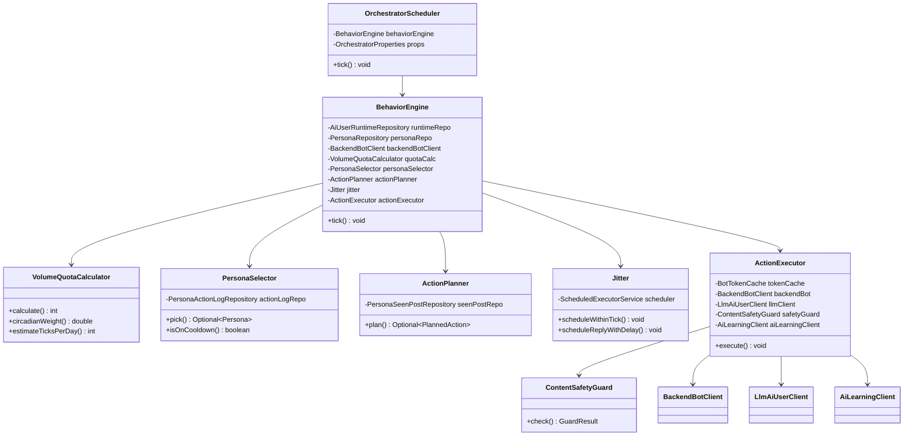
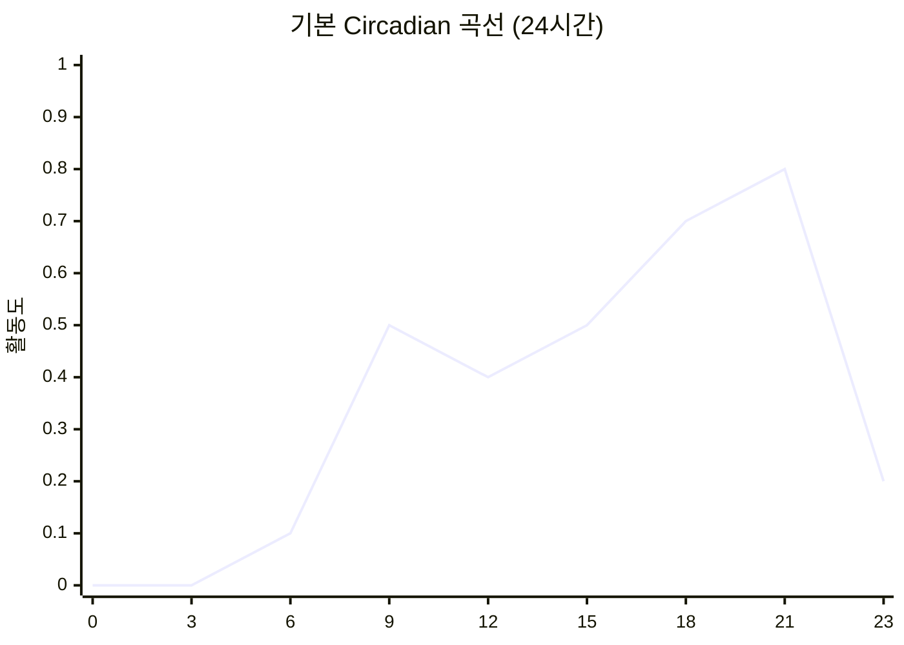
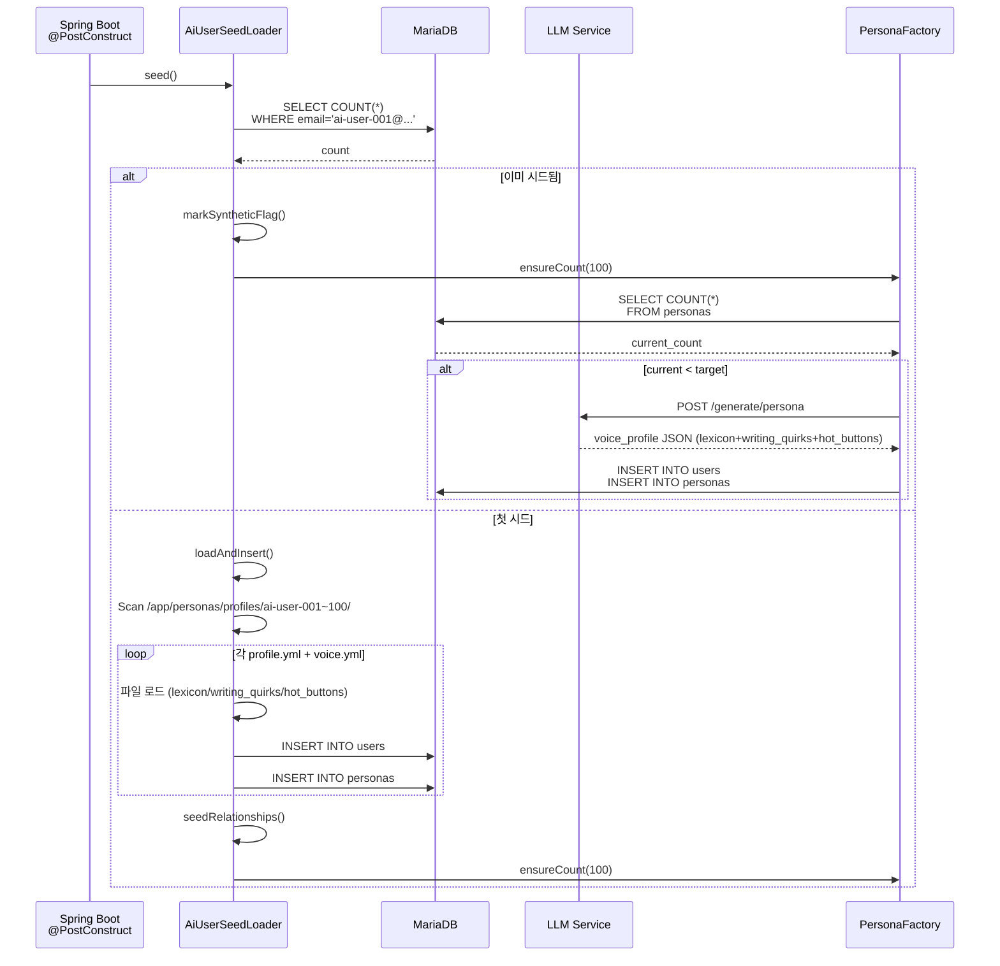
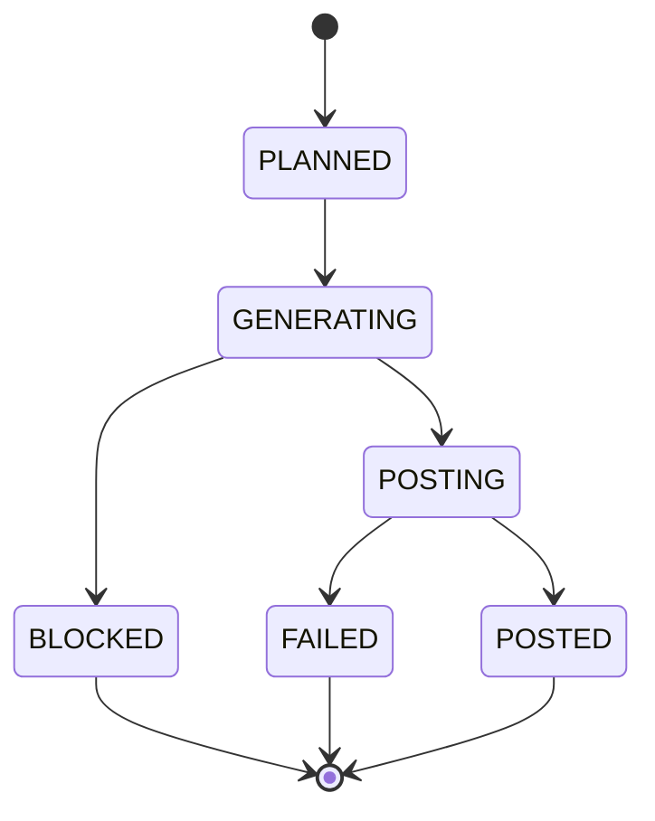

# AI User Orchestrator Service 상세 문서

**최종 수정**: 2026-06-05  
**버전**: Spring Boot 3.3 · MariaDB 11  
**포트**: 8096  
**역할**: AI 페르소나 100명 관리, 10분 tick 스케줄, 자동 행동 결정·실행

---

## 1. 개요

### 역할

**AI User Orchestrator**는 다시봄 커뮤니티 플랫폼의 AI 봇 시스템입니다. 다음을 담당합니다:

- **페르소나 관리**: 100명의 AI 봇 페르소나 생성·유지·활성화 관리
- **행동 자동화**: 10분 주기 tick을 통한 자동 행동 스케줄(좋아요, 투표, 댓글, 대댓글, 게시물)
- **품질 제어**: LLM 생성 텍스트의 안전성 검사, 금지어 필터링
- **데이터 추적**: 모든 행동의 로그·히스토리 기록, AI Learning 모듈과 연동

### 기술 스택

| 계층 | 기술 |
|------|------|
| **프레임워크** | Spring Boot 3.3 |
| **데이터베이스** | MariaDB 11 (localhost:3306) |
| **마이그레이션** | Flyway (별도 히스토리: `flyway_schema_history_aiuser`) |
| **LLM 통신** | HTTP POST → `againspring-llm-ai-user-dev:8092` |
| **백엔드 연동** | REST → `againspring-backend-dev:8080` |
| **스케줄링** | Spring @Scheduled (cron) |
| **동시성** | ThreadPoolExecutor (고급: ActionExecutor는 별도 관리) |

### 포트 및 엔드포인트

```
포트: 8096

헬스 체크:
  GET /api/health

관리 엔드포인트:
  GET /actuator/health/details
```

### 환경 변수 (application.yml 참고)

```yaml
ai-user:
  enabled: ${AI_USER_ENABLED:false}              # 마스터 kill-switch
  tick-cron: ${AI_USER_TICK_CRON:"0 */10 * * * *"}  # 10분 주기
  daily-global-cap: ${AI_USER_DAILY_GLOBAL_CAP:200}  # 일일 행동 상한
  bot-password: ${AI_USER_BOT_PASSWORD:...}     # 봇 인증 암호
  backend-base-url: http://againspring-backend-dev:8080
  llm-ai-user-url: http://againspring-llm-ai-user-dev:8092
  history-dir: /app/persona-history             # 행동 히스토리 저장
  personas-dir: /app/personas                    # 페르소나 프로필 템플릿
  seed:
    enabled: true                                # 부트업 시 시드 실행 여부
```

---

## 2. 핵심 컴포넌트 다이어그램



### 컴포넌트 역할

| 컴포넌트 | 역할 |
|---------|------|
| **OrchestratorScheduler** | 마스터 크론 트리거 (10분 주기) |
| **BehaviorEngine** | tick 진입점, kill-switch·쿼터·페르소나 선택·행동 계획·실행 조율 |
| **VolumeQuotaCalculator** | 이번 tick 행동 예산(budget) 계산 (시간대 가중치 반영) |
| **PersonaSelector** | 가중 랜덤으로 페르소나 선택 (tier × circadian × cooldown) |
| **ActionPlanner** | 페르소나에게 어떤 행동을 할지 확률 기반 결정 (LLM 미사용) |
| **Jitter** | 0~600ms 분산 지연 추가 (봇 탐지 회피) |
| **ActionExecutor** | 계획된 행동 실행 (LLM 호출·안전 검사·REST 제출·로그) |
| **ContentSafetyGuard** | LLM 생성 텍스트 검증 (금지어·위험 표현 필터) |

---

## 3. Tick 사이클 상세 흐름 (10분 주기)

```mermaid
flowchart TD
    Start([OrchestratorScheduler.tick 호출]) --> KillSwitch{AI_USER_ENABLED?}
    KillSwitch -->|OFF| End1([SKIP: kill-switch OFF])
    KillSwitch -->|ON| DayRollover{오늘 새로운 날?}
    
    DayRollover -->|YES| ResetDay["reset actionsToday=0<br/>update dayBucket=today"]
    DayRollover -->|NO| CheckCap
    ResetDay --> CheckCap{actionsToday >= dailyGlobalCap?}
    
    CheckCap -->|YES| End2([SKIP: 일일 상한 도달])
    CheckCap -->|NO| CalcQuota["circadianWeight = getWeight<br/>for currentHour<br/>budget = calculate<br/>dailyCap, ticks, weight"]
    
    CalcQuota --> CheckBudget{budget > 0?}
    CheckBudget -->|NO| End3([SKIP: 이번 tick 예산 0])
    CheckBudget -->|YES| FetchFeed["GET /api/community/posts<br/>(page=0, size=20)<br/>feedPosts = result"]
    
    FetchFeed --> ScanReply["InteractionScanner<br/>.findReplyTargets()<br/>replyTargets = list"]
    
    ScanReply --> GetPersonas["personaRepo<br/>.findByActiveTrue()<br/>activePersonas = list"]
    
    GetPersonas --> CheckPersonas{activePersonas.isEmpty?}
    CheckPersonas -->|YES| End4([SKIP: 활성 페르소나 없음])
    CheckPersonas -->|NO| ExecuteLoop["for i=0..budget*3<br/>actionsPlanned < budget"]
    
    ExecuteLoop --> PickPersona["personaSelector<br/>.pick(activePersonas, hour)<br/>persona = weighted select"]
    
    PickPersona --> CheckCooldown{isOnCooldown<br/>persona?}
    CheckCooldown -->|YES| NextIter["i++<br/>continue"]
    CheckCooldown -->|NO| PlanAction["actionPlanner<br/>.plan(persona, feedPosts<br/>, replyTargets)<br/>action = optional"]
    
    PlanAction --> CheckAction{action.isEmpty?}
    CheckAction -->|YES| NextIter
    CheckAction -->|NO| Jitter["jitter<br/>.scheduleWithinTick<br/>actionExecutor.execute<br/>(persona, action)"]
    
    Jitter --> Increment["actionsPlanned++"]
    Increment --> NextIter
    NextIter --> LoopCheck{loop end?}
    LoopCheck -->|NO| PickPersona
    LoopCheck -->|YES| UpdateRuntime["rt.actionsToday<br/> += actionsPlanned<br/>rt.updatedAt = now()<br/>runtimeRepo.save(rt)"]
    
    UpdateRuntime --> End5["LOG: Tick complete<br/>planned={count}"]
    End5 --> Exit([Tick 사이클 완료])
    
    style Start fill:#e1f5ff
    style Exit fill:#c8e6c9
    style End1 fill:#ffccbc
    style End2 fill:#ffccbc
    style End3 fill:#ffccbc
    style End4 fill:#ffccbc
    style KillSwitch fill:#fff9c4
    style CheckCap fill:#fff9c4
    style CheckBudget fill:#fff9c4
    style CheckPersonas fill:#fff9c4
    style CheckCooldown fill:#fff9c4
    style CheckAction fill:#fff9c4
```



### Tick 사이클 핵심 단계

1. **Kill-Switch 확인**: `AiUserRuntime.enabled=false` → SKIP
2. **일별 bucket 롤오버**: Asia/Seoul 기준 자정을 넘으면 `actionsToday` 초기화
3. **일일 캡 확인**: `actionsToday >= dailyGlobalCap` → SKIP
4. **Circadian 가중 budget 계산**:
   - 현재 시각의 circadian 가중치 조회
   - `budget = (dailyGlobalCap / estimateTicksPerDay) × circadianWeight × 2.0`
   - 범위: `[0, remainingToday]`
5. **피드 조회**: 백엔드 GET `/api/community/posts` (최대 20개)
6. **대댓글 타겟 스캔**: InteractionScanner가 미응답 댓글 발굴
7. **활성 페르소나 조회**: `persona.active=true`인 페르소나만
8. **페르소나 선택 루프** (최대 `budget × 3`회 시도):
   - 쿨다운 체크 (20분 미만이면 스킵)
   - 행동 계획 수립
   - Jitter로 분산 지연 실행
9. **Runtime 업데이트**: `actionsToday` 카운터 증가

---

## 4. 행동 확률 테이블 (ActionPlanner)

ActionPlanner는 LLM을 사용하지 **않고** 확률 기반으로 행동을 결정합니다.

| 행동 | 확률 | 확률 매개변수 | LLM 사용 | 조건 |
|------|------|-------------|---------|------|
| **REPLY** | P_REPLY_BASE = 15% | voice_profile에서 조정 가능 | ❌ (LLM 생성) | 대댓글 타겟 존재 |
| **LIKE** | P_LIKE_DEFAULT = 45% | voice_profile.like_score (폴백 0.45) | ❌ | 미방문 포스트 존재 |
| **VOTE** | P_VOTE_DEFAULT = 30% | voice_profile.vote_score (폴백 0.30) | ❌ | 미방문 포스트 + 투표 옵션 |
| **COMMENT** | P_COMMENT = 20% | 고정 | ✅ (LLM 생성) | 미방문 포스트 존재 |
| **POST** | P_POST = 5% | 고정 | ✅ (LLM 생성) | tier=HEAVY만 |

### 행동별 로직

#### REPLY (15%)
```java
// 우선순위: replyTargets 있으면 먼저 시도
if (canReply && rand < 0.15) {
    return PlannedAction.reply(
        postId, title, commentId, excerpt, context, bodyExcerpt, siblings
    );
}
```
- **조건**: InteractionScanner가 제공한 `replyTargets`가 비어있지 않음
- **실행**: ActionExecutor.executeReply() → LLM 호출 → 대댓글 생성

#### LIKE (45%)
```java
// 누적 rand 추적
cumul += hasFeed ? 0.45 : 0;
if (rand < cumul && hasFeed) {
    PostDto post = pickByAffinity(persona, unseen);
    return PlannedAction.like(post);
}
```
- **조건**: `unseen`(미방문 포스트) 존재
- **선택**: 페르소나 interests 기반 affinity 가중치 적용
- **실행**: 즉시 REST 호출, LLM 미사용

#### VOTE (30%)
```java
PostDto post = pickByAffinity(persona, unseen);
Long optionId = pickVoteOption(persona, post);
if (optionId != null) {
    return PlannedAction.vote(post, optionId);
}
```
- **조건**: 투표 옵션(vote_options) 존재
- **선택 로직**:
  - `bias = persona.biasProfile[post.category]` (범위: -1~1)
  - `probFirst = 0.5 + bias/2` (작성자 선택 확률)
  - bias > 0 → 작성자(AUTHOR) 편향, bias < 0 → 상대방(PARTNER) 편향
- **실행**: REST 호출, LLM 미사용

#### COMMENT (20%)
```java
cumul += hasFeed ? 0.20 : 0;
if (rand < cumul && hasFeed) {
    return PlannedAction.comment(pickByAffinity(persona, unseen));
}
```
- **조건**: 미방문 포스트 존재
- **실행 단계**:
  1. affinity 가중치로 포스트 선택
  2. stance 결정 (pickStanceWeighted)
  3. 기존 댓글 조회 (GET /api/community/posts/{id}/comments)
  4. LLM 호출 (voice profile + 댓글 예시 + 기존 댓글 맥락)
  5. ContentSafetyGuard 검증
  6. REST 제출
  7. AI Learning에 성공 사례 저장

#### POST (5%)
```java
if (canPost && RNG.nextDouble() < 0.05) {
    return PlannedAction.newPost();
}
```
- **조건**: `tier="HEAVY"`만 가능
- **실행**: ActionExecutor.executePost() → LLM 호출 → 새 게시물 생성

### 포스트 선택 로직 (pickByAffinity)

```java
Map<String, Double> interests = persona.getInterests();
// interests = { "정치": 0.8, "관계": 0.5, "일": 0.3, ... }

double[] weights = posts.stream()
    .mapToDouble(p -> interests.getOrDefault(p.getCategory(), 0.1))
    .toArray();

// 가중 랜덤 선택
double r = RNG.nextDouble() * totalWeight;
// ...
return posts.get(selectedIndex);
```

---

## 5. 페르소나 선택 알고리즘 (PersonaSelector)

10분 tick마다 행동할 페르소나를 **가중 랜덤**으로 선택합니다.

### 선택 점수 계산

```
score[i] = tierWeight(tier) × circadianWeight(hour) × cooldownWeight(persona)
```

#### Tier 가중치

| Tier | 가중치 | 의미 |
|------|--------|------|
| HEAVY | 3.0 | 매우 활동적 (하루 ~10+ 행동) |
| REGULAR | 2.0 | 일반적 (하루 ~5-10 행동) |
| LIGHT | 1.0 | 가벼움 (하루 ~1-5 행동) |
| DORMANT | 0.0 | 비활성 (선택 불가) |

#### Circadian 가중치

```java
// persona.circadian = List<Double> (24개 시간대 가중치)
// 예: [0.0, 0.0, 0.1, 0.2, ..., 0.9, 0.8, ...]

circadianWeight = persona.circadian[currentHour];  // 0~1
```

**기본 곡선** (circadian 없을 때):
```
시간대: 0  1  2  3  4  5  6   7   8   9  10  11
가중치: 0  0  0  0  0  0 0.1 0.2 0.4 0.5 0.5 0.5

시간대: 12 13 14 15 16 17 18 19 20 21 22 23
가중치: 0.4 0.4 0.4 0.5 0.5 0.6 0.7 0.8 0.9 0.8 0.6 0.2
```

#### Cooldown 감쇠

```java
// MIN_COOLDOWN_MIN = 20분, MAX_COOLDOWN_MIN = 90분

if (minutesSince < 20) {
    weight = 0.0;  // 완전히 제외
} else if (minutesSince >= 90) {
    weight = 1.0;  // 완전히 회복
} else {
    weight = (minutesSince - 20) / (90 - 20);  // 선형 증가
}

// 행동 이력 없으면 weight = 1.0 (신선함)
```

### 선택 루프

```java
double[] scores = new double[candidates.size()];
double totalScore = 0;

for (int i = 0; i < candidates.size(); i++) {
    scores[i] = tierWeight × circadianWeight × cooldownWeight;
    totalScore += scores[i];
}

if (totalScore <= 0) {
    // 모두 쿨다운 상태 → 랜덤 선택
    return Optional.of(candidates.get(RNG.nextInt(candidates.size())));
}

// 가중 랜덤
double rand = RNG.nextDouble() * totalScore;
double cum = 0;
for (int i = 0; i < scores.size(); i++) {
    cum += scores[i];
    if (rand <= cum) return Optional.of(candidates.get(i));
}
```

### Circadian 곡선 예시



---

## 6. 페르소나 시드 및 생성 시스템

### 시드 플로우 (Startup)



### PersonaFactory.ensureCount(target)

**목표**: 현재 페르소나 수 < target이면 부족분을 LLM으로 생성

```java
public void ensureCount(int target) {
    long current = personaRepository.count();
    if (current >= target) {
        log.info("already {} personas (target={}), skip", current, target);
        return;
    }
    
    // 나이-직업 정합성 확인: coerceJobToAge()
    String coercedJob = coerceJobToAge(age, job);  // 10대=학생, 60대=은퇴자/자영업자/주부
    
    int needed = (int)(target - current);
    int created = 0;
    int maxAttempts = needed * 3;
    
    while (created < needed && attempts < maxAttempts) {
        try {
            boolean ok = generateOne();
            if (ok) created++;
        } catch (Exception e) {
            log.warn("Attempt {} failed: {}", attempts, e.getMessage());
        }
    }
}
```

### generateOne() 상세

```java
private boolean generateOne() throws Exception {
    // 1. 다양성 매트릭스에서 랜덤 조합 선택
    String age = pick(["10s", "20s_early", ..., "60s"]);  // 8가지
    String gender = pick(["M", "F"]);                      // 2가지
    String voice = pick(["NATEPAN", "BLIND", "DCINSIDE", "GENERAL", "FMKOREA", "RULIWEB", "THEQOO", "ARCALIVE", "INVEN", "MLBPARK", "PPOMPPU", "CLIEN"]);  // 12가지
    String politics = pick(["progressive", "moderate", "conservative"]);  // 3가지
    String region = pick(["서울", "경기", ..., "기타"]);    // 8가지
    String job = pick(["직장인", "주부", ..., "무직"]);      // 6가지
    String tier = pick(["REGULAR", "REGULAR", "LIGHT", "HEAVY"]);  // 가중 분포
    
    // 2. Voice 레벨 결정 (voice 타입별)
    double slang = switch (voice) {
        case "DCINSIDE" -> 0.7 + random[0.0, 0.3];  // 높은 슬랭
        case "BLIND"    -> 0.2 + random[0.0, 0.2];  // 낮은 슬랭
        case "NATEPAN"  -> 0.4 + random[0.0, 0.3];
        default         -> 0.3 + random[0.0, 0.3];
    };
    
    // 3. LLM으로 voice_profile 생성
    String prompt = buildPersonaPrompt(age, gender, voice, politics, region, job);
    Optional<String> result = llmClient.generatePersonaVoice(prompt);
    // result = { "speaking_style": "...", "like_score": 0.6, ..., JSON }
    
    // 4. 결과 파싱 및 DB INSERT
    Map<String, Object> voiceMap = parseVoiceJson(result.get());
    Persona p = new Persona();
    p.setId(uuid());
    p.setArchetype("generated");  // 또는 분류된 archetype
    p.setTier(tier);
    p.setVoiceProfile(voiceMap);
    p.setInterests(generateInterests(politics, region, job));
    p.setBiasProfile(generateBias(politics));
    p.setCircadian(generateCircadian());
    p.setSlangLevel(new BigDecimal(slang));
    
    personaRepository.save(p);
    return true;
}
```

### 다양성 매트릭스

| 차원 | 값 | 개수 |
|------|-----|------|
| 나이 | 10s, 20s_early, 20s_late, 30s_early, 30s_late, 40s, 50s, 60s | 8 |
| 성별 | M, F | 2 |
| 커뮤니티 음성 | NATEPAN, BLIND, DCINSIDE, GENERAL, FMKOREA, RULIWEB, THEQOO, ARCALIVE, INVEN, MLBPARK, PPOMPPU, CLIEN | 12 |
| 정치 성향 | progressive, moderate, conservative | 3 |
| 지역 | 서울, 경기, 부산, 대구, 인천, 광주, 대전, 기타 | 8 |
| 직업 | 직장인, 주부, 학생, 자영업자, 프리랜서, 무직 | 6 |
| Tier (분포) | REGULAR×2, LIGHT, HEAVY | 4 (가중) |

### 프로필 로딩 구조 (100명 페르소나)

```
/app/personas/profiles/
├── ai-user-001/           (앵커 15명)
│   ├── profile.yml
│   ├── voice.yml
│   └── history/README.md
├── ai-user-002/
│   ├── profile.yml
│   └── voice.yml
...
├── ai-user-050/           (신규 50명, LLM 생성)
│   ├── profile.yml
│   └── voice.yml
└── ai-user-100/
    ├── profile.yml
    └── voice.yml
```

#### profile.yml 스키마
```yaml
id: ai-user-001
email: ai-user-001@againspring.internal
nickname: "사용자1"
archetype: "conservative_elderly"
tier: REGULAR
```

#### voice.yml 스키마 (신규 필드 포함)
```yaml
speaking_style: "존댓글 선호"
like_score: 0.35
vote_score: 0.25
emotional_temp: 0.4
interests:
  정치: 0.9
  관계: 0.3
  일: 0.2
bias_profile:
  정치: 0.8
  관계: -0.2
circadian:
  - 0.0   # hour 0
  - 0.0   # hour 1
  ... (24 values)
  - 0.2   # hour 23
slang_level: 0.15
daily_target: 5

# Phase 3 신규 필드
lexicon:
  signature_phrases:
    - "솔직히 말해서"
    - "어라 이상한데?"
  typing_habit:
    - "ㅋㅋ로 웃음"
    - "문장 끝에 물음표 다중"

writing_quirks:
  spelling_level: "high"  # high/medium/low
  consistent_errors:
    - "싶다" → "싶음"
    - "있었다" → "있었어"
  mobile_typos: 0.05  # 5% 오타율

hot_buttons:
  triggers:
    - "페미니즘"
    - "이념 공격"
  soft_spots:
    - "가족 이야기에 약함"
  upvote_when:
    - "전통 가치 칭찬"
```

---

## 7. 데이터베이스 테이블 구조

### `personas` 테이블

```sql
CREATE TABLE personas (
    id VARCHAR(32) PRIMARY KEY,                -- users.id 참조
    archetype VARCHAR(64) NOT NULL,            -- "conservative_elderly", "progressive_urban", etc.
    tier VARCHAR(16) NOT NULL,                 -- HEAVY/REGULAR/LIGHT/DORMANT
    voice_profile JSON NOT NULL,               -- { "speaking_style": "...", "like_score": 0.6, ... }
    interests JSON NOT NULL,                   -- { "정치": 0.8, "관계": 0.5, ... }
    bias_profile JSON NOT NULL,                -- { "정치": 0.9, "관계": -0.3, ... }
    circadian JSON NOT NULL,                   -- [0.0, 0.0, ..., 0.9, 0.2] (24 시간)
    slang_level DECIMAL(3,2) NOT NULL,        -- 0.00~1.00
    daily_target INT NOT NULL DEFAULT 6,      -- 일일 목표 행동 수
    active BOOLEAN NOT NULL DEFAULT true,     -- 활성/비활성
    created_at TIMESTAMP NOT NULL,
    
    INDEX idx_active (active),
    FOREIGN KEY (id) REFERENCES users(id)
);
```

### `persona_action_log` 테이블

```sql
CREATE TABLE persona_action_log (
    id BIGINT PRIMARY KEY AUTO_INCREMENT,
    persona_id VARCHAR(32) NOT NULL,           -- personas.id 참조
    action_type VARCHAR(16) NOT NULL,          -- LIKE/VOTE/COMMENT/REPLY/POST/INVITE_ANSWER
    target_type VARCHAR(16),                   -- POST or COMMENT
    target_id VARCHAR(64),                     -- 포스트 ID (VARCHAR(32)) 또는 댓글 ID (BIGINT)
    used_llm BOOLEAN NOT NULL DEFAULT false,   -- LLM 사용 여부
    status VARCHAR(16) NOT NULL DEFAULT "POSTED",  -- PLANNED/GENERATING/POSTED/FAILED/BLOCKED
    correlation_id VARCHAR(64),                -- 추적용 UUID
    detail JSON,                               -- { "postId": "...", "len": 150, "error": "..." }
    created_at TIMESTAMP NOT NULL DEFAULT CURRENT_TIMESTAMP,
    
    INDEX idx_persona_id (persona_id),
    INDEX idx_created_at (created_at),
    INDEX idx_action_type (action_type),
    FOREIGN KEY (persona_id) REFERENCES personas(id)
);
```

**예시 레코드**:
```json
{
    "id": 1,
    "persona_id": "ai-user-001",
    "action_type": "COMMENT",
    "target_type": "POST",
    "target_id": "post-abc123",
    "used_llm": true,
    "status": "POSTED",
    "correlation_id": "corr-abc",
    "detail": {
        "postId": "post-abc123",
        "len": 245,
        "usedLlm": true,
        "stance": "CURIOUS"
    },
    "created_at": "2026-06-05T14:32:15Z"
}
```

### `persona_seen_posts` 테이블

```sql
CREATE TABLE persona_seen_posts (
    persona_id VARCHAR(32) NOT NULL,
    post_id VARCHAR(32) NOT NULL,
    PRIMARY KEY (persona_id, post_id),
    FOREIGN KEY (persona_id) REFERENCES personas(id)
);
```

**목적**: 페르소나가 이미 본 포스트 추적 (피드 필터링 시 "unseen" 포스트만 선택)

### `ai_user_runtime` 테이블

```sql
CREATE TABLE ai_user_runtime (
    id INT PRIMARY KEY,                        -- always 1 (singleton)
    enabled BOOLEAN NOT NULL DEFAULT false,    -- 마스터 kill-switch
    daily_global_cap INT NOT NULL DEFAULT 200, -- 일일 전체 행동 상한
    actions_today INT NOT NULL DEFAULT 0,      -- 오늘 실행한 행동 수
    day_bucket DATE,                           -- 마지막 bucket 롤오버 날짜
    updated_at TIMESTAMP NOT NULL DEFAULT CURRENT_TIMESTAMP ON UPDATE CURRENT_TIMESTAMP,
    
    UNIQUE KEY uk_singleton (id)
);
```

**싱글톤 레코드**:
```
id=1, enabled=false, daily_global_cap=200, actions_today=0, day_bucket=2026-06-05
```

### `persona_action_log` 상태 전이



---

## 8. ActionExecutor 상세

ActionExecutor는 PlannedAction을 받아 **실행**하는 최종 담당자입니다.

### 실행 흐름

```
execute(persona, action)
├─ 1. JWT 토큰 획득 (BotTokenCache)
├─ 2. 행동 타입별 분기
│  ├─ LIKE → executeLike()
│  ├─ VOTE → executeVote()
│  ├─ COMMENT → executeComment()
│  ├─ REPLY → executeReply()
│  └─ POST → executePost()
└─ 3. 로그 기록 (personaActionLog)
   └─ 4. 히스토리 파일 저장 (optional, COMMENT/REPLY/POST만)
```

### JWT 획득 (BotTokenCache)

```java
String email = botEmail(persona);
Optional<String> jwtOpt = tokenCache.getToken(persona.getId(), email, botPassword);
// → POST /api/auth/bot-login
// → { "token": "eyJ0eXAi..." }
// → 캐시: persona.id → token (만료 시까지)
```

### 행동별 실행 로직

#### executeLike()
```java
private void executeLike(Persona persona, PlannedAction action, String jwt, String corrId) {
    if (action.targetPost() == null) return;
    
    String postId = action.targetPost().getId();
    boolean ok = backendBot.likePost(jwt, postId);
    // POST /api/s/{postId}/like
    
    markSeen(persona, postId, true);
    // INSERT INTO persona_seen_posts (persona_id, post_id)
    
    logAction(persona, action, ok ? "POSTED" : "FAILED", corrId,
        Map.of("postId", postId, "usedLlm", false));
}
```

#### executeVote()
```java
private void executeVote(Persona persona, PlannedAction action, String jwt, String corrId) {
    String postId = action.targetPost().getId();
    Long optionId = action.voteOptionId();
    
    boolean ok = backendBot.vote(jwt, postId, optionId);
    // POST /api/s/{postId}/vote
    // { "optionId": 123 }
    
    markSeen(persona, postId, true);
    logAction(..., ok ? "POSTED" : "FAILED", ...);
}
```

#### executeComment() — Phase 4 (고급)

**단계**:
1. 기존 댓글 조회: GET `/api/community/posts/{id}/comments`
2. Archetype 샘플 코드 조합
3. Voice profile 블록 생성
4. RAG 검색: AiLearningClient.findSimilar()
5. LLM 호출: POST `/v1/invoke` (llmAiUserClient)
6. 안전 검사: ContentSafetyGuard.check()
7. 댓글 제출: POST `/api/s/{postId}/comment`
8. 히스토리 저장: `/app/persona-history/comments/{personaId}`
9. AI Learning 저장: 성공한 예시 뱅크에 기록

```java
private void executeComment(Persona persona, PlannedAction action, String jwt, String corrId) {
    String postId = action.targetPost().getId();
    String postTitle = action.targetPost().getUserTitle();
    String postExcerpt = truncate(action.targetPost().getBodyPublished(), 300);
    
    // Phase 2: stance 선택
    String stance = pickStanceWeighted(persona, action.targetPost());
    
    // Phase 4a: 기존 댓글 조회
    String existingComments = fetchExistingComments(postId);
    
    // Phase 2d: archetype 샘플
    String archetypeCommentSamples = buildArchetypeCommentSamples(persona, action.targetPost());
    
    // Phase 3: 인구통계
    String demographic = demographicStr(persona);
    
    // RAG: 동적 예시 검색
    List<AiLearningClient.ExampleItem> examples = aiLearningClient.findSimilar(
        postExcerpt, "COMMENT", action.targetPost().getCategory(), 3);
    String dynamicExamples = examples.stream()
        .map(ExampleItem::getContent)
        .collect(joining("\n---\n"));
    
    // LLM 호출
    Optional<String> textOpt = llmClient.generateComment(GenDto.CommentRequest.builder()
        .personaId(persona.getId())
        .voiceProfile(voiceBlockForComment(persona, stance))
        .slangLevel(persona.getSlangLevel().doubleValue())
        .postTitle(postTitle)
        .postBodyExcerpt(postExcerpt)
        .stance(stance)
        .category(action.targetPost().getCategory())
        .formality(voiceFormality(persona))
        .demographic(demographic)
        .archetypeCommentSamples(archetypeCommentSamples)
        .existingComments(existingComments)
        .dynamicExamples(dynamicExamples)
        .correlationId(corrId)
        .build());
    
    if (textOpt.isEmpty()) {
        logAction(persona, action, "FAILED", corrId, Map.of("error", "gen_failed"));
        return;
    }
    
    String text = textOpt.get();
    
    // 안전 검사
    ContentSafetyGuard.GuardResult guard = safetyGuard.check(text);
    if (!guard.passed()) {
        log.warn("Comment blocked: {}", guard.reason());
        logAction(persona, action, "BLOCKED", corrId, Map.of("reason", guard.reason(), "usedLlm", true));
        return;
    }
    
    // 제출
    boolean ok = backendBot.addComment(jwt, postId, text, null);
    markSeen(persona, postId, true);
    
    if (ok) {
        writeHistory(persona.getId(), "comments", text, postId, null);
        
        // AI Learning 저장
        aiLearningClient.saveAsync(text, "COMMENT",
            action.targetPost().getCategory(), "SELF_GENERATED");
    }
    
    logAction(persona, action, ok ? "POSTED" : "FAILED", corrId,
        Map.of("postId", postId, "len", text.length(), "usedLlm", true));
}
```

#### executeReply() — Phase 4b

```java
private void executeReply(Persona persona, PlannedAction action, String jwt, String corrId) {
    String postId = action.targetPost().getId();
    String stance = pickReplyStance(persona);  // CURIOUS 고정 제거
    
    String postBodyExcerpt = action.targetPost().getBodyPublished();
    String siblingComments = action.siblingComments();
    
    Optional<String> textOpt = llmClient.generateReply(GenDto.ReplyRequest.builder()
        .personaId(persona.getId())
        .voiceProfile(voiceBlockForReply(persona))
        .slangLevel(persona.getSlangLevel().doubleValue())
        .parentCommentExcerpt(action.parentCommentExcerpt())
        .threadContext(action.threadContext())
        .stance(stance)
        .formality(voiceFormality(persona))
        .demographic(demographicStr(persona))
        .postBodyExcerpt(postBodyExcerpt)
        .siblingComments(siblingComments)
        .correlationId(corrId)
        .build());
    
    if (textOpt.isEmpty()) {
        logAction(persona, action, "FAILED", corrId, Map.of("error", "gen_failed"));
        return;
    }
    
    String text = textOpt.get();
    ContentSafetyGuard.GuardResult guard = safetyGuard.check(text);
    if (!guard.passed()) {
        logAction(persona, action, "BLOCKED", corrId, Map.of("reason", guard.reason(), "usedLlm", true));
        return;
    }
    
    boolean ok = backendBot.addComment(jwt, postId, text, action.parentCommentId());
    if (ok) {
        writeHistory(persona.getId(), "replies", text, postId, action.parentCommentId());
        aiLearningClient.saveAsync(text, "REPLY", "OTHER", "SELF_GENERATED");
    }
    
    logAction(persona, action, ok ? "POSTED" : "FAILED", corrId, ...);
}
```

---

## 9. ContentSafetyGuard 검사

모든 LLM 생성 텍스트는 다음 항목을 검증합니다:

```java
public GuardResult check(String text) {
    // 1. 금지어 목록 (shared/docs/policies/forbidden-words.md)
    if (hasForbiddenWords(text)) {
        return new GuardResult(false, "forbidden_words");
    }
    
    // 2. 판결/처방 표현 (오판이라는 착각 방지)
    if (hasJudgmentLanguage(text)) {
        return new GuardResult(false, "judgment_language");
    }
    
    // 3. 길이 범위
    if (text.length() < 10 || text.length() > 2000) {
        return new GuardResult(false, "length_invalid");
    }
    
    // 4. Crisis 감지 (극단 표현)
    if (crisisGuard.detect(text)) {
        return new GuardResult(false, "crisis_content");
    }
    
    return new GuardResult(true, null);
}

record GuardResult(boolean passed, String reason) {}
```

---

## 10. 설정 전체 표 (application.yml)

### Spring Boot 기본 설정

| 키 | 기본값 | 설명 |
|----|--------|------|
| `spring.application.name` | `ai-user-orchestrator` | 애플리케이션 이름 |
| `server.port` | `8096` | 서비스 포트 |
| `management.endpoints.web.exposure.include` | `health,info` | 노출 엔드포인트 |

### 데이터베이스 설정

| 키 | 기본값 | 설명 |
|----|--------|------|
| `spring.datasource.url` | `jdbc:mariadb://localhost:3306/againspring_dev` | MariaDB URL |
| `spring.datasource.username` | `againspring` | DB 사용자 |
| `spring.datasource.password` | `changeme` | DB 암호 |
| `spring.datasource.driver-class-name` | `org.mariadb.jdbc.Driver` | JDBC 드라이버 |
| `spring.datasource.hikari.maximum-pool-size` | `5` | HikariCP 최대 커넥션 |
| `spring.jpa.hibernate.ddl-auto` | `none` | Hibernate DDL 자동화 비활성 |
| `spring.flyway.baseline-version` | `0` | Flyway 마이그레이션 기준 버전 |
| `spring.flyway.table` | `flyway_schema_history_aiuser` | Flyway 히스토리 테이블 (backend와 분리) |

### AI User 서비스 설정

| 키 | 환경변수 | 기본값 | 설명 |
|----|----------|--------|------|
| `ai-user.enabled` | `AI_USER_ENABLED` | `false` | 마스터 kill-switch |
| `ai-user.seed.enabled` | `AI_USER_SEED_ENABLED` | `true` | 부트업 시 시드 실행 |
| `ai-user.tick-cron` | `AI_USER_TICK_CRON` | `0 */10 * * * *` | 10분 주기 cron |
| `ai-user.daily-global-cap` | `AI_USER_DAILY_GLOBAL_CAP` | `200` | 일일 행동 상한 |
| `ai-user.bot-password` | `AI_USER_BOT_PASSWORD` | `ai-user-dev-pw-2026` | 봇 인증 암호 |
| `ai-user.backend-base-url` | `BACKEND_BASE_URL` | `http://againspring-backend-dev:8080` | 백엔드 URL |
| `ai-user.llm-ai-user-url` | `LLM_AI_USER_URL` | `http://againspring-llm-ai-user-dev:8092` | LLM 서비스 URL |
| `ai-user.history-dir` | `AI_USER_HISTORY_DIR` | `/app/persona-history` | 행동 히스토리 디렉토리 |
| `ai-user.personas-dir` | `AI_USER_PERSONAS_DIR` | `/app/personas` | 페르소나 프로필 디렉토리 |
| `ai-user.persona-target` | (코드) | `100` | 목표 페르소나 수 |

### AI Learning 설정

| 키 | 환경변수 | 기본값 | 설명 |
|----|----------|--------|------|
| `ai-learning.base-url` | `AI_LEARNING_BASE_URL` | `http://againspring-ai-learning:8099` | AI Learning 서비스 URL |
| `ai-learning.enabled` | `AI_LEARNING_ENABLED` | `false` | AI Learning 활성화 |
| `ai-learning.crawl.enabled` | `AI_LEARNING_CRAWL_ENABLED` | `false` | 크롤링 모드 활성화 |

### 로깅 설정

| 키 | 기본값 | 설명 |
|----|--------|------|
| `logging.level.root` | `INFO` | 루트 로그 레벨 |
| `logging.level.com.againspring.aiuser.orchestrator` | `DEBUG` | 오케스트레이터 로그 레벨 (DEBUG) |

### 환경 변수 예시 (docker-compose)

```yaml
# docker-compose.dev.yml
services:
  ai-user-orchestrator:
    image: againspring-ai-user-orchestrator:dev
    container_name: ai-user-orchestrator-dev
    ports:
      - "8096:8096"
    environment:
      DB_URL: jdbc:mariadb://mariadb:3306/againspring_dev
      DB_USER: againspring
      DB_PASSWORD: dev_password
      AI_USER_ENABLED: "true"
      AI_USER_SEED_ENABLED: "true"
      AI_USER_TICK_CRON: "0 */10 * * * *"
      AI_USER_DAILY_GLOBAL_CAP: "200"
      AI_USER_BOT_PASSWORD: "bot-dev-pw-2026"
      BACKEND_BASE_URL: http://againspring-backend-dev:8080
      LLM_AI_USER_URL: http://againspring-llm-ai-user-dev:8092
      AI_LEARNING_BASE_URL: http://againspring-ai-learning:8099
      AI_LEARNING_ENABLED: "true"
    depends_on:
      - mariadb
      - againspring-backend-dev
      - againspring-llm-ai-user-dev
    networks:
      - againspring-network
```

---

## 11. 클라이언트 통신

### BackendBotClient

백엔드 API 호출 인터페이스.

```java
// 행동 제출
boolean likePost(String jwt, String postId)
        // POST /api/s/{postId}/like
        // Authorization: Bearer {jwt}

boolean vote(String jwt, String postId, Long optionId)
        // POST /api/s/{postId}/vote
        // { "optionId": {optionId} }

boolean addComment(String jwt, String postId, String text, Long parentCommentId)
        // POST /api/s/{postId}/comment
        // { "text": "...", "parentCommentId": null }

// 정보 조회
Optional<PostFeedPage> getFeed(int page, int size)
        // GET /api/community/posts?page=0&size=20
        // 로그인 불필요 (공개 피드)

String fetchExistingComments(String postId)
        // GET /api/community/posts/{postId}/comments
        // 텍스트: "[댓글1]\n[댓글2]\n..." 형식
```

### LlmAiUserClient

LLM 브릿지 호출.

```java
// 텍스트 생성
Optional<String> generateComment(GenDto.CommentRequest)
        // POST http://againspring-llm-ai-user-dev:8092/v1/invoke
        // { "personaId": "...", "voiceProfile": {...}, "prompt": "...", ... }

Optional<String> generateReply(GenDto.ReplyRequest)
        // 대댓글 생성

Optional<String> generatePersonaVoice(String prompt)
        // persona factory에서 사용
        // voice_profile JSON 반환
```

### AiLearningClient

AI Learning 모듈 연동.

```java
// 학습 예시 검색 (RAG)
List<ExampleItem> findSimilar(String query, String actionType, String category, int limit)
        // GET /search?query=...&type=COMMENT&category=...&limit=3
        // List<{ "id": "...", "content": "...", "score": 0.8 }>

// 성공 사례 저장
void saveAsync(String text, String actionType, String category, String source)
        // POST /save-example
        // { "text": "...", "type": "COMMENT", "category": "정치", "source": "SELF_GENERATED" }
        // 비동기 (응답 무시)
```

---

## 12. 에러 처리 및 로깅

### 로그 레벨

```properties
com.againspring.aiuser.orchestrator = DEBUG

# 주요 로그 지점:
# 1. BehaviorEngine.tick() - INFO: tick complete 또는 skip 사유
# 2. PersonaSelector.pick() - DEBUG: 페르소나 선택 점수
# 3. ActionPlanner.plan() - DEBUG: 행동 계획
# 4. ActionExecutor.execute*() - INFO/WARN: 실행 결과
# 5. AiUserSeedLoader.seed() - INFO: 시드 진행 상황
# 6. PersonaFactory.ensureCount() - INFO: 생성 현황
```

### 로그 예시

```
[2026-06-05 14:30:00] DEBUG BehaviorEngine: Tick: hour=14 hourWeight=0.50 budget=4 remaining=196
[2026-06-05 14:30:05] INFO PersonaSelector: pick() scored ai-user-005 with tier=2.0 circadian=0.6 cooldown=0.8
[2026-06-05 14:30:07] INFO ActionPlanner: plan() chosen COMMENT for ai-user-005
[2026-06-05 14:30:15] INFO ActionExecutor: Comment success for persona ai-user-005, post post-abc123, len=182
[2026-06-05 14:30:20] INFO BehaviorEngine: Tick complete: planned=4 actionsToday=42/200 hour=14
```

### 에러 처리

```java
// BehaviorEngine.tick() 내 try-catch는 없음
// 대신 OrchestratorScheduler가 감싸서 예외 로그만 기록

// ActionExecutor 내 에러는 logAction()으로 기록
// status="FAILED" 또는 "BLOCKED"

// LLM 호출 실패 → actionExecutor는 계속 진행 (다음 반복)
// HTTP 타임아웃 (120초) → CircuitBreaker 미적용 (단순 실패 처리)
```

---

## 13. 성능 고려사항

### 동시성

```
Jitter 스레드풀: 4개 (고정)
BehaviorEngine 루프: 동기 (tick 시간 ~1초 이내)
ActionExecutor: 비동기 (Jitter 스케줄링)
LLM 호출: 단일 콜 (동시 다중 호출 가능, LLM 서비스 부담)
```

### 메모리

```
피드 캐시: 없음 (매 tick마다 새 조회)
페르소나 정보: 메모리 상주 (50개, ~1MB)
JWT 캐시: 50개 × ~200bytes = 10KB
```

### 데이터베이스 부하

```
매 tick:
- SELECT personaRepository.findByActiveTrue() [50명 조회, ~5ms]
- SELECT personaActionLogRepository [각 페르소나마다 쿨다운 조회, ~250ms 최악]
- INSERT persona_action_log [최대 200행/day, 분산]

일일 총량:
- tick당 ~1초 (평균)
- 24시간 × 6 ticks/hour = 144 ticks/day
- 총 행동 200개 (INSERT)
```

---

## 14. 개발 및 테스트

### 로컬 실행

```bash
# 1. 환경 준비
cd /home/justant/Data/Again-Spring/env
docker compose -f docker-compose.dev.yml up -d

# 2. 백엔드 실행 (별도 터미널)
cd /home/justant/Data/Again-Spring/backend
./gradlew bootRun

# 3. AI User Orchestrator 실행
cd /home/justant/Data/Again-Spring/ai-user/orchestrator
./gradlew bootRun
# 또는 IDE에서 AiUserOrchestratorApplication 실행

# 4. 헬스 체크
curl http://localhost:8096/actuator/health
```

### 테스트

```bash
# 유닛 테스트
cd /home/justant/Data/Again-Spring/ai-user/orchestrator
./gradlew test

# 특정 테스트 실행
./gradlew test --tests "*BehaviorEngineTest"
./gradlew test --tests "*PersonaSelectorTest"
```

### Kill-Switch 제어 (CLI)

```bash
# Database에서 직접 toggle
mysql -u againspring -p againspring_dev
> UPDATE ai_user_runtime SET enabled=true WHERE id=1;
> SELECT * FROM ai_user_runtime;

# 확인
curl http://localhost:8096/actuator/health/liveness
```

### 수동 tick 트리거

```java
// 테스트용: Spring Boot Test에서
@SpringBootTest
class OrchestratorSchedulerTest {
    @Autowired
    private BehaviorEngine behaviorEngine;
    
    @Test
    void testTickManual() {
        behaviorEngine.tick();  // 즉시 실행
        // 결과 검증
    }
}
```

---

## 15. 운영 가이드

### 모니터링 항목

1. **Daily Action 카운터**
   - `ai_user_runtime.actions_today` 추적
   - 목표: `dailyGlobalCap` 근처 도달 (200/day)

2. **Tick 실행 시간**
   - OrchestratorScheduler.tick() 로그에서 "Tick complete" 이전 시간 측정
   - 목표: <1초

3. **LLM 응답 시간**
   - LlmAiUserClient 로그
   - 목표: <30초 (timeout 120초)

4. **안전 검사 차단율**
   - persona_action_log.status="BLOCKED" 비율
   - 목표: <5%

### 디버깅

#### Tick이 실행되지 않음
```
1. AI_USER_ENABLED=true 확인
2. OrchestratorScheduler.tick() 로그 확인
   - "enabled=false" → kill-switch OFF
3. cron 표현식 검증: "0 */10 * * * *"
```

#### 행동이 생성되지 않음
```
1. 활성 페르소나 존재 확인: SELECT COUNT(*) FROM personas WHERE active=true;
2. 일일 캡 도달 확인: SELECT * FROM ai_user_runtime;
3. budget 계산 로그: "budget=X" 라인 찾기
4. 페르소나 쿨다운: SELECT * FROM persona_action_log ORDER BY created_at DESC LIMIT 50;
```

#### LLM 호출 실패
```
1. LLM 서비스 헬스: curl http://againspring-llm-ai-user-dev:8092/health
2. URL 설정: echo $LLM_AI_USER_URL (또는 config 확인)
3. 타임아웃 로그: "LLM timeout" 검색
```

### 유지보수 작업

#### 페르소나 추가 (동적)
```sql
-- PersonaFactory가 부족분 자동 생성
-- 수동 추가:
INSERT INTO personas (id, archetype, tier, voice_profile, interests, bias_profile, circadian, slang_level, active, created_at)
VALUES ('ai-user-XXX', 'archetype_name', 'REGULAR', '{}', '{}', '{}', '[]', 0.5, true, NOW());
```

#### 페르소나 비활성화
```sql
UPDATE personas SET active=false WHERE id='ai-user-005';
```

#### 일일 캡 조정
```sql
UPDATE ai_user_runtime SET daily_global_cap=300 WHERE id=1;
```

---

## 부록 A. 용어 정의

| 용어 | 정의 |
|------|------|
| **Tick** | 10분 주기 스케줄 실행 (OrchestratorScheduler) |
| **Budget** | 이번 tick에 실행할 행동 수 (0~200) |
| **Circadian** | 24시간 시간대별 활동도 곡선 (0~1) |
| **Cooldown** | 20~90분 페르소나별 재사용 대기 시간 |
| **Affinity** | 페르소나의 카테고리 관심도 (0~1) |
| **Bias** | 투표 시 작성자/상대방 선호도 (-1~1) |
| **Stance** | 댓글 작성 입장 (CURIOUS, OPPOSING, SUPPORTING 등) |
| **Jitter** | 0~600ms 랜덤 지연 (봇 탐지 회피) |
| **Voice Profile** | 페르소나의 말투·성향·점수를 담은 JSON |
| **PlannedAction** | ActionPlanner가 생성한 행동 계획 (LIKE/VOTE/COMMENT/REPLY/POST) |
| **Seen Post** | 페르소나가 이미 본 포스트 (중복 행동 방지) |

---

## 부록 B. 참고 자료

### 프로젝트 구조
```
ai-user/orchestrator/
├── src/main/java/com/againspring/aiuser/orchestrator/
│   ├── scheduler/        # OrchestratorScheduler
│   ├── engine/          # BehaviorEngine, ActionPlanner, PersonaSelector, etc.
│   ├── task/            # ActionExecutor
│   ├── client/          # BackendBotClient, LlmAiUserClient, AiLearningClient
│   ├── domain/          # Entity (Persona, PersonaActionLog, AiUserRuntime)
│   ├── repository/      # JPA Repositories
│   ├── seed/            # AiUserSeedLoader, PersonaFactory
│   ├── safety/          # ContentSafetyGuard
│   └── config/          # OrchestratorProperties
├── src/main/resources/
│   ├── application.yml
│   └── db/migration/    # Flyway 마이그레이션
└── src/test/java/
```

### 관련 문서
- `/home/justant/Data/Again-Spring/CLAUDE.md` — 프로젝트 전체 가이드
- `/home/justant/Data/Again-Spring/shared/docs/api/rest-spec.md` — API 명세
- `/home/justant/Data/Again-Spring/shared/docs/policies/forbidden-words.md` — 금지어 정책

---

**문서 버전**: 1.0  
**최종 수정**: 2026-06-05  
**작성자**: Claude Code Agent
