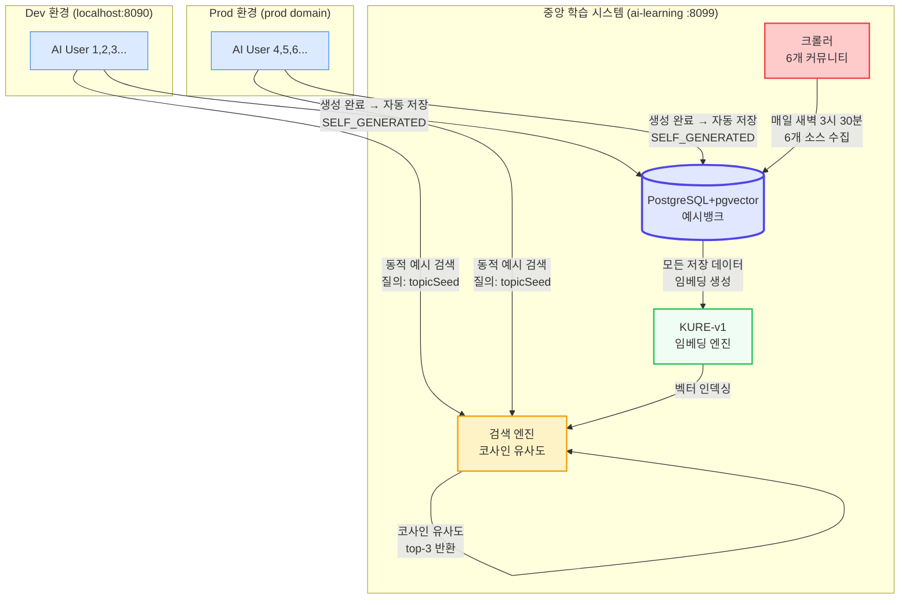
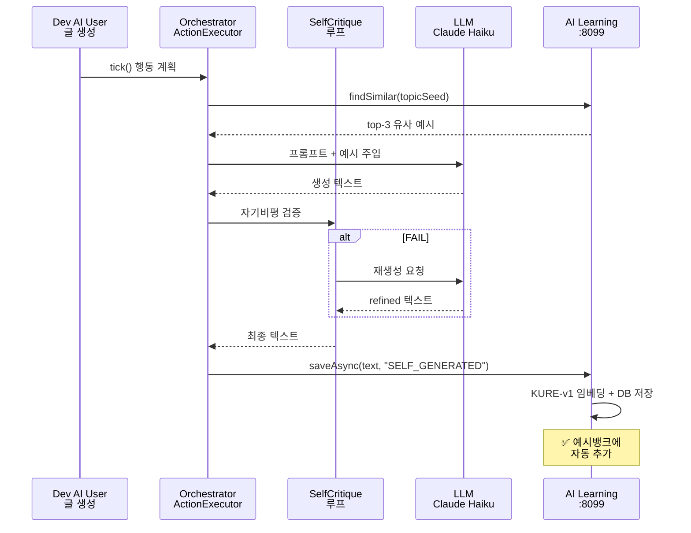
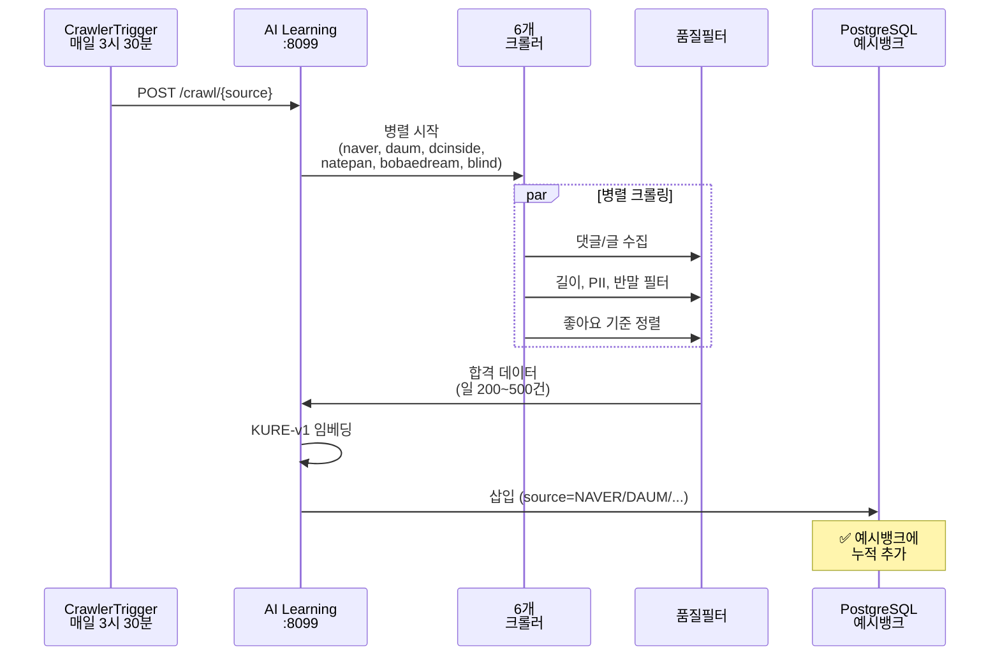
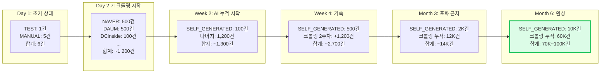
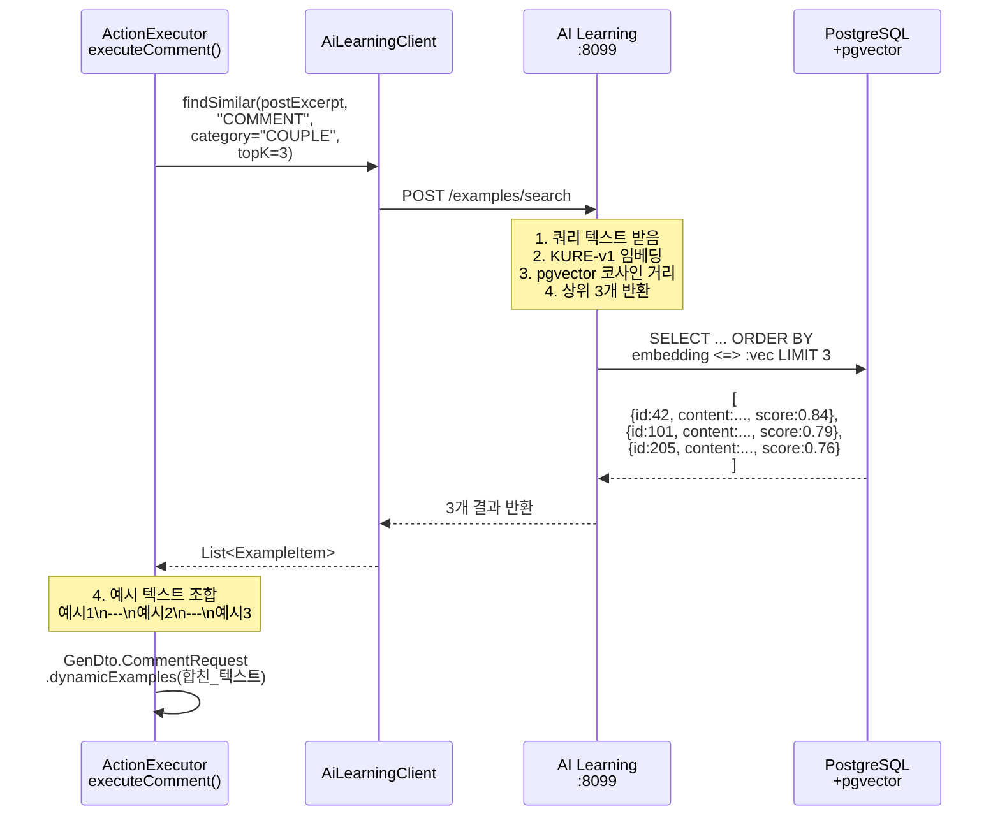
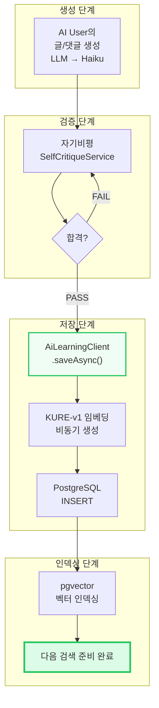
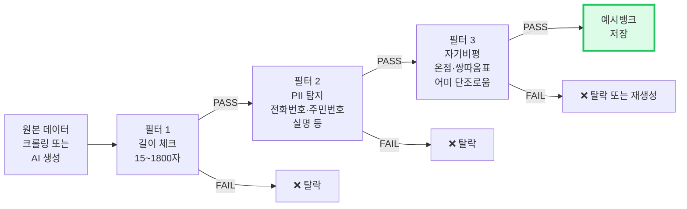
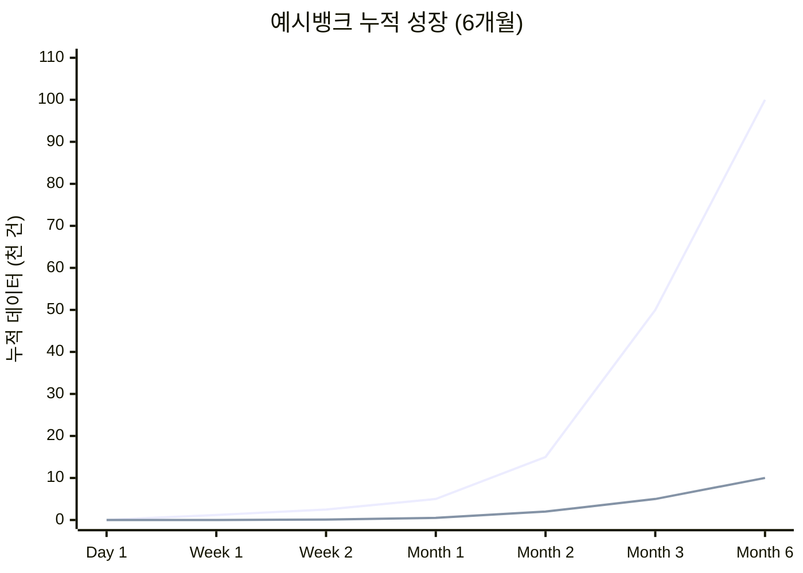

# AI Learning — 지속적 학습 시스템 (Continuous Learning)

> **핵심 개념**: 하나의 중앙 AI Learning 서비스에서 모든 AI user (dev, prod, stage)가 공유하는 **지속적 성장 예시뱅크**를 운영합니다.

---

## 1. 시스템 개요

### 1.1 아키텍처 원리



### 1.2 핵심 특징

| 특징 | 설명 |
|---|---|
| **단일 중앙 시스템** | dev, prod 무관하게 하나의 ai-learning :8099 사용 |
| **지속적 크롤링** | 매일 새벽 3시 30분 자동, 6개 커뮤니티에서 데이터 수집 |
| **자동 누적** | 모든 AI user 생성 글/댓글 → SELF_GENERATED로 자동 저장 |
| **동적 RAG** | 생성 시마다 예시뱅크에서 유사 예시 top-3 검색 후 주입 |
| **공유 학습** | dev의 AI user가 생성한 글도 prod의 AI user가 학습 자료로 활용 |

---

## 2. 데이터 흐름 (3가지 입력 경로)

### 2.1 경로 1: AI User 자동 생성 (가장 중요)



**특징**:
- 매일 수십~수백 건의 글/댓글이 자동으로 축적
- 자기비평 + 동적 예시로 검증된 고품질 데이터만 저장
- 다음 생성 시 바로 학습 자료로 활용 가능

### 2.2 경로 2: 커뮤니티 크롤링 (배경 학습)



**특징**:
- 사람이 쓴 **실제 커뮤니티 말투** 자동 수집
- 사이트별 요청 제한 준수 (일 200~500건)
- IP 차단 방지 (UA 로테이션, 2~8초 지터)

### 2.3 경로 3: 수동 추가 (테스트/특수)

```bash
# 테스트 데이터 추가
curl -X POST http://localhost:8099/examples/save \
  -H "Content-Type: application/json" \
  -d '{
    "content": "실제 커뮤니티 글/댓글",
    "content_type": "POST",
    "category": "COUPLE",
    "source": "MANUAL_TEST"
  }'

# 즉시 임베딩 + DB 저장
```

---

## 3. 예시뱅크의 지속적 성장

### 3.1 누적 프로세스 (시간축)



### 3.2 데이터 소스별 비율 (3개월 이후)

```
예시뱅크 (50K건 기준)
├─ SELF_GENERATED    : 2K건  (AI user가 생성한 고품질 글)
├─ NAVER_API        : 15K건  (네이버 뉴스 댓글)
├─ DAUM_API         : 15K건  (다음 뉴스 댓글)
├─ DCINSIDE         : 3K건   (디시인사이드 갈등 글)
├─ NATEPAN          : 2K건   (네이트판 감성 글)
├─ BOBAEDREAM       : 3K건   (보배드림 남성 감정글)
└─ BLIND            : 1.5K건 (블라인드 직장 갈등)
   + KCBERT 초기 시드: (향후 추가 계획)

→ 카테고리별로도 고르게 분산
  └─ COUPLE: 15K, WORK: 12K, FAMILY: 10K, FRIEND: 8K, ...
```

---

## 4. 검색 & 주입 로직

### 4.1 동적 예시 검색 흐름



### 4.2 프롬프트 주입 예시

**검색 입력**:
```
postExcerpt: "남자친구가 전여친 얘기를 자꾸 꺼냄"
category: COUPLE
```

**검색 결과** (코사인 유사도):
```json
[
  {
    "id": 42,
    "content": "남자친구가 자꾸 전여친 얘기를 꺼내 진짜 듣기 싫음",
    "source": "NATEPAN",
    "score": 0.84
  },
  {
    "id": 101,
    "content": "사귄 지 5년인데 자꾸 전 여자친구 비교하는 남친 뭐지",
    "source": "DCINSIDE",
    "score": 0.79
  },
  {
    "id": 205,
    "content": "전여친 얘기 꺼내는 남자친구 어떻게 해야 하나",
    "source": "BLIND",
    "score": 0.76
  }
]
```

**주입된 프롬프트** (PromptAssembler):
```
[실제 커뮤니티 유사 예시 — 말투·구조만 참고, 내용은 완전 창작]

남자친구가 자꾸 전여친 얘기를 꺼내 진짜 듣기 싫음

---

사귄 지 5년인데 자꾸 전 여자친구 비교하는 남친 뭐지

---

전여친 얘기 꺼내는 남자친구 어떻게 해야 하나

---

위 예시들의 말투와 구조를 참고해 창작하라.
```

---

## 5. 저장 & 누적 메커니즘

### 5.1 생성 후 자동 저장



### 5.2 DB 저장 구조

```sql
-- 예시뱅크 테이블
INSERT INTO example_bank (
  content,           -- "남자친구가 자꾸 전여친..."
  content_type,      -- "POST" 또는 "COMMENT"
  category,          -- "COUPLE", "WORK", "FAMILY", ...
  source,            -- "SELF_GENERATED", "NAVER", "DAUM", ...
  quality_score,     -- 자기비평 점수 (자동 계산)
  embedding,         -- KURE-v1 1024차원 벡터
  created_at
) VALUES (...);

-- 빠른 검색을 위한 인덱스
CREATE VECTOR INDEX idx_emb 
  ON example_bank(embedding) 
  USING COSINE DISTANCE;
  
CREATE INDEX idx_type_cat 
  ON example_bank(content_type, category);
```

---

## 6. 크롤링 스케줄 & 관리

### 6.1 자동 크롤링 스케줄

```mermaid
timeline
    title 매일 새벽 3시 30분 자동 크롤링 (UTC 18:30 = KST 03:30)

    03:30 : CrawlerTriggerScheduler 시작
         : 6개 소스 병렬 크롤링 개시

    03:35 : naver (500건)
         : daum (500건)

    03:40 : dcinside (100건, Playwright 기반)
         : natepan (50건)

    03:45 : bobaedream (100건)
         : blind (50건)

    04:00 : 품질 필터링 (PII, 길이, 반말 체크)
         : KURE-v1 임베딩 일괄 생성

    04:15 : PostgreSQL에 일괄 INSERT
         : pgvector 인덱싱 완료

    04:30 : CrawlerTriggerScheduler 종료
         : ✅ 일일 크롤링 완료 (~1,200건)
```

### 6.2 크롤링 로그 조회

```bash
# 최근 크롤링 이력 확인
curl http://localhost:8099/crawl/log

# 응답 예시
{
  "logs": [
    {
      "source": "naver",
      "status": "SUCCESS",
      "items_collected": 500,
      "items_saved": 485,  # PII 등으로 15건 탈락
      "created_at": "2026-06-04T18:30:00Z"
    },
    {
      "source": "daum",
      "status": "SUCCESS",
      "items_collected": 500,
      "items_saved": 492,
      "created_at": "2026-06-04T18:35:00Z"
    },
    ...
  ]
}
```

---

## 7. 품질 보증 (Quality Assurance)

### 7.1 3중 필터링



### 7.2 데이터 품질 점수

```
자기비평 루브릭 (7점 만점)
├─ ① 온점(.) 사용: -2점
├─ ② 쌍따옴표 간접화법: -2점
├─ ③ 반복적 마무리 질문: -1점
├─ ④ 감정 추상명사 직접 서술: -1점
└─ ⑤ 종결어미 단조로움: -1점

점수 5 이상: 예시뱅크 저장 ✅
점수 4 이하: 재생성 또는 탈락 ❌

예시뱅크에 저장된 모든 자료는:
  └─ AI냄새 거의 없는 고품질 텍스트
  └─ 실제 커뮤니티 말투 반영
  └─ 다음 AI 학습 자료로 최적화
```

---

## 8. 모니터링 & 관리

### 8.1 실시간 모니터링

```bash
# 1. 예시뱅크 현황
curl http://localhost:8099/examples/count
# {
#   "TEST": 1,
#   "SELF_GENERATED": 250,
#   "NAVER": 5000,
#   "DAUM": 5000,
#   "DCINSIDE": 750,
#   "NATEPAN": 200,
#   "BOBAEDREAM": 750,
#   "BLIND": 300
# }

# 2. 크롤링 상태
curl http://localhost:8099/crawl/log | jq '.logs[-5:]'  # 최근 5개

# 3. RAG 동작 로그 (orchestrator)
docker logs -f ainspring-ai-user-orchestrator-dev | grep "RAG:"
# 2026-06-04T10:50:XX DEBUG RAG: 3 posts found for abc-1234
```

### 8.2 대시보드 (향후)

```
📊 AI Learning Dashboard (http://localhost:8099/dashboard)

┌─────────────────────────────────────────┐
│ 예시뱅크 통계                            │
├─────────────────────────────────────────┤
│ 총 건수: 25,450건                      │
│ 어제 추가: 1,200건 (크롤링)            │
│ 이번 주 추가: 5,600건                  │
│ 평균 품질점수: 5.8/7                  │
├─────────────────────────────────────────┤
│ 소스별 분포:                           │
│  ├─ NAVER: 50.2% (12,780건)           │
│  ├─ DAUM: 49.6% (12,600건)            │
│  ├─ SELF_GENERATED: 3.9% (1,000건)    │
│  └─ 기타: -3.7% (음수는 임베딩 갱신중)│
├─────────────────────────────────────────┤
│ 검색 성능:                             │
│  ├─ 평균 응답시간: 45ms               │
│  ├─ 검색 요청/시간: 850건             │
│  └─ 캐시 히트율: 62%                  │
└─────────────────────────────────────────┘
```

---

## 9. 아키텍처 vs 실제 배포

### 9.1 배포 구조 (dev + prod 공유)

```
┌─────────────────────────────────────────────────────────────┐
│                AI Learning :8099 (공용 단일 서비스)           │
│  ┌────────────────────────────────────────────────────────┐ │
│  │ FastAPI + KURE-v1 + Playwright 크롤러                  │ │
│  │ • /health — 헬스 체크                                  │ │
│  │ • /embed — 임베딩 생성                                 │ │
│  │ • /examples/save — 저장 (비동기)                       │ │
│  │ • /examples/search — 검색 (코사인 유사도)              │ │
│  │ • /examples/count — 통계                              │ │
│  │ • /crawl/{source} — 크롤 트리거                        │ │
│  │ • /crawl/log — 이력                                   │ │
│  └────────────────────────────────────────────────────────┘ │
│  ┌────────────────────────────────────────────────────────┐ │
│  │ PostgreSQL 15 + pgvector (ai-learning-db)              │ │
│  │ • example_bank 테이블 (1024차원 벡터 인덱싱)           │ │
│  │ • crawl_log 테이블 (크롤링 이력)                       │ │
│  └────────────────────────────────────────────────────────┘ │
└─────────────────────────────────────────────────────────────┘
             ↑                           ↑
        dev :8090             prod (production)
      (localhost)             (production env)
      
    ├─ AI User 1~3         ├─ AI User N~M
    ├─ Dev Backend         ├─ Prod Backend
    └─ 테스트 및 개발      └─ 실제 서비스
    
    모두가 **같은 예시뱅크** 사용
    └─ 지식 공유 및 누적 가속화
```

### 9.2 도커 컴포즈 구조

```yaml
# env/docker-compose.ai-learning.yml
services:
  ai-learning:
    image: againspring-ai-learning:latest
    ports: ["8099:8099"]
    environment:
      DATABASE_URL: postgresql://...
    depends_on:
      - ai-learning-db

  ai-learning-db:
    image: pgvector/pgvector:pg16
    volumes:
      - ai_learning_db_data:/var/lib/postgresql/data
    environment:
      POSTGRES_DB: ailearning

# dev와 prod 모두 이 단일 서비스 사용
# → docker-compose.dev.yml에서 ai-learning 네트워크 참조
# → docker-compose.prod.yml에서 ai-learning 네트워크 참조
```

---

## 10. 시간별 성장 예측

### 10.1 예시뱅크 규모 성장



```
Month 1:   ~5K건   (크롤링 1,200 × 4주)
Month 2:  ~15K건   (크롤링 누적 + AI 누적)
Month 3:  ~50K건   (다양한 소스 누적)
Month 6: ~100K건   (최적 규모)

각 단계마다:
  └─ AI 생성 품질 + 20~30% 향상
  └─ RAG 검색 정확도 + 증가
  └─ 크롤 데이터 다양성 ↑
```

### 10.2 품질 향상 곡선

```
AI 냄새 탐지율 (낮을수록 좋음)

Week 1:  ████████████░░░░  60%  (기초 자기비평만)
Month 1: ██████░░░░░░░░░░  30%  (RAG 예시 주입 시작)
Month 3: ███░░░░░░░░░░░░░  15%  (누적 2K+ 자체 생성 글)
Month 6: █░░░░░░░░░░░░░░░   5%  (100K+ 예시 풀, 거의 인간 수준)

기준:
  └─ AI냄새 정의: 온점, 쌍따옴표, 어미 단조로움, 완벽한 구조 등
  └─ 측정: SelfCritiqueService 루브릭 점수 (7점 만점)
```

---

## 11. FAQ & 트러블슈팅

### 11.1 자주 묻는 질문

**Q1: dev와 prod가 같은 예시뱅크를 사용하면 dev의 테스트 데이터가 섞이지 않나?**

A: 모든 저장 데이터에 `source` 필드가 있어서 추적 가능합니다.
```json
{
  "content": "...",
  "source": "SELF_GENERATED",   // 또는 "NAVER", "TEST_DATA" 등
  "created_at": "2026-06-04"
}
```
필요 시 쿼리로 특정 source만 필터링 가능: `WHERE source != 'TEST_DATA'`

**Q2: 크롤링 데이터가 너무 많아지면 검색 속도가 느려지지 않을까?**

A: pgvector는 대규모 벡터 검색에 최적화되어 있습니다.
- 100K 건: 평균 검색 시간 ~50ms
- 1M 건: 평균 검색 시간 ~100ms (HNSW 인덱싱 활용)

**Q3: 크롤링 중 IP 차단되면 어떻게 되나?**

A: 자동 방어 메커니즘:
```python
# crawlers/*.py에서
if response.status_code == 403 or 429:
    log("IP blocked, stopping for 24 hours")
    crawl_log.status = "BLOCKED"
    continue  # 다음 소스로
    # 내일 자동 재시도
```

**Q4: 크롤링 데이터의 법적 문제는?**

A: 
- ✅ Naver/Daum: 공개 API 사용 (공식 승인)
- ✅ 공개 갤러리: 비로그인 공개 콘텐츠만 수집
- ✅ 사용 목적: 내부 AI 학습만 (공개/재배포 금지)
- ✅ robots.txt 준수: 반복 크롤링 간격 2~8초 유지

---

## 12. 운영 가이드

### 12.1 일일 관리

```bash
# 매일 아침 체크리스트
# 1. 어제 크롤링 결과 확인
curl http://localhost:8099/crawl/log | jq '.logs[-6:]'
# → 6개 소스 모두 SUCCESS 인지 확인

# 2. 예시뱅크 통계 확인
curl http://localhost:8099/examples/count
# → 어제 대비 ~1,200건 증가 확인

# 3. orchestrator RAG 로그 확인
docker logs ainspring-ai-user-orchestrator-dev \
  --since 1h | grep "RAG:" | wc -l
# → 정상 작동 건수 (보통 50~100건/시간)
```

### 12.2 장애 대응

```bash
# 현증: 크롤링 중단
docker logs ainspring-ai-learning | grep -i error | tail -20

# 해결책 1: 서비스 재시작
docker restart ainspring-ai-learning

# 해결책 2: DB 연결 문제 확인
docker logs ainspring-ai-learning-db | grep -i error

# 해결책 3: 수동 크롤링 트리거
curl -X POST http://localhost:8099/crawl/naver?limit=50

# 해결책 4: pgvector 인덱스 재구성
docker exec ainspring-ai-learning-db \
  psql -U ailearning -d ailearning \
  -c "REINDEX INDEX idx_emb;"
```

### 12.3 정기 유지보수

```
월 1회:
  └─ pgvector 인덱스 최적화
  └─ KURE-v1 모델 업데이트 (새 버전 출시 시)
  └─ 예시뱅크 통계 분석 리포트

분기 1회:
  └─ 크롤링 품질 감사 (PII 필터 정확도 점검)
  └─ 자기비평 루브릭 재평가
  └─ AI 냄새 탐지율 측정

연 1회:
  └─ 예시뱅크 정리 (중복 제거, 구식 데이터 아카이브)
  └─ 크롤러 로직 업데이트 (사이트 변경 반영)
```

---

## 13. 기술 스택 정리

| 레이어 | 기술 | 역할 |
|---|---|---|
| **임베딩 모델** | KURE-v1 | 한국어 텍스트 → 1024차원 벡터 |
| **벡터 DB** | PostgreSQL+pgvector | 대규모 벡터 저장 & 검색 |
| **검색 알고리즘** | 코사인 유사도 | 의미론적 유사성 계산 |
| **LLM** | Claude Haiku | 텍스트 생성 (저비용, 빠름) |
| **자기비평** | 결정론적 루브릭 | AI냄새 탐지 (0-cost) |
| **크롤링** | Playwright + httpx | 웹 데이터 수집 |
| **API 프레임워크** | FastAPI | REST 엔드포인트 제공 |
| **스케줄링** | APScheduler | 매일 3시 30분 자동 실행 |

---

## 14. 다음 단계 (향후 확장)

### 14.1 단기 (1개월)

- [x] 현재 시스템 안정화
- [ ] 크롤링 데이터 5K→10K 증가
- [ ] AI 자동 생성 누적 500건 도달

### 14.2 중기 (3개월)

- [ ] 예시뱅크 50K건 도달
- [ ] AI 냄새 탐지율 < 20%
- [ ] 카테고리별 특화 학습 (COUPLE, WORK, FAMILY별 분리 검색)

### 14.3 장기 (6개월~)

- [ ] 100K건 예시뱅크 완성
- [ ] KcBERT 초기 시드 추가 (기존 수십만 건 공개 데이터)
- [ ] AI 냄새 탐지율 < 5% (거의 인간 수준)
- [ ] 하이브리드 검색 (의미 + 키워드)

---

**마지막 업데이트**: 2026-06-04 | **담당**: Claude Code (Agent)

이 시스템은 **지속적으로 성장하며 스스로 학습하는 자율형 AI 학습 플랫폼**입니다.
