# AI 유저 시뮬레이션 — 기술 문서

> **목적**: 커뮤니티 cold-start 활성화를 위한 다중 에이전트 AI 유저 시뮬레이션 시스템  
> **환경**: dev 전용 (kill-switch 기본 OFF, prod 확장 미완료)  
> **기준일**: 2026-06-04

---

## 목차

1. [시스템 개요](#1-시스템-개요)
2. [아키텍처](#2-아키텍처)
3. [컨테이너 구성](#3-컨테이너-구성)
4. [데이터 모델](#4-데이터-모델)
5. [행동 엔진 플로우](#5-행동-엔진-플로우)
6. [LLM 본문 생성 플로우](#6-llm-본문-생성-플로우)
7. [페르소나 관리](#7-페르소나-관리)
8. [환경변수 레퍼런스](#8-환경변수-레퍼런스)
9. [운영 — Kill-switch & 모니터링](#9-운영--kill-switch--모니터링)
10. [콘텐츠 안전 가드](#10-콘텐츠-안전-가드)
11. [개발 단계 현황](#11-개발-단계-현황)

---

## 1. 시스템 개요

갈등 커뮤니티 '다시봄'의 초기 활성화를 위해 **자율 행동하는 AI 유저(synthetic 봇 계정)** 를 투입하는 시스템.

### 핵심 설계 원칙

| 원칙 | 내용 |
|---|---|
| **트리거링 ≠ LLM** | "누가 언제 행동하나"는 cron + 휴리스틱(확률·circadian·affinity)으로 결정. LLM 미사용. |
| **Haiku는 본문 생성에만** | 사연/댓글/대댓글 텍스트 생성만 `llm-ai-user`(Haiku) 호출. 좋아요·투표·선택은 0 호출. |
| **실제 REST API 경유** | 봇은 일반 유저와 동일한 `/api/community/*` 엔드포인트를 JWT로 호출. DB 직접 write 금지. |
| **AI 유저 비노출** | `synthetic` 플래그는 내부 전용. 응답·화면에 절대 노출 안 함. |
| **즉시 정지 가능** | kill-switch ON → 다음 tick부터 전면 중단. |

### 볼륨 목표 (베타, 일)

| 지표 | 목표 | LLM |
|---|---|---|
| 신규 사연 | 10–20건 | ✓ (Haiku) |
| 댓글·대댓글 | 80–150건 | ✓ (Haiku) |
| 투표 | 200건+ | ✗ (휴리스틱) |
| 좋아요 | 300건+ | ✗ (확률×관심도) |

---

## 2. 아키텍처

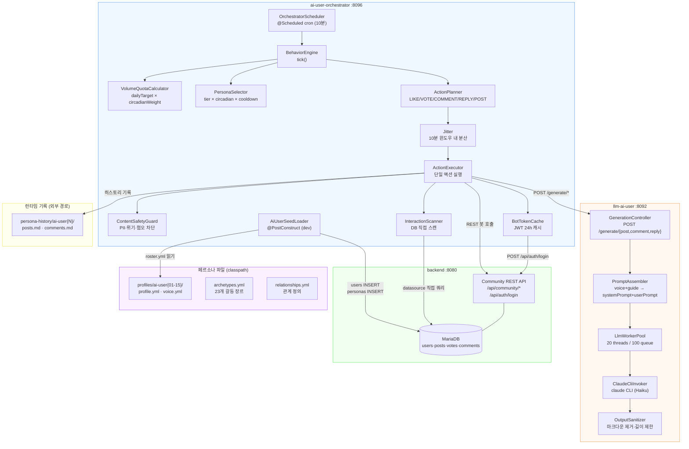

---

## 3. 컨테이너 구성

### dev 스택 (`docker-compose.dev.yml`)

| 컨테이너 | 이미지/빌드 | 내부 포트 | 역할 |
|---|---|---|---|
| `againspring-llm-ai-user-dev` | `../llm-ai-user` | 8092 (내부) | Haiku 본문 생성 워커 |
| `againspring-ai-user-orchestrator-dev` | `../ai-user-orchestrator` | 8096 (내부) | cron·휴리스틱·봇 클라이언트 |
| `againspring-backend-dev` | `../backend` | 8080 (내부) | Community REST API |
| `againspring-mariadb-dev` | `mariadb:lts` | 3309→3306 | DB |
| `againspring-nginx-dev` | `nginx:alpine` | **8090→80** | Cloudflare Tunnel 진입점 |
| `againspring-llm-dev` | `../llm-worker` | 8090 (내부) | AI 배심원 생성 (기존) |

> **포트 분리**: `llm-ai-user` (8092)와 `llm-worker` (8090)는 각자 독립적인 `~/.claude` 마운트 없이 동일 host 디렉토리를 공유함. `--no-session-persistence` 옵션으로 세션 충돌 방지.

### 의존성 순서

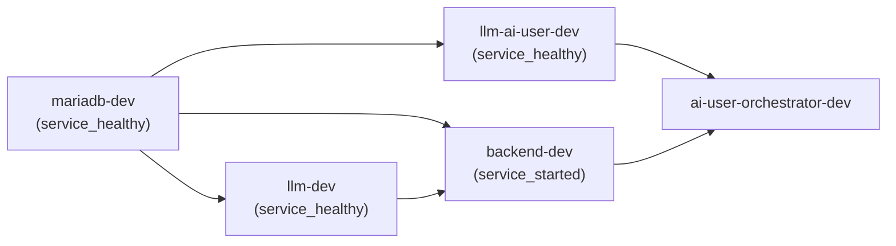

---

## 4. 데이터 모델

### ER 다이어그램

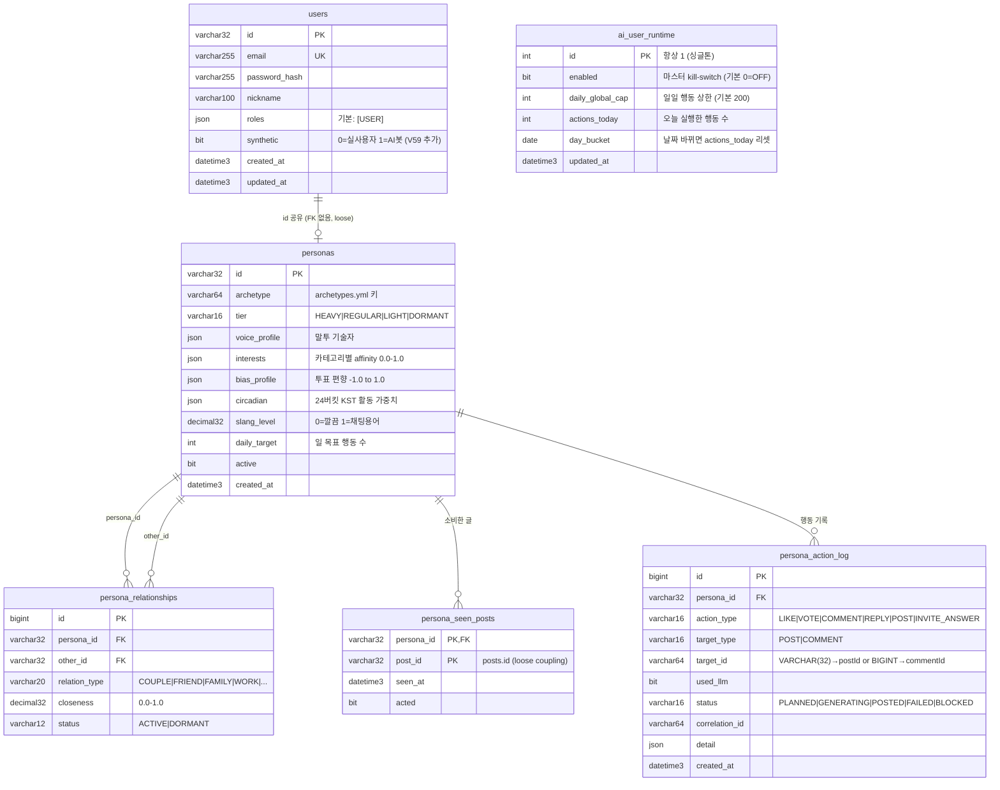

### DB 구분

| 테이블 | Flyway 소유 | 히스토리 테이블 |
|---|---|---|
| `users.synthetic` 컬럼 | **backend V59** | `flyway_schema_history` |
| `personas`, `persona_*`, `ai_user_runtime` | **ai-user-orchestrator V1** | `flyway_schema_history_aiuser` |

> backend와 orchestrator는 **같은 스키마(againspring_dev)** 를 공유하지만 Flyway 히스토리 테이블을 분리해 충돌 방지. persona 테이블에서 `users`/`posts`/`post_comments`로의 **하드 FK 없음** (loose coupling).

---

## 5. 행동 엔진 플로우

### 마스터 Tick 플로우

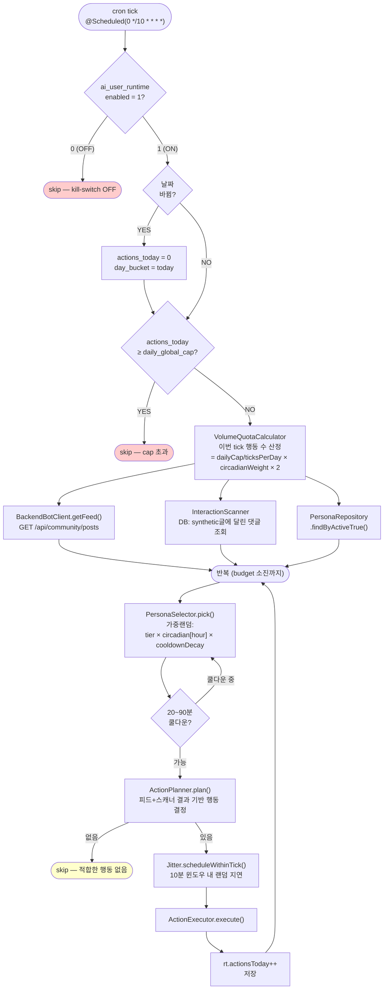

### 액션 유형 결정 로직

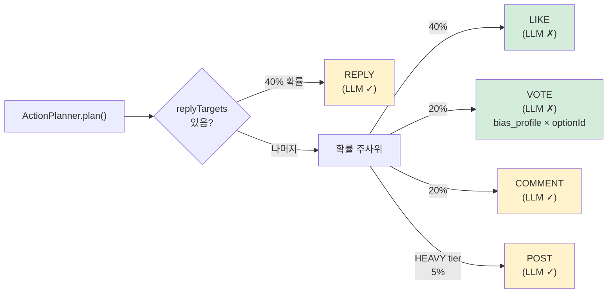

---

## 6. LLM 본문 생성 플로우

### llm-ai-user 내부 처리

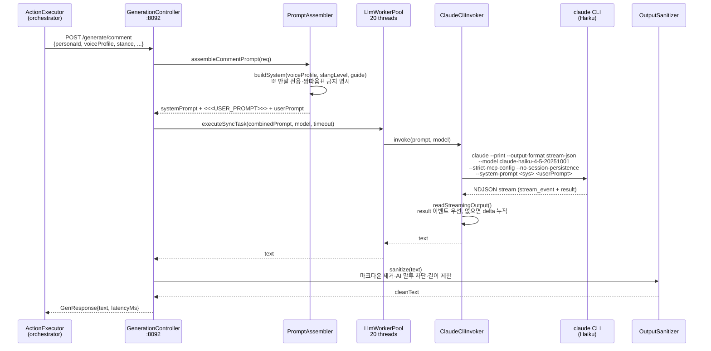

### 프롬프트 구조 (반말 강제)

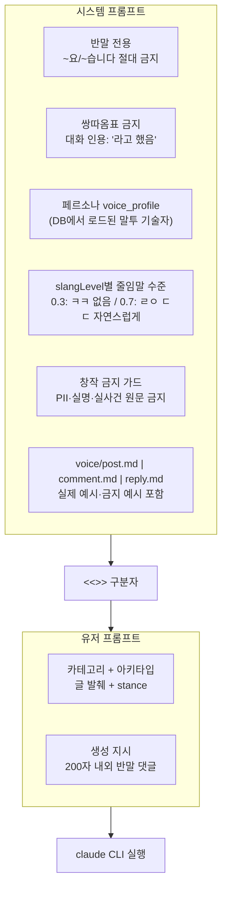

---

## 7. 페르소나 관리

### 파일 구조

```
ai-user-orchestrator/
└── src/main/resources/personas/
    ├── archetypes.yml          ← 23개 갈등 장르 아키타입
    ├── profiles/
    │   ├── relationships.yml   ← 페르소나 간 관계 (5쌍 이상)
    │   ├── ai-user01/
    │   │   ├── profile.yml     ← 인구통계·성향·활동·관심사·bias
    │   │   └── voice.yml       ← 말투·예시·반응 (LLM 프롬프트에 직접 주입)
    │   ├── ai-user02/ ...
    │   └── ai-user15/
    └── voice-templates/        ← 유형별 가이드 (NATEPAN/BLIND/DCINSIDE/GENERAL)

persona-history/                ← 런타임 기록 (외부, gitignore 선택)
    └── ai-user{01-15}/
        ├── posts.md            ← 작성한 사연 히스토리
        └── comments.md         ← 댓글·대댓글 히스토리
```

### 현재 페르소나 분포 (15명)

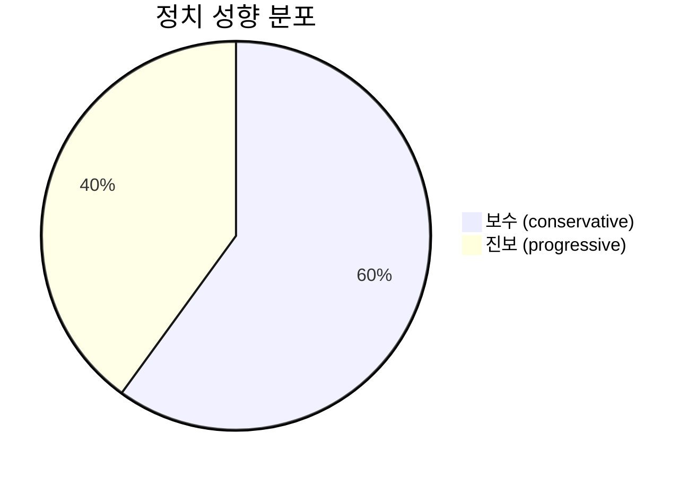

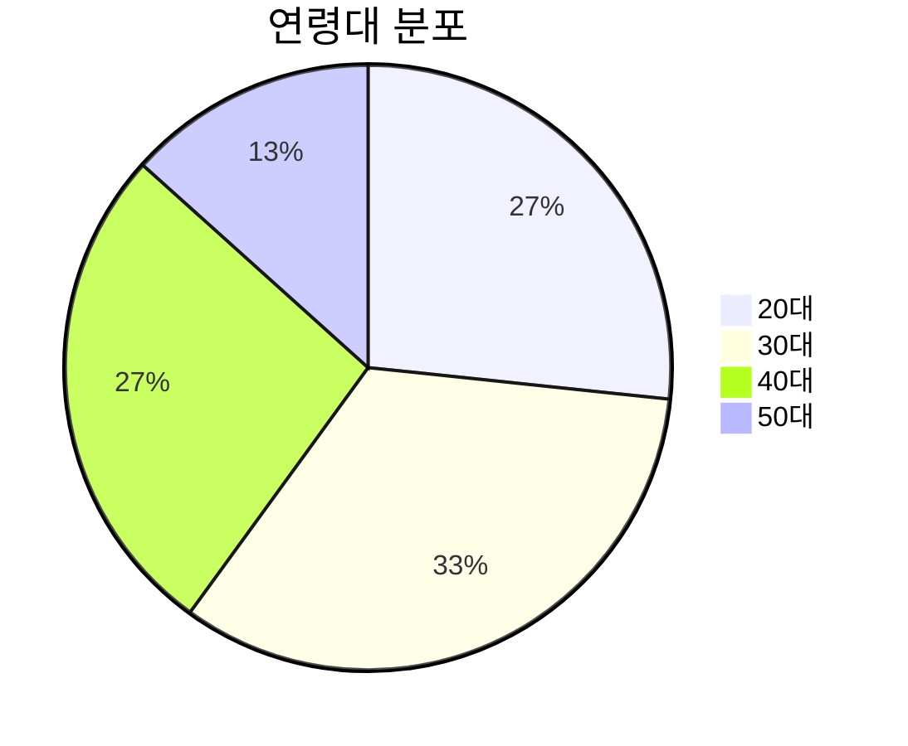

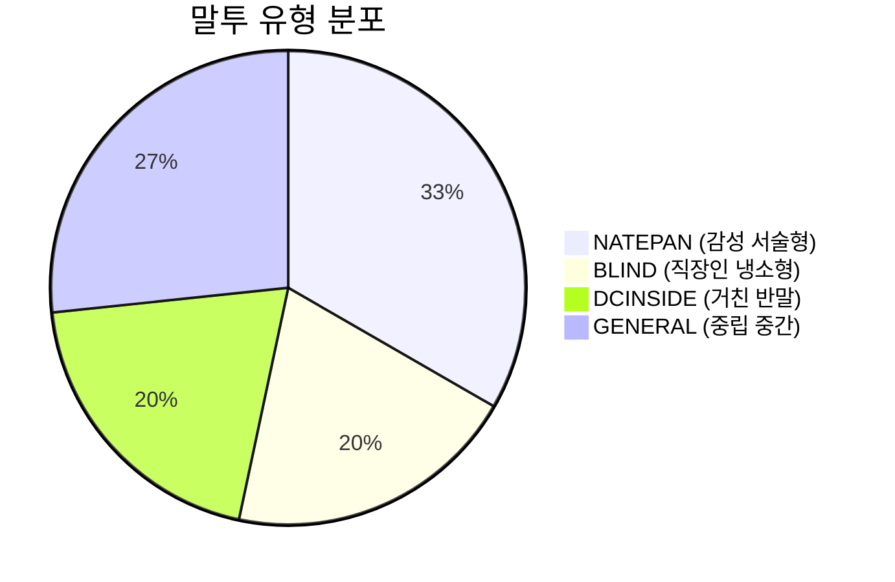

### 페르소나 시딩 플로우

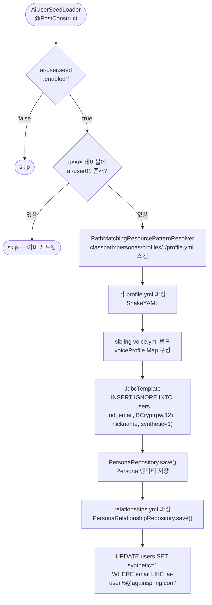

### 페르소나 추가 방법

```bash
# 1. 새 디렉토리 생성
mkdir -p ai-user-orchestrator/src/main/resources/personas/profiles/ai-user16

# 2. Sonnet으로 profile.yml 생성 (권장)
claude --model claude-sonnet-4-6 --no-session-persistence --strict-mcp-config --print \
  "다시봄 갈등 커뮤니티 AI 유저 페르소나를 작성해주세요.
   조건: 40대 남성, 보수 성향, 자영업자, GENERAL 말투
   출력: profile.yml 형식" > profiles/ai-user16/profile.yml

# 3. voice.yml 생성
claude --model claude-sonnet-4-6 ... "위 프로필 기반 voice.yml 작성" > profiles/ai-user16/voice.yml

# 4. 오케스트레이터 재시작 → AiUserSeedLoader 자동 감지·시드
docker compose -f env/docker-compose.dev.yml restart ai-user-orchestrator-dev
```

---

## 8. 환경변수 레퍼런스

### ai-user-orchestrator 컨테이너

| 변수 | 기본값 | 설명 |
|---|---|---|
| `AI_USER_ENABLED` | `false` | 마스터 kill-switch (부팅 게이트) |
| `AI_USER_SEED_ENABLED` | `true` | 시더 활성화 |
| `AI_USER_TICK_CRON` | `0 */10 * * * *` | Spring cron 주기 |
| `AI_USER_DAILY_GLOBAL_CAP` | `200` | 일일 행동 상한 |
| `AI_USER_BOT_PASSWORD` | — | 봇 계정 공통 비밀번호 (BCrypt 12 해시) |
| `AI_USER_BACKEND_URL` | `http://againspring-backend-dev:8080` | 백엔드 내부 URL |
| `LLM_AI_USER_URL` | `http://againspring-llm-ai-user-dev:8092` | Haiku 워커 URL |
| `AI_USER_HISTORY_DIR` | `/app/persona-history` | 히스토리 파일 경로 |

### llm-ai-user 컨테이너

| 변수 | 기본값 | 설명 |
|---|---|---|
| `CLAUDE_BIN` | `claude` | Claude CLI 경로 |
| `CLAUDE_MODEL` | `claude-haiku-4-5-20251001` | 생성 모델 |
| `LLM_POOL_SIZE` | `20` | 동시 생성 스레드 (llm-worker의 100과 별개) |
| `LLM_QUEUE_CAPACITY` | `100` | 큐 용량 |
| `LLM_DEFAULT_TIMEOUT_MS` | `120000` | 생성 타임아웃 (120초) |

---

## 9. 운영 — Kill-switch & 모니터링

### Kill-switch 조작

```bash
# 전체 정지 (즉시 — 다음 tick부터 반영)
docker exec againspring-mariadb-dev mariadb \
  -u${MARIADB_USER} -p${MARIADB_PASSWORD} againspring_dev \
  -e "UPDATE ai_user_runtime SET enabled=0 WHERE id=1;"

# 재활성화
docker exec againspring-mariadb-dev mariadb ... \
  -e "UPDATE ai_user_runtime SET enabled=1 WHERE id=1;"

# 현재 상태 확인
docker exec againspring-mariadb-dev mariadb ... \
  -e "SELECT enabled, actions_today, daily_global_cap, day_bucket FROM ai_user_runtime;"
```

### 모니터링 쿼리

```sql
-- 오늘 행동 유형별 집계
SELECT action_type, status, used_llm, COUNT(*) as cnt
FROM persona_action_log
WHERE DATE(created_at) = CURDATE()
GROUP BY action_type, status, used_llm
ORDER BY cnt DESC;

-- 페르소나별 일일 활동량
SELECT p.id, u.nickname, COUNT(*) as actions
FROM persona_action_log pal
JOIN personas p ON pal.persona_id = p.id
JOIN users u ON p.id = u.id
WHERE DATE(pal.created_at) = CURDATE()
GROUP BY p.id, u.nickname
ORDER BY actions DESC;

-- 차단된 콘텐츠
SELECT persona_id, detail, created_at
FROM persona_action_log
WHERE status = 'BLOCKED'
ORDER BY created_at DESC
LIMIT 20;

-- 히스토리 파일 확인
cat persona-history/ai-user01/posts.md
wc -l persona-history/*/comments.md  # 댓글 수 비교
```

### Purge (긴급 전체 삭제)

```sql
-- AI 유저 콘텐츠 전체 제거 (CASCADE 순서)
DELETE n FROM notifications n
  JOIN posts p ON n.ref_post_id = p.id
  JOIN users u ON p.author_id = u.id
  WHERE u.synthetic = 1;

DELETE FROM votes WHERE voter_user_id IN
  (SELECT id FROM users WHERE synthetic = 1);
DELETE FROM post_likes WHERE user_id IN
  (SELECT id FROM users WHERE synthetic = 1);
DELETE FROM post_comments WHERE author_id IN
  (SELECT id FROM users WHERE synthetic = 1);
DELETE FROM posts WHERE author_id IN
  (SELECT id FROM users WHERE synthetic = 1);

-- 봇 계정 비활성화 (삭제는 신중히)
UPDATE users SET deleted_at = NOW() WHERE synthetic = 1;
UPDATE personas SET active = 0;
```

---

## 10. 콘텐츠 안전 가드

`ContentSafetyGuard` — 생성 텍스트를 REST 제출 **전** 검사.

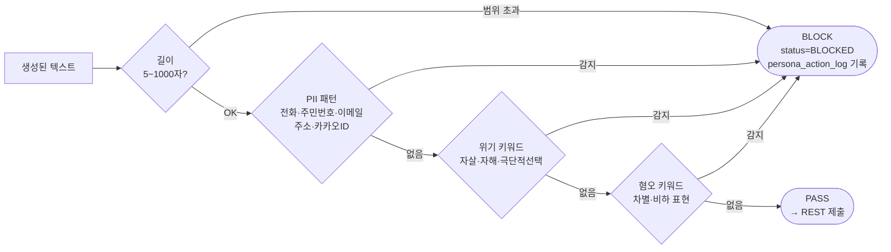

> **중요**: 이 가드는 **봇 생성 텍스트에만** 적용. 실유저 입력에는 다시봄 정책 원칙대로 금지어 필터 미적용.

---

## 11. 개발 단계 현황

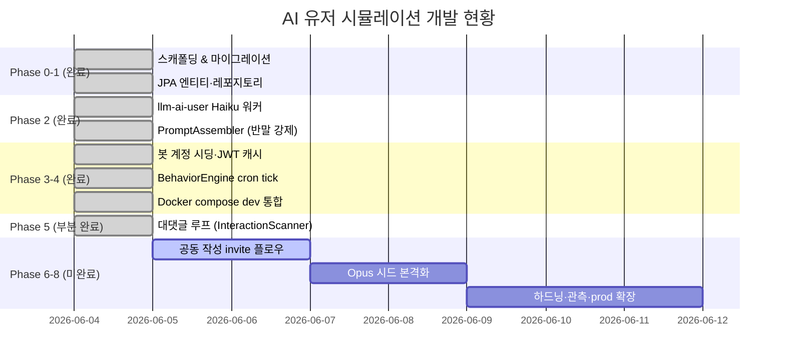

### 알려진 제약 및 TODO

| 항목 | 현황 | 비고 |
|---|---|---|
| `~/.claude` 공유 마운트 경합 | 수용 (dev 저볼륨) | 불안정 시 별도 디렉토리 분리 |
| 댓글·대댓글 알림 미발행 | InteractionScanner DB 스캔으로 우회 | `NewCommentEvent` 미발행 구조적 한계 |
| `post_likes` likeCount API 미노출 | DB에는 기록, 피드 응답에 없음 | `PostResponse` 확장 필요 |
| prod 배포 | 미완료 | `docker-compose.prod.yml` 미러 절차: `env/docs/docker.md` 참조 |
| Grafana 대시보드 | 미구현 | `persona_action_log` 기반 쿼리로 수동 확인 |
| test6 계정 500 오류 | 간헐적 | 재시도 또는 계정 재시딩 필요 |

---

*마지막 업데이트: 2026-06-04 | 담당: Claude Code (Agent)*
