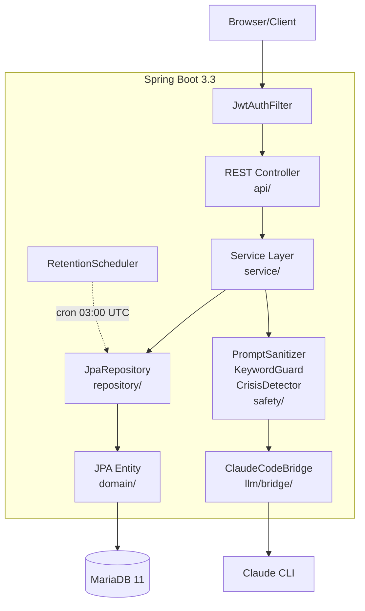

# 아키텍처

## 기술 스택

| 영역 | 기술 |
|---|---|
| 언어 | Java 21 (Eclipse Temurin) |
| 프레임워크 | Spring Boot 3.3 |
| 빌드 | Gradle Kotlin DSL |
| DB | MariaDB 11 LTS (utf8mb4, UTC) |
| ORM | Spring Data JPA (Hibernate) |
| 마이그레이션 | Flyway 10 (V1~V5) |
| 인증 | Spring Security + JWT (jjwt 0.12.5) |
| 메일 | Spring Mail (Gmail SMTP) |
| API 문서 | springdoc-openapi 2.6 (Swagger UI) |
| Rate Limit | bucket4j 7.6 |
| 직렬화 | Jackson 2.17, SnakeYAML 2.0 |
| 테스트 | JUnit 5, Mockito, Testcontainers, H2 |
| LLM | Claude Code CLI (subprocess) |

## 레이어 흐름



### 구성 요소:

```
HTTP Request
   │
   ▼  Spring Security (JwtAuthFilter, RateLimitFilter)
@RestController (api/*Controller)
   │
   │  request DTO 검증 (Bean Validation)
   ▼
@Service (service/*)
   │
   │  비즈니스 로직 + @Transactional 경계
   │  ├── safety/* (KeywordGuard, CrisisDetector)
   │  ├── llm/* (ClaudeCodeBridge → claude CLI) — 자세한 설명은 llm-bridge.md 참조
   │  └── parser/* (LLM 응답 → 도메인 객체)
   ▼
@Repository (Spring Data JPA)
   │
   ▼
MariaDB (Flyway 관리 스키마)

   ◄── domain Event 발행 ──◄
       SessionCompletedEvent → SessionCompletedGraphListener (관계 그래프 갱신)
       TurnCompletedEvent
       SafetyTriggerEvent → SafetyAuditLogger
       CrisisDetectedEvent → SessionService (TERMINATED 전이)
```

## 트랜잭션 정책

- 기본: `@Transactional(readOnly = true)` Service 메서드 (조회)
- 변경 메서드: `@Transactional` (write)
- LLM 호출은 트랜잭션 **밖**에서 수행 — 60s 타임아웃 동안 DB 커넥션 점유 방지
- 패턴:
  ```java
  @Transactional
  public Turn saveUserInput(...) { /* DB 저장 */ }
  
  // 트랜잭션 밖에서 LLM 호출
  LLMResponse response = llmProvider.invoke(request);
  
  @Transactional
  public Turn saveMediatorResponse(...) { /* 결과 저장 */ }
  ```

## Mediation State Machine

`SessionStateMachine`이 `SessionStatus` 전이의 단일 진실.

```
WAITING_B
   │ /sessions/join/{token}
   ▼
B_JOINED
   │ /sessions/{id}/turns (turnNumber=1, role=A)
   ▼
IN_MEDIATION  ──── /turns 반복 (1~6) ────►  COMPLETED
   │
   │ (어느 시점이든)
   │ CrisisDetectedEvent → 강제 종료
   ▼
TERMINATED

(독자 흐름)
WAITING_B → SOLO_MODE  ──── /turns 단축 (2~3) ────►  COMPLETED
```

`SessionStatus` enum: `WAITING_B, B_JOINED, IN_MEDIATION, COMPLETED, SOLO_MODE, TERMINATED`

`MediationController.progressTurn()` 진입 시:
1. 현재 turn 일치 확인 (`TURN_MISMATCH` 422)
2. KeywordGuard / CrisisDetector 실행
3. LLM 호출 (트랜잭션 밖)
4. 응답 저장 + 다음 턴으로 전이
5. turn_6 완료 시 `SessionCompletedEvent` 발행 → `COMPLETED`

## 이벤트 흐름

| 이벤트 | 발행 | 리스너 | 효과 |
|---|---|---|---|
| `SessionCompletedEvent` | turn_6 완료 시 | `SessionCompletedGraphListener` | `user_relationships` + `conflict_history` 갱신 |
| `TurnCompletedEvent` | 매 턴 완료 시 | (현재 미사용 — 모니터링용 예약) | — |
| `SafetyTriggerEvent` | KeywordGuard / RatioEnforcer 위반 시 | `SafetyAuditLogger` | safety 감사 로그 (마스킹) |
| `CrisisDetectedEvent` | CrisisDetector 발동 시 | `SessionService.terminateForCrisis` | `SessionStatus.TERMINATED` 전이 |

`AsyncConfig`로 일부 리스너는 비동기 처리 — main thread 막지 않음.

## 스케줄러

| 빈 | cron | 동작 |
|---|---|---|
| `RetentionScheduler.purgeExpiredContent` | `0 0 3 * * *` (매일 03:00 UTC) | 30일 경과 세션의 `turns.{content, mediator_message, mediator_summary_for_opponent}` NULL 처리 |
| `RevokedTokenCleanupScheduler.cleanup` | `0 0 4 * * *` (매일 04:00 UTC) | 만료된 `revoked_tokens` 행 삭제 |

`SchedulingConfig`의 `@EnableScheduling` 활성. 테스트 프로파일에서는 비활성.

## 프로파일별 설정 차이

| 키 | dev | prod | test |
|---|---|---|---|
| `spring.jpa.hibernate.ddl-auto` | `update` | `validate` | `create-drop` |
| `spring.flyway.enabled` | `false` | `true` | `false` |
| `springdoc.swagger-ui.enabled` | `true` | `false` | (N/A) |
| `management.endpoints.web.exposure.include` | `health,info,metrics` | `health` only | (N/A) |
| `logging.level.com.againspring` | `DEBUG` | `WARN` | `DEBUG` |
| `llm.provider` | `claude-code` | `claude-code` | `mock` |
| DB | MariaDB 3306 (host) / 컨테이너 | MariaDB internal | H2 in-memory (MariaDB mode) |

## DTO 컨벤션

- request DTO: `*Request` 접미사 + Bean Validation 어노테이션 (`@NotNull`, `@Size`, `@Email`)
- response DTO: `*Response` 접미사 + `@Builder` 패턴
- 도메인 → DTO 변환은 Controller에서 수행 (Service는 도메인 객체만 반환)
- JSON 컬럼 매핑은 `@Convert(converter = JpaJsonConverter.class)` 또는 Jackson String

## 보안 컴포넌트

| 컴포넌트 | 역할 | 정책 문서 |
|---|---|---|
| `JwtAuthFilter` | 모든 요청에서 토큰 검증 + 폐기 확인 | [policies/auth-jwt.md](./policies/auth-jwt.md) |
| `RateLimitFilter` | bucket4j 기반 IP/유저별 제한 | `shared/docs/policies/auth.md` |
| `KeywordGuard` | 금지어 검사 (입력+응답 양방향) | [policies/keyword-guard.md](./policies/keyword-guard.md) |
| `CrisisDetector` | 위기 키워드 → 세션 강제 종료 | `shared/docs/policies/crisis-detection.md` |
| `PromptSanitizer` | LLM 입력 inject 방지 | [policies/prompt-sanitizer.md](./policies/prompt-sanitizer.md) |
| `RatioEnforcer` | 화해 기여도 클리핑 강제 | `shared/docs/policies/ratio-calculation.md` |
| `SafetyAuditLogger` | 모든 safety 이벤트 마스킹 후 DB | — |

## 예외 처리

`GlobalExceptionHandler`(`@RestControllerAdvice`)가 모든 예외를 표준 응답으로 변환:

```jsonc
{
  "error": {
    "code": "SESSION_NOT_FOUND",
    "message": "세션을 찾을 수 없어요",
    "timestamp": "2026-04-26T10:30:00Z"
  }
}
```

코드 매핑은 `shared/docs/api/rest-spec.md` 에러 코드 표 참조.

도메인 예외는 모두 `BusinessException(errorCode, message)` 또는 그 하위. 서비스에서 Bean Validation 실패는 `MethodArgumentNotValidException`으로 자동 처리.

## 헬스체크

- `GET /api/health` — 단순 200 응답 (커스텀 컨트롤러)
- `GET /actuator/health` — Spring Actuator (DB connectivity 포함)
- prod에서 nginx는 `/actuator/health`만 노출 (`env/nginx/prod.conf`)

## 비기능 요구

| 요구사항 | 구현 |
|---|---|
| LLM 동시성 제한 | `ClaudeCodeWorkerPool.semaphore = 3` (변경: `CLAUDE_POOL_SIZE` env) |
| LLM 타임아웃 | 60s (변경: `claude-code.default-timeout-ms`) |
| DB 풀 크기 | dev 10/2, prod 20/5 (HikariCP) |
| Rate limit | RateLimitFilter (bucket4j) |
| 로깅 | logback-spring.xml + Lombok @Slf4j |
| 트레이싱 | `correlationId` (UUID, X-Request-ID 헤더) — `LLMCallLogger` 등에 전파 |
