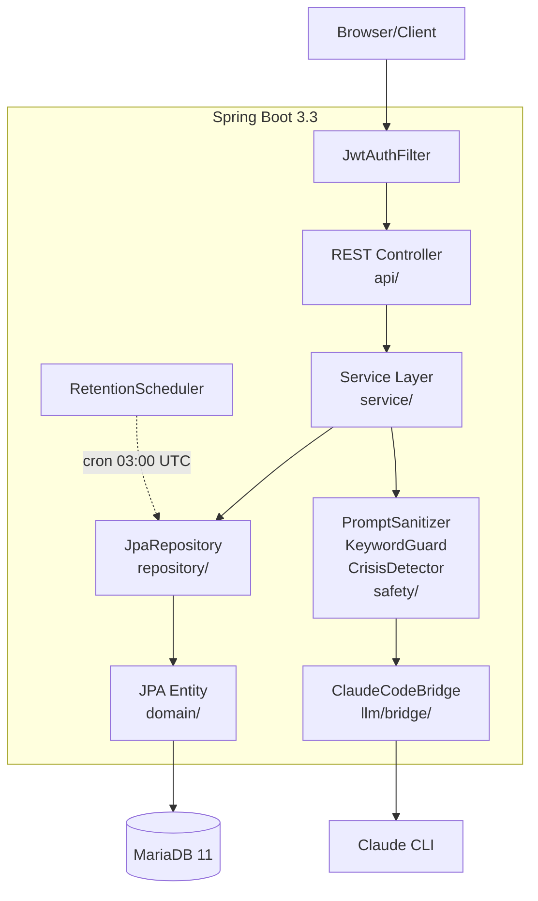
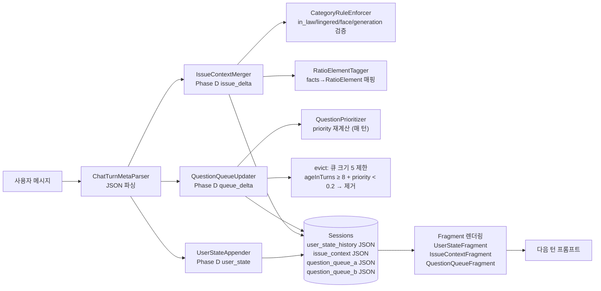

# 아키텍처

## 기술 스택

| 영역 | 기술 |
|---|---|
| 언어 | Java 21 (Eclipse Temurin) |
| 프레임워크 | Spring Boot 3.3 |
| 빌드 | Gradle Kotlin DSL |
| DB | MariaDB 11 LTS (utf8mb4, UTC) |
| ORM | Spring Data JPA (Hibernate) |
| 마이그레이션 | Flyway 10 (V1~V14) |
| 인증 | Spring Security + JWT (jjwt 0.12.5) |
| 메일 | Spring Mail (Gmail SMTP) |
| API 문서 | springdoc-openapi 2.6 (Swagger UI) |
| Rate Limit | bucket4j 7.6 |
| 직렬화 | Jackson 2.17, SnakeYAML 2.0 |
| 테스트 | JUnit 5, Mockito, Testcontainers, H2 |
| LLM | Claude Code CLI (subprocess) |

## 레이어 흐름



### 구성 요소:

```
HTTP Request
   │
   ▼  Spring Security (JwtAuthFilter, RateLimitFilter)
@RestController (api/*Controller)
   │
   │  request DTO 검증 (Bean Validation)
   ▼
@Service (service/*)
   │
   │  비즈니스 로직 + @Transactional 경계
   │  ├── safety/* (KeywordGuard, CrisisDetector)
   │  ├── llm/* (ClaudeCodeBridge → claude CLI) — 자세한 설명은 llm-bridge.md 참조
   │  └── parser/* (LLM 응답 → 도메인 객체)
   ▼
@Repository (Spring Data JPA)
   │
   ▼
MariaDB (Flyway 관리 스키마)

   ◄── domain Event 발행 ──◄
       TurnCompletedEvent
       SafetyTriggerEvent → SafetyAuditLogger
       CrisisDetectedEvent → SessionService (TERMINATED 전이)
```

## 트랜잭션 정책

- 기본: `@Transactional(readOnly = true)` Service 메서드 (조회)
- 변경 메서드: `@Transactional` (write)
- LLM 호출은 트랜잭션 **밖**에서 수행 — 60s 타임아웃 동안 DB 커넥션 점유 방지
- 패턴:
  ```java
  @Transactional
  public Turn saveUserInput(...) { /* DB 저장 */ }
  
  // 트랜잭션 밖에서 LLM 호출
  LLMResponse response = llmProvider.invoke(request);
  
  @Transactional
  public Turn saveMediatorResponse(...) { /* 결과 저장 */ }
  ```

## Mediation State Machine (V1.5 카톡식)

`SessionStateMachine`이 `SessionStatus` 전이의 단일 진실. V1.5부터 카톡 메시지 기반 흐름.

```mermaid
flowchart TB
    Start[POST /api/sessions]
    Solo["CHATTING_SOLO<br/>(Solo 모드)"]
    Invite[POST /api/sessions/{id}/messages<br/>with invite token]
    Duo["CHATTING_DUO<br/>(Duo 모드)"]
    Finalize["AWAITING_FINALIZATION<br/>(종료 권유)"]
    Completed["COMPLETED<br/>(완료)"]
    Terminated["TERMINATED<br/>(강제 종료)"]
    
    Start -->|세션 생성| Solo
    Solo -->|상대가 invite로 참여| Duo
    Solo -->|사용자 결정| Completed
    Duo -->|/finalize 호출| Finalize
    Finalize -->|양쪽 agree| Completed
    Finalize -->|한쪽 decline| Duo
    Solo -->|crisis detected| Terminated
    Duo -->|crisis detected| Terminated
```

**상태 전이 규칙**:
- `CHATTING_SOLO` → `CHATTING_DUO`: 상대가 초대 토큰으로 `/invite` 엔드포인트를 통해 참여
- `CHATTING_SOLO` → `COMPLETED`: 사용자가 종료 결정 또는 충분히 대화 후 권유 수락
- `CHATTING_DUO` → `AWAITING_FINALIZATION`: `/finalize` 호출 (종료 권유)
- `AWAITING_FINALIZATION` → `COMPLETED`: 양쪽이 `/finalize/agree`
- `AWAITING_FINALIZATION` → `CHATTING_DUO`: 한쪽이 `/finalize/decline`
- **Any** → `TERMINATED`: CrisisDetector 발동 (위험 키워드)

**ChatService 처리 순서** (`POST /api/sessions/{id}/messages`):
1. 현재 상태 확인 (CHATTING_SOLO 또는 CHATTING_DUO만 메시지 허용)
2. CrisisDetector 실행 (위험 키워드) → level 1 시 즉시 차단, level 2는 메타 부착
3. 사용자 메시지 저장 (`messages` 테이블) + 카운트 증가
4. **사용자 프로필 로드** (`UserRepository.findByIdAndDeletedAtIsNull`) — Solo 1명 / Duo 2명
5. **ChatPromptAssembler 호출** — system + gottman + nvc + `<user_profile>` + `<psychology_feedback>` + relations + chat/{solo,duo}_chat + history + current + `<duo_balance>` + 응답 형식 지시
6. LLM 호출 (Haiku, 트랜잭션 밖, 60s timeout)
7. **`ChatTurnMetaParser.parse()`** — 응답을 본문 + `<turn_meta>` JSON으로 분리
8. 중재자 본문 저장 (`messages` 테이블) — meta 블록은 사용자에 노출되지 않음
9. **세션 누적 갱신**: `horsemen_history`, `nvc_completion_history` append + Duo면 발신자별 `user_{a,b}_emotion_intensity` 누적 평균
10. 필요시 `finalize_suggested_at` 설정 (AI가 종료 권유)

## 이벤트 흐름

| 이벤트 | 발행 | 리스너 | 효과 |
|---|---|---|---|
| `TurnCompletedEvent` | 매 턴 완료 시 | (현재 미사용 — 모니터링용 예약) | — |
| `SafetyTriggerEvent` | KeywordGuard / RatioEnforcer 위반 시 | `SafetyAuditLogger` | safety 감사 로그 (마스킹) |
| `CrisisDetectedEvent` | CrisisDetector 발동 시 | `SessionService.terminateForCrisis` | `SessionStatus.TERMINATED` 전이 |

`AsyncConfig`로 일부 리스너는 비동기 처리 — main thread 막지 않음.

## 스케줄러

| 빈 | cron | 동작 |
|---|---|---|
| `RetentionScheduler.purgeExpiredContent` | `0 0 3 * * *` (매일 03:00 UTC) | 30일 경과 세션의 `messages.content` NULL 처리 (V1.5 이후) / `turns.{content, mediator_message}` NULL 처리 (V1.5 이전 레거시 히스토리) |
| `RevokedTokenCleanupScheduler.cleanup` | `0 0 4 * * *` (매일 04:00 UTC) | 만료된 `revoked_tokens` 행 삭제 |

`SchedulingConfig`의 `@EnableScheduling` 활성. 테스트 프로파일에서는 비활성.

## 프로파일별 설정 차이

| 키 | dev | prod | test |
|---|---|---|---|
| `spring.jpa.hibernate.ddl-auto` | `update` | `validate` | `create-drop` |
| `spring.flyway.enabled` | `false` | `true` | `false` |
| `springdoc.swagger-ui.enabled` | `true` | `false` | (N/A) |
| `management.endpoints.web.exposure.include` | `health,info,metrics` | `health` only | (N/A) |
| `logging.level.com.againspring` | `DEBUG` | `WARN` | `DEBUG` |
| `llm.provider` | `claude-code` | `claude-code` | `mock` |
| DB | MariaDB 3306 (host) / 컨테이너 | MariaDB internal | H2 in-memory (MariaDB mode) |

## DTO 컨벤션

- request DTO: `*Request` 접미사 + Bean Validation 어노테이션 (`@NotNull`, `@Size`, `@Email`)
- response DTO: `*Response` 접미사 + `@Builder` 패턴
- 도메인 → DTO 변환은 Controller에서 수행 (Service는 도메인 객체만 반환)
- JSON 컬럼 매핑은 `@Convert(converter = JpaJsonConverter.class)` 또는 Jackson String

## 보안 컴포넌트

| 컴포넌트 | 역할 | 정책 문서 |
|---|---|---|
| `JwtAuthFilter` | 모든 요청에서 토큰 검증 + 폐기 확인 | [policies/auth-jwt.md](./policies/auth-jwt.md) |
| `RateLimitFilter` | bucket4j 기반 IP/유저별 제한 | `shared/docs/policies/auth.md` |
| `KeywordGuard` | 금지어 검사 (입력+응답 양방향) | [policies/keyword-guard.md](./policies/keyword-guard.md) |
| `CrisisDetector` | 위기 키워드 → 세션 강제 종료 | `shared/docs/policies/crisis-detection.md` |
| `PromptSanitizer` | LLM 입력 inject 방지 | [policies/prompt-sanitizer.md](./policies/prompt-sanitizer.md) |
| `RatioEnforcer` | 화해 기여도 클리핑 강제 | `shared/docs/policies/ratio-calculation.md` |
| `SafetyAuditLogger` | 모든 safety 이벤트 마스킹 후 DB | — |

## Phase D 컨텍스트 추적

권위본: [`shared/docs/policies/context-algorithm.md`](../../shared/docs/policies/context-algorithm.md)

세션별로 사용자의 심리 상태를 추적하고 질문 큐를 관리해 매 턴 컨텍스트를 풍부하게 한다.



| 컴포넌트 | 역할 |
|---|---|
| `UserState` (enum 7종) | `OPENING` → `VENTING` → `DEFENSIVE` → `BLAMING` → `REFLECTING` → `NEGOTIATING` → `RESOLVING` |
| `IssueContext` (4슬롯) | headline · facts · namedNeeds · threads |
| `QuestionQueue` (A·B 분리 PQ) | 사용자별 우선순위 질문 큐 — 중재자가 적시에 명확화 질문 삽입 |

세션 컬럼(V10): `user_state_history` JSON, `issue_context` JSON, `question_queue_a` JSON, `question_queue_b` JSON

## 중재 컨텍스트 강화 컴포넌트 (Phase A/B/C)

| 컴포넌트 | 역할 | 위치 |
|---|---|---|
| `UserProfileFragment` | User → `<user_profile>` 자연어 블록 (Phase A) | `service/prompt/UserProfileFragment.java` |
| `PsychologyFeedbackFormatter` | 누적 4 Horsemen·NVC 점수 → `<psychology_feedback>` 자연어 지시 (Phase B) | `service/prompt/PsychologyFeedbackFormatter.java` |
| `DuoBalanceFormatter` | A·B 발화량/감정 강도 불균형 시 `<duo_balance>` 관심 분배 지시 (Phase C) | `service/prompt/DuoBalanceFormatter.java` |
| `ChatTurnMetaParser` | LLM 응답 본문/`<turn_meta>` JSON 분리 + 누적 점수 추출 (Phase B) | `service/parser/ChatTurnMetaParser.java` |

세션 누적 데이터:
- `sessions.horsemen_history` (V8) — 턴별 4 Horsemen 강도 배열
- `sessions.nvc_completion_history` (V8) — 턴별 NVC 4단계 완성 여부
- `sessions.user_{a,b}_emotion_intensity` (V9) — A·B 누적 감정 강도 0.00–1.00

## 예외 처리

`GlobalExceptionHandler`(`@RestControllerAdvice`)가 모든 예외를 표준 응답으로 변환:

```jsonc
{
  "error": {
    "code": "SESSION_NOT_FOUND",
    "message": "세션을 찾을 수 없어요",
    "timestamp": "2026-04-26T10:30:00Z"
  }
}
```

코드 매핑은 `shared/docs/api/rest-spec.md` 에러 코드 표 참조.

도메인 예외는 모두 `BusinessException(errorCode, message)` 또는 그 하위. 서비스에서 Bean Validation 실패는 `MethodArgumentNotValidException`으로 자동 처리.

## 헬스체크

- `GET /api/health` — 단순 200 응답 (커스텀 컨트롤러)
- `GET /actuator/health` — Spring Actuator (DB connectivity 포함)
- prod에서 nginx는 `/actuator/health`만 노출 (`env/nginx/prod.conf`)

## 비기능 요구

| 요구사항 | 구현 |
|---|---|
| LLM 동시성 제한 | `ClaudeCodeWorkerPool.semaphore = 3` (변경: `CLAUDE_POOL_SIZE` env) |
| LLM 타임아웃 | 60s (변경: `claude-code.default-timeout-ms`) |
| DB 풀 크기 | dev 10/2, prod 20/5 (HikariCP) |
| Rate limit | RateLimitFilter (bucket4j) |
| 로깅 | logback-spring.xml + Lombok @Slf4j |
| 트레이싱 | `correlationId` (UUID, X-Request-ID 헤더) — `LLMCallLogger` 등에 전파 |
