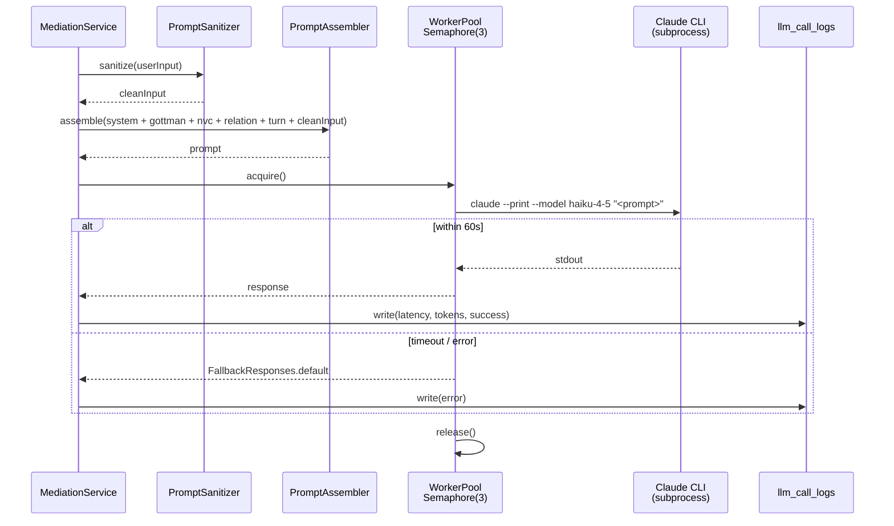

# LLM 브릿지 — BE 구현 가이드

다시봄 백엔드는 Anthropic API 키 없이 **Claude Code CLI**를 ProcessBuilder로 호출해 LLM 응답을 얻는다. 호스트의 `~/.claude` 세션을 컨테이너가 공유.

## 소스 코드 위치

- `backend/src/main/java/com/againspring/llm/bridge/ClaudeCodeBridge.java` — CLI 호출 진입점
- `backend/src/main/java/com/againspring/llm/bridge/ClaudeCodeWorkerPool.java` — Semaphore(3) 동시성 제어
- `backend/src/main/java/com/againspring/llm/bridge/PromptSanitizer.java` — 사용자 입력 검증
- `backend/src/main/java/com/againspring/llm/prompt/{PromptAssembler,PromptLoader}.java` — 프롬프트 어셈블 및 캐싱
- `backend/src/main/java/com/againspring/llm/monitoring/LLMCallLogger.java` — 호출 감사 로깅
- `backend/src/main/java/com/againspring/llm/fallback/FallbackResponses.java` — 실패 시 안전 응답

---

## 설계 원칙

1. **API 과금 없음** — Claude Pro/Max 구독의 Claude Code만 사용
2. **추상화** — `LLMProvider` 인터페이스로 향후 API/다른 provider 교체 가능
3. **동시성 제한** — `Semaphore(3)`으로 동시 최대 3개 Claude 프로세스만 실행
4. **타임아웃** — 60초 기본 (Haiku 4.5 평균 응답 ~3초, 안전 마진)
5. **Fallback** — 실패 시 사전 정의된 안전 응답 반환

---

## 호출 흐름



### 텍스트 버전:

```
MediationService.processTurn(...)
   │
   │  ① PromptAssembler가 system + gottman + nvc + relations + turn_n 레이어 조립
   ▼
LLMRequest { systemPrompt, layers, userInput, timeout }
   │
   │  ② PromptSanitizer.sanitize(userInput) — injection 패턴 차단
   ▼
ClaudeCodeBridge.invoke(request)
   │
   │  ③ assembleFinalPrompt — <system>..</system><context>..</context><user_input>..</user_input>
   ▼
ClaudeCodeWorkerPool.execute(timeout, correlationId)
   │
   │  ④ Semaphore(3) acquire (최대 3개 동시 실행)
   ▼
ProcessBuilder("claude", "--print", "--model", "claude-haiku-4-5-20251001", finalPrompt)
   │
   │  ⑤ stdout 읽기, exitCode 검사
   ▼
LLMResponse { rawText, tokensUsed (estimate), latencyMs, provider, correlationId, isFallback }
   │
   │  ⑥ LLMCallLogger.logCall → llm_call_logs 테이블
   ▼
TurnResponseParser / ReportResponseParser → 구조화 → DB 저장 → API 응답
```

---

## 핵심 클래스

### `LLMProvider` (인터페이스)

```java
public interface LLMProvider {
  LLMResponse invoke(LLMRequest request) throws LLMException;
  CompletableFuture<LLMResponse> invokeAsync(LLMRequest request);
  String getProviderName();
  boolean isHealthy();
}
```

### `ClaudeCodeBridge` (구현)

```java
@Component
@ConditionalOnProperty(name = "llm.provider", havingValue = "claude-code", matchIfMissing = true)
public class ClaudeCodeBridge implements LLMProvider { ... }
```

`@ConditionalOnProperty`로 `llm.provider=mock`일 때는 `MockLLMProvider`가 빈으로 등록됨 (테스트 프로파일).

### `ClaudeCodeWorkerPool`

```java
private final Semaphore semaphore = new Semaphore(3);  // 환경변수로 변경 가능

public String execute(Callable<String> task, Duration timeout, String correlationId) {
  if (!semaphore.tryAcquire(5, SECONDS)) throw new LLMCapacityException("Pool exhausted");
  try {
    Future<String> f = executor.submit(task);
    return f.get(timeout.toMillis(), MILLISECONDS);
  } catch (TimeoutException e) {
    throw new LLMTimeoutException("Claude Code timeout after " + timeout);
  } finally {
    semaphore.release();
  }
}
```

**동시성 제한**: 최대 3개 프로세스 동시 실행. 초과 시 5초 대기 후 `LLMCapacityException` 발생.

### `PromptSanitizer`

사용자 입력에서 prompt-injection 패턴 차단:

```java
private static final List<Pattern> INJECTION_PATTERNS = List.of(
  Pattern.compile("(?i)ignore (previous|above|all) instructions"),
  Pattern.compile("(?i)you are now"),
  Pattern.compile("(?i)system prompt"),
  Pattern.compile("(?i)</?system>"),
  Pattern.compile("(?i)forget everything"),
  Pattern.compile("(?i)disregard"),
  Pattern.compile("(?i)override")
);
```

추가 검증:
- 입력 길이 제한 (5000자)
- `[INST]`, `[/INST]` 등 특수 구분자 제거
- 매칭 시 `[REDACTED]`로 치환 + WARN 로그

### `PromptAssembler` + `PromptLoader`

- `PromptLoader`는 시작 시 `shared/docs/prompts/**.md`를 메모리 캐시 (`@PostConstruct`)
- `PromptAssembler.assemble(turn, role, conflictType, relationType)`이 다음을 합성:
  ```
  system.md
  + gottman/conflict_<TYPE>.md (조건부)
  + gottman/principles.md
  + nvc/framework.md
  + relations/<RELATION_TYPE>.md
  + turns/turn_<n>_<role>.md
  ```
- `POST /api/admin/prompts/reload`로 재시작 없이 캐시 무효화

### `FallbackResponses`

LLM 실패 시 반환할 안전 기본 응답:

```java
fallbacks.put("turn_3_a", "지금 답변이 어렵네요. 잠시 후 다시 시도해주세요.");
fallbacks.put("final_report", "분석 중 오류가 발생했어요. 고객센터로 문의해주세요.");
// ...
```

응답에 `isFallback: true` 표시 → FE는 사용자에게 재시도 옵션 표시.

---

## Claude Code CLI 호출

```bash
claude --print --model claude-haiku-4-5-20251001 "<final_prompt>"
```

- `--print`: 비대화형 단일 응답 모드
- `--model`: 환경변수 `CLAUDE_MODEL` (기본 `claude-haiku-4-5-20251001`)로 지정 가능
- 프롬프트는 **인자**로 전달 (stdin 미사용 — ProcessBuilder가 안전 처리)

---

## 설정 (application.yml)

```yaml
app:
  prompts:
    path: ${PROMPTS_PATH:./shared/docs/prompts}  # 프롬프트 파일 위치

llm:
  provider: ${LLM_PROVIDER:claude-code}
  claude-code:
    binary-path: ${CLAUDE_BIN:claude}            # 호스트의 claude CLI
    model: ${CLAUDE_MODEL:claude-haiku-4-5-20251001}
    pool-size: ${CLAUDE_POOL_SIZE:3}             # 동시 실행 프로세스 수
    default-timeout-ms: 60000                    # 60초 타임아웃
```

`PromptLoader`는 `app.prompts.path`로부터 프롬프트를 읽음. 기본값은 `./shared/docs/prompts`.

---

## 인증 (호스트 ~/.claude 마운트)

API 키 미사용. 컨테이너 실행 시:

```yaml
# docker-compose.dev.yml / docker-compose.prod.yml
backend-dev:
  volumes:
    - ${CLAUDE_HOST_CONFIG_DIR:-/home/justant/.claude}:/root/.claude
```

**설정 절차:**
1. 호스트에서 `claude` 명령으로 로그인 → `~/.claude/` 디렉토리 생성
2. 컨테이너가 동일 세션을 마운트된 볼륨으로 공유
3. `ANTHROPIC_API_KEY` 환경변수 불필요

**세션 만료 시:**
- 호스트에서 `claude` 재로그인
- `docker compose restart backend-dev` (또는 prod)

---

## 모니터링

`LLMCallLogger.logCall`이 `llm_call_logs` 테이블에 다음 기록:

| 필드 | 설명 |
|---|---|
| `correlation_id` | 호출 추적 (요청 헤더 X-Request-ID와 연동) |
| `provider` | `claude-code` |
| `session_id`, `turn_number` | 세션 컨텍스트 |
| `tokens_used` | Bridge가 추정 (`length / 4`) |
| `latency_ms` | invoke 시작 → 응답까지 경과 시간 |
| `outcome` | `success` / `fallback` / `timeout` / `error` |
| `error_code` | `LLMTimeoutException` / `LLMCapacityException` / 기타 |

**참고**: 프롬프트/응답 본문은 저장하지 않음 — 분량과 결과만 기록.

---

## 보안 체크리스트

- [x] 사용자 입력 PromptSanitizer 통과 강제
- [x] ProcessBuilder 사용 (셸 인젝션 방지) — `bash -c` 절대 금지
- [x] stderr 발췌(500자)만 저장 — 민감 정보 차단
- [x] `revokedTokens` 검사 후 인증된 사용자만 호출
- [x] 길이 제한 (입력 5000자)
- [x] 동시 처리 제한 (Semaphore 3)
- [x] 응답 후처리 단계에서 KeywordGuard 재검사

---

## 트러블슈팅

| 증상 | 원인 | 조치 |
|---|---|---|
| `LLMTimeoutException` 빈발 | Claude Pro rate limit 도달 또는 응답 지연 | pool-size 축소 또는 호스트 세션 재로그인 |
| `claude` 명령 없음 | CLI 미설치 | `npm install -g @anthropic-ai/claude-code` |
| 401/세션 만료 | `~/.claude` 마운트 만료 또는 토큰 재발급 필요 | 호스트에서 `claude` 재로그인 + 컨테이너 재시작 |
| stdout 비어있음 | 프롬프트가 SW 엔지니어링이 아닌 비기술 조언으로 인식되어 거부 | system prompt가 NVC 재구성 형태로 프레임돼 있는지 확인 |
| 응답에 금지어 | LLM이 우회 시도 | KeywordGuard가 응답 후처리에서 차단 — 정상 동작 |

---

## 향후 API 전환 계획

API 키 기반 전환 시:

```java
@Component
@ConditionalOnProperty(name = "llm.provider", havingValue = "claude-api")
public class ClaudeAPIProvider implements LLMProvider {
  @Value("${llm.claude-api.key}") private String apiKey;
  // Anthropic SDK 사용
}
```

환경변수 변경만으로 전환 — 비즈니스 로직 코드 무수정.

---

## 프롬프트 파일 위치

정책 및 프롬프트 원본은 `shared/docs/prompts/` 하위:

- `system.md` — 시스템 역할 정의
- `gottman/*.md` — Gottman 부부 치료 체계
- `nvc/*.md` — 비폭력 대화 (NVC) 프레임워크
- `relations/*.md` — 관계 유형별 고정 콘텍스트
- `turns/*.md` — 턴별 역할별 프롬프트

자세한 설명은 `shared/docs/v1/SYSTEM_PROMPTS.md` 참조.

---

**마지막 업데이트**: 2026-04-26
