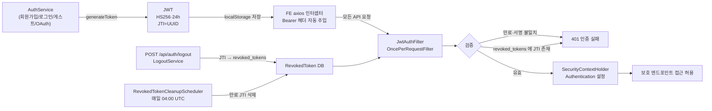

# JWT 인증 — JwtService · JwtAuthFilter · 토큰 폐기

## Source of truth

- `backend/src/main/java/com/againspring/security/JwtService.java`
- `backend/src/main/java/com/againspring/security/JwtAuthFilter.java`
- `backend/src/main/java/com/againspring/security/SecurityConfig.java`
- `backend/src/main/java/com/againspring/service/LogoutService.java`
- `backend/src/main/java/com/againspring/RevokedTokenCleanupScheduler.java`
- DB: `revoked_tokens` (Flyway V4)
- 통합 정책: [`shared/docs/policies/auth.md`](../../../shared/docs/policies/auth.md)

## 토큰 형식 (jjwt 0.12.5)

```
HS256
{
  "sub": "<userId>",
  "email": "user@example.com",
  "isGuest": false,
  "roles": ["USER"],
  "iat": 1714123200,
  "exp": 1714209600,
  "jti": "<uuid>"           ← 고유 ID, 폐기 시 사용
}
```

서명: `application.yml`의 `jwt.secret` (env `JWT_SECRET`, ≥256bit). 만료: `jwt.expiration-ms` (기본 24h, 게스트는 1h).

## 발급 (`JwtService.generateToken`)

```java
public String generateToken(User user, Duration ttl) {
    String jti = UUID.randomUUID().toString();
    return Jwts.builder()
        .subject(user.getId())
        .claim("email", user.getEmail())
        .claim("isGuest", user.isGuest())
        .claim("roles", user.getRoles())
        .issuedAt(Date.from(Instant.now()))
        .expiration(Date.from(Instant.now().plus(ttl)))
        .id(jti)
        .signWith(secretKey, Jwts.SIG.HS256)
        .compact();
}
```

호출처: `AuthService` (회원가입/로그인/게스트), `OAuth2Controller` (소셜)

## JWT 생명주기



## 검증 (`JwtAuthFilter`)

`extends OncePerRequestFilter` — 모든 요청 1회 통과.

```java
protected void doFilterInternal(req, res, chain) {
    String header = req.getHeader("Authorization");
    if (header == null || !header.startsWith("Bearer ")) {
        chain.doFilter(req, res); return;   // 인증 없이 진행 (보호 엔드포인트는 SecurityConfig가 거부)
    }
    String token = header.substring(7);
    try {
        Claims claims = jwtService.parse(token);
        String jti = claims.getId();
        if (revokedTokenRepository.existsByJti(jti)) {
            throw new BusinessException("UNAUTHORIZED", "Token revoked");
        }
        var auth = new UsernamePasswordAuthenticationToken(
            claims.getSubject(), null,
            mapRoles(claims.get("roles", List.class))
        );
        SecurityContextHolder.getContext().setAuthentication(auth);
    } catch (JwtException e) {
        // 만료/서명 불일치 — 인증 없이 진행
    }
    chain.doFilter(req, res);
}
```

`SecurityConfig`가 `addFilterBefore(JwtAuthFilter, UsernamePasswordAuthenticationFilter.class)`로 등록.

## 폐기 (`LogoutService`)

```java
public void logout(String jti, Date expiresAt) {
    RevokedToken r = new RevokedToken(jti, currentUserId(), Instant.now(), expiresAt.toInstant());
    revokedTokenRepository.save(r);
}
```

폐기 후 동일 토큰으로 다음 요청 시 `JwtAuthFilter`가 거부 (`UNAUTHORIZED`).

## 정리 (`RevokedTokenCleanupScheduler`)

```java
@Scheduled(cron = "0 0 4 * * *")  // 매일 04:00 UTC
public void cleanup() {
    int deleted = revokedTokenRepository.deleteByExpiresAtBefore(Instant.now());
    log.info("Cleaned up {} expired revoked tokens", deleted);
}
```

만료된 토큰은 어차피 검증에서 거부되므로 DB에서 제거해 인덱스 부풀림 방지.

## SecurityConfig 핵심

```java
@Bean
SecurityFilterChain securityFilterChain(HttpSecurity http) throws Exception {
    return http
        .csrf(c -> c.disable())                    // JWT 사용 — CSRF 불필요
        .sessionManagement(s -> s.sessionCreationPolicy(STATELESS))
        .authorizeHttpRequests(auth -> auth
            .requestMatchers("/api/health", "/actuator/health",
                             "/swagger-ui/**", "/v3/api-docs/**",
                             "/api/auth/**").permitAll()
            .requestMatchers("/api/admin/**").hasRole("ADMIN")
            .anyRequest().authenticated()
        )
        .addFilterBefore(jwtAuthFilter, UsernamePasswordAuthenticationFilter.class)
        .addFilterBefore(rateLimitFilter, JwtAuthFilter.class)
        .build();
}
```

## OAuth provider 통합

`OAuth2Controller.callback(provider, request)` → `OAuthProviderService` → 신규 User 생성 또는 기존 user 조회 → `JwtService.generateToken` → `AuthResponse` 반환

자세한 흐름: [oauth-google.md](./oauth-google.md), `shared/docs/policies/auth.md`

## 보안 체크리스트

- [x] HS256 + 256bit 이상 secret
- [x] STATELESS 세션
- [x] CSRF 비활성 (JWT)
- [x] CORS 설정 (`config/CorsConfig.java`)
- [x] 토큰 폐기 가능 (revoked_tokens)
- [x] 만료 토큰 정리 (스케줄러)
- [x] Bean Validation 우선 → 비즈니스 검증 차후
- [x] 비밀번호 BCrypt 해시
- [x] 에러 메시지에 사용자 존재 여부 누설 안 함

## 트러블슈팅

| 증상 | 원인 |
|---|---|
| 모든 인증 요청이 401 | `JWT_SECRET` 변경됨 → 기존 토큰 무효 (사용자 재로그인 필요) |
| 로그아웃 후에도 요청 통과 | `revoked_tokens` 테이블 부재 — Flyway V4 적용 확인 |
| 토큰 만료 시간 안 맞음 | 컨테이너/호스트 시간대 (`TZ=UTC`) 확인 |
| OAuth callback 실패 | `APP_URL` 환경변수가 실제 도메인과 일치하는지 + provider console의 redirect_uri 일치 확인 |
