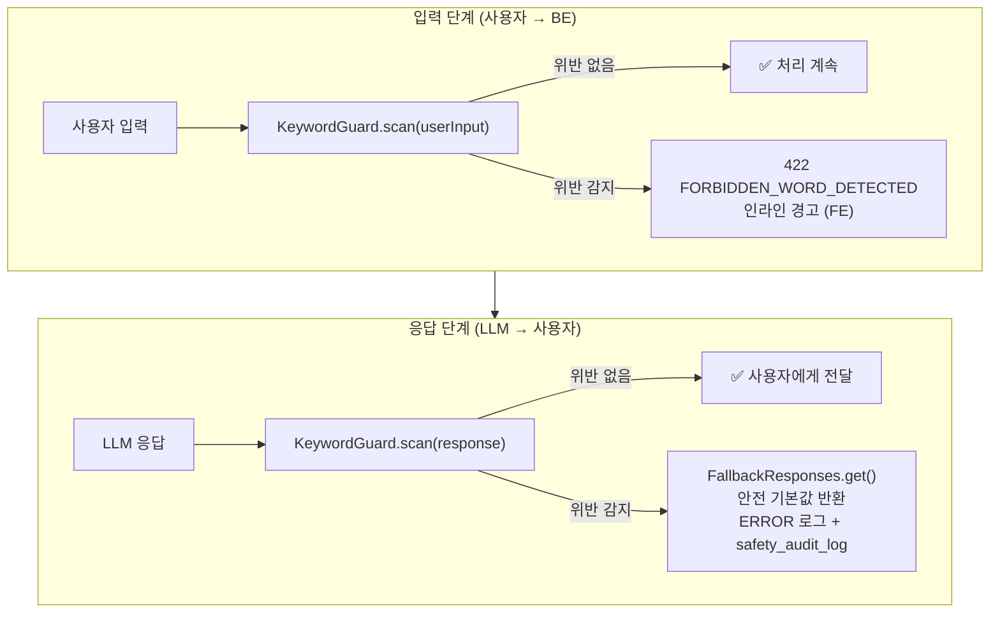

# KeywordGuard

금지어 검사. **입력 단계 + LLM 응답 후처리** 두 곳에서 동작.

## Source of truth

- 코드: `backend/src/main/java/com/againspring/safety/KeywordGuard.java`
- 단어 목록: `backend/src/main/resources/safety/forbidden-words.yml`
- 정책: [`shared/docs/policies/forbidden-words.md`](../../../shared/docs/policies/forbidden-words.md)

FE 측 동등 코드: `frontend/lib/constants/forbiddenWords.ts` — 변경 시 양쪽 동시 갱신.

## 4단계 카테고리

| Level | 분류 | 예 |
|---|---|---|
| 1 | 법률 용어 | 과실비율, 판결, 가해자, 피해자 |
| 2 | 임상·병리 용어 | 나르시시스트, 가스라이팅, 회피형 |
| 3 | 판결·승패 용어 | 이겼다/졌다, 승자/패자, 정답 |
| 4 | 관계 파국 조장 | 헤어지세요, 절교, 손절 |

전체 목록과 대체어: [`shared/docs/policies/forbidden-words.md`](../../../shared/docs/policies/forbidden-words.md)

## 동작 모드



### 1. 입력 검사 (사용자 → BE)

```java
ScanResult result = keywordGuard.scan(userInput);
if (result.hasViolations()) {
    throw new BusinessException("FORBIDDEN_WORD_DETECTED", 
        "사용할 수 없는 표현이 포함되어 있어요: " + result.getMatchedWords());
}
```

위반 시 `422 FORBIDDEN_WORD_DETECTED` 응답. FE는 입력 필드에 인라인 경고 표시.

### 2. LLM 응답 후처리 (LLM → 사용자)

```java
LLMResponse response = llmProvider.invoke(request);
ScanResult result = keywordGuard.scan(response.getRawText());
if (result.hasViolations()) {
    log.error("LLM response contains forbidden words: {}", result.getMatchedWords());
    return FallbackResponses.get(taskType);  // 안전 기본값
}
```

LLM이 우회 시도하더라도 사용자에게는 도달하지 못함. 발생 시 **알림 로그 + safety_audit_log** 기록.

## YAML 형식

`backend/src/main/resources/safety/forbidden-words.yml`:

```yaml
levels:
  - level: 1
    category: legal
    words:
      - 과실비율
      - 판결
      - 판사
      - 유죄
      - 무죄
      - 가해자
      - 피해자
      - 고소
      - 소송
      - 증거
      - 심판
  - level: 2
    category: clinical
    words:
      - 나르시시스트
      - 소시오패스
      - 가스라이팅
      # ...
  # level 3, 4 ...
```

`KeywordGuard`가 `@PostConstruct`로 로드 → 메모리 캐시.

## 사전 승인 컨텍스트 (allowed contexts)

일부 단어는 안내 문구에서 사용 가능:

```yaml
allowed_contexts:
  - "판결이 아니라"        # "판결이 아니라 결과예요" 가능
  - "판결·승패"            # "판결·승패가 없어요" 가능
```

스캔 알고리즘:
1. 텍스트에 금지어 발견
2. 그 위치 ±20자 윈도우 내 `allowed_contexts` 매치 확인
3. 매치되면 위반 아님으로 처리

## 변경 시 절차

1. `forbidden-words.yml` 갱신
2. `frontend/lib/constants/forbiddenWords.ts` **동기 갱신** (FE 측 검사)
3. `frontend/scripts/check-forbidden-words.js`의 FORBIDDEN 배열 갱신
4. `shared/docs/policies/forbidden-words.md` 갱신
5. 단위 테스트 (`KeywordGuardTest`) 추가/갱신 — 100% 커버리지 유지

## 위기 키워드와의 관계

KeywordGuard는 **사용자에게 안 좋게 들릴 단어**를 검사. 위기 키워드(폭력·자해·아동학대)는 별도 컴포넌트:

- `safety/CrisisDetector.java` → 위기 감지 시 세션 강제 종료 + 핫라인
- 정책: `shared/docs/policies/crisis-detection.md`

두 검사기는 독립적으로 동작 — 같은 입력에서 둘 다 발동 가능.

## 모니터링

- 위반 시 로그: `WARN` 레벨 + 단어/카테고리/사용자 ID
- 빈도 집계: 별도 dashboard 미구현 — 필요 시 `safety_audit_log` 쿼리
