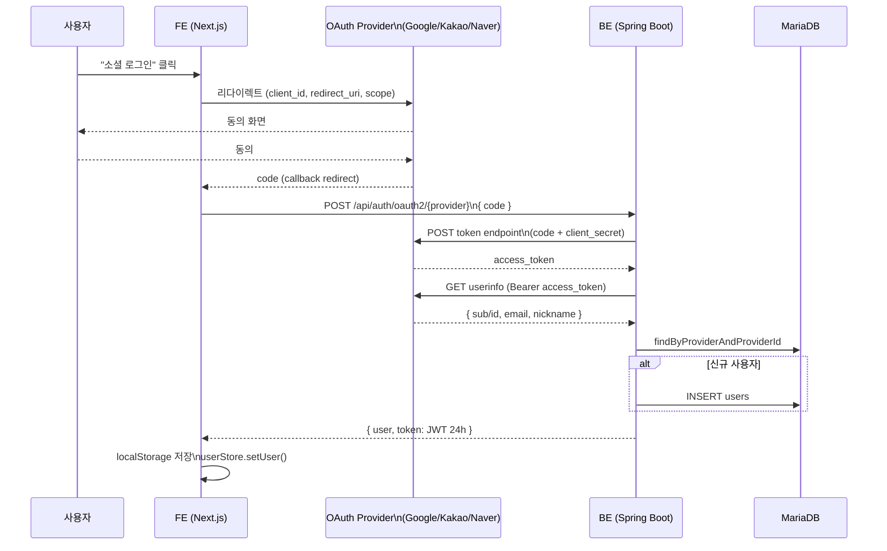

# OAuth Provider 통합 (Google · Kakao · Naver)

## Source of truth

- `backend/src/main/java/com/againspring/api/OAuth2Controller.java`
- `backend/src/main/java/com/againspring/service/oauth/OAuthProviderService.java`
- `backend/src/main/java/com/againspring/service/oauth/OAuthUserInfo.java`
- DB: `users.{provider, provider_id}` (Flyway V2)
- 통합 정책: [`shared/docs/policies/auth.md`](../../../shared/docs/policies/auth.md)

## 통합 인터페이스

```java
@Service
public class OAuthProviderService {
    public OAuthUserInfo authenticate(String provider, String code) {
        switch (provider) {
            case "google" -> return google(code);
            case "kakao"  -> return kakao(code);
            case "naver"  -> return naver(code);
            default -> throw new BusinessException("INVALID_INPUT", "Unknown provider: " + provider);
        }
    }
}
```

`OAuthUserInfo`:
```java
public record OAuthUserInfo(String provider, String providerId, String email, String nickname) {}
```

## 흐름 (모든 provider 공통)



```
[FE] 사용자가 "Google 로그인" 클릭
   → window.location = "https://accounts.google.com/o/oauth2/v2/auth?..."
       client_id, redirect_uri = APP_URL/auth/callback/google, scope, state, response_type=code
       
[Google] 사용자 동의
   → redirect: APP_URL/auth/callback/google?code=AUTH_CODE&state=...

[FE: app/auth/callback/[provider]/page.tsx]
   → POST /api/auth/oauth2/google { "code": AUTH_CODE }

[BE: OAuth2Controller.callback("google", req)]
   → OAuthProviderService.authenticate("google", req.code)
       1. POST oauth2.googleapis.com/token { code, client_id, client_secret, redirect_uri, grant_type=authorization_code }
          → access_token
       2. GET googleapis.com/oauth2/v3/userinfo (Bearer access_token)
          → { sub, email, name, picture, ... }
       3. Map → OAuthUserInfo("google", sub, email, name)
   → UserService.findOrCreateOAuthUser(userInfo)
       - users WHERE provider="google" AND provider_id=sub 조회
       - 없으면 신규 User 생성 (email, nickname=name, provider, provider_id)
   → JwtService.generateToken(user, 24h)
   → AuthResponse { user, token }
```

## Provider 엔드포인트

| Provider | Token endpoint | UserInfo endpoint | Scope 권장 |
|---|---|---|---|
| google | `https://oauth2.googleapis.com/token` | `https://www.googleapis.com/oauth2/v3/userinfo` | `openid email profile` |
| kakao | `https://kauth.kakao.com/oauth/token` | `https://kapi.kakao.com/v2/user/me` | `account_email profile_nickname` |
| naver | `https://nid.naver.com/oauth2.0/token` | `https://openapi.naver.com/v1/nid/me` | `name email` |

## 환경변수 (env/.env.{dev,prod})

```bash
GOOGLE_CLIENT_ID=...
GOOGLE_CLIENT_SECRET=...
KAKAO_CLIENT_ID=...
KAKAO_CLIENT_SECRET=...
NAVER_CLIENT_ID=...
NAVER_CLIENT_SECRET=...
```

dev에서는 미설정 시 해당 provider 비활성 (FE에서 버튼 숨김 — `NEXT_PUBLIC_*` ARG가 빈 문자열이면 비표시).

## redirect_uri 등록

각 provider 콘솔에서 등록 필요한 URI:

| 환경 | URI |
|---|---|
| local 개발 | `http://localhost:3000/auth/callback/{provider}` |
| dev 서버 | `https://dev.againspring.net/auth/callback/{provider}` |
| prod 서버 | `https://againspring.net/auth/callback/{provider}` |

provider별 콘솔:
- Google: [console.cloud.google.com](https://console.cloud.google.com) → APIs & Services → Credentials
- Kakao: [developers.kakao.com](https://developers.kakao.com) → 내 애플리케이션 → 카카오 로그인 → Redirect URI
- Naver: [developers.naver.com](https://developers.naver.com) → 애플리케이션 → API 설정 → Callback URL

## DB 매핑

```sql
-- Flyway V2
ALTER TABLE users
    ADD COLUMN provider VARCHAR(50) NULL,        -- 'google'|'kakao'|'naver'|NULL(이메일 가입)
    ADD COLUMN provider_id VARCHAR(255) NULL,    -- provider의 고유 user id
    ADD UNIQUE KEY uk_users_provider (provider, provider_id);
```

이메일 회원과 OAuth 회원이 동일 이메일을 쓰는 케이스:
- 이메일 가입 후 같은 이메일로 OAuth 시도 → **신규 OAuth user 생성**, 기존과 분리
- 향후 "계정 통합" 기능 검토 — 현재 미구현

## 게스트 → OAuth 승격

게스트 토큰 보유 상태에서 OAuth 가입 시:
1. OAuth user 신규 생성
2. 게스트 user의 sessions / turns / reports를 새 user_id로 이전
3. `guest_sessions` 행 삭제
4. 새 OAuth JWT 발급

## 보안 체크리스트

- [x] `client_secret`은 BE 환경변수 (FE 노출 금지)
- [x] redirect_uri는 provider 콘솔에 화이트리스트 등록 (코드로는 `APP_URL` 사용)
- [x] `state` 파라미터 검증 (FE 측 — CSRF 방어)
- [x] access_token은 BE에서만 사용, FE에 전달 안 함
- [x] provider userinfo 응답에서 email 검증 (provider별 nullable 처리)

## 트러블슈팅

| 증상 | 원인/조치 |
|---|---|
| `redirect_uri_mismatch` | provider 콘솔의 등록 URI와 `APP_URL` 불일치 |
| 401 from provider | client_secret 만료/잘못 입력 — provider 콘솔에서 재발급 |
| email == null | scope에 email 누락 또는 사용자가 권한 미동의 — UserService에서 nullable 허용 |
| 한글 nickname 깨짐 | provider 응답 charset 확인 (Naver는 명시적으로 UTF-8 헤더 필요할 수 있음) |
