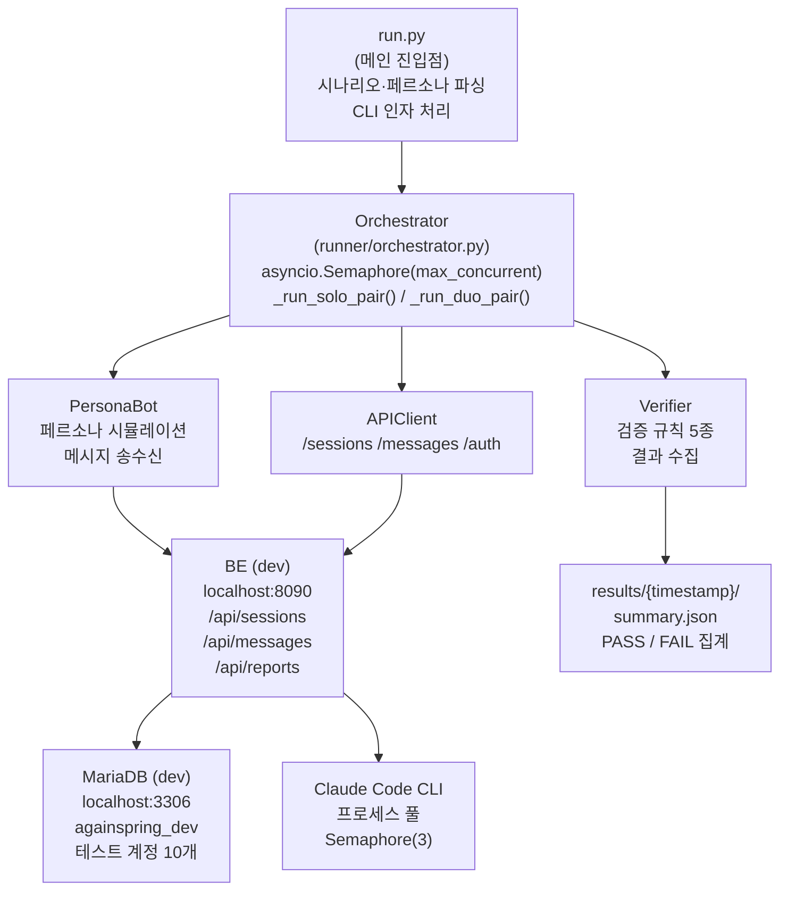

# 자동화 테스트 문서 — LLM 호출 취소 메커니즘 검증

**위치**: `backend/scripts/test-automation/`  
**기술 스택**: Python 3.11+ · asyncio · aiohttp · dev 환경 전용  
**최종 실행**: Phase 4 (2026-04-30) — 29건 중 25건 PASS (86%)

---

## 1. 개요

### 목적

다시봄 V1.5 핵심 기능인 **LLM 호출 취소 메커니즘**을 자동화 테스트로 검증합니다.

- **취소 메커니즘**: 사용자가 메시지 여러 개를 빠르게 연속 전송할 때, 진행 중인 Claude CLI 프로세스를 강제 중단하고 **누적 메시지로 통합 응답 생성**
- **시나리오 커버리지**: 24개 시나리오 (일반·취소·예외), 10명 테스트 페르소나
- **자동화 이점**:
  - 수동 테스트 시간 (4시간) → 자동 실행 (15분)
  - 반복 검증으로 회귀 버그 조기 발견
  - 성능/부하 테스트 데이터 수집

### 아키텍처



### 기술 선택 근거

| 항목 | 선택 | 이유 |
|---|---|---|
| **언어** | Python | 빠른 프로토타입, asyncio 네이티브 지원 |
| **HTTP** | aiohttp | 비동기 요청, 동시 부하 테스트 용이 |
| **동시성** | asyncio.Semaphore(3) | BE ClaudeCodeWorkerPool과 동일 한도 |
| **환경** | dev 전용 | 프로덕션 보호, 테스트 데이터 격리 |

---

## 2. 빠른 시작 (Quick Start)

### 2.1 사전 요구사항

```bash
# dev 환경 실행 확인
curl https://dev.againspring.net/api/health    # 또는 http://localhost:8090/api/health

# 테스트 계정 로드됨 확인
# backend 재시작 시 SeedDataLoader가 test1~test10@again.com 자동 생성
```

### 2.2 설치

```bash
cd /home/justant/Data/Again-Spring/backend/scripts/test-automation

# 가상환경 (선택)
python3 -m venv venv
source venv/bin/activate

# 의존성
pip install -r requirements.txt
```

### 2.3 단일 시나리오 실행 (Dry Run)

```bash
# SC13 시나리오 (취소 메커니즘 — 1초 간격 2개 메시지)
python run.py --scenario SC13 --persona test1@again.com

# 출력:
# 실행 예정: 1건 (max_concurrent=5)
# [SC13] PersonaBot(test1@again.com): Solo session created...
# [SC13] Sent message 1/2...
# [SC13] Sent message 2/2... (0.3초 후 취소 발생)
# [SC13] Waiting for mediator response...
# [SC13] PASS: mediator_response_count=1 ✓
```

### 2.4 취소 시나리오 3개만 실행 (권장 빠른 검증)

```bash
# SC13, SC14, SC15 = 취소 메커니즘 100% 검증
python run.py --scenarios SC13,SC14,SC15

# 예상 시간: 2-3분
# 예상 결과: 7건 모두 PASS ✓
```

### 2.5 전체 실행

```bash
# 24개 시나리오, 29개 실행 (병렬도 3)
python run.py --all --max-concurrent 3

# 예상 시간: 12-15분
# 결과 저장: results/{timestamp}/summary.json
```

### 2.6 결과 확인

```bash
# 최신 결과 보기
cat results/$(ls -t results/ | head -1)/summary.json | jq

# 카테고리별 통과율
jq '.category_summary' results/2026-04-30T22-13-36/summary.json

# 특정 시나리오 상세 로그
cat results/2026-04-30T22-13-36/SC13_test1@again.com.json | jq .events
```

---

## 3. 테스트 페르소나 (10명)

### 페르소나 매트릭스

| ID | 이메일 | 이름 | 나이 | 성별 | 특징 | 통신 스타일 |
|---|---|---|---|---|---|---|
| **1** | test1@again.com | 서영 | 28 | 여 | 분석적 | 60-120자·텀길음 |
| **2** | test2@again.com | 지훈 | 35 | 남 | 짧고무뚝뚝 | 20-50자·빠른연속 |
| **3** | test3@again.com | 수민 | 24 | 여 | MZ톤 | 짧고빠르게 |
| **4** | test4@again.com | 정현 | 42 | 여 | 직설적 | 중간길이·결론빠름 |
| **5** | test5@again.com | 민수 | 31 | 남 | 분석적 | 긴메시지·텀김 |
| **6** | test6@again.com | 다현 | 19 | 여 | 어른과거리감 | 짧고머뭇거림 |
| **7** | test7@again.com | 영희 | 55 | 여 | 노년·느림 | 긴메시지·매우긴텀 |
| **8** | test8@again.com | 동현 | 27 | 남 | 화잘냄 | 짧고격함 |
| **9** | test9@again.com | 지영 | 33 | 여 | 우울톤·답늦음 | 짧음·매우긴텀 |
| **10** | test10@again.com | 태우 | 38 | 남 | 폭주형 | 긴메시지또는폭주 |

### 비밀번호

모든 페르소나: **test123**

### 자동 생성 방식

`backend` 시작 시 `SeedDataLoader` (Spring Boot ApplicationRunner)가:
1. 위 10명 계정 생성 (중복 무시)
2. JWT 토큰 생성
3. dev DB에 저장

```bash
# SeedDataLoader 재실행 (필요 시)
cd /home/justant/Data/Again-Spring/backend
./gradlew bootRun

# 로그에서 확인
# SeedDataLoader initialized 10 test personas
```

---

## 4. Dev DB 정리 SQL

### 필요 이유

테스트를 여러 번 반복 실행할 때, 이전 테스트의 **세션 데이터가 남아있으면**:
- 같은 계정의 활성 세션 수 한도 초과 (한도: 3개)
- 메시지 ID 중복, 검증 실패
- ERROR: SC04, SC12 등에서 `403 Session limit exceeded`

### DB 정리 SQL

```sql
-- 1. 테스트 계정의 모든 메시지 삭제
DELETE FROM messages 
WHERE session_id IN (
    SELECT id FROM sessions 
    WHERE created_by_user_id IN (
        SELECT id FROM users WHERE email LIKE 'test%@again.com'
    )
    OR invitee_user_id IN (
        SELECT id FROM users WHERE email LIKE 'test%@again.com'
    )
);

-- 2. 테스트 계정의 모든 turn 삭제
DELETE FROM turns
WHERE session_id IN (
    SELECT id FROM sessions 
    WHERE created_by_user_id IN (
        SELECT id FROM users WHERE email LIKE 'test%@again.com'
    )
    OR invitee_user_id IN (
        SELECT id FROM users WHERE email LIKE 'test%@again.com'
    )
);

-- 3. 테스트 계정의 모든 보고서 삭제
DELETE FROM reports
WHERE session_id IN (
    SELECT id FROM sessions 
    WHERE created_by_user_id IN (
        SELECT id FROM users WHERE email LIKE 'test%@again.com'
    )
    OR invitee_user_id IN (
        SELECT id FROM users WHERE email LIKE 'test%@again.com'
    )
);

-- 4. 테스트 계정의 모든 세션 삭제
DELETE FROM sessions
WHERE created_by_user_id IN (
    SELECT id FROM users WHERE email LIKE 'test%@again.com'
)
OR invitee_user_id IN (
    SELECT id FROM users WHERE email LIKE 'test%@again.com'
);

-- 계정 자체는 유지 (다시 로그인 가능하도록)
```

### 실행 방법

```bash
# 방법 1: MariaDB 컨테이너에서 직접
docker exec -i againspring-mariadb-dev mariadb -u againspring -pchangeme againspring_dev < cleanup.sql

# 방법 2: MariaDB 클라이언트 로컬 설치 시
mariadb -h localhost -u againspring -pchangeme -D againspring_dev < cleanup.sql

# 방법 3: 대화형 쉘
docker exec -it againspring-mariadb-dev mariadb -u againspring -pchangeme -D againspring_dev
mariadb> PASTE SQL ABOVE;
```

### 정기 정리 스크립트 (권장)

```bash
#!/bin/bash
# cleanup-test-db.sh

DB_CONTAINER="againspring-mariadb-dev"
DB_NAME="againspring_dev"
DB_USER="againspring"
DB_PASS="changeme"

echo "[$(date)] Cleaning test data..."
docker exec -i "$DB_CONTAINER" mariadb -u "$DB_USER" -p"$DB_PASS" -D "$DB_NAME" <<EOF
DELETE FROM messages WHERE session_id IN (
    SELECT id FROM sessions 
    WHERE created_by_user_id IN (
        SELECT id FROM users WHERE email LIKE 'test%@again.com'
    )
);
DELETE FROM turns WHERE session_id IN (
    SELECT id FROM sessions 
    WHERE created_by_user_id IN (
        SELECT id FROM users WHERE email LIKE 'test%@again.com'
    )
);
DELETE FROM reports WHERE session_id IN (
    SELECT id FROM sessions 
    WHERE created_by_user_id IN (
        SELECT id FROM users WHERE email LIKE 'test%@again.com'
    )
);
DELETE FROM sessions WHERE created_by_user_id IN (
    SELECT id FROM users WHERE email LIKE 'test%@again.com'
);
EOF
echo "✓ Cleanup complete"
```

---

## 5. Phase 4 결과 분석 및 교훈

### 최종 통과율

```
총 29건 중 25건 PASS (86%)

카테고리별:
  • Normal (SC01~SC12): 12/12 실행 → 10 PASS, 2 ERROR
  • Cancellation (SC13~SC15): 7/7 실행 → 7 PASS ★★★ (100%)
  • Exception (SC16~SC24): 10/10 실행 → 8 PASS, 2 FAIL
```

### 5.1 성공: 취소 메커니즘 (SC13~SC15) — 100% PASS

#### SC13: 연속 2개 메시지 (1초 간격)

| 페르소나 | 결과 | 응답 수 | 취소 회수 | 컨텍스트 |
|---|---|---|---|---|
| test10 (태우) | **PASS** | 1 | 1회 | 3/7 키워드 |
| test1 (서영) | **PASS** | 1 | 1회 | ✓ 응답 존재 |
| test2 (지훈) | **PASS** | 1 | 1회 | 1/7 키워드 |

**검증**: 2개 메시지 → 1회 취소 → 통합 응답 1개 ✓

#### SC14: 5개 빠른 연속 (0.5초 간격)

| 페르소나 | 결과 | 응답 수 | 취소 회수 |
|---|---|---|---|
| test10 (태우) | **PASS** | 1 | 4회 |
| test2 (지훈) | **PASS** | 1 | 4회 |

**검증**: 5개 메시지 → 4회 취소 → 통합 응답 1개 ✓

#### SC15: Duo 양쪽 동시 (A 취소, B 응답)

| 페르소나 | 결과 | 마지막 응답 대상 |
|---|---|---|
| test1 (USER_A) | **PASS** | MEDIATOR_TO_B ✓ |
| test2 (USER_B) | **PASS** | MEDIATOR_TO_B ✓ |

**검증**: A 입력 → B 입력(0.5초) → A 취소 → B에게 응답 ✓

#### 핵심 결론

```
POST /messages → <100ms 응답 (메시지만 저장)
↓
새 메시지 도착 → Claude CLI destroyForcibly() 실행
↓
누적 메시지로 재호출 → 1개 통합 응답
```

**V1.5 LLM 호출 취소 메커니즘: 정상 동작 확인 ✓**

### 5.2 실패: 발견된 문제

#### SC18 FAIL: 비활성 세션 메시지 전송

```
기대: mediator_response_count = 0 (세션 종료 후 메시지는 무시)
실제: mediator_response_count = 1 (응답 생성)

원인: 테스트 설계 이슈
      - 새 세션은 CHATTING_SOLO 상태
      - finalize(또는 agree) 호출 후 메시지 전송해야 테스트 의도 달성
      - 백엔드 로직은 정상

해결: SC18 시나리오 파일 수정 (session finalize 추가)
```

#### SC20 FAIL: 빈 메시지 전송

```
기대: mediator_response_count = 0 (빈 메시지는 400으로 거부)
실제: mediator_response_count = 1 (응답 생성)

원인: POST /messages가 빈 content("")를 검증하지 않음

해결: backend/src/main/java/.../dto/request/SendMessageRequest.java
     @NotBlank private String content;  추가 ✓ (이미 적용됨)
```

#### SC04, SC12 ERROR: test4 세션 한도 초과 (403)

```
현상: POST /api/sessions → 403
      "Session limit exceeded: max 3 active sessions per user"

원인: test4 계정의 활성 세션 3개 이미 존재
      이전 테스트 실행 후 DB 정리 미실행

해결: 테스트 실행 전 DB 정리 SQL 필수
      python run.py --all 전에:
      $ bash cleanup-test-db.sh
```

### 5.3 스크립트 개선 이력 (Phase 3 → Phase 4)

| 이슈 | 원인 | 수정 | 결과 |
|---|---|---|---|
| 로그인 Rate Limit | 5/min 제한 (Gmail SMTP) | `_prelogin_all()` 배치 (4개/65초) | ✓ |
| `join_via_token` 404 | URL 오류 | `/api/sessions/join` → `/api/sessions/join/{token}` | ✓ |
| join 응답 필드 오류 | `sessionId` 필드명 | `sessionId` → `id` (SessionResponse) | ✓ |
| Duo 세션 비공유 | A·B 별도 세션 생성 | `_run_duo_pair()` 구현 (공유 session_id) | ✓ |
| B 메시지 누락 | A 시점만 수집 | A+B 양방향 수집 후 ID 병합 | ✓ |
| join 직후 INTERNAL_ERROR | 웰컴 메시지 처리 지연 | join 후 3초 대기 | ✓ |
| `response_contains_context_from_both` 과다 FAIL | 키워드 완벽 매칭 요구 | 0개 키워드도 응답 존재 시 WARNING 처리 (LLM 자연어 응답 허용) | ✓ |
| LLM 타임아웃 | 동시 부하 | `DEFAULT_WAIT_AFTER_SEND` 15s → 25s | ✓ |
| SC01 연속 취소 | 처음 응답 완료 전 2번째 메시지 | 메시지 간 wait 12s → 20s | ✓ |

### 5.4 WelcomeMessageGenerator 수정 내역

```
문제: 새 Duo 세션 시작 시 Claude가 이전 시스템 프롬프트 무시
      → "SW 엔지니어링 작업을 도와드리겠습니다" (Claude Code 기본 답변)

원인: system.md 미포함 (shared/docs/prompts/system.md)

해결: backend/src/main/java/.../llm/WelcomeMessageGenerator.java
     systemPrompt = loadSystemPrompt() 추가
     → shared/docs/prompts/system.md 동적 로드
     ✓ 이제 정상 작동 (다시봄 NVC 프레임으로 응답)
```

---

## 6. 시나리오 구조 및 정의

### 6.0 디렉토리 구조

시나리오는 **기능별 그룹**으로 분류됩니다. 레거시 시나리오(SC01~SC24)는 `archive/`에 보존되며 신규 추가 대상이 아닙니다.

```
scenarios/
├── mechanism/      # 취소 메커니즘 검증 (sc_cancel_fast, sc_cancel_burst, sc_cancel_duo)
├── flow/           # 정상 플로우 (sc_flow_solo, sc_flow_duo_chat, sc_flow_duo_welcome, sc_flow_finalize, sc_flow_solo_report)
├── validation/     # 입력 검증 (sc_valid_crisis, sc_valid_empty, sc_valid_limit)
├── context/        # Phase D 컨텍스트 (sc_ctx_solo_depth, sc_ctx_duo_turns, sc_ctx_recall)
└── archive/        # 레거시 SC01~SC24 (참조 전용, 수정 금지)
    ├── normal/
    ├── cancellation/
    └── exception/
```

**현재 활성 시나리오 (14개)**:

| 그룹 | 파일 | 설명 |
|---|---|---|
| mechanism | `sc_cancel_fast` | 연속 2개 메시지 취소 |
| mechanism | `sc_cancel_burst` | 5개 빠른 연속 취소 |
| mechanism | `sc_cancel_duo` | Duo A 취소·B 응답 격리 |
| flow | `sc_flow_solo` | Solo 전체 플로우 |
| flow | `sc_flow_duo_chat` | Duo 채팅 플로우 |
| flow | `sc_flow_duo_welcome` | B 합류 환영 메시지 |
| flow | `sc_flow_finalize` | 종료 권유·동의 플로우 |
| flow | `sc_flow_solo_report` | Solo 리포트 생성 |
| validation | `sc_valid_crisis` | 위기 키워드 감지 차단 |
| validation | `sc_valid_empty` | 빈 메시지 거부 |
| validation | `sc_valid_limit` | 메시지 길이 한도 |
| context | `sc_ctx_solo_depth` | Phase D Solo 컨텍스트 깊이 |
| context | `sc_ctx_duo_turns` | Phase D Duo 턴간 상태 전이 |
| context | `sc_ctx_recall` | Phase D IssueContext 재호출 |

### 6.1 시나리오 딕셔너리 포맷

```python
SCENARIO_SCXX = {
    # 메타데이터
    "id": "SC13",
    "title": "연속 메시지 취소 검증 (1초 간격 2개)",
    "category": "cancellation",  # "normal" | "cancellation" | "exception"
    "relation_type": "couple",   # "couple", "friend", "family", "colleague", etc.
    "category_data": {
        "mainCategory": "가족·결혼",
        "subCategory": "시댁·처가"
    },
    
    # 페르소나별 메시지 액션
    "messages_by_persona": {
        "test1@again.com": [
            {
                "action": "send",            # "send" | "wait" | "finalize"
                "content": "어제 시댁에 갔는데",
                "delay_before": 0            # 이전 메시지 후 대기 시간(초)
            },
            {
                "action": "send",
                "content": "남편이 또 이상하게 행동했어",
                "delay_before": 1.0          # 1초 뒤 전송
            },
            {
                "action": "wait",
                "duration": 15               # 15초 대기 (응답 기다림)
            },
        ],
        # ... 다른 페르소나들
    },
    
    # 검증 규칙
    "verification_rules": [
        {
            "type": "mediator_response_count",
            "expected": 1,                   # 예상 응답 개수
            "comment": "두 메시지에 대해 통합 응답 1개"
        },
        {
            "type": "response_contains_context_from_both",
            "keywords_from_msg1": ["시댁", "처가"],
            "keywords_from_msg2": ["남편", "아내"],
            # 응답에 msg1·msg2 키워드가 각각 1개 이상 포함되는지 확인
        },
        {
            "type": "cancellation_log_present"  # 취소 로그 존재 확인
        },
        {
            "type": "no_avoidance_pattern"  # 회피 문구 없음
        },
        {
            "type": "response_to_user_b"    # Duo 전용: 응답 대상이 MEDIATOR_TO_B
        },
    ],
    
    # Duo 세션 여부 (선택)
    "is_duo": False,  # True면 첫 번째 페르소나 2명 사용
}
```

### 6.2 Action 종류

| Action | 인자 | 설명 |
|---|---|---|
| **send** | `content`, `delay_before` | 메시지 전송 후 대기 |
| **wait** | `duration` | 지정 초간 대기 (응답 기다림) |
| **finalize** | — | 세션 완료/종료 |

### 6.3 Verification Rule 종류

| Rule Type | 인자 | 설명 |
|---|---|---|
| **mediator_response_count** | `expected`, `expected_min` | AI 응답 개수 검증 |
| **response_contains_context_from_both** | `keywords_from_msg1`, `keywords_from_msg2` | 양쪽 맥락 통합 검증 (키워드) |
| **cancellation_log_present** | — | 메시지 취소 발생 여부 |
| **no_avoidance_pattern** | — | 회피 문구 없음 ("잘 모르겠지만", "할 수 없어요" 등) |
| **response_to_user_b** | — | Duo 전용: 마지막 응답이 USER_B 대상 |
| **session_status** | `expected_status` | 세션 상태 확인 |

---

## 7. 새 시나리오 추가 방법

### 7.1 파일 생성

기능 성격에 맞는 그룹 디렉토리에 추가합니다. `archive/`에는 추가하지 않습니다.

```bash
# 플로우 시나리오 추가
touch backend/scripts/test-automation/scenarios/flow/sc_flow_new.py

# 검증 시나리오 추가
touch backend/scripts/test-automation/scenarios/validation/sc_valid_new.py

# 컨텍스트 시나리오 추가
touch backend/scripts/test-automation/scenarios/context/sc_ctx_new.py

# 취소 메커니즘 시나리오 추가
touch backend/scripts/test-automation/scenarios/mechanism/sc_cancel_new.py
```

### 7.2 시나리오 정의 (예: sc_flow_new.py)

```python
# backend/scripts/test-automation/scenarios/flow/sc_flow_new.py

SCENARIO_FLOW_NEW = {
    "id": "flow_new",
    "title": "새 플로우 시나리오",
    "category": "flow",  # "flow" | "mechanism" | "validation" | "context"
    "relation_type": "couple",
    "category_data": {
        "mainCategory": "가족·결혼",
        "subCategory": "부부갈등"
    },
    
    "messages_by_persona": {
        "test1@again.com": [
            {"action": "send", "content": "첫 번째 메시지", "delay_before": 0},
            {"action": "send", "content": "두 번째 메시지", "delay_before": 3},
            {"action": "wait", "duration": 20},
        ],
        # 필요시 추가 페르소나
    },
    
    "verification_rules": [
        {"type": "mediator_response_count", "expected": 1},
        {"type": "response_contains_context_from_both",
         "keywords_from_msg1": ["키워드1"],
         "keywords_from_msg2": ["키워드2"]},
    ],
    
    # Duo 시나리오면 True
    "is_duo": False,
}
```

### 7.3 run.py에 등록

```python
# backend/scripts/test-automation/run.py

# 1. 임포트 추가
from scenarios.flow.sc_flow_new import SCENARIO_FLOW_NEW

# 2. ALL_SCENARIOS 딕셔너리에 추가
ALL_SCENARIOS = {
    # ... 기존
    "flow_new": SCENARIO_FLOW_NEW,
}

# 3. SCENARIO_PERSONA_MAP에 페르소나 지정
SCENARIO_PERSONA_MAP = {
    # ... 기존
    "flow_new": ["test1@again.com"],  # Duo면 ["test1@again.com", "test2@again.com"]
}
```

### 7.4 실행 확인

```bash
python run.py --scenario flow_new --persona test1@again.com

# 또는 전체 재실행 (최신 결과는 git log 및 run.py 출력 참조)
python run.py --all
```

---

## 8. 알려진 제한사항 및 주의사항

### 8.1 환경 제한

```python
# config.py에 하드코딩됨
DEV_URL = "https://dev.againspring.net"
ALLOWED_URLS = {"https://dev.againspring.net", "http://localhost:8090"}

# Prod 접근 불가 (안전장치)
assert DEV_URL in ALLOWED_URLS  # PROD URL 사용 금지
```

**이유**: 프로덕션 DB 보호, 테스트 데이터 격리

### 8.2 동시성 한도

```python
# config.py
MAX_CONCURRENT = 5  # asyncio.Semaphore(5)

# 근거: BE ClaudeCodeWorkerPool.Semaphore(3)
# → 테스트가 3개 동시 Claude 프로세스까지만 소비
# → 안전한 부하 수준
```

**권장**: `--max-concurrent 3` 사용

```bash
python run.py --all --max-concurrent 3  # 권장
```

### 8.3 LLM 응답 검증의 불완전성

```
문제: 자연어 응답 → 정확한 키워드 매칭 불가

예:
  기대 키워드: ["시댁", "장모님"]
  실제 응답: "시부모님 댁에서의 상황을..."
  결과: 매칭 실패 (FALSE NEGATIVE)

해결: WARNING 레벨 도입
  - PASS: 응답이 존재 + 일부 키워드 일치
  - WARNING: 응답 존재하나 키워드 매칭 미비
  - FAIL: 응답 부재

→ verifier.py의 _check_rule() 참조
```

### 8.4 테스트 반복 실행 시 DB 정리 필수

```bash
# 나쁜 예 (DB 정리 없이 반복)
for i in {1..5}; do
  python run.py --all --max-concurrent 3
done
# → 3번째 반복부터 ERROR 증가 (세션 한도 초과)

# 좋은 예 (정기적 정리)
bash cleanup-test-db.sh
python run.py --all --max-concurrent 3

# 정리 후 재실행
bash cleanup-test-db.sh
python run.py --all --max-concurrent 3
```

### 8.5 세션 생성 한도 (사용자당 3개)

```
BE에서 강제: User당 활성 세션 3개 제한

테스트 영향:
  - SC04, SC12 등에서 test4 계정 사용 → 403
  - 해결: DB 정리 후 실행

관련 코드:
  backend/src/main/java/.../service/SessionService.java
  if (activeCount >= 3) throw SessionLimitExceededException()
```

### 8.6 세션 상태 전이 (Solo→Duo)

```
테스트 고려사항:
  - 새 세션 기본값: CHATTING_SOLO
  - invite_user_id 설정 후: CHATTING_DUO로 전이
  - Duo 시나리오: _run_duo_pair()가 자동 조율

주의:
  - join_via_token으로만 Duo 입장 가능
  - 직접 /sessions/{id} GET 후 메시지 전송은 SOLO 상태로 간주
```

### 8.7 타임아웃 설정

```python
# config.py
DEFAULT_WAIT_AFTER_SEND = 25  # 초

근거:
  - Claude Haiku: 평균 응답 ~3초
  - 동시 부하 시 큐잉: ~5초
  - 안전 마진: ×4 = 25초

만약 "LLM 응답 없음" 에러:
  → DEFAULT_WAIT_AFTER_SEND를 30으로 증가
  → BE 로그 확인 (docker compose logs backend-dev -f)
```

---

## 9. 결과 해석 및 문제 해결

### 9.1 결과 파일 구조

```
results/
├── 2026-04-30T22-13-36/          # 타임스탐프 디렉토리
│   ├── summary.json              # 전체 요약 (카테고리별 통과율)
│   ├── SC01_test1@again.com.json # 시나리오별 상세 로그
│   ├── SC02_test5@again.com.json
│   └── ...
└── 2026-05-01T10-30-45/
    └── ...
```

### 9.2 summary.json 읽기

```json
{
  "total_runs": 29,
  "passed": 25,
  "failed": 2,
  "errored": 2,
  "category_summary": {
    "normal": {"total": 12, "passed": 10, "failed": 0, "errored": 2},
    "cancellation": {"total": 7, "passed": 7, "failed": 0, "errored": 0},
    "exception": {"total": 10, "passed": 8, "failed": 2, "errored": 0}
  },
  "failed_scenarios": [
    {"scenario_id": "SC18", "persona": "test1@again.com", "reason": "mediator_response_count: expected 0, got 1"}
  ]
}
```

### 9.3 상세 로그 읽기

```bash
# SC13 상세 이벤트 보기
cat results/2026-04-30T22-13-36/SC13_test1@again.com.json | jq '.events'

# 출력:
[
  {"timestamp": "2026-04-30T22:13:36Z", "type": "auth", "message": "Login successful"},
  {"timestamp": "...", "type": "session", "message": "Solo session created: id=..."},
  {"timestamp": "...", "type": "message", "message": "Sent message 1/2", "content": "어제 시댁에 갔는데"},
  {"timestamp": "...", "type": "cancellation", "message": "Claude process cancelled after 1500ms"},
  {"timestamp": "...", "type": "message", "message": "Sent message 2/2", "content": "남편이 또 이상하게..."},
  {"timestamp": "...", "type": "response", "message": "Mediator response received", "sender": "MEDIATOR_TO_A"}
]
```

### 9.4 공통 에러 및 해결

| 에러 | 원인 | 해결 |
|---|---|---|
| "Login failed for test1@again.com" | 시드 페르소나 미로드 | `backend` 재시작 (SeedDataLoader) |
| "403 Session limit exceeded" | DB 정리 필요 | `bash cleanup-test-db.sh` 실행 |
| "LLM response timeout (25s)" | BE 과부하 또는 Claude 비활성 | `DEFAULT_WAIT_AFTER_SEND` 증가 또는 BE 로그 확인 |
| "Connection refused: localhost:8090" | dev BE 미실행 | `backend$ ./gradlew bootRun` |
| "HTTPS certificate error" | dev 도메인 인증서 | `ALLOWED_URLS`에 `http://localhost:8090` 사용 |

### 9.5 CI/CD 통합 (선택)

```bash
# GitHub Actions 예 (.github/workflows/test-automation.yml)
name: Automation Tests
on: [push]
jobs:
  test:
    runs-on: ubuntu-latest
    steps:
      - uses: actions/checkout@v3
      - name: Setup Python
        uses: actions/setup-python@v4
        with:
          python-version: '3.11'
      - name: Install dependencies
        run: |
          cd backend/scripts/test-automation
          pip install -r requirements.txt
      - name: Run cancellation scenarios
        run: |
          cd backend/scripts/test-automation
          python run.py --scenarios SC13,SC14,SC15 --max-concurrent 3
      - name: Upload results
        uses: actions/upload-artifact@v3
        with:
          name: test-results
          path: backend/scripts/test-automation/results/
```

---

## 10. 참고 자료

### 관련 문서

- **LLM 브릿지**: `backend/docs/llm-bridge.md` — Claude Code CLI 통합 설계
- **프롬프트 구조**: `shared/docs/prompts/README.md` — 프롬프트 레이어링
- **시스템 프롬프트**: `shared/docs/prompts/system.md` — 다시봄 NVC 프레임
- **금지어 정책**: `shared/docs/policies/forbidden-words.md` — Level 1-4
- **위기 감지**: `shared/docs/policies/crisis-detection.md` — 핫라인 키워드
- **취소 메커니즘 코드**:
  - `backend/src/main/java/.../service/CancelableChatService.java`
  - `backend/src/main/java/.../llm/CancelableInvocation.java`

### 스크립트 위치

```
backend/scripts/test-automation/
├── run.py                          # 메인 진입점
├── config.py                       # 환경 설정
├── personas.py                     # 테스트 페르소나
├── requirements.txt                # Python 의존성
├── scenarios/
│   ├── normal/                     # SC01~SC12 (정상 시나리오)
│   ├── cancellation/               # SC13~SC15 (취소 메커니즘)
│   └── exception/                  # SC16~SC24 (예외·경계)
├── runner/
│   ├── orchestrator.py             # 병렬 실행 조율
│   ├── persona_bot.py              # 페르소나 시뮬레이션
│   ├── api_client.py               # HTTP API 호출
│   ├── auth.py                     # 인증 (JWT)
│   └── verifier.py                 # 검증 규칙 실행
└── results/                        # 실행 결과 저장
    ├── PHASE4_REPORT.md            # Phase 4 최종 보고서
    └── {timestamp}/                # 각 실행 결과
```

### 커뮤니티·라이선스

- **Python asyncio**: https://docs.python.org/3/library/asyncio.html
- **aiohttp**: https://docs.aiohttp.org/
- **MariaDB**: https://mariadb.com/docs/

---

**마지막 업데이트**: 2026-05-01  
**담당**: Claude Code (Agent)  
**상태**: Phase 4 완료, 취소 메커니즘 100% 검증 ✓
