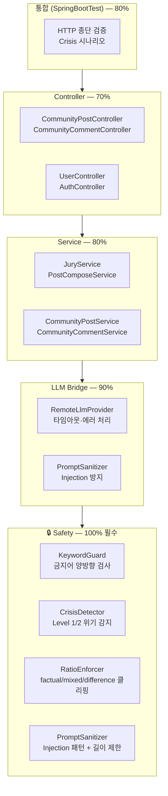

# 테스트 정책

## 실행

```bash
cd backend
./gradlew test                        # 전체
./gradlew test --tests "*Sanitizer*"  # 패턴
./gradlew test --tests com.againspring.safety.KeywordGuardTest
./gradlew test --rerun-tasks          # 캐시 무시
```

리포트: `backend/build/reports/tests/test/index.html`

## 프로파일

테스트는 `application-test.yml`이 자동 활성:

- DB: H2 in-memory (`jdbc:h2:mem:test;MODE=MariaDB;...`)
- Flyway: disabled (Hibernate ddl-auto=create-drop)
- LLM: `MockLLMProvider` (실제 claude CLI 미호출)
- 스케줄러: 비활성

## 도구

| 도구 | 용도 |
|---|---|
| JUnit 5 | 단위/통합 테스트 |
| Mockito | mock |
| AssertJ | fluent assertion |
| Testcontainers 1.20.4 | 실 DB 통합 테스트 (선택) |
| Spring Boot Test | `@SpringBootTest`, `@WebMvcTest`, `@DataJpaTest` |
| MockMvc | Controller 테스트 |

## 커버리지 목표



| 계층 | 목표 |
|---|---|
| Service (비즈니스 로직) | 80% |
| Controller (라우팅 + 입력 검증) | 70% |
| LLM Bridge | 90% (에러 처리 중점) |
| Safety (KeywordGuard, CrisisDetector, RatioEnforcer, PromptSanitizer) | **100%** |
| API 통합 (Controller→Service→Repo) | 80% |

JaCoCo로 측정 (현재 build.gradle.kts에 미포함 — 필요 시 추가).

## 테스트 분류

### 단위 테스트 (`@ExtendWith(MockitoExtension.class)`)

가장 빠름, mock 의존성. Service 로직 검증.

```java
@ExtendWith(MockitoExtension.class)
class StyleCalculatorTest {
    @Test
    void givenAllFives_returnsWaveStyle() { ... }
}
```

### Controller 슬라이스 (`@WebMvcTest`)

Controller만 띄우고 Service mock. MockMvc로 HTTP 검증.

```java
@WebMvcTest(CommunityPostController.class)
class CommunityPostControllerTest {
    @MockBean CommunityPostService communityPostService;
    @Autowired MockMvc mockMvc;
}
```

### Repository 슬라이스 (`@DataJpaTest`)

JPA만 띄우고 H2로 실제 쿼리 검증.

### 통합 테스트 (`@SpringBootTest`)

전체 컨텍스트 + H2. 보호 정책 종단 검증에 사용.

```java
@SpringBootTest
@AutoConfigureMockMvc
@ActiveProfiles("test")
class CrisisDetectionIntegrationTest { ... }
```

### 실 LLM 통합 (선택, 격리)

```java
@EnabledIfEnvironmentVariable(named = "CLAUDE_CODE_AVAILABLE", matches = "true")
class ClaudeCodeBridgeIntegrationTest {
    @Autowired LLMProvider llmProvider;
    @Test void realCall() { ... }
}
```

CI에서는 환경변수 없으면 자동 skip.

## 보안 정책 100% 커버리지 책임

다음 클래스는 변경 시 반드시 테스트:

- `safety/KeywordGuard` — 모든 단어 카테고리 + 응답 후처리
- `safety/CrisisDetector` — Level 1 4 카테고리 + Level 2
- `safety/RatioEnforcer` — factual/difference/mixed 클리핑 + 엣지 케이스
- `llm/PromptSanitizer` — INJECTION_PATTERNS 전부 + 길이 제한
- `security/JwtService` — 토큰 발급/검증/폐기 확인
- `security/JwtAuthFilter` — 인증 헤더 누락/유효/만료/폐기 시나리오

## 트러블슈팅

| 증상 | 조치 |
|---|---|
| `H2 dialect not found` | `application-test.yml`에 `MODE=MariaDB` 명시 확인 |
| Flyway 실행돼서 H2 깨짐 | test 프로파일에 `spring.flyway.enabled: false` 확인 |
| LLM 호출 실 발생 | test 프로파일에 `llm.provider: mock` 확인 |
| 스케줄러가 테스트 중 실행 | `@SpringBootTest`에 `@MockBean RetentionScheduler` 또는 별도 `@Profile("!test")` |
| 임의 시간 의존 테스트 깨짐 | `Clock` 빈 주입 후 mock — `ClockConfig.java` 참조 |
