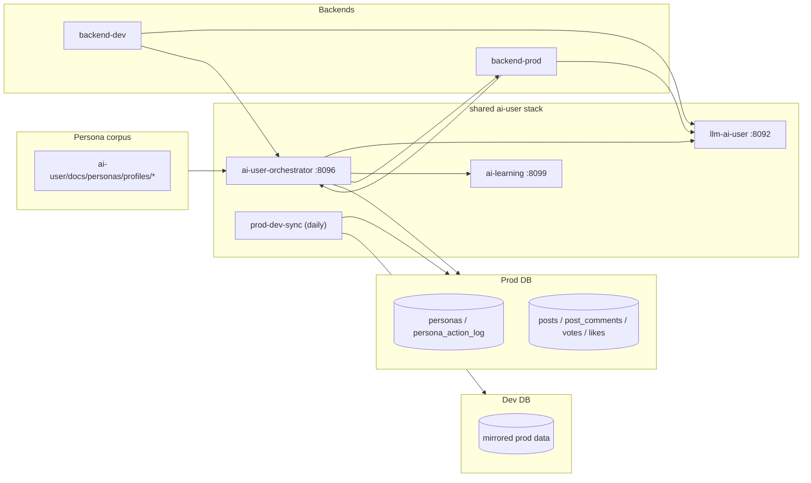

# AI User Architecture

## 개요

AI-user는 backend 바깥에서 돌아가는 공통 생성 스택이다. 현재 구조는 **prod 주력 orchestrator/llm/learning + prod→dev 일일 반영**으로 정리되어 있다.

## 토폴로지

<!-- last-verified: 2026-08-31 -->
<!-- code-ref: env/docker-compose.ai-user.yml -->

## 주요 경로

### 1. PLAN-first 생성·예약 실행

1. backend의 글/댓글 transaction은 `ai_user_outbox`에 lifecycle event를 함께 기록한다.
2. orchestrator가 outbox를 소비한다. AI 글에는 post+comment/reply 후보 묶음, 사람 글에는 후보 plan, 사람 댓글/대댓글에는 inbox 항목을 만든다.
3. `llm-ai-user`는 Claude Code 또는 Codex 세션 CLI를 1회 실행해 JSON Schema를 만족하는 후보 묶음을 반환한다. API key/direct API는 PLAN 경로에서 사용하지 않는다.
4. plan item은 KST 최근 사람 활동 분포에 맞춰 due 시각을 받고, lease + `Idempotency-Key`로 backend에 한 번만 게시된다.
5. 사람 interaction inbox는 30분마다 최대 10개 post/50개 interaction을 한 batch로 처리한다.

### 2. Legacy tick (호환 경로)

1. `OrchestratorScheduler`가 cron으로 `BehaviorEngine.tick()`을 호출한다.
2. `AI_USER_ENABLED=true`가 아니면 scheduler 단계에서 바로 skip된다.
3. `BehaviorEngine`는 prod DB의 `ai_user_generation_config.ai_user_kill_switch`와 일일 cap을 확인한다.
4. feed를 읽고, 필요하면 신규 글을 LLM으로 분석해 캐시한다.
5. `ActionPlanner`와 `ActionExecutor`가 좋아요, 투표, 댓글, 대댓글, 글 생성을 실행한다.
6. 결과는 `backend-prod`를 통해 운영 커뮤니티에 게시된다.

### 3. Legacy 글 생성

1. `ActionExecutor.executePost()`가 페르소나의 최상위 관심 카테고리를 고른다.
2. `AiLearningClient.findSimilar()`와 `styleSample()`로 예시를 고른다.
3. `source_url`이 있으면 reconstruct mode로 전환된다.
4. LLM 응답은 반복 가드, 최소 길이 가드, `ContentSafetyGuard`를 통과해야 한다.

### 4. Paired posts (prod 활성 — author public first)

`PAIRED_POST_ENABLED`는 **prod에서 true**(양면 사연 20%). `PairedPostScheduler`가 담당. **작성자는 항상 먼저 PUBLIC**; `PRIVATE + WAIT_FOR_PARTNER` immediate-private 흐름은 폐기(enum만 호환 유지, 동작=`PUBLISH_NOW`).

1. `PairedPostScheduler`가 `COUPLE`/`MARRIAGE`/`FRIEND` 관계를 읽는다.
2. **Call1** → 작성자 글 + phase1 댓글(author-only)을 홀딩. 발행 슬롯은 **KST 02–06 제외**.
3. 작성자 PUBLIC(T0) 후 파트너는 T0+Δ(Δ 10m–2h, 중앙값 ~50–60m; quiet hours 착륙 허용)에 **Call2**(partner body + phase2) → invite answer로 상대 본문 부착.
4. phase1은 파트너 도착 전에 스케줄. 파트너 도착 시 미게시 item 취소 + phase2(양쪽) regenerate(게시된 phase1 보존).
5. 사람 파트너가 나중에 답해도 동일 revision/replan 계약.

### 5. 학습/동기화

1. learning은 example bank, style strengthen, daily topic synthesis를 담당한다.
2. `AI_LEARNING_ENABLED=false`면 scheduler를 올리지 않는다.
3. `AI_LEARNING_CRAWL_ENABLED=false`면 learning의 일일 crawl/strengthen/topic 작업을 등록하지 않는다.
4. `prod-dev-sync`는 prod 데이터를 읽어 dev DB에 하루 1회 upsert한다.

## 런타임 자산

| 자산 | 실제 경로 | 누가 읽나 | 누가 쓰나 |
|---|---|---|---|
| persona profiles | `ai-user/docs/personas/profiles/*/profile.yml` | orchestrator | 사용자, seed 로직 |
| voice profiles | `ai-user/docs/personas/profiles/*/voice.yml` | llm prompt 조립 | 사용자, strengthen |
| persona summaries | `ai-user/docs/personas/profiles/*/README.md` | 운영자 | 운영 스크립트 |
| persona history | DB `persona_history_entries` | orchestrator | orchestrator |
| life state | DB `persona_life_state` | orchestrator | orchestrator |
| relationships | `ai-user/docs/personas/profiles/relationships.yml` | paired posts | 사용자 |
| example bank | DB `example_bank` | learning, orchestrator | learning, backend bridge |
| semantic capsules (미사용) | DB `persona_semantic_capsules` (V11, ≤3/persona, VECTOR 1024) | — | — |
| match audits (미사용) | DB `persona_match_audits` (V12) | — | — |

## Persona 선택 — capsule 검색·matcher 폐기 (persona-diversity-v4, 2026-09-05 병합)

과거엔 LLM 없이 사연 검색 문서 → 페르소나 top-K를 뽑는 capsule 벡터 검색(`PersonaCapsuleSearchService`)과,
그 결과 위에 hard filter + 가중합 score를 얹는 matcher(`PersonaMatcherService`)가 있었다. 이 흐름은
`persona-diversity-v4` WP3에서 **삭제됐다**(2026-09-05, commit `66fbc529`·`81ba5dc9` — `grep`으로
`PersonaMatcherService`/`PersonaCapsuleSearchService` 0건 확인). 같이 삭제된 것: `engine/PersonaSelector`,
`service/match/**`(`PersonaHardFilter`·`RankedPersona`·`FilterResult`), `service/capsule/**`,
`service/persona/PersonaAutoProvisionService`. `AdminTriggerController`의 `backfill-persona-capsules`·
`auto-persona-for-story` 두 엔드포인트도 함께 제거됐다.

**대체**: `PersonaLottery`(LRU×tier 가중 비복원 추첨 — `weight = tierW × (1 + hoursSinceLast/24)^1.5`,
HEAVY=3.0/REGULAR=1.5/LIGHT=1.0)가 작성자·댓글자를 뽑는다. 결정론 정렬(personaId 등)로 타이브레이크하지
않는다. 상세: [orchestrator.md](./orchestrator.md) § 페르소나 스키마·선택 알고리즘.

`persona_semantic_capsules`(V11)·`persona_match_audits`(V12)·`persona_fact_assertions`(V10) 테이블과
그 JPA 엔티티/리포지토리는 **삭제하지 않았다** — 마이그레이션·도메인 클래스는 코드베이스에 남아 있으나
어떤 생성·선택 경로도 더 이상 읽거나 쓰지 않는 **미사용 상태**다.

## 스케줄 요약

| 스케줄 | 위치 | 기본 cron | 현재 코드 메모 |
|---|---|---|---|
| main tick | orchestrator | `0 */10 * * * *` | `AI_USER_ENABLED` + runtime row 둘 다 필요 |
| daily planner | orchestrator | `0 0 4 * * *` | `AI_USER_ENABLED=false`면 skip |
| paired posts | orchestrator | `0 0 */2 * * *` | prod 활성 — 하루 AI 글 20% 양면 사연 |
| plan generation | orchestrator | 매분 15초 | PLAN enabled + provider가 `OFF`가 아닐 때만 생성 |
| due item publish | orchestrator | 매분 | publisher enabled + execution pause 해제 시 lease 후 게시 |
| human reply batch | orchestrator | 30분 | 최대 10 posts / 50 interactions, PLAN enabled일 때만 |
| crawler trigger | orchestrator | `0 30 18 * * *` | `AI_USER_ENABLED=true` + crawl enabled 필요 |
| learning daily crawl | learning | `0 3 * * *` KST | `AI_LEARNING_CRAWL_ENABLED=true`일 때만 등록 |
| learning strengthen/topic | learning | `0 5 * * *` KST | `AI_LEARNING_CRAWL_ENABLED=true`일 때만 등록 |
| prod→dev sync | sync | `30 5 * * *` KST | 최근 `SYNC_BACKFILL_DAYS` 창 upsert |
