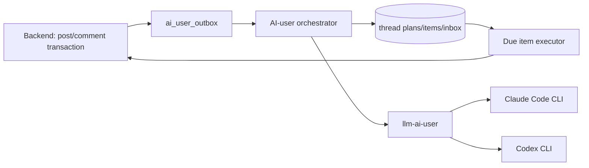

# AI User Thread Planning

## 목적과 적용 범위

`PLAN` 모드는 AI-user의 글·댓글·대댓글을 **생성 시점**과 **게시 시점**으로 분리한다. 한 게시글에 댓글이 30개라는 이유만으로 31회 LLM을 호출하지 않는다. 새 AI 게시글은 기본으로 **4~6 persona micro-batch**로 본문+댓글 후보를 만들되, 댓글 페르소나는 matcher 상위 **READY 하한+1슬라이스**만 넣고 (`ready-min-items` 기본 6이면 약 11명), 후속 `HUMAN_POST`는 아이템이 그 하한에 미달할 때만 돈다. `ai-user.thread-plan.micro-batch-enabled`가 꺼지면 예전 mega-call이다. 사람 게시글은 저장 직후 비동기 한 번의 요청으로 후보 풀을 만든다. 실제 게시, 좋아요, 조회수, 투표는 데이터베이스에 저장된 계획을 따라 실행하며 추가 LLM을 쓰지 않는다.

이 문서는 PLAN 모드의 운영 SSOT다. legacy tick, paired-post, direct API, post analysis 및 self-critique는 전환 완료 전 호환 경로일 수 있으나 신규 PLAN 작업의 의존성이 아니다.

> **현재 상태 (2026-07-31)**: `posts.id`(VARCHAR)를 `Long`으로 파싱하려는 구조적 버그
> (2026-07-30 발견, `ThreadPlanGenerationService.planRequest` 등)를 수정 완료했다
> (comment/reply ID는 실제 BIGINT라 그대로 둠 — postId만 String 문제였다). 새
> `bundleTimeoutMs`는 `/admin/ai-user` → `ai_user_generation_config.bundle_timeout_ms`(기본 600초)가 SSOT다. 저장 즉시 반영.
> dev 검증(`ai-user-orchestrator-dev`, e2e-realbe 158 passed) 후 **prod에도
> 적용 완료** — `scheduler_mode='PLAN'`으로 운영 중이며, 새 글 생성 직후 댓글이
> 한꺼번에 몰리지 않고 예약 스케줄에 따라 분산 게시됨을 확인했다.
>
> **단, `AiPostBundleService.generateAndPublish()` 자체는 생성 즉시 발행이다** —
> 글(post) 수준에서는 "새벽에 만들면 새벽에 올라옴" 문제가 여전히 남아 있었다.
> 2026-07-31에 `generateAndHold()` + `ai_scheduled_posts` + `ScheduledPostPublisher`를
> 추가해 글 발행 자체도 생성과 분리했다. 새벽 배치는 이제 `generateAndHold`만
> 쓴다. 홀딩 시 후보 item에 `scheduledAt`을 심고, `persistResponse`는 저장된
> 시각을 우선한다(관리자 예약 홀딩 편집용). 상세: `docs/ai-user/operations.md` §8.
> Hold 직전 맞춤법은 `SoftProofread`: 오탈자 휴리스틱이 있을 때만 LLM 교정, 실패 시 원문 유지. 솔로 글당 LLM 횟수: [llm-call-budget.md](../70-policy/llm-call-budget.md).
>
> **FAMILY 광장 라우팅 (2026-08-22~)**: prod corpus에 가족 갈등 사연이 실제로 부족해 환경변수 `AI_USER_FAMILY_PLAZA_ENABLED`(기본 false)로 꺼져 있다. 꺼지면 페르소나의 최상위 interest가 FAMILY여도 OTHER로 재배치된다. 사용자 대면(검색·카테고리·라벨)은 변화 없음. 코퍼스가 늘어나면 환경변수 하나로 복구.

## persona-diversity-v4 — 소스 골격·카테고리 비율·캐스트 추첨 (WP1~WP4 병합 완료, 2026-09-05)

상세 계약: `docs/_active/persona-diversity-v4.md`. WP1~WP4는 commit `81ba5dc9`에서 병합됐고,
병합 후 감사에서 나온 결함(계약 위반 3건·미배선 3건·데이터 무결성 2건·게이트 집계 2건)도
모두 수정됐다(§6 defect 목록은 `docs/_active/persona-diversity-v4.md` §6 참고). 아래는
현재 코드 기준 실제 클래스명·경로다.

- **소스 골격 추출**: claim source(크롤 원문)를 그대로 프롬프트에 넣지 않고, `llm-ai-user`
  `POST /v2/extract-skeleton`(Haiku, `SkeletonController`/`SkeletonExtractionService`)이 먼저
  `category`·`author_role`·`counterpart_role`·`relationship`·`incident`·`sequence`(3~5 사건
  단위)·`stakes`·`author_claim`·`counterpart_claim`·`emotion`·`gray_zone`·`b_side_viable`로
  일반화한다. 고유명사·지명·금액·날짜는 일반화하고 원문 문장을 그대로 담지 않는다. 추출
  실패(파싱 실패·필수 키 누락)는 HTTP 400이 아니라 200 + `ok:false`로 응답해 orchestrator가
  재시도/스킵을 판단한다 — 원문 폴백은 어떤 경로에서도 하지 않는다(추출 실패 시 그 글 생성
  자체를 건너뜀). solo(`PlanSourceStoryResolver`)·paired(`PairedPostScheduler`)·레거시
  `/generate/post`(`ActionExecutor`) 세 경로 모두 골격만 프롬프트에 싣는다.
  `SourceOverlapGuard`(12-gram·겹침 0.20 초과 시 거부)가 solo(`AiPostBundleService`)·
  paired(`PairedPostScheduler`) 게시 직전 재구성 결과를 원문과 대조한다. 레거시
  `/generate/post` 경로에는 이 겹침 가드가 배선돼 있지 않다 — 골격만 프롬프트에 실린다는
  방어는 있지만 게시 직전 대조는 solo·paired 두 경로만 커버한다.
- **카테고리 비율 + 시점 제한**(기존 `romanticShare` 대체, `service/threadplan/CategoryMixPlanner`):

  | 카테고리 | 비율 | 작성자(A) 하드 필터 | B(상대방) 시점 |
  |---|---|---|---|
  | WORK | 35% | 전원 | 금지 |
  | COUPLE | 25% | `marital != MARRIED` | 허용 |
  | FRIEND | 15% | 전원 | 허용 |
  | FAMILY | 15% | 전원(시부모·처가는 MARRIED만) | 금지 |
  | MARRIED | 10% | `marital == MARRIED` | 허용 |

  양면(paired) 글은 B 허용 카테고리에서만 생성한다.
- **작성자·댓글자 캐스트 추첨** (`service/persona/PersonaLottery`): 하드 필터(위 표 + `active=1`
  + 자기 글 댓글 금지) 통과자 중 `weight = tierW × (1 + hoursSinceLast/24)^1.5`(HEAVY 3.0 /
  REGULAR 1.5 / LIGHT 1.0, `hoursSinceLast`는 `last_post_at`/`last_comment_at` 기준, NULL이면
  720)로 가중 비복원 추첨한다. `personaId` 기준 결정론 정렬은 금지 — 매 호출 회전이 계약이다.

## 구성과 경계

<!-- last-verified: 2026-08-31 -->
<!-- code-ref: ai-user/orchestrator -->


- Backend는 게시글·댓글의 변경과 outbox event를 **같은 트랜잭션**에 기록한다. Spring in-process event만으로 외부 orchestrator 전달을 보장하지 않는다.
- `ai-user-orchestrator` (prod)와 `ai-user-orchestrator-dev` (dev 전용 신설)가 각각의 backend/DB에서 outbox를 소비해 plan/job/inbox를 만들고, due item을 lease해 backend API로 게시한다. 두 인스턴스는 공유 `llm-ai-user` 워커 컨테이너를 사용한다.
- `llm-ai-user`는 하나의 컨테이너다. Claude와 Codex CLI 바이너리를 함께 담지만 요청이 선택한 CLI 프로세스만 실행하고 매 요청 후 종료한다. 인증 디렉터리는 지속하되 대화 컨텍스트는 요청마다 격리한다.
- 사용자 원문·완성 prompt·LLM 원문은 일반 로그나 job 상세에 저장하지 않는다. 식별자, 길이, hash, failure code, latency만 운영 진단 기본값이다.

## workload별 LLM 계약

| workload | 입력 | 결과 | Claude | Codex |
|---|---|---|---|---|
| `AI_POST_BUNDLE` | topic/RAG, post persona, 참여 persona(마이크로배치 시 슬라이스), 후보 수 | post + 댓글/대댓글 후보 | Sonnet | 5.6 Terra alias |
| `HUMAN_POST_PLAN` | 이미 저장된 사람 글, persona pool | 댓글/대댓글 후보 | Haiku | 5.6 Luna alias |
| `HUMAN_REPLY_BATCH` | 최대 10 post 또는 50 human interaction | 입력 comment ID별 1:1 AI reply | Haiku | 5.6 Luna alias |

실제 CLI model identifier는 `AI_POST_{CLAUDE,CODEX}_MODEL`, `AI_INTERACTION_{CLAUDE,CODEX}_MODEL`로 주입한다. 기본 Codex 값은 검증된 `gpt-5.6-terra`/`gpt-5.6-luna`이며, 모델 alias 변경에 대비해 환경변수로만 바꾼다.

각 job은 provider/model을 생성 시점에 snapshot한다. provider는 `CLAUDE`, `CODEX`, `OFF` 중 workload별로 고르며 `OFF`는 **새 job 생성만** 막는다. 같은 provider/model로 최대 한 번 재시도하고, 두 번째 실패는 `FAILED`이며 반대 provider 자동 전환은 금지한다. 관리자만 명시적으로 재시도할 수 있다.

## 계획과 후보 풀

기본 후보 풀은 최상위 댓글 14개와 대댓글 10개, 총 24개이며 운영 범위는 8~30개다. 그러나 dev 검증 결과, 기본 24개는 구조화 생성 시 LLM 응답이 5~10분 이상 지연되는 현상이 관찰되었다. 타임아웃 설정(bundleTimeoutMs)을 240초로 확대했으나 응답 시간 개선을 위해 **prod 전환 시 `candidate_pool_size=16`(최상위 14개 + 대댓글 2개)으로 설정할 것을 권고**한다. 후보 전체가 실제 게시되는 것은 아니다. 노출·사람 반응·시간대에 따라 통상 6~20개만 활성화한다.

**Micro-batch (WP4 / 기본 ON)**: 상세 호출 횟수는 [llm-call-budget.md](../70-policy/llm-call-budget.md) §1.

`AiPostBundleService`는 matcher로 정렬된 comment cast를 **전체 활성 페르소나(~150)가 아니라** `capCommentersForMicroBatch`로 자른다. 예산은 `max(microBatchSize, ready-min-items) + microBatchSize`(기본 5·6 → **11명**). 그다음 `microBatchSize`(clamp 4..6)로 슬라이스한다.

```
b0  AI_POST     author + 첫 슬라이스 (항상)
b1+ HUMAN_POST  합친 items < ready-min-items(기본 6) 이고 remaining(pool) > 0 일 때만
                빈 응답이면 break
```

item ref는 `b{n}_…`로 합친 뒤 `candidate_pool_size`로 캡한다. 따라서 후보 풀 목표 16을 채우려고 HUMAN_POST를 반복하지 않는다. `micro-batch-enabled=false`면 mega-call 1회(`planPersonaCastMax` 상한, 기본 40).

Hold 직전 맞춤법: `SoftProofread` — 오탈자 휴리스틱이 있을 때만 `/generate/proofread`. 줄 수 변경·타임아웃은 원문 유지.

검증 순서:

1. Claude `--json-schema`와 Codex `--output-schema`는 동일한 classpath JSON Schema를 사용한다. 이후 허용 persona ID, 길이, **item 단위 한국어/거절문**, 안전/중복을 다시 검증한다. JSON 봉투 자체는 언어 검사 면제 근거가 될 수 없다.
   파싱된 post/comment body의 리터럴 `"\n"`은 실개행으로 정규화한다(legacy `OutputSanitizer`와 동일 규칙 — PLAN은 전체 sanitizer를 타지 않음).
   **AI_POST 제목/본문**: 제목은 공백 포함 **4~40자**(프롬프트 권장 12~40), 본문과 **동일 문자열 금지**(공백 정규화 후 비교). 위반 시 `INVALID_STRUCTURED_OUTPUT`으로 재시도. orchestrator `AiPostBundleService`도 동일 가드를 한 번 더 적용한다.
   **AI_POST `promo_title`**: 광장 `title`과 **독립**인 **master SNS scroll-stop 훅**. 도발적·호기심 유발 한 줄(개행 허용, 줄≤20·평탄화 4~80자). 원제 글자 복제 금지. 없거나 무효면 title 하드랩 폴백. 게시 시 `posts.promo_title`에 저장(미전달 시 AS `PromoTitleService` 폴백).
   **AI_POST `hook_emotion`**: 필수 enum `shock|anger|tension|sad|hype` (훅이 겨냥하는 감정). sanitize 시 누락/무효 → `tension`. BE `hookEmotion`(V108+) 전달 — 엔드포인트 미수락이면 JSON/DTO에만 유지.
   **AI_POST 캡쳐 분할**: 본문은 문장(짧은 의미 단위)마다 개행. 비어 있지 않은 줄이 **9개 이상**이면 `post.capture_split_after_lines`(1-based, 각 장 마지막 블록; 장당 ≤8·최대 4장)을 넣고, 8 이하면 `null`. 범위 밖 값은 parse 시 null로 강등(PLAN 전체 실패 아님). 게시 시 `posts.capture_split_after_lines`에 저장되고 마케팅 brief → ASM 캡쳐 컷에 쓰인다. 양면 Call2 `partner_post.capture_split_after_lines` → `partner_capture_split_after_lines`.
2. 부모 후보가 탈락하면 그 후보를 참조하는 대댓글도 탈락시킨다.
3. `parsePlan` 하한은 요청 파라미터로 조절한다. `minTopLevel`/`minItems` 미지정 시 레거시 기본(최상위 6 · 전체 12, 각각 max에 캡). 품질 게이트로 이후 드롭할 orchestrator는 `minTopLevel=1`, `minItems=1`을 보낸다(현재 `AiPostBundleService`·`ThreadPlanGenerationService` 기본).
4. **`ThreadQualityGate`** (`persistAndFinalize`): cast 소속 · **story-side 제외(글 작성자·상대방 persona는 댓글/대댓글 불가 — `STORY_PERSONA`)** · parent(대댓글→앞서 남은 최상위) · `ContentSafetyGuard`(COMMENT) · stance 단일 관점 ≤80%(stance 필드 없으면 `UNEVALUATED:stance`로 스킵). `stance`는 LLM의 자유 라벨을 보존하는 최대 64자 필드다(V19; 예: `concerned_supportive`). 실패 item은 드롭만 하고 filler로 채우지 않는다. 부모 탈락 시 자식도 연쇄 탈락. 사람 댓글에 대한 author 답글(`humanAuthorId` 있는 human-reply batch)은 이 게이트를 타지 않는다.
5. 품질 게이트 후 잔여가 운영 READY 하한(`ai-user.thread-plan.ready-min-top-level` 기본 3 · `ready-min-items` 기본 6) 미만이면 **댓글만** `HUMAN_POST`로 LLM **1회** 재생성한다. 재생성 후에도 하한 미달(또는 재생성 불가)이면 kept item을 **버리지 않고** 개수와 무관하게 얇은 READY→ACTIVE로 진행한다(구 `QUALITY_BELOW_MIN_ITEMS` 전량 discard 폐지). 하한 통과 시에도 READY→ACTIVE.
6. 구조 자체가 깨진 응답(빈 items·상한 초과 등)은 기존처럼 `INVALID_STRUCTURED_OUTPUT`. 동일 provider/model로 한 번만 재시도한다.

## 시간 배분과 수명

모든 계획은 실제 게시 시각 기준 최대 24시간(`absolute_expires_at`)만 유효하다. 고정 4/6/8시간 창을 강제하지 않는다. KST 기준 최근 28일의 **사람 활동**을 요일·시간별로 집계해 누적 유효 활동시간을 계산하고, 그 축에 candidate activation threshold를 배치한다.

- 새 글의 첫 일반 댓글은 보통 3~12분 뒤, reply는 부모가 게시된 뒤 최소 5분(일반적으로 10~60분) 뒤에만 가능하다.
- 관심은 초반에 가장 높고 이후 급격히 낮아진다. 새벽 02:00~06:00에는 일반 AI 글/댓글을 억제·재분배한다.
- 사람이 심야에 실제로 댓글을 남긴 경우 해당 상호작용에 대한 제한적 AI reply 1개는 15~90분에 허용할 수 있다. 일반 후보는 다음 활동 창으로 미룬다.
- 재시작 후 만료 전 item을 한 tick에 몰아 쓰지 않는다. 남은 exposure 구간에 다시 분산한다.

## 사람 상호작용

사람이 작성한 댓글/대댓글은 outbox를 통해 `ai_human_interaction_inbox`에 한 번만 들어간다. 30분 batch는 만료 전 `PENDING` 항목을 lease한 뒤 **post별 grouping + chunk(기본 20)** 로 LLM에 보낸다(구 lease 상한 10 post / 50 interaction은 W6-B chunk·예산으로 교체 중).

### Wave6 계약 (WP5 / §16.7)

| 항목 | 값 | 비고 |
|---|---|---|
| idempotency key | `human-reply:{inboxId}:{personaId}` | W6-A. 구키 `human-reply:{sourceCommentId}` 행은 in-place 마이그레이션하지 않음(충돌 시 새 키만 사용·로그) |
| responders / interaction | **0~3** | 흥미 부족이면 0명(`NO_RESPONSE`)이 정상 |
| 대화 예산 | distinct persona ≤**3** · persona당 ≤**5** · post×human ≤**15** (3×5) | 절대 상한. 같은 사람의 여러 댓글 root는 budget 공유, **다른 사람은 완전 독립**(V15 `human_author_id`로 분리) |

> **설정 SSOT**: 위 수치는 `ai_user_generation_config.hr_*`(backend V91)가 기준이며 `/admin/ai-user`의 **댓글 생성량 설정** 박스에서 관리한다.
> orchestrator는 컬럼이 0(미설정)일 때만 `application.yml` 기본값으로 폴백한다.
> 총상한은 저장하지 않고 `distinct × perPersona`로 파생하므로 `3×5≠15` 같은 불일치 상태가 존재할 수 없다.
| chunk | **20** interactions / LLM 호출 | `AI_USER_HUMAN_REPLY_CHUNK_SIZE` |
| 자동 재시도 | `automatic_attempts_max=2` (최초+1) | 두 번 모두 빈 응답이면 종료 |
| delay | 1~30분 | LLM `delayMinutes` 또는 설정 범위 랜덤 |
| inbox TTL | 7일 (`observed_at`) | `CANCELLED` + `EXPIRED_TTL` |

### 실패·종료 코드 (본문 게시 금지 — safe code만)

| code | 의미 | inbox 결과 |
|---|---|---|
| `NO_RESPONSE` | LLM이 의도적으로 0명 응답 | 종료(재 lease 없음). W6-B |
| `NO_ACTIVE_PLAN` | ACTIVE/유효 plan 없음 · plan-less 정책에 따른 skip | `SKIPPED` 등. W6-B |
| `GENERATION_FAILED` | 동일 chunk LLM 빈 응답을 2회 | `SKIPPED` + `attempt_count=2` + `last_error_code` (W6-C / V14) |
| `MISSING_CONTEXT` | humanBody/responder 등 컨텍스트 부재 | `SKIPPED` |
| `EXPIRED_TTL` | inbox/plan TTL 초과 | `CANCELLED` / plan `EXPIRED` |

실패·거절·크레딧 소진 문자열은 **댓글 본문으로 저장하지 않는다.** `attempt_count` / `last_error_code` / `schema_version`은 inbox 원장 컬럼(AI-user Flyway **V14**). 전체 `ai_human_reply_batches` 테이블·WP6 admin UI는 후속.

### 처리 메모

- batch 요청에는 **실제** `humanBody`·`postTitle`/`postBody`·`parentBody`(있을 때)·`candidateResponders`(interested pool 최대 ~8, `voiceProfile`은 structured Map)를 넣는다. 빈 값/`Map.of()`는 LLM 400을 유발하므로 금지.
- LLM은 interaction당 **0~3** reply(`candidateResponders`에서만 선택). 0건 → `NO_RESPONSE`. persist 전 예산(3×5·15) 원자 검사; 초과분 skip/`BUDGET_EXHAUSTED`.
- ready inbox는 **chunk_size=20**으로 나눠 순차 LLM 호출(호출당 자동 최대 2 attempts — W6-C).
- **Plan-less (0b)**: 최신 plan이 비만료면(ACTIVE/READY 아니어도) 그 plan에 REPLY attach. 부재·만료 → `NO_ACTIVE_PLAN`(무한 release 금지).
- TTL 정리 cron/플래그(`ttl-cleanup-enabled`)는 **기본 OFF**. 운영 정리는 `POST /admin/trigger/human-reply-ttl-cleanup?force=true`로만 수행한다.
- human-reply plan item `idempotency_key` = `human-reply:{inboxId}:{personaId}` (W6-A). 같은 human comment에 persona별 복수 AI 답변이 가능. 기존 `human-reply:{sourceCommentId}` 행은 그대로 두고 마이그레이션하지 않음(UNIQUE mid-flight 충돌 방지). 새 키 insert 충돌 시 해당 responder만 skip·로그.
- plan READY 시 출연진(kept items의 personaId)을 `ai_post_interested_personas`(source=`PLAN_CAST`)에 best-effort seed. human-reply는 score 순 pool → plan-item personas → active 순으로 degrade.
- 성공 persist 시 `last_error_code`를 지우고 `attempt_count`를 기록한다. LLM 2회 실패 시 `GENERATION_FAILED`로 skip(재 lease 없음).
- AI가 쓴 댓글·대댓글은 inbox에 넣지 않으므로 AI-to-AI 루프가 생기지 않는다.
- 사람이 AI 댓글에 답하면 해당 AI persona가 우선 답한다. AI 글의 사람 최상위 댓글은 post author persona가 우선이며, 사람 글에서는 관심 pool(`ai_post_interested_personas`, V13) 기반 후보를 쓴다.

### WP6 admin UI (defer)

전용 `/admin/content?tab=ai-comments` batch·실패 원장 탭은 **이번 wave에서 만들지 않는다.** 예약 AI 댓글 편집은 기존 공개 글 **스레드 에디터**(`ThreadEditorDialog` · `GET/PATCH /api/admin/content/posts/{id}/thread`)와 **예약 홀딩** 탭으로 연결한다 — 상세: [`operations.md`](./operations.md) §8.

## 수정, 신고, 삭제

- post title/body/category 변경 또는 partner answer 추가는 같은 post의 content revision으로 취급한다. 미게시 item을 취소하고 30분 debounce 후 새 revision으로 regenerate한다. 자동 replan 최대 횟수는 2회다. 이미 게시된 댓글은 보존한다.
- **AI 양면 사연(paired, 2026-08-04~)**: 작성자는 **먼저 PUBLIC**(private-until-partner 폐기). 댓글은 이단:
  - **phase1** (Call1, author-only): 작성자 PUBLIC 직후·파트너 전. 소량(약 2–4 최상위). `scheduledAt`은 파트너 도착(T0+Δ) **엄격히 이전**.
  - **phase2** (Call2, both-context): 파트너 본문+댓글. Call2 입력에 게시된 최상위 댓글 **최대 5–8**(없으면 0 OK). 파트너 도착 시 **미게시 item 취소** 후 phase2 regenerate — **이미 게시된 phase1은 보존**.
  - outbox REQUESTED + 새벽 provider 창에만 의존하지 않는다. source body phase2는 `[작성자]`/`[상대방]` 양쪽.
- 신고 `PENDING`은 계획을 바꾸지 않는다. 관리자가 `BLOCKED` 처리하면 남은 관련 item을 취소한다.
- post delete/private는 plan 전체 취소, parent comment delete/block은 그 item과 자식을 취소한다.
- 사람/AI 여부와 무관하게 backend의 기존 notification event를 발생시킨다. AI 알림 집계나 억제는 하지 않는다.

## 실행 안전성

`ai_thread_plan_items.idempotency_key`는 unique이며 due executor는 DB lease를 획득한 뒤 실행한다. 실행 직전에 post/comment 공개 상태, 삭제/차단 상태, parent 완료, persona 활성 상태를 재확인한다. 내부 봇 게시 요청은 같은 값을 `Idempotency-Key` 헤더로 전송한다. backend의 `bot_request_dedup`은 synthetic JWT 요청에 한해 같은 키의 기존 target ID를 반환하므로 timeout처럼 성공 여부가 불명확한 경우에도 중복 없이 재시도한다.

댓글 UI와 공개 API는 **최상위 댓글 + 직계 대댓글(깊이 1)** 만 지원한다. 계획 item의 `targetCommentId` 또는 게시된 `parentItemId`가 이미 대댓글을 가리키면, publisher는 조상 체인을 최상위 댓글까지 따라가 그 댓글의 직계 대댓글로 평탄화해 게시한다. 따라서 오래된/수동 편집 계획에 depth≥2 참조가 남아도 게시가 실패하거나 숨겨진 깊은 스레드를 만들지 않는다. 조상 조회가 실패하면 원래 parent를 유지해 backend의 깊이 검증을 따른다.

운영 제어는 분리한다.

| 제어 | 의미 |
|---|---|
| workload provider `OFF` | 이후 해당 종류의 LLM job을 만들지 않음 |
| execution pause | 이미 만든 예약 item의 게시만 멈춤 |
| global kill switch | 새 plan/job·스레드 발행·**예약 글 발행**·engagement 모두 중단 |

## LLM 없는 engagement

조회수·댓글/대댓글 좋아요는 candidate 생성이나 post analysis를 호출하지 않는다.
현재 값보다 낮아지는 방향으로는 절대 안 움직이고(`deficit = max(0, target - current)`),
목표에 점진적으로만 접근한다. **구현: `PlanEngagementDispatcher`**
(`ai-user/orchestrator/.../service/engagement/`, 2026-07-31~) — LEGACY
`BehaviorEngine.tick()`이 삭제된 뒤에도 완전히 독립적으로 5분 cron
(`AI_USER_ENGAGEMENT_CRON`)으로 돈다. 게이트는 `AI_USER_ENGAGEMENT_ENABLED` +
`ai_user_kill_switch`/`schedule_execution_paused`.

- comment like target: `log1p(post views) * 0.75 + child replies * 1.0`, × jitter × popularity, 최대 12
- reply like target: `log1p(post views) * 0.40`, × jitter × popularity, 최대 5
- **2026-08-01 재조정 (선형 포화 수정)**: 2026-07-31의 선형 계수
  (`views * 0.025` / `views * 0.012`)는 조회수 ~139 기준으로 1~6을 노렸지만,
  ViewDispatcher가 조회수를 500~800까지 올리자 모든 댓글이 `cap=12`에 붙었다
  (실측: 최근 7일 최상위 댓글 167개 중 **115개가 정확히 12** — `post_6cb27` /
  `post_8922927` 등). 공식을 `log1p(views)`로 바꾸고 계수를 `0.75`/`0.40`으로
  재맞춰 조회수 수백~수천에서도 대략 2~9(댓글)/1~4(대댓글)로 분산되게 했다.
  추가로 댓글 id 솔트 `popularity∈[0.4,1.6)`를 곱해 "인기 댓글 vs 조용한 댓글"
  편차를 만든다(`jitter`와 다른 솔트라 서로 상관되지 않음). **초과분(surplus)
  수렴**: 타깃보다 많은 좋아요는 warm-token 페르소나의 `unlikeComment`로만 깎는다
  (cold 로그인은 prod auth 레이트리밋 5/min에 걸려 실행 전체가 0건이 됨).
  대량 소급은 DB `post_likes`/`like_count` 직접 조정이 안전하다.
- **2026-07-31 재조정(이력)**: 최초 계수(`0.002`/`0.001`)는 조회수가 수천 단위일 걸
  가정한 값이었다. 당시 PLAN 글 조회수는 74~207(평균 ~139)이라 대댓글이 0에
  수렴해 `0.025`/`0.012`로 올렸으나, 위 선형 포화로 다시 깨졌다.
- 지터는 **결정적**이다(대상 id의 CRC32 기반, `Math.random()` 아님) — 문서 초안 단계의
  "±20% jitter" 표현은 부정확했다. 5분마다 재평가하는 수렴형 구조라 지터가 매번
  달라지면 타깃이 계속 흔들려 좋아요가 무한 누적될 수 있어서, 대상마다 고정된
  값을 쓴다(`EngagementTargetCalculator.jitter`, `ViewDispatcher`와 동일 기법).
- 매 실행마다 조회수(`ViewDispatcher.dispatchViews()`)를 먼저 갱신한 뒤 그 값으로
  좋아요 타깃을 계산한다 — `ViewDispatcher`가 의도적으로 좋아요를 조회수 공식에서
  빼는 것과 짝을 이뤄 순환 증폭을 막는다.
- **post like target: `views * 0.02 + comments/replies * 0.6`.** 2026-07-31까지는
  이 디스패처가 다루지 않고 `service/threadplan/VoteLikeBatchService.java`
  (`provider_vote_like` 게이트, 글로벌 일일 쿼터)가 별도로 담당했으나, **그
  서비스는 삭제됐다.** 원인: `provider_vote_like`가 prod에서 계속 `'OFF'`였고
  — 새벽 배치 스크립트(`env/scripts/nightly-ai-user-batch.sh`)는 LLM provider
  3종만 켜고 이 컬럼은 건드리지 않아서 — 투표·글 좋아요가 완전히 0에
  수렴했다(실측: `persona_action_log` VOTE 7/27~29 일 14~28건 → 7/31 **2건**,
  LIKE 동 기간 13~26건 → **0건**). 이제 `PlanEngagementDispatcher`가 흡수해
  `postLikeTarget()`을 직접 호출한다. 좋아요는 토글이라 이미 누른 페르소나가
  재선택되면 오히려 깎이므로, 후보에서 `alreadyLikedPostAuthorIds(postId)`와
  글 작성자(`snapshot.authorId()`) 제외가 필수다. 예산은 댓글/대댓글 좋아요와
  `maxLikeCallsPerRun`을 공유한다(같은 토글 성격·같은 위험).
- **투표(vote) target: `views * 0.15`, 최대 80.** 익명 투표는 실사용자가 댓글보다
  훨씬 활발히 참여한다는 판단(사용자 확정, 2026-07-31)으로 댓글 계수보다 훨씬
  큰 15%를 쓴다(조회수 139 → 17~25표, 현재 댓글 6~14개의 약 1.5~2배). 이것도
  `VoteLikeBatchService` 삭제로 흡수된 기능이다. 그 서비스의 구조적 결함
  두 가지도 같이 해결됐다:
  - **A:B 편향**: 옛 서비스는 항상 `voteOptions.get(0)`만 찍어 100:0으로
    쏠렸다. 지금은 글마다 결정적 목표 A(작성자측) 비율을
    `EngagementTargetCalculator.voteAShare(postId, min, max)`로 구하고(기본
    `[0.44, 0.80]`, prod 자연 분포 실측치), `chooseVoteOptionIndex(currentA,
    currentB, targetAShare)`로 그 목표에 못 미치는 쪽에만 표를 얹는다 — 표를
    **추가만** 하므로 사람이 이미 던진 표를 뒤집지 않는다. `voteAShare`는
    `jitter()`와 **다른 솔트**(`"ashare:"+postId`)로 해시한다 — 같은 해시를
    쓰면 표 목표량과 A-비율이 완전히 상관돼 "표 많은 글은 항상 A 편중"이라는
    부자연스러운 패턴이 생긴다.
  - **중복 투표 방지**: `votes` 테이블의 `UNIQUE(post_id, voter_user_id)` 때문에
    같은 페르소나가 같은 글에 두 번 투표하면 백엔드가 409를 던진다. 디스패치
    전 `alreadyVotedUserIds(postId)`로 반드시 걸러낸다.
  - **예산 분리**: 투표는 `maxVoteCallsPerRun`(기본 40)이라는 별도 카운터를
    쓴다 — 댓글 좋아요 backfill이 `maxLikeCallsPerRun`을 다 먹으면 투표가
    영구히 굶는 걸 막기 위함이다. `maxVotesPerPostPerRun`(기본 8)으로 한 글이
    페르소나 풀을 통째로 소진해 나머지 글의 투표를 굶기는 것도 막는다 — 미달분은
    다음 5분 실행이 DB에서 deficit을 다시 읽어 이어받는다.
  - **페르소나 풀 60으로 상향**(기존 30): 투표는 UNIQUE 제약상 한 페르소나가
    한 글에 1표뿐이라, cap 12인 댓글 좋아요와 달리 풀보다 큰 투표 타깃(최대
    80, 실무 최대 ~37)에 쉽게 걸린다. warm 우선 선발이라 풀이 작으면 매 실행
    거의 같은 인원이 뽑히고 그 인원이 1회차에 전부 투표하면 2회차부터 후보가
    `coldLoginBudget`(3)만큼만 남는다. 60은 상한일 뿐이라 로그인 부하는
    늘지 않는다.
- `ai_thread_plan_items`(`item_type = POST_LIKE/COMMENT_LIKE/REPLY_LIKE/VIEW`)를
  쓰지 않는다 — 발행 파이프라인(`lockDueItems`/`ThreadPlanPublisher.publish()`)이
  타입 필터가 없어 핫패스를 건드려야 하고, `idempotency_key` UNIQUE 제약이
  "같은 대상을 다시 좋아요"라는 수렴형 재평가와 맞지 않는다. 4개 enum 상수는
  선언만 남아있고 아무도 만들거나 소비하지 않는다.
- `ai_user_runtime.daily_global_cap`을 공유하지 않는다 — LEGACY tick 전용
  카운터라 공유하면 그 캡 도달 시 engagement가 조용히 멈춘다. 대신 실행당
  상한(`maxPostsPerRun`, `maxLikeCallsPerRun`)만 둔다.
- 백필과 평상시 운영은 같은 코드다(`reconcile(lookbackDays, ...)`) — 차이는
  `lookbackDays` 뿐. `POST /admin/trigger/reconcile-engagement?dryRun=true`로
  실제 반영 없이 부족분만 먼저 확인할 수 있다.
- **댓글/대댓글 좋아요 디스패치용 페르소나 풀은 실행(run)당 한 번만 구성한다
  (2026-07-31~).** prod의 로그인 레이트리밋(`security.rate-limit.auth-per-minute`
  기본값 **분당 5회/IP**, `RateLimitFilter.java`, dev만 1000으로 override)을
  orchestrator의 모든 봇 로그인이 공유한다. 계수 재조정으로 디스패치 시도량이
  대폭 늘면서, 매 댓글마다 활성 페르소나 전체(~150명)를 다시 섞어 후보로 쓰는
  기존 방식은 한 번의 5분 실행 안에서 서로 다른 페르소나가 대거 처음 로그인을
  시도하게 만들어 이 레이트리밋에 걸렸다(실측 COMMENT_LIKE 실패율 43%). 지금은
  `reconcile()` 시작부에서 `BotTokenCache`에 유효 토큰이 이미 있는("warm")
  페르소나를 우선 채우고, 모자란 만큼만 새로 로그인할("cold") 페르소나를
  `coldLoginBudget`(기본 3) 한도 안에서 추가해 `personaPoolSize`(기본 30)
  풀을 만들고, 이 풀을 실행 전체의 댓글 반복문에서 재사용한다. 자기 좋아요/
  중복 좋아요 제외 로직은 그대로 이 풀 위에서 동작한다. 토큰 TTL이 24시간이라
  전체 페르소나가 warm해지고 나면(수 시간 내) 실행당 로그인 0회에 수렴한다.
- `planModePostIds`가 `created_at DESC`로 정렬해 반환하고 `maxLikeCallsPerRun`
  소진 시 즉시 끊기던 구조는 캡을 다 채우는 실행마다 가장 오래된 글부터
  영원히 처리되지 않는 편향을 만들었다. `reconcile()`이 매번 post 목록을
  받은 뒤 셔플해서 이 편향을 없앤다. `maxLikeCallsPerRun`도 `300→500`으로
  올렸다(전체 수렴에 필요한 총량보다는 낮게 유지 — 여러 회차에 걸쳐 점진적으로
  채워지는 게 급격한 스파이크보다 자연스럽다).
- **cold 페르소나 로그인 실패는 즉시 풀에서 제거한다.** 배포 직후 실측:
  `ActionExecutor.execute()`는 JWT 획득 실패 시 예외 없이 조용히 no-op하는데,
  실패한 cold 페르소나가 이 사실을 모른 채 남은 댓글들의 후보로 계속 재선택되면
  같은 페르소나 하나가 한 실행 안에서 수십 번 다시 로그인을 시도해 429를
  반복 유발했다(실측: 밀리초 단위로 같은 personaId 재시도). 지금은 `execute()`
  직후 `botTokenCache.hasValidToken(persona.getId())`로 실제 로그인 성공 여부를
  확인해 실패 시 그 실행의 `personaPool`에서 즉시 제거한다 — cold 페르소나당
  실패는 실행마다 최대 1회로 확정 상한이 걸린다.

## 장애 코드와 관측

실패는 본문으로 게시하지 않는다. bridge와 orchestrator의 `LlmErrorSignature`/`ContentSafetyGuard`를 모두 통과한 결과만 저장·게시한다. 구조화 오류, 안전 오류, 인증 만료, timeout, provider unavailable, parent dependency, visibility changed는 failure code로 남긴다.

핵심 관측 값은 workload/provider별 job 수·latency·실패 코드, plan 상태, due item lease/게시/만료, batch input/output/누락, outbox 지연이다. 실제 콘텐츠나 prompt는 metric label에 넣지 않는다.
