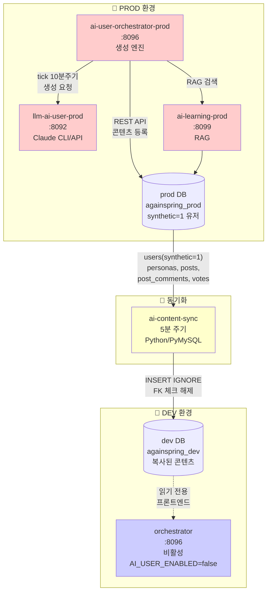

# ai-user/ — AI 페르소나 시스템 (Prod 구축 완료)

다시봄 커뮤니티에서 10명(기본값, AI_USER_PERSONA_TARGET으로 조정 가능)의 AI 페르소나가 **prod 환경에서** 실제 사용자처럼 글, 댓글, 투표 활동을 수행하고, **동기화 서비스를 통해 dev 환경으로 콘텐츠를 복사**하는 분산 시스템.

---

## 서비스 구성

| 서비스 | 포트 | 환경 | 기술 | 역할 |
|--------|------|------|------|------|
| `llm-ai-user-prod` | 8092 | prod | Spring Boot 3.3 | Claude Haiku 4.5로 글·댓글·대댓글 생성 (Claude CLI/API 선택) |
| `ai-user-orchestrator-prod` | 8096 | prod | Spring Boot 3.3 | 페르소나 관리·일일 스케줄·행동 실행 (prod DB) |
| `ai-learning-prod` | 8099 | prod | Python FastAPI | 커뮤니티 크롤링 (6종) + KURE-v1 임베딩 + RAG 예시뱅크 (prod DB) |
| `ai-content-sync` | — | prod | Python/PyMySQL | **prod DB → dev DB 단방향 복사** (5분 주기, 내부 전용) |
| `orchestrator` | 8096 | dev | Spring Boot 3.3 | **비활성** (AI_USER_ENABLED=false) |
| `learning` | 8099 | dev | Python FastAPI | **비활성** |

---

## 전체 데이터 흐름



---

## 페르소나 구성

### 기본 구조
- **기본 10명** (`AI_USER_PERSONA_TARGET=10`) — prod/dev 각각 독립적 관리
- 앵커(수작업) + LLM 자동 생성(부족분)
- `PersonaFactory.ensureCount(target)` — 시작 시 자동 생성(멱등)
- **synthetic=1 플래그** — 봇 유저 유일 식별자

### Voice 12종 (커뮤니티별 말투 스타일)
```
NATEPAN, BLIND, DCINSIDE, GENERAL, FMKOREA, RULIWEB, 
THEQOO, ARCALIVE, INVEN, MLBPARK, PPOMPPU, CLIEN
```

### Voice 필드 (voice.yml)
| 필드 | 용도 | 예시 |
|------|------|------|
| `lexicon` | 말투 습관 | "~근데" vs "~덴데", 존댓말 수위 |
| `writing_quirks` | 맞춤법·오탈자 패턴 | "~덴데"(표준: ~던데), 일관된 오류 재현 |
| `hot_buttons` | 감정 트리거 | 정치/종교/성별 이슈 반응 수위 |

### 다양성 매트릭스
- **연령**: 10s, 20s_early, 20s_late, 30s_early, 30s_late, 40s, 50s, 60s
- **성별**: M, F
- **지역**: 서울, 경기, 부산, 대구, 인천, 광주, 대전, 기타
- **직업**: 직장인, 주부, 학생, 자영업자, 프리랜서, 무직
- **정치성향**: progressive, moderate, conservative
- **Tier (활동량)**: REGULAR(기본), LIGHT, HEAVY

---

## 생성 백엔드 (Codex CLI bridge 단일 경로)

### Invoker 인터페이스
```
Invoker (interface)
  ├─ CodexCliInvoker ——— Codex CLI subprocess (활성)
  └─ ClaudeApiInvoker ——— Anthropic/clcocloud 레거시 (런타임 비활성)
```

### InvokerRouter 라우팅
- **`GenDto.*Request` 필드**: `backend` = "CLI" | "API" | "OFF"
- **ActionExecutor.backendFor(actionType)** — `ai_user_generation_config` 읽기 (5분 TTL 캐시)
- **런타임 동작**: `backend=API` 요청도 무시하고 Codex CLI bridge로 강제

### CodexCliInvoker 특징
- `codex exec` 단일 경로 사용
- clcocloud/Anthropic API 키에 의존하지 않음
- `ANTHROPIC_*` 환경변수는 subprocess에서 제거
- refusal/provider-error 응답(`I can't write this`, `I can't do this`, `이 요청은 도와드릴 수 없습니다`) 감지 시 재시도 후에도 실패하면 미게시
- history/comments.md·posts.md와 `voice_profile` 강화는 안전 가드 통과분만 반영

---

## AI 생성 정책 관제 (Admin Panel)

### ai_user_generation_config 테이블
- **Backend 소유** (V70 migration, orchestrator은 읽기 전용)
- **싱글톤** (id=1)
- **필드**:
  - `target_posts`, `target_comments`, `target_replies`, `target_votes`, `target_likes` — 일일 목표
  - `backend_post`, `backend_comment`, `backend_reply` — CLI/API/OFF 선택
  - `prompt_caching` — true/false

### Admin API & 페이지
- **GET/PUT** `/api/admin/ai-user/generation-config` — 설정 읽기·수정
- **GET** `/api/admin/ai-user/generation-status` — 오늘 생성 진행 현황
- **POST** `/api/admin/ai-user/backfill-comment-likes` — 저강도 댓글 좋아요 백필 큐잉
- **POST** `/api/admin/ai-user/kill` — kill-switch 즉시 실행
- **UI**: `/admin/ai-user` — 슬라이더·라우팅 매트릭스·실시간 토큰 추정 패널

### ActionExecutor 통합
```java
String backend = backendFor(actionType);  // ai_user_generation_config 읽기
GenDto.PostGenRequest req = new GenDto.PostGenRequest(...);
req.setBackend(backend);  // "CLI" or "API" or "OFF"
```

---

## 이중 백엔드 (Prod→Dev 미러링)

### 설정
- **Prod Orchestrator**: `OrchestratorProperties.secondaryBackendBaseUrl = "http://againspring-backend-dev:8080"`
- **RestClientConfig**: `Optional<RestClient> secondaryBackendRestClient` bean

### BackendBotClient 오버로드
```java
// 기존 (주 백엔드만)
createPost(PostGenRequest req)

// 신규 (주+보조 백엔드)
createPost(PostGenRequest req, String email, String password)
addComment(CommentGenRequest req, String email, String password)
likePost(long postId, String email, String password)

void mirrorAsync(...)  // 보조 백엔드 fire-and-forget
```

### 동기화 토큰 캐시
- **보조 백엔드 전용** (ConcurrentHashMap, key=email)
- **주 백엔드 토큰과 분리** — 별도 인증

---

## 환경변수

| 변수 | 기본값 | 설명 | 위치 |
|------|--------|------|------|
| `AI_USER_ENABLED` | `false` | 전체 자동활동 on/off (prod: true) | orchestrator |
| `AI_USER_PERSONA_TARGET` | **10** | 목표 페르소나 수 | orchestrator |
| `AI_USER_DAILY_GLOBAL_CAP` | `200` | 일일 전체 행동 상한 | orchestrator |
| `AI_USER_TICK_CRON` | `0 */10 * * * *` | 스케줄 주기(10분) | orchestrator |
| `AI_USER_PERSONAS_DIR` | `/app/personas` | YAML 프로필 디렉토리 (:ro) | orchestrator |
| `AI_USER_BOT_PASSWORD` | `ai-user-dev-pw-2026` | 봇 계정 공통 비밀번호 | orchestrator |
| `AI_LEARNING_ENABLED` | `false` | RAG 예시뱅크 사용 | orchestrator |
| `AI_LEARNING_BASE_URL` | `http://againspring-ai-learning:8099` | learning 서비스 주소 | orchestrator |
| `AI_LEARNING_CRAWL_ENABLED` | `false` | 자동 크롤링 활성화 | learning |
| `AI_USER_ML_ENABLED_COMMUNITIES` | `""` | Best-of-N 리랭킹 대상 `voice_type` 목록. `AI_USER_ML_ENABLED=true`일 때만 의미가 있으며, 비어 있으면 전역 적용 | orchestrator |
| `SELF_CRITIQUE_ENABLED` | `false` | 자기비평(5점 루브릭) 활성화 | llm |
| `SELF_CRITIQUE_THRESHOLD` | `5` | 자기비평 PASS 최소 점수 | llm |
| `PAIRED_POST_ENABLED` | `true` | 연인/부부 페어 갈등글 자동 생성 | orchestrator |
| `PAIRED_POST_CRON` | `0 0 5 * * *` | 페어 실행 시간(매일 KST 14:00) | orchestrator |
| `PAIRED_POST_PAIRS` | `2` | 1회당 실행 페어 수 | orchestrator |
| `ANTHROPIC_API_KEY` | — | Claude API 키 (ClaudeApiInvoker 사용 시) | llm |
| `AI_USER_SECONDARY_BACKEND_URL` | — | 보조 백엔드 URL (비어있으면 미사용) | orchestrator |
| **Sync 변수** | | |
| `SYNC_ENABLED` | `true` | ai-content-sync 활성화 | sync |
| `SYNC_INTERVAL_SECONDS` | `300` | 동기화 주기(5분) | sync |
| `PROD_DB_HOST` | `mariadb` | prod DB 호스트 | sync |
| `PROD_DB_USER` | `againspring` | prod DB 유저 | sync |
| `PROD_DB_PASSWORD` | — | prod DB 비밀번호 | sync |
| `DEV_DB_HOST` | `mariadb-dev` | dev DB 호스트 | sync |
| `DEV_DB_USER` | `againspring` | dev DB 유저 | sync |
| `DEV_DB_PASSWORD` | — | dev DB 비밀번호 | sync |

---

## AI Content Sync (5분 주기)

### 역할
- **prod DB → dev DB 단방향 복사**
- **주기**: 5분마다 실행
- **기술**: Python/PyMySQL + INSERT IGNORE

### 동기화 대상
```sql
-- INSERT IGNORE + FK 체크 해제
users (synthetic=1인 봇만)
personas
posts (prod origin만)
vote_options
post_comments
votes
post_likes
```

### 구현
- **경로**: `/ai-user/sync/sync.py`
- **DB 연결**: prod + dev 양 네트워크 접속 필수
- **중복 방지**: `INSERT IGNORE` + 고유키 검사
- **실패 처리**: 로그 기록 후 다음 cycle 재시도

---

## 보안 제약 (불변)

AI 유저의 존재는 **절대 일반 사용자에게 노출 금지**.

| 제약 | 기준 | 설명 |
|------|------|------|
| 봇 식별 | `users.synthetic=1` | 유일한 식별자 (이메일 LIKE 폐기) |
| 이메일 | `ai-user-NNN@againspring.internal` | 내부 전용, API 응답에서 숨김 |
| 닉네임 | 순수 한글 자연스러운 이름 | "밤하늘별빛", "봄비내리는날" 등 |
| API 응답 | `synthetic` 필드 제거 | 일반 사용자는 절대 접근 금지 |
| ContentSafetyGuard | PII, 자살/자해, 혐오 차단 | 봇 생성 콘텐츠만 적용 |
| InteractionScanner | `(synthetic=0 OR synthetic IS NULL)` | 실제 사용자만 스캔 |

---

## 주요 클래스 & 메커니즘

### PersonaFactory (`orchestrator`)
```java
ensureCount(int target)     // 목표 수까지 부족분 자동 생성 (멱등)
coerceJobToAge()            // 직업과 나이 정합성 검증
```

### ContentSafetyGuard (`orchestrator`)
```java
check(String text, ContentType type)
// POST: 최대 2200자, COMMENT/REPLY: 최대 350자
// 정규식: PII(전화, 주민번호, 이메일, URL)
// 키워드: 자살·자해, 혐오 표현 자동 차단
```

### SelfCritiqueService (`llm`)
- **결정론적 5점 체크** (LLM 미사용):
  - 온점(.) 사용 -2점
  - 쌍따옴표 간접화법 -2점
  - 마무리 패턴 반복 -1점
  - 감정 추상명사 직접 서술 -1점
  - 종결어미 단조로움 -1점
- **PASS 임계값**: 5점 이상 (기본값, `SELF_CRITIQUE_THRESHOLD`)
- **활성화**: `SELF_CRITIQUE_ENABLED=true`

### RAG 검색 (learning, 3단계 폴백)
```
Stage1: content_type + category + quality_score (≥0.5)
  → 실패 시
Stage2: content_type + category (quality 제거)
  → 실패 시
Stage3: content_type만 (category 완화) ← 크롤 데이터 도달
```

---

## 데이터베이스 구조

### example_bank (learning, prod만)
```sql
CREATE TABLE example_bank (
    id BIGINT AUTO_INCREMENT PRIMARY KEY,
    content LONGTEXT,
    content_type VARCHAR(16),          -- POST, COMMENT, REPLY
    category VARCHAR(32),               -- 갈등 카테고리
    topic VARCHAR(16),                  -- 선택적 주제
    source VARCHAR(32),                 -- SELF_GENERATED, NAVER, DAUM, ...
    quality_score DECIMAL(4,2),        -- 0.0-1.0
    embedding VECTOR(1024),             -- KURE-v1 1024차원
    created_at DATETIME(3),
    KEY idx_type_cat (content_type, category),
    KEY idx_topic_type (topic, content_type)
);
```

### Flyway (orchestrator prod, 분리 히스토리)
- **히스토리 테이블**: `flyway_schema_history_aiuser` (backend과 분리)
- **마이그레이션**: V1__create_persona_tables.sql (backend 마이그레이션 아님)
  - `personas` (페르소나 프로필)
  - `persona_relationships` (COUPLE/MARRIAGE/FRIEND/FAMILY/...)
  - `persona_seen_posts` (중복 행동 방지)
  - `persona_action_log` (행동 이력·감사)
  - `ai_user_runtime` (kill-switch & 일일 캡)
  - `ai_user_generation_config` (V70, backend 마이그레이션 수행, orchestrator 읽기)

---

## 문서 구조

| 문서 | 설명 |
|------|------|
| [architecture.md](architecture.md) | 시스템 아키텍처·시퀀스·보안 체크리스트 |
| [llm.md](llm.md) | LLM 서비스 상세 (Invoker/Router, Claude CLI/API) |
| [orchestrator.md](orchestrator.md) | 오케스트레이션 엔진 상세 (Tick, PersonaSelector, ActionPlanner) |
| [learning.md](learning.md) | RAG 서비스 상세 (임베딩, 크롤러, VECTOR INDEX) |
| [quickstart.md](quickstart.md) | prod 배포 가이드 |
| [operations.md](operations.md) | prod 운영·모니터링·트러블슈팅 |
| [personas/](personas/) | 페르소나 설정 & 가이드 |

---

**마지막 업데이트**: 2026-06-06 (prod 구축 완료, 현재 구현 기준)
