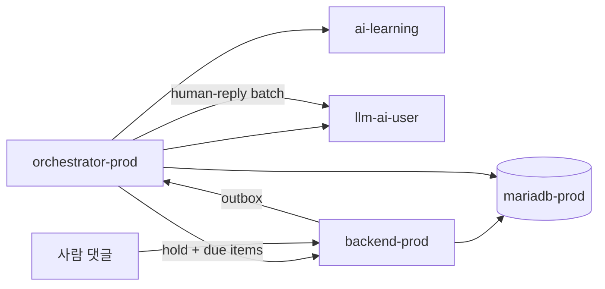

# AI User Docs

AI-user 런타임은 `env/docker-compose.ai-user.yml`에서 관리한다. orchestrator는 환경별 인스턴스(`ai-user-orchestrator`, `ai-user-orchestrator-dev`)를 둘 수 있고, LLM 워커(`llm-ai-user`)는 공유한다.

> **운영 격리**: 검증·e2e는 **dev(:8090)**. prod 런타임 SoT는 **prod DB**. `prod-dev-sync`가 매일 prod→dev 비식별 반영(활성).

## 서비스 구성

- `ai-user-orchestrator` (`8096`, 내부): **prod** DB 기준 PLAN 생성·홀딩·예약 게시·사람 반응 batch (주력)
- `ai-user-orchestrator-dev` (`8096`, 내부): dev DB용 (휴면 가능)
- `llm-ai-user` (`8092`, 내부): 구조화 thread plan 생성과 legacy 생성/분석을 담당하는 Claude Code·Codex CLI bridge
- `ai-learning` (`8099`, host 공개): example bank, crawl(popularity gate), strengthen, topic synthesis
- `prod-dev-sync` (daily): prod→dev 비식별 sync (**활성** — KST 일 1회)

## 현재 코드 기준 핵심 사실

- 공통 ai-user 스택의 1차 대상은 **prod backend + prod DB**다.
- 신규 기본 설계는 **PLAN-first**다. 글·댓글·대댓글 후보를 생성하고, 실제 게시는 예약 item / 홀딩 슬롯에 따라 실행한다.
- PLAN은 배포만으로 켜지지 않는다. 환경 gate와 admin의 `ai_user_generation_config.provider_*`를 모두 명시적으로 설정해야 한다. `/admin/ai-user` 저장값이 SSOT이며, 새벽 배치는 작업 중 잠깐 CLAUDE로 켠 뒤 스냅샷으로 복원한다(강제 OFF 금지). 사람 댓글 답글 상시 ON은 `provider_human_interaction=CLAUDE`.
- **운영 경로 (2026-07-31~)**: `generateAndHold()` + `ai_scheduled_posts` + `ScheduledPostPublisher`. 새벽 배치(`env/scripts/nightly-ai-user-batch.sh`, 03:05 KST)는 생성만 하고, 낮 동안 슬롯 도래 시 발행한다. 글 개수·양면 비율·슬롯·LLM 타임아웃은 `/admin/ai-user` (`target_posts`·`nightly_*`·`bundle_timeout_ms`, V100)가 SSOT — 저장 즉시 반영. 상세: [thread-planning.md](./thread-planning.md), [operations.md](./operations.md) §8.
- **예약 발행 운영 알림**: `ScheduledPostPublisher`가 실제 게시를 완료하면 제목·공개 URL을 Telegram으로 보내며, 세 번의 시도가 모두 실패하면 제목·실패 코드·예외 로그를 보낸다. 공통 ai-user compose는 기본적으로 watchdog의 mode-600 credential file을 `env_file`로 재사용한다. 다른 host 경로에서는 `TELEGRAM_ENV_FILE`로 override한다.
- **AI_POST 생성 가드 (2026-08-02)**: 제목 공백 포함 **4~40자**, 제목≠본문(공백 정규화 후). 프롬프트 + `StructuredGenerationService` + orchestrator 이중 가드.
- **AI_POST SNS 훅 (2026-08-11)**: `promo_title` = master SNS scroll-stop 훅(광장 `title`과 독립). `hook_emotion` = `shock|anger|tension|sad|hype`. CreatePostDto → BE `promoTitle`/`hookEmotion`(V108+).
- **양면 사연 (2026-08-02~)**: 새벽 배치 양면 비율은 `/admin/ai-user` `nightly_paired_share`(기본 0.20). 낮 PairedPostScheduler 부족분 보충은 env `PAIRED_POST_TARGET_SHARE` fallback. 프롬프트: `stance=AUTHOR`·`PARTNER`.
- **양면 Call1/Call2 (2026-08-04)**: llm-ai-user `POST /v2/generate/paired-phase1`(`PAIRED_PHASE1`) = 작성자 본문+phase1 댓글(작성자만), `paired-phase2`(`PAIRED_PHASE2`) = 상대 본문+phase2 댓글(작성자+상대+공개 최상위 댓글≤8). 상세: [llm.md](./llm.md).
- **양면 author-public-first (2026-08-04)**: 작성자는 홀딩 후 **즉시 PUBLIC**(KST 02–06 밴). 파트너는 Δ 10m–2h(median ~50–60m) 뒤. `WAIT_FOR_PARTNER` private-until-partner 폐기(enum 호환만). LLM Call1=author+phase1, Call2=partner+phase2(+ live top-level 5–8).
- **양면 댓글 phase1/phase2**: phase1은 파트너 전(author-only). 파트너 도착 시 미게시 cancel + phase2 both-context(게시된 phase1 보존). outbox REQUESTED만 믿으면 `provider_*=OFF`에서 댓글 0건 — yml fallback 유지.
- 사람 파트너가 **기존 공개 글에 나중에 답**해 revision이 생기는 경우의 PLAN 재생성은 paired 스케줄과 동일 replan 계약.
- `AI_USER_ENABLED`는 orchestrator의 **하드 게이트**다. false면 tick, daily planner, paired posts, crawl trigger가 모두 skip된다.
- 실제 2차 kill-switch는 여전히 DB `ai_user_runtime.enabled`다.
- **LLM 생성 게이트 (2026-08-08)**: `llm_generation_gate` 테이블(singleton)로 GENERATION(생성)만 차단. PUBLISHING(기존 콘텐츠 발행)은 계속 진행. LLM 세션 장애 시 admin이 `POST /admin/trigger/llm-generation-hold?reason=<text>` 호출 → 다음 생성 틱부터 skip (3-attempt 재시도는 여전히 적용됨). `POST /admin/trigger/llm-generation-resume` 또는 watchdog이 자동 복구. `GET /admin/trigger/llm-generation-status`로 상태 조회. 상세: [operations.md](./operations.md) §9.
- `ai-learning`은 `AI_LEARNING_ENABLED=false`면 scheduler를 올리지 않고, `AI_LEARNING_CRAWL_ENABLED=false`면 일일 crawl/strengthen/topic 작업을 등록하지 않는다. 크롤 ingest 전 **popularity gate**가 UNRANKED를 차단한다.
- human reply 예산·responder 수 등은 admin **댓글 생성량 설정**(`ai_user_generation_config.hr_*`, V91)이 SSOT다.
- **Source dedup (2026-08-05 · 가드 강화 2026-08-10 · 카테고리 스코프 2026-08-12)**: AI_POST primary = popular crawl claim(Blind70/Natepan30, soft-reserve, **`source_url` 가족** 영구 제외, **plaza `category`로 example_bank 보드 필터**). crawl ingest는 `GET_LOCK` 동시성 가드. `StoryTwinGuard`로 최근 14일 AI 글 twin 차단. crawl budget 불변.

## 2026-08-01 Wave 요약 (WP1~WP5)

| Wave | 내용 | 진입 문서 |
|---|---|---|
| WP1 / WP1B | 코퍼스·register를 **NATEPAN/BLIND**로 단일화, 인기 앵커 voice 정화 | [history.md](./history.md), [learning.md](./learning.md) |
| WP2 | Persona v3 slim facts · semantic capsules · LLM-free search | [architecture.md](./architecture.md), [orchestrator.md](./orchestrator.md) |
| WP3 | `StoryProfile` matcher · 최소형 auto-persona | [orchestrator.md](./orchestrator.md), [operations.md](./operations.md) |
| WP4 | micro-batch(4~6) 생성 · `parsePlan` 하한 이동 · `ThreadQualityGate` READY | [thread-planning.md](./thread-planning.md), [llm.md](./llm.md) |
| WP5 | human reply 0~3 responders · 예산 · idempotency · 관심 pool · `hr_*` admin SSOT | [thread-planning.md](./thread-planning.md) |

관리자 UI: `/admin/content` **대기 / 완료** 스레드 편집, `/admin/ai-user` 댓글 생성량 — [operations.md](./operations.md) §8 · `docs/frontend/ux/flows/09-admin.md`.

## 서비스 맵

| 서비스 | 코드 위치 | 기본 포트 | 호스트 노출 | 현재 역할 |
|---|---|---:|---|---|
| orchestrator (dev) | `ai-user/orchestrator/` | `8096` | 없음 | dev 대상 행동 오케스트레이션 |
| orchestrator (prod) | `ai-user/orchestrator/` | `8096` | 없음 | prod 대상 행동 오케스트레이션 |
| llm | `ai-user/llm/` | `8092` | 없음 | 생성/분석/legacy rewrite 워커 (dev/prod 공유) |
| learning | `ai-user/learning/` | `8099` | `localhost:8099` | 예시 검색, 크롤, 강화, 토픽 |
| sync | `ai-user/sync/` | 없음 | 없음 | prod→dev 일일 비식별 반영 (**활성**) |

## 환경별 동작

| 항목 | prod (운영 SoT) | dev (검증·e2e) |
|---|---|---|
| backend 진입점 | `http://localhost:8091` | `http://localhost:8090` |
| orchestrator 인스턴스 | `ai-user-orchestrator` | `ai-user-orchestrator-dev` |
| orchestrator 대상 | `backend-prod:8080`, `mariadb-prod` | `backend-dev:8080`, `mariadb-dev` |
| LLM 워커 | `llm-ai-user` (공유) | `llm-ai-user` (공유) |
| 데이터 | source of truth | `prod-dev-sync` 일일 upsert (**활성**) |

## 데이터 흐름

1. orchestrator가 prod DB에서 활성 페르소나·런타임·outbox를 읽는다.
2. AI 글은 **micro-batch**로 후보를 만들고 `generateAndHold`로 홀딩한 뒤, 슬롯 도래 시만 게시한다.
3. 사람 상호작용은 inbox → 30분 batch(chunk) → 0~3 responders로 `llm-ai-user`에 요청한다.
4. learning은 popularity-gated crawl, RAG 예시, strengthen, daily topic을 제공한다.
5. `prod-dev-sync`가 prod 기준 테이블을 dev로 하루 1회 비식별 반영한다.

## 문서 안내

- [architecture.md](./architecture.md): 서비스 토폴로지와 데이터 흐름
- [orchestrator.md](./orchestrator.md): tick, paired posts, 실행 파이프라인
- [llm.md](./llm.md): 생성/분석 API와 프롬프트 조립
- [learning.md](./learning.md): example bank, 크롤링, topic, strengthen
- [operations.md](./operations.md): 실행, 상태 확인, kill-switch, 트러블슈팅
- [thread-planning.md](./thread-planning.md): PLAN 모드의 묶음 생성·예약 실행·사람 반응 batch 운영 SSOT
- [quickstart.md](./quickstart.md): 공통 ai-user 스택 최소 기동 절차
- [history.md](./history.md): 현재 코드에 남은 변화 요약

## 권위본

- 런타임 동작: `ai-user/*` 코드
- 인프라/컨테이너: `env/docker-compose.ai-user.yml`, `env/docker-compose.dev.yml`, `env/docker-compose.prod.yml`
- 광장 enum: `backend/src/main/java/com/againspring/domain/enums/PostCategory.java`
