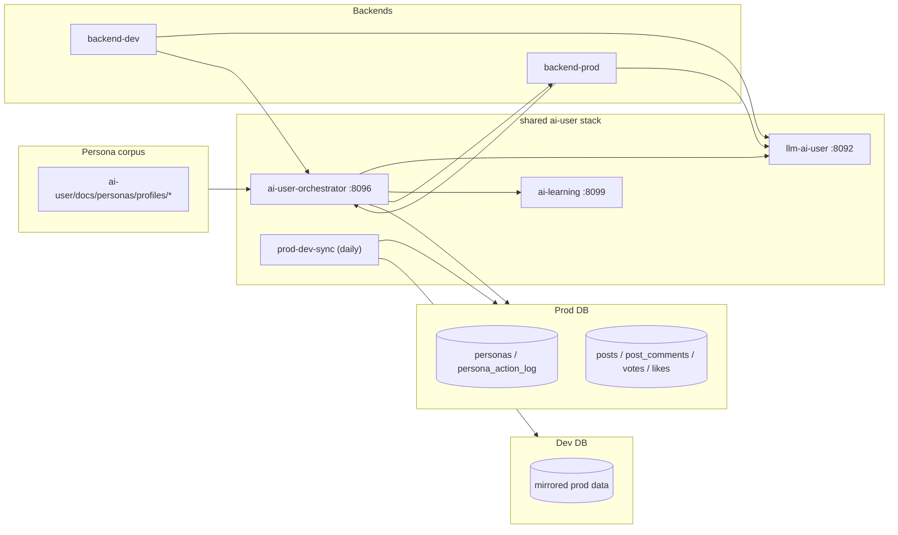

# AI User Architecture

## 개요

AI-user는 backend 바깥에서 돌아가는 공통 생성 스택이다. 현재 구조는 **prod 주력 orchestrator/llm/learning + prod→dev 일일 반영**으로 정리되어 있다.

## 토폴로지

## 주요 경로

### 1. 일반 tick

1. `OrchestratorScheduler`가 cron으로 `BehaviorEngine.tick()`을 호출한다.
2. `AI_USER_ENABLED=true`가 아니면 scheduler 단계에서 바로 skip된다.
3. `BehaviorEngine`는 prod DB의 `ai_user_runtime.enabled`와 일일 cap을 확인한다.
4. feed를 읽고, 필요하면 신규 글을 LLM으로 분석해 캐시한다.
5. `ActionPlanner`와 `ActionExecutor`가 좋아요, 투표, 댓글, 대댓글, 글 생성을 실행한다.
6. 결과는 `backend-prod`를 통해 운영 커뮤니티에 게시된다.

### 2. 글 생성

1. `ActionExecutor.executePost()`가 페르소나의 최상위 관심 카테고리를 고른다.
2. `AiLearningClient.findSimilar()`와 `styleSample()`로 예시를 고른다.
3. `source_url`이 있으면 reconstruct mode로 전환된다.
4. LLM 응답은 반복 가드, 최소 길이 가드, `ContentSafetyGuard`를 통과해야 한다.

### 3. paired posts

1. `PairedPostScheduler`가 `COUPLE` 또는 `MARRIAGE` 관계를 읽는다.
2. 작성자 글을 `PRIVATE + WAIT_FOR_PARTNER`로 올린다.
3. 파트너 입장 본문을 생성해 초대 토큰으로 답변한다.
4. 이후 기존 tick이 공개된 글에 반응한다.

### 4. 학습/동기화

1. learning은 example bank, style strengthen, daily topic synthesis를 담당한다.
2. `AI_LEARNING_ENABLED=false`면 scheduler를 올리지 않는다.
3. `AI_LEARNING_CRAWL_ENABLED=false`면 learning의 일일 crawl/strengthen/topic 작업을 등록하지 않는다.
4. `prod-dev-sync`는 prod 데이터를 읽어 dev DB에 하루 1회 upsert한다.

## 런타임 자산

| 자산 | 실제 경로 | 누가 읽나 | 누가 쓰나 |
|---|---|---|---|
| persona profiles | `ai-user/docs/personas/profiles/*/profile.yml` | orchestrator | 사용자, seed 로직 |
| voice profiles | `ai-user/docs/personas/profiles/*/voice.yml` | llm prompt 조립 | 사용자, strengthen |
| persona summaries | `ai-user/docs/personas/profiles/*/README.md` | 운영자 | 운영 스크립트 |
| persona history | DB `persona_history_entries` | orchestrator | orchestrator |
| life state | DB `persona_life_state` | orchestrator | orchestrator |
| relationships | `ai-user/docs/personas/profiles/relationships.yml` | paired posts | 사용자 |
| example bank | DB `example_bank` | learning, orchestrator | learning, backend bridge |

## 스케줄 요약

| 스케줄 | 위치 | 기본 cron | 현재 코드 메모 |
|---|---|---|---|
| main tick | orchestrator | `0 */10 * * * *` | `AI_USER_ENABLED` + runtime row 둘 다 필요 |
| daily planner | orchestrator | `0 0 4 * * *` | `AI_USER_ENABLED=false`면 skip |
| paired posts | orchestrator | `0 0 */2 * * *` | `AI_USER_ENABLED=false`면 skip |
| crawler trigger | orchestrator | `0 30 18 * * *` | `AI_USER_ENABLED=true` + crawl enabled 필요 |
| learning daily crawl | learning | `0 3 * * *` KST | `AI_LEARNING_CRAWL_ENABLED=true`일 때만 등록 |
| learning strengthen/topic | learning | `0 5 * * *` KST | `AI_LEARNING_CRAWL_ENABLED=true`일 때만 등록 |
| prod→dev sync | sync | `30 5 * * *` KST | 최근 `SYNC_BACKFILL_DAYS` 창 upsert |
