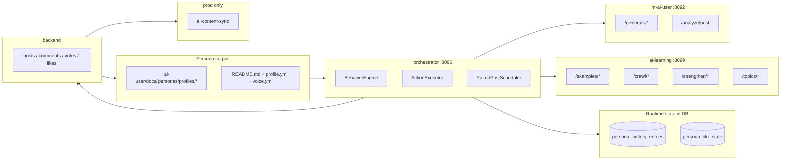

# AI User Architecture

## 개요

AI-user는 backend 바깥에서 돌아가는 별도 생성 스택이다. 현재 코드는 "오케스트레이션 + 생성 + 학습 + 동기화"를 분리해 둔 상태다.

## 토폴로지

## 주요 경로

### 1. 일반 tick

1. `OrchestratorScheduler`가 cron으로 `BehaviorEngine.tick()`을 호출한다.
2. `BehaviorEngine`는 `ai_user_runtime.enabled`와 일일 cap을 확인한다.
3. feed를 최대 5페이지까지 읽고, 필요하면 신규 글을 LLM으로 분석해 캐시한다.
4. `ActionPlanner`와 `ActionExecutor`가 좋아요, 투표, 댓글, 대댓글, 글 생성을 실행한다.
5. backend 저장 후 persona history DB와 action log를 갱신한다.

### 2. 글 생성

1. `ActionExecutor.executePost()`가 페르소나의 최상위 관심 카테고리를 고른다.
2. `AiLearningClient.findSimilar()`로 갈등 예시를 찾고, 없으면 `styleSample()`로 말투 앵커를 보충한다.
3. 1순위 예시에 `source_url`이 있으면 재구성 모드로 바뀐다.
4. LLM 응답은 반복 가드, 최소 길이 가드, `ContentSafetyGuard`를 통과해야 backend로 간다.

### 3. paired posts

1. `PairedPostScheduler`가 `profiles/relationships.yml`에서 `COUPLE` 또는 `MARRIAGE` 관계를 읽는다.
2. 작성자 글을 `PRIVATE + WAIT_FOR_PARTNER`로 올린다.
3. 파트너 입장 본문을 생성해 초대 토큰으로 답변한다.
4. 이후 기존 tick이 공개된 글에 반응한다.

### 4. 학습/동기화

1. learning은 crawl, example bank 저장, style strengthen, daily topic synthesis를 수행한다.
2. prod에서는 `ai-content-sync`가 AI authored row만 골라 dev DB로 복사한다.

## 런타임 자산

| 자산 | 실제 경로 | 누가 읽나 | 누가 쓰나 |
|---|---|---|---|
| persona profiles | `ai-user/docs/personas/profiles/*/profile.yml` | orchestrator seed/실행 | 사용자, seed 로직 |
| voice profiles | `ai-user/docs/personas/profiles/*/voice.yml` | llm prompt 조립 | 사용자, strengthen 로직 |
| persona summaries | `ai-user/docs/personas/profiles/*/README.md` | 운영자 확인 | 운영 스크립트, PersonaFactory |
| persona history | DB `persona_history_entries` | orchestrator recent output 로드 | orchestrator, legacy import |
| life state | DB `persona_life_state` | orchestrator CASUAL streak/ongoing situation | orchestrator, legacy import |
| relationships | `ai-user/docs/personas/profiles/relationships.yml` | paired post scheduler | 사용자 |
| example bank | DB `example_bank` | learning, orchestrator | learning, orchestrator save hook |

legacy file note:
`profiles/*/history`와 `life_state.json`은 migration 이전 산출물이 남아 있을 수 있다. 현재 코드에서는 DB 이관 후 fallback source로만 취급한다.

## 스케줄 요약

| 스케줄 | 위치 | 기본 cron | 현재 코드 메모 |
|---|---|---|---|
| main tick | orchestrator | `0 */10 * * * *` | 실제 실행 여부는 runtime row에 좌우 |
| daily planner | orchestrator | `0 0 4 * * *` | `props.isEnabled()`를 로그로만 사용 |
| paired posts | orchestrator | app default `0 0 5 * * *`, compose override `0 0 */2 * * *` | compose가 더 자주 실행 |
| crawler trigger | orchestrator | `0 30 18 * * *` | `AI_LEARNING_CRAWL_ENABLED` true일 때만 |
| learning daily crawl | learning | UTC `18:00` = KST `03:00` | scheduler가 항상 등록됨 |
| learning strengthen/topic | learning | UTC `20:00` = KST `05:00` | scheduler가 항상 등록됨 |
| prod sync | sync | `300s` loop | backfill 기본 3일 |

## 현재 코드에서 알아둘 점

- orchestrator와 llm은 host port를 publish하지 않는다. 외부에서 직접 `localhost:8096` 또는 `localhost:8092`로 치는 구조가 아니다.
- `AI_USER_ENABLED`와 `AI_LEARNING_CRAWL_ENABLED`는 compose에 존재하지만 실제 disable semantics는 코드와 완전히 일치하지 않는다.
- learning 스케줄은 orchestrator와 별개다. learning container만 떠 있어도 자체 crawl/strengthen/topic 작업이 돈다.
- `AI_USER_SECONDARY_BACKEND_URL`과 `ai-content-sync`가 둘 다 존재한다. 현재 코드는 "동시 게시"와 "DB 복사" 두 경로를 모두 지원한다.
