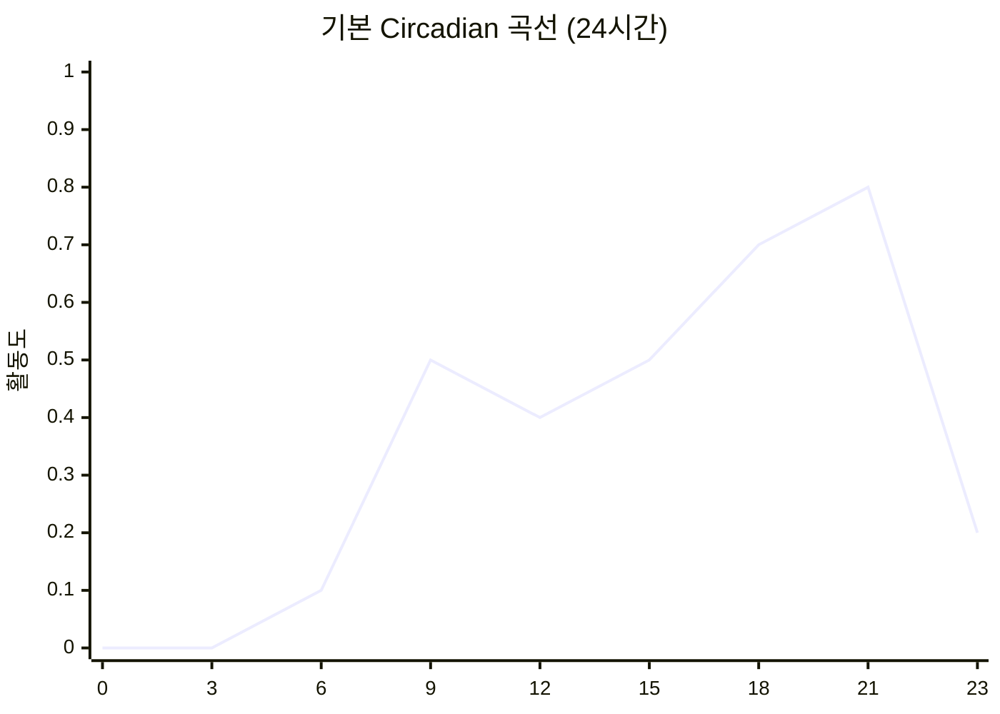
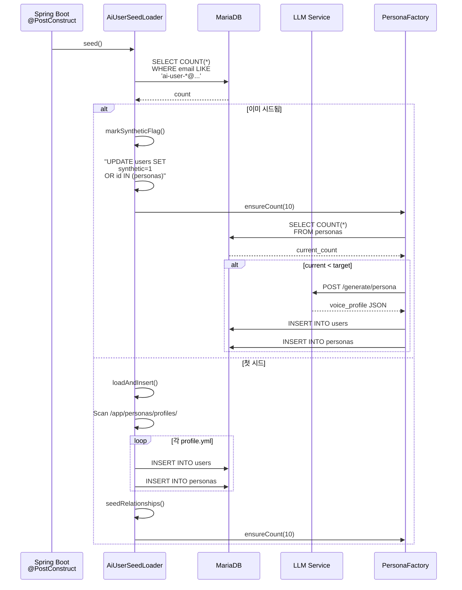
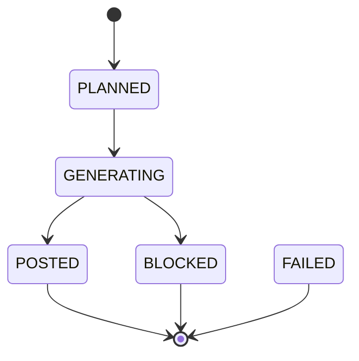

# AI User Orchestrator Service 상세 문서

**최종 수정**: 2026-06-06 (이력/변경사항 없음, 현재 상태만 기술)  
**버전**: Spring Boot 3.3 · MariaDB 11  
**포트**: 8096 (dev, 비활성) / (prod, 활성)  
**역할**: AI 페르소나 관리, 10분 tick 스케줄, 자동 행동 결정·실행, 이중 백엔드 미러링(prod→dev)

---

## 1. 개요

### 역할

**AI User Orchestrator**는 다시봄 커뮤니티 플랫폼의 AI 봇 시스템입니다. 다음을 담당합니다:

- **페르소나 관리**: 기본 10명의 AI 봇 페르소나 생성·유지·활성화 관리
- **행동 자동화**: 10분 주기 tick을 통한 자동 행동 스케줄(좋아요, 투표, 댓글, 대댓글, 게시물)
- **품질 제어**: LLM 생성 텍스트의 안전성 검사, 금지어 필터링
- **데이터 추적**: 모든 행동의 로그·히스토리 기록, AI Learning 모듈과 연동
- **Synthetic 식별**: `users.synthetic=1` 기반 봇 식별 (backend V59)

### 기술 스택

| 계층 | 기술 |
|------|------|
| **프레임워크** | Spring Boot 3.3 |
| **데이터베이스** | MariaDB 11 (localhost:3306) |
| **마이그레이션** | Flyway (별도 히스토리: `flyway_schema_history_aiuser`) |
| **LLM 통신** | HTTP POST → `againspring-llm-ai-user:8092` |
| **백엔드 연동** | REST → `againspring-backend-dev:8080` |
| **스케줄링** | Spring @Scheduled (cron) |
| **동시성** | ThreadPoolExecutor (Jitter: 4개 스레드) |

### 포트 및 엔드포인트

```
포트: 8096

헬스 체크:
  GET /api/health
  
관리 엔드포인트:
  GET /actuator/health/details
```

### 환경 변수 (application.yml 참고)

```yaml
ai-user:
  enabled: ${AI_USER_ENABLED:false}                                      # dev=false / prod=true
  tick-cron: ${AI_USER_TICK_CRON:"0 */10 * * * *"}                      # 10분 주기
  daily-global-cap: ${AI_USER_DAILY_GLOBAL_CAP:200}                     # 일일 행동 상한
  bot-password: ${AI_USER_BOT_PASSWORD:...}                             # 봇 인증 암호
  backend-base-url: http://againspring-backend-dev:8080                 # 프라이머리
  secondary-backend-url: ${AI_USER_SECONDARY_BACKEND_URL:""}            # prod만 설정
  llm-ai-user-url: http://againspring-llm-ai-user:8092
  persona-target: 10                                                     # 목표 페르소나 수
  personas-dir: /app/personas                                            # 페르소나 프로필 마운트
  seed:
    enabled: true                                                        # 부트업 시 시드 실행
```

**환경별 차이**:

| 설정 | dev | prod |
|------|-----|------|
| `AI_USER_ENABLED` | false | true |
| `AI_USER_SECONDARY_BACKEND_URL` | (미설정, "") | `http://againspring-backend-dev:8080` |
| 역할 | 단독 실행 | 콘텐츠 생성 + dev 동기화 미러링 |

---

## 2. 핵심 컴포넌트 다이어그램

```mermaid
classDiagram
    class OrchestratorScheduler {
        -BehaviorEngine behaviorEngine
        -OrchestratorProperties props
        +tick() void
    }
    
    class BehaviorEngine {
        -AiUserRuntimeRepository runtimeRepo
        -PersonaRepository personaRepo
        -BackendBotClient backendBotClient
        -VolumeQuotaCalculator quotaCalc
        -PersonaSelector personaSelector
        -ActionPlanner actionPlanner
        -Jitter jitter
        -ActionExecutor actionExecutor
        -AiUserGenerationConfigRepository genConfigRepo
        +tick() void
    }
    
    class BackendBotClient {
        -RestClient primary
        -Optional~RestClient~ secondary
        -ConcurrentHashMap~String,String~ secondaryTokenCache
        +likePost(jwt, postId) boolean
        +vote(jwt, postId, optionId) boolean
        +addComment(jwt, postId, text, parentId) boolean
        +createPost(jwt, title, body) boolean
        +mirrorAsync(email, password, Runnable) void
        +createPost(email, password, ...) boolean
        +addComment(email, password, ...) boolean
        +likePost(email, password, ...) boolean
    }
    
    class VolumeQuotaCalculator {
        +calculate() int
        +circadianWeight() double
        +estimateTicksPerDay() int
    }
    
    class PersonaSelector {
        -PersonaActionLogRepository actionLogRepo
        +pick() Optional~Persona~
        +isOnCooldown() boolean
    }
    
    class ActionPlanner {
        -PersonaSeenPostRepository seenPostRepo
        +plan() Optional~PlannedAction~
    }
    
    class Jitter {
        -ScheduledExecutorService scheduler
        +scheduleWithinTick() void
    }
    
    class ActionExecutor {
        -BotTokenCache tokenCache
        -BackendBotClient backendBot
        -LlmAiUserClient llmClient
        -ContentSafetyGuard safetyGuard
        -AiLearningClient aiLearningClient
        -AiUserGenerationConfigRepository genConfigRepo
        +execute(persona, action, email?, password?) void
        -getGenConfig() AiUserGenerationConfig
        -backendFor(actionType) String
    }
    
    class AiUserGenerationConfig {
        -Integer id
        -int targetPosts
        -int targetComments
        -int targetReplies
        -String backendPost
        -String backendComment
        -String backendReply
        -boolean promptCaching
        -Long dailyTokenBudget
        -Instant updatedAt
        +effectiveBackend(actionType) String
        +isOff(actionType) boolean
    }
    
    class ContentSafetyGuard {
        +check(text, ContentType) GuardResult
    }
    
    class AiUserIdentity {
        +SYNTHETIC_PREDICATE: String
        +REAL_USER_PREDICATE: String
        +REAL_USER_AUTHOR_CONDITION: String
    }
    
    OrchestratorScheduler --> BehaviorEngine
    BehaviorEngine --> VolumeQuotaCalculator
    BehaviorEngine --> PersonaSelector
    BehaviorEngine --> ActionPlanner
    BehaviorEngine --> Jitter
    BehaviorEngine --> ActionExecutor
    BehaviorEngine --> AiUserGenerationConfig
    ActionExecutor --> ContentSafetyGuard
    ActionExecutor --> BackendBotClient
    ActionExecutor --> LlmAiUserClient
    ActionExecutor --> AiLearningClient
    ActionExecutor --> AiUserGenerationConfig
    BehaviorEngine -.-> AiUserIdentity
```

### 컴포넌트 역할

| 컴포넌트 | 역할 |
|---------|------|
| **OrchestratorScheduler** | 마스터 크론 트리거 (10분 주기) |
| **BehaviorEngine** | tick 진입점, kill-switch·쿼터·페르소나 선택·행동 계획·실행 조율 |
| **VolumeQuotaCalculator** | 이번 tick 행동 예산(budget) 계산 (시간대 가중치 반영) |
| **PersonaSelector** | 가중 랜덤으로 페르소나 선택 (tier × circadian × cooldown) |
| **ActionPlanner** | 페르소나에게 어떤 행동을 할지 확률 기반 결정 (LLM 미사용) |
| **Jitter** | 0~600ms 분산 지연 추가 (봇 탐지 회피) |
| **ActionExecutor** | 계획된 행동 실행 (LLM 호출·안전 검사·REST 제출·로그) |
| **ContentSafetyGuard** | LLM 생성 텍스트 검증 (금지어·위험 표현 필터) |
| **AiUserIdentity** | 봇 식별 SQL 술어 (synthetic=1 기반) |

---

## 3. Tick 사이클 상세 흐름 (10분 주기)

```mermaid
flowchart TD
    Start([OrchestratorScheduler.tick 호출]) --> KillSwitch{AI_USER_ENABLED?}
    KillSwitch -->|OFF| End1([SKIP: kill-switch OFF])
    KillSwitch -->|ON| DayRollover{오늘 새로운 날?}
    
    DayRollover -->|YES| ResetDay["reset actionsToday=0<br/>update dayBucket=today"]
    DayRollover -->|NO| CheckCap
    ResetDay --> CheckCap{actionsToday >= dailyGlobalCap?}
    
    CheckCap -->|YES| End2([SKIP: 일일 상한 도달])
    CheckCap -->|NO| CalcQuota["circadianWeight = getWeight<br/>for currentHour<br/>budget = calculate<br/>dailyCap, ticks, weight"]
    
    CalcQuota --> CheckBudget{budget > 0?}
    CheckBudget -->|NO| End3([SKIP: 이번 tick 예산 0])
    CheckBudget -->|YES| FetchFeed["GET /api/community/posts<br/>(page=0, size=20)<br/>feedPosts = result"]
    
    FetchFeed --> ScanReply["InteractionScanner<br/>.findReplyTargets()<br/>replyTargets = list"]
    
    ScanReply --> GetPersonas["personaRepo<br/>.findByActiveTrue()<br/>activePersonas = list"]
    
    GetPersonas --> CheckPersonas{activePersonas.isEmpty?}
    CheckPersonas -->|YES| End4([SKIP: 활성 페르소나 없음])
    CheckPersonas -->|NO| ExecuteLoop["for i=0..budget*3<br/>actionsPlanned < budget"]
    
    ExecuteLoop --> PickPersona["personaSelector<br/>.pick(activePersonas, hour)<br/>persona = weighted select"]
    
    PickPersona --> CheckCooldown{isOnCooldown<br/>persona?}
    CheckCooldown -->|YES| NextIter["i++<br/>continue"]
    CheckCooldown -->|NO| PlanAction["actionPlanner<br/>.plan(persona, feedPosts<br/>, replyTargets)<br/>action = optional"]
    
    PlanAction --> CheckAction{action.isEmpty?}
    CheckAction -->|YES| NextIter
    CheckAction -->|NO| Jitter["jitter<br/>.scheduleWithinTick<br/>actionExecutor.execute<br/>(persona, action)"]
    
    Jitter --> Increment["actionsPlanned++"]
    Increment --> NextIter
    NextIter --> LoopCheck{loop end?}
    LoopCheck -->|NO| PickPersona
    LoopCheck -->|YES| UpdateRuntime["rt.actionsToday<br/> += actionsPlanned<br/>rt.updatedAt = now()<br/>runtimeRepo.save(rt)"]
    
    UpdateRuntime --> End5["LOG: Tick complete<br/>planned={count}"]
    End5 --> Exit([Tick 사이클 완료])
    
    style Start fill:#e1f5ff
    style Exit fill:#c8e6c9
    style End1 fill:#ffccbc
    style End2 fill:#ffccbc
    style End3 fill:#ffccbc
    style End4 fill:#ffccbc
    style KillSwitch fill:#fff9c4
    style CheckCap fill:#fff9c4
    style CheckBudget fill:#fff9c4
    style CheckPersonas fill:#fff9c4
    style CheckCooldown fill:#fff9c4
    style CheckAction fill:#fff9c4
```



### Tick 사이클 핵심 단계

1. **Kill-Switch 확인**: `AiUserRuntime.enabled=false` → SKIP
2. **일별 bucket 롤오버**: Asia/Seoul 기준 자정을 넘으면 `actionsToday` 초기화
3. **일일 캡 확인**: `actionsToday >= dailyGlobalCap` → SKIP
4. **Circadian 가중 budget 계산**:
   - 현재 시각의 circadian 가중치 조회
   - `budget = (dailyGlobalCap / estimateTicksPerDay) × circadianWeight × 2.0`
   - 범위: `[0, remainingToday]`
5. **피드 조회**: 백엔드 GET `/api/community/posts` (최대 20개)
6. **대댓글 타겟 스캔**: InteractionScanner가 미응답 댓글 발굴
7. **활성 페르소나 조회**: `persona.active=true`인 페르소나만
8. **페르소나 선택 루프** (최대 `budget × 3`회 시도):
   - 쿨다운 체크 (20~90분 선형 감쇠)
   - 행동 계획 수립
   - Jitter로 분산 지연 실행
9. **Runtime 업데이트**: `actionsToday` 카운터 증가

---

## 4. 행동 확률 테이블 (ActionPlanner)

ActionPlanner는 LLM을 사용하지 **않고** 확률 기반으로 행동을 결정합니다.

| 행동 | 확률 | 확률 매개변수 | LLM 사용 | 조건 |
|------|------|-------------|---------|------|
| **REPLY** | P_REPLY_BASE = 15% | voice_profile에서 조정 가능 | ❌ (LLM 생성) | 대댓글 타겟 존재 |
| **LIKE** | P_LIKE_DEFAULT = 45% | voice_profile.like_score (폴백 0.45) | ❌ | 미방문 포스트 존재 |
| **VOTE** | P_VOTE_DEFAULT = 30% | voice_profile.vote_score (폴백 0.30) | ❌ | 미방문 포스트 + 투표 옵션 |
| **COMMENT** | P_COMMENT = 20% | 고정 | ✅ (LLM 생성) | 미방문 포스트 존재 |
| **POST** | P_POST = 5% | 고정 | ✅ (LLM 생성) | tier=HEAVY만 |

### 행동별 로직

#### REPLY (15%)
```java
// 우선순위: replyTargets 있으면 먼저 시도
if (canReply && rand < 0.15) {
    return PlannedAction.reply(
        postId, title, commentId, excerpt, context, bodyExcerpt, siblings
    );
}
```
- **조건**: InteractionScanner가 제공한 `replyTargets`가 비어있지 않음
- **실행**: ActionExecutor.executeReply() → LLM 호출 → 대댓글 생성

#### LIKE (45%)
```java
cumul += hasFeed ? 0.45 : 0;
if (rand < cumul && hasFeed) {
    PostDto post = pickByAffinity(persona, unseen);
    return PlannedAction.like(post);
}
```
- **조건**: `unseen`(미방문 포스트) 존재
- **선택**: 페르소나 interests 기반 affinity 가중치 적용
- **실행**: 즉시 REST 호출, LLM 미사용

#### VOTE (30%)
```java
PostDto post = pickByAffinity(persona, unseen);
Long optionId = pickVoteOption(persona, post);
if (optionId != null) {
    return PlannedAction.vote(post, optionId);
}
```
- **조건**: 투표 옵션(vote_options) 존재
- **선택 로직**:
  - `bias = persona.biasProfile[post.category]` (범위: -1~1)
  - `probFirst = 0.5 + bias/2` (작성자 선택 확률)
  - bias > 0 → 작성자(AUTHOR) 편향, bias < 0 → 상대방(PARTNER) 편향
- **실행**: REST 호출, LLM 미사용

#### COMMENT (20%)
```java
cumul += hasFeed ? 0.20 : 0;
if (rand < cumul && hasFeed) {
    return PlannedAction.comment(pickByAffinity(persona, unseen));
}
```
- **조건**: 미방문 포스트 존재
- **실행**: LLM 호출 후 안전 검사 후 제출

#### POST (5%)
```java
if (canPost && RNG.nextDouble() < 0.05) {
    return PlannedAction.newPost();
}
```
- **조건**: `tier="HEAVY"`만 가능
- **실행**: ActionExecutor.executePost() → LLM 호출 → 새 게시물 생성

### 포스트 선택 로직 (pickByAffinity)

```java
Map<String, Double> interests = persona.getInterests();
// interests = { "정치": 0.8, "관계": 0.5, "일": 0.3, ... }

double[] weights = posts.stream()
    .mapToDouble(p -> interests.getOrDefault(p.getCategory(), 0.1))
    .toArray();

// 가중 랜덤 선택
double r = RNG.nextDouble() * totalWeight;
// ...
return posts.get(selectedIndex);
```

---

## 5. 페르소나 선택 알고리즘 (PersonaSelector)

10분 tick마다 행동할 페르소나를 **가중 랜덤**으로 선택합니다.

### 선택 점수 계산

```
score[i] = tierWeight(tier) × circadianWeight(hour) × cooldownWeight(persona)
```

#### Tier 가중치

| Tier | 가중치 | 의미 |
|------|--------|------|
| HEAVY | 3.0 | 매우 활동적 (하루 ~10+ 행동) |
| REGULAR | 2.0 | 일반적 (하루 ~5-10 행동) |
| LIGHT | 1.0 | 가벼움 (하루 ~1-5 행동) |
| DORMANT | 0.0 | 비활성 (선택 불가) |

#### Circadian 가중치

```java
// persona.circadian = List<Double> (24개 시간대 가중치)
// 예: [0.0, 0.0, 0.1, 0.2, ..., 0.9, 0.8, ...]

circadianWeight = persona.circadian[currentHour];  // 0~1
```

**기본 곡선** (circadian 없을 때):
```
시간대: 0  1  2  3  4  5  6   7   8   9  10  11
가중치: 0  0  0  0  0  0 0.1 0.2 0.4 0.5 0.5 0.5

시간대: 12 13 14 15 16 17 18 19 20 21 22 23
가중치: 0.4 0.4 0.4 0.5 0.5 0.6 0.7 0.8 0.9 0.8 0.6 0.2
```

#### Cooldown 감쇠

```java
// MIN_COOLDOWN_MIN = 20분, MAX_COOLDOWN_MIN = 90분

if (minutesSince < 20) {
    weight = 0.0;  // 완전히 제외
} else if (minutesSince >= 90) {
    weight = 1.0;  // 완전히 회복
} else {
    weight = (minutesSince - 20) / (90 - 20);  // 선형 증가
}

// 행동 이력 없으면 weight = 1.0 (신선함)
```

### 선택 루프

```java
double[] scores = new double[candidates.size()];
double totalScore = 0;

for (int i = 0; i < candidates.size(); i++) {
    scores[i] = tierWeight × circadianWeight × cooldownWeight;
    totalScore += scores[i];
}

if (totalScore <= 0) {
    // 모두 쿨다운 상태 → 랜덤 선택
    return Optional.of(candidates.get(RNG.nextInt(candidates.size())));
}

// 가중 랜덤
double rand = RNG.nextDouble() * totalScore;
double cum = 0;
for (int i = 0; i < scores.size(); i++) {
    cum += scores[i];
    if (rand <= cum) return Optional.of(candidates.get(i));
}
```

### Circadian 곡선 예시



---

## 6. 페르소나 시드 및 생성 시스템

### 시드 플로우 (Startup)



### PersonaFactory.ensureCount(target)

**목표**: 현재 페르소나 수 < target(기본 10)이면 부족분을 LLM으로 생성

```java
public void ensureCount(int target) {
    long current = personaRepository.count();
    if (current >= target) {
        log.info("already {} personas (target={}), skip", current, target);
        return;
    }
    
    int needed = (int)(target - current);
    int created = 0;
    int maxAttempts = needed * 3;
    
    while (created < needed && attempts < maxAttempts) {
        try {
            boolean ok = generateOne();
            if (ok) created++;
        } catch (Exception e) {
            log.warn("Attempt {} failed: {}", attempts, e.getMessage());
        }
    }
}
```

### generateOne() 상세

```java
private boolean generateOne() throws Exception {
    // 1. 다양성 매트릭스에서 랜덤 조합 선택
    String age = pick(["10s", "20s_early", ..., "60s"]);  // 8가지
    String gender = pick(["M", "F"]);                      // 2가지
    String voice = pick(["NATEPAN", "BLIND", "DCINSIDE", "GENERAL", "FMKOREA", "RULIWEB", "THEQOO", "ARCALIVE", "INVEN", "MLBPARK", "PPOMPPU", "CLIEN"]);  // 12가지
    String politics = pick(["progressive", "moderate", "conservative"]);  // 3가지
    String region = pick(["서울", "경기", ..., "기타"]);    // 8가지
    String job = pick(["직장인", "주부", ..., "무직"]);      // 6가지
    String tier = pick(["REGULAR", "REGULAR", "LIGHT", "HEAVY"]);  // 가중 분포
    
    // 2. Voice 레벨 결정 (voice 타입별) — 2026-06-05: 혼용 Voice slang 상향
    double slang = switch (voice) {
        case "DCINSIDE"  -> 0.7 + random[0.0, 0.2];     // 높은 슬랭
        case "FMKOREA"   -> 0.65 + random[0.0, 0.2];
        case "ARCALIVE"  -> 0.65 + random[0.0, 0.2];
        case "THEQOO"    -> 0.5 + random[0.0, 0.25];    // 혼용 스타일 — slang 범위 상향
        case "INVEN"     -> 0.5 + random[0.0, 0.25];    // 혼용 스타일 — slang 범위 상향
        case "BLIND"     -> 0.2 + random[0.0, 0.2];     // 낮은 슬랭
        case "NATEPAN"   -> 0.4 + random[0.0, 0.25];    // 사연=존댓말, 댓글=혼용 — slang 범위 상향
        case "RULIWEB"   -> 0.45 + random[0.0, 0.25];   // 혼용 스타일 — slang 범위 상향
        case "MLBPARK"   -> 0.2 + random[0.0, 0.15];
        case "PPOMPPU"   -> 0.25 + random[0.0, 0.2];    // 혼용으로 분류 — slang 범위 상향
        case "CLIEN"     -> 0.1 + random[0.0, 0.15];
        default          -> 0.3 + random[0.0, 0.3];
    };
    
    // 3. LLM으로 voice_profile 생성
    String prompt = buildPersonaPrompt(age, gender, voice, politics, region, job);
    Optional<String> result = llmClient.generatePersonaVoice(prompt);
    // result = { "speaking_style": "...", "like_score": 0.6, ..., JSON }
    
    // 4. 결과 파싱 및 DB INSERT
    Map<String, Object> voiceMap = parseVoiceJson(result.get());
    Persona p = new Persona();
    p.setId(uuid());
    p.setArchetype("generated");
    p.setTier(tier);
    p.setVoiceProfile(voiceMap);
    p.setInterests(generateInterests(politics, region, job));
    p.setBiasProfile(generateBias(politics));
    p.setCircadian(generateCircadian());
    p.setSlangLevel(new BigDecimal(slang));
    
    personaRepository.save(p);
    return true;
}
```

### Synthetic 식별 및 자가 치유

**AiUserIdentity.java**: 봇 식별 SQL 술어 통합 관리

```java
public final class AiUserIdentity {
    /** WHERE 절: 봇 계정 (synthetic=1) */
    public static final String SYNTHETIC_PREDICATE = "synthetic = 1";
    
    /** WHERE 절: 실유저 계정 */
    public static final String REAL_USER_PREDICATE = "(synthetic = 0 OR synthetic IS NULL)";
    
    /** NOT IN 조건: 봇 저자 제외 (InteractionScanner 등에서 사용) */
    public static final String REAL_USER_AUTHOR_CONDITION = "(synthetic = 0 OR synthetic IS NULL)";
}
```

**markSyntheticFlag()** (AiUserSeedLoader):
- 기존 앵커 15명에 `synthetic=1` INSERT 시 포함
- `.internal` 이메일 패턴 + persona 멤버 자동 감지
- V59 이전 데이터도 fallback 처리

### 다양성 매트릭스

| 차원 | 값 | 개수 |
|------|-----|------|
| 나이 | 10s, 20s_early, 20s_late, 30s_early, 30s_late, 40s, 50s, 60s | 8 |
| 성별 | M, F | 2 |
| 커뮤니티 음성 | NATEPAN, BLIND, DCINSIDE, GENERAL, FMKOREA, RULIWEB, THEQOO, ARCALIVE, INVEN, MLBPARK, PPOMPPU, CLIEN | 12 |
| 정치 성향 | progressive, moderate, conservative | 3 |
| 지역 | 서울, 경기, 부산, 대구, 인천, 광주, 대전, 기타 | 8 |
| 직업 | 직장인, 주부, 학생, 자영업자, 프리랜서, 무직 | 6 |
| Tier (분포) | REGULAR×2, LIGHT, HEAVY | 4 (가중) |

### 페르소나 타겟

```
기본값: 10명
환경변수: AI_USER_PERSONA_TARGET
설정: OrchestratorProperties.personaTarget
```

---

## 7. 데이터베이스 테이블 구조

### `personas` 테이블

```sql
CREATE TABLE personas (
    id VARCHAR(32) PRIMARY KEY,                -- users.id 참조 (관례적)
    archetype VARCHAR(64) NOT NULL,            -- "conservative_elderly", etc.
    tier VARCHAR(16) NOT NULL,                 -- HEAVY/REGULAR/LIGHT/DORMANT
    voice_profile JSON NOT NULL,               -- { "speaking_style": "...", "like_score": 0.6, ... }
    interests JSON NOT NULL,                   -- { "정치": 0.8, "관계": 0.5, ... }
    bias_profile JSON NOT NULL,                -- { "정치": 0.9, "관계": -0.3, ... }
    circadian JSON NOT NULL,                   -- [0.0, 0.0, ..., 0.9, 0.2] (24 시간)
    slang_level DECIMAL(3,2) NOT NULL,        -- 0.00~1.00
    daily_target INT NOT NULL DEFAULT 6,      -- (현재 미사용)
    active BOOLEAN NOT NULL DEFAULT true,     -- 활성/비활성
    created_at TIMESTAMP NOT NULL,
    
    INDEX idx_active (active),
    FOREIGN KEY (id) REFERENCES users(id)
);
```

### `persona_action_log` 테이블

```sql
CREATE TABLE persona_action_log (
    id BIGINT PRIMARY KEY AUTO_INCREMENT,
    persona_id VARCHAR(32) NOT NULL,           -- personas.id 참조
    action_type VARCHAR(16) NOT NULL,          -- LIKE/VOTE/COMMENT/REPLY/POST
    target_type VARCHAR(16),                   -- POST or COMMENT
    target_id VARCHAR(64),                     -- 포스트 ID 또는 댓글 ID
    used_llm BOOLEAN NOT NULL DEFAULT false,   -- LLM 사용 여부
    status VARCHAR(16) NOT NULL DEFAULT "POSTED",  -- PLANNED/GENERATING/POSTED/FAILED/BLOCKED
    correlation_id VARCHAR(64),                -- 추적용 UUID
    detail JSON,                               -- { "postId": "...", "len": 150, "error": "..." }
    created_at TIMESTAMP NOT NULL DEFAULT CURRENT_TIMESTAMP,
    
    INDEX idx_persona_id (persona_id),
    INDEX idx_created_at (created_at),
    INDEX idx_action_type (action_type),
    FOREIGN KEY (persona_id) REFERENCES personas(id)
);
```

**예시 레코드**:
```json
{
    "id": 1,
    "persona_id": "ai-user-001",
    "action_type": "COMMENT",
    "target_type": "POST",
    "target_id": "post-abc123",
    "used_llm": true,
    "status": "POSTED",
    "correlation_id": "corr-abc",
    "detail": {
        "postId": "post-abc123",
        "len": 245,
        "usedLlm": true,
        "stance": "CURIOUS"
    },
    "created_at": "2026-06-05T14:32:15Z"
}
```

### `persona_seen_posts` 테이블

```sql
CREATE TABLE persona_seen_posts (
    persona_id VARCHAR(32) NOT NULL,
    post_id VARCHAR(32) NOT NULL,
    seen_at DATETIME(3) NOT NULL DEFAULT CURRENT_TIMESTAMP(3),
    acted BIT(1) NOT NULL DEFAULT 0,
    PRIMARY KEY (persona_id, post_id),
    FOREIGN KEY (persona_id) REFERENCES personas(id)
);
```

**목적**: 페르소나가 이미 본 포스트 추적 (피드 필터링 시 "unseen" 포스트만 선택)

### `ai_user_runtime` 테이블

```sql
CREATE TABLE ai_user_runtime (
    id INT PRIMARY KEY,                        -- always 1 (singleton)
    enabled BOOLEAN NOT NULL DEFAULT false,    -- 마스터 kill-switch
    daily_global_cap INT NOT NULL DEFAULT 200, -- 일일 전체 행동 상한
    actions_today INT NOT NULL DEFAULT 0,      -- 오늘 실행한 행동 수
    day_bucket DATE,                           -- 마지막 bucket 롤오버 날짜
    updated_at TIMESTAMP NOT NULL DEFAULT CURRENT_TIMESTAMP ON UPDATE CURRENT_TIMESTAMP,
    
    UNIQUE KEY uk_singleton (id)
);
```

**싱글톤 레코드**:
```
id=1, enabled=false, daily_global_cap=200, actions_today=0, day_bucket=2026-06-05
```

### `persona_action_log` 상태 전이



---

## 8. ActionExecutor 상세

ActionExecutor는 PlannedAction을 받아 **실행**하는 최종 담당자입니다.

### 실행 흐름 및 backend 파라미터 주입

```
execute(persona, action, email?, password?)
├─ 0. backend 정책 조회 (캐시 5분 TTL)
│  ├─ getGenConfig() → AiUserGenerationConfig (읽기 전용)
│  └─ backendFor(actionType) → "CLI" / "API" / "OFF"
│
├─ 1. JWT 토큰 획득 (BotTokenCache)
│  └─ 기본: 페르소나 봇 계정
│  └─ 오버로드: email/password로 보조 JWT 획득 (미러링 용도)
│
├─ 2. 행동 타입별 분기
│  ├─ LIKE → executeLike()
│  ├─ VOTE → executeVote()
│  ├─ COMMENT → executeComment(backend 파라미터 포함)
│  ├─ REPLY → executeReply(backend 파라미터 포함)
│  └─ POST → executePost(backend 파라미터 포함)
│
├─ 3. 로그 기록 (personaActionLog)
│  └─ detail 필드: backend, used_backend 포함
│
└─ 4. 미러링 (optional)
   └─ email/password 존재 시 mirrorAsync() fire-and-forget
```

### backend 정책 매개변수

```java
// getGenConfig() — 5분 TTL 캐시
private AiUserGenerationConfig getGenConfig() {
    // backend DB 조회 (읽기 전용, @Immutable)
    // 캐시: ConcurrentHashMap<String, Long> (get time 기록)
    return configRepo.findById(1).orElse(DEFAULT_CONFIG);
}

// backendFor(actionType) — "POST" / "COMMENT" / "REPLY" 분기
private String backendFor(String actionType) {
    AiUserGenerationConfig cfg = getGenConfig();
    return switch(actionType) {
        case "POST" -> cfg.effectiveBackend(actionType);      // → "CLI"/"API"/"OFF"
        case "COMMENT" -> cfg.effectiveBackend(actionType);
        case "REPLY" -> cfg.effectiveBackend(actionType);
        default -> "CLI";  // 기본값
    };
}
```

**AI User Generation Config 엔티티** (backend 소유):

```java
@Entity @Table(name="ai_user_generation_config") @Immutable
public class AiUserGenerationConfig {
    @Id private Integer id;
    
    // 일일 목표 (제한, 정책용)
    private int targetPosts;       // 목표 게시물 수
    private int targetComments;    // 목표 댓글 수
    private int targetReplies;     // 목표 대댓글 수
    
    // 백엔드 행동 정책 (actionType 별)
    private String backendPost;    // "CLI" / "API" / "OFF"
    private String backendComment; // "CLI" / "API" / "OFF"
    private String backendReply;   // "CLI" / "API" / "OFF"
    
    // 생성 정책
    private boolean promptCaching; // Claude API 프롬프트 캐싱 활성화
    private Long dailyTokenBudget; // 일일 토큰 상한 (null = 무제한)
    
    private Instant updatedAt;
    
    public String effectiveBackend(String actionType) {
        return switch(actionType) {
            case "POST" -> backendPost == null ? "CLI" : backendPost;
            case "COMMENT" -> backendComment == null ? "CLI" : backendComment;
            case "REPLY" -> backendReply == null ? "CLI" : backendReply;
            default -> "CLI";
        };
    }
    
    public boolean isOff(String actionType) {
        return "OFF".equals(effectiveBackend(actionType));
    }
}
```

**GenDto에 backend 필드 주입**:

```java
public class GenDto {
    public static class CommentRequest {
        public String personaId;
        public String voiceProfile;
        public double slangLevel;
        // ... 기존 필드
        public String backend;  // "CLI" 또는 "API" ← backendFor("COMMENT")에서 주입
        
        public static Builder builder() { return new Builder(); }
    }
    
    // POST, REPLY도 동일
}
```

### JWT 획득 (BotTokenCache)

```java
String email = botEmail(persona);
Optional<String> jwtOpt = tokenCache.getToken(persona.getId(), email, botPassword);
// → POST /api/auth/bot-login
// → { "token": "eyJ0eXAi..." }
// → 캐시: persona.id → token (만료 시까지)
```

### Voice Profile 블록 주입 (Phase 3 강화: writing_quirks, lexicon, hot_buttons)

**2026-06-05 변경사항**: voice_profile의 3개 필드가 프롬프트에 활성 주입됩니다:

- **writing_quirks** (consistent_errors, mobile_typos): 고정 맞춤법 오류 패턴 및 모바일 오타 여부
- **lexicon** (signature_phrases, typing_habit): 페르소나가 자주 쓰는 표현과 타이핑 습관
- **hot_buttons** (triggers, soft_spots): 페르소나를 자극하는 주제와 약한 주제

세 가지 헬퍼 메소드로 voice 블록에 주입됩니다:

```java
// voiceBlockForPost: writing_quirks + lexicon 추가
private String voiceBlockForPost(Persona persona) {
    // ... general_style, example_post_openers ...
    appendWritingQuirks(sb, vp);    // 고정 맞춤법 오류 패턴
    appendLexicon(sb, vp);          // 자주 쓰는 표현
    // ... age_voice_notes, political_voice_notes ...
}

// voiceBlockForComment: writing_quirks + lexicon + hot_buttons 추가
private String voiceBlockForComment(Persona persona, String stance) {
    // ... general_style, example_comments ...
    appendWritingQuirks(sb, vp);    // 고정 맞춤법 오류 패턴
    appendLexicon(sb, vp);          // 자주 쓰는 표현
    appendHotButtons(sb, vp);       // 민감 주제
    // ... reactions ...
}

// voiceBlockForReply: writing_quirks + lexicon + hot_buttons 추가
private String voiceBlockForReply(Persona persona) {
    // ... general_style, example_replies ...
    appendWritingQuirks(sb, vp);    // 고정 맞춤법 오류 패턴
    appendLexicon(sb, vp);          // 자주 쓰는 표현
    appendHotButtons(sb, vp);       // 민감 주제
    // ... reactions ...
}
```

**효과**:
- LLM이 페르소나의 실제 맞춤법 오류 습관을 반영한 글 생성 (예: "싶다"→"싶음", 오타 2~3%)
- "솔직히 말해서", "어라 이상한데?" 같은 고유 표현이 자연스럽게 나타남
- "페미니즘", "이념" 같은 민감 주제에서 감정적 톤이 반영됨

### 행동별 실행 로직

#### executeLike()
```java
private void executeLike(Persona persona, PlannedAction action, String jwt, String corrId) {
    if (action.targetPost() == null) return;
    
    String postId = action.targetPost().getId();
    boolean ok = backendBot.likePost(jwt, postId);
    // POST /api/s/{postId}/like
    
    markSeen(persona, postId, true);
    // INSERT INTO persona_seen_posts (persona_id, post_id)
    
    logAction(persona, action, ok ? "POSTED" : "FAILED", corrId,
        Map.of("postId", postId, "usedLlm", false));
}
```

#### executeVote()
```java
private void executeVote(Persona persona, PlannedAction action, String jwt, String corrId) {
    String postId = action.targetPost().getId();
    Long optionId = action.voteOptionId();
    
    boolean ok = backendBot.vote(jwt, postId, optionId);
    // POST /api/s/{postId}/vote
    // { "optionId": 123 }
    
    markSeen(persona, postId, true);
    logAction(..., ok ? "POSTED" : "FAILED", ...);
}
```

#### executeComment() — Phase 4

**단계**:
1. 기존 댓글 조회: GET `/api/community/posts/{id}/comments`
2. Archetype 샘플 코드 조합
3. Voice profile 블록 생성 (writing_quirks, lexicon, hot_buttons 주입 포함)
4. RAG 검색: AiLearningClient.findSimilar()
5. LLM 호출: POST `/v1/invoke`
6. 안전 검사: ContentSafetyGuard.check(text, ContentType.COMMENT)
7. 댓글 제출: POST `/api/s/{postId}/comment`
8. 히스토리 저장: `/app/persona-history/comments/{personaId}`
9. AI Learning 저장: 성공한 예시 뱅크에 기록

```java
private void executeComment(Persona persona, PlannedAction action, String jwt, String corrId) {
    String postId = action.targetPost().getId();
    String stance = pickStanceWeighted(persona, action.targetPost());
    
    // Phase 4a: 기존 댓글 조회
    String existingComments = fetchExistingComments(postId);
    
    // LLM 호출
    Optional<String> textOpt = llmClient.generateComment(GenDto.CommentRequest.builder()
        .personaId(persona.getId())
        .voiceProfile(voiceBlockForComment(persona, stance))
        .slangLevel(persona.getSlangLevel().doubleValue())
        // ... 기타 필드
        .build());
    
    if (textOpt.isEmpty()) {
        logAction(persona, action, "FAILED", corrId, Map.of("error", "gen_failed"));
        return;
    }
    
    String text = textOpt.get();
    
    // 안전 검사 — ContentType.COMMENT (최대 350자)
    ContentSafetyGuard.GuardResult guard = safetyGuard.check(text, ContentType.COMMENT);
    if (!guard.passed()) {
        log.warn("Comment blocked: {}", guard.reason());
        logAction(persona, action, "BLOCKED", corrId, Map.of("reason", guard.reason(), "usedLlm", true));
        return;
    }
    
    // 제출
    boolean ok = backendBot.addComment(jwt, postId, text, null);
    markSeen(persona, postId, true);
    
    if (ok) {
        writeHistory(persona.getId(), "comments", text, postId, null);
        aiLearningClient.saveAsync(text, "COMMENT", action.targetPost().getCategory(), "SELF_GENERATED");
    }
    
    logAction(persona, action, ok ? "POSTED" : "FAILED", corrId,
        Map.of("postId", postId, "len", text.length(), "usedLlm", true));
}
```

#### executeReply() — Phase 4b

```java
private void executeReply(Persona persona, PlannedAction action, String jwt, String corrId) {
    String postId = action.targetPost().getId();
    String stance = pickReplyStance(persona);
    
    // LLM 호출
    Optional<String> textOpt = llmClient.generateReply(GenDto.ReplyRequest.builder()
        .personaId(persona.getId())
        .voiceProfile(voiceBlockForReply(persona))
        .slangLevel(persona.getSlangLevel().doubleValue())
        .parentCommentExcerpt(action.parentCommentExcerpt())
        // ... 기타 필드
        .build());
    
    if (textOpt.isEmpty()) {
        logAction(persona, action, "FAILED", corrId, Map.of("error", "gen_failed"));
        return;
    }
    
    String text = textOpt.get();
    
    // 안전 검사 — ContentType.COMMENT (최대 350자)
    ContentSafetyGuard.GuardResult guard = safetyGuard.check(text, ContentType.COMMENT);
    if (!guard.passed()) {
        logAction(persona, action, "BLOCKED", corrId, Map.of("reason", guard.reason(), "usedLlm", true));
        return;
    }
    
    boolean ok = backendBot.addComment(jwt, postId, text, action.parentCommentId());
    if (ok) {
        writeHistory(persona.getId(), "replies", text, postId, action.parentCommentId());
        aiLearningClient.saveAsync(text, "REPLY", "OTHER", "SELF_GENERATED");
    }
    
    logAction(persona, action, ok ? "POSTED" : "FAILED", corrId, ...);
}
```

#### executePost()

```java
private void executePost(Persona persona, String jwt, String corrId) {
    // LLM 호출: 제목 + 본문 생성
    Optional<String> resultOpt = llmClient.generatePost(...);
    
    if (resultOpt.isEmpty()) {
        logAction(persona, action, "FAILED", corrId, Map.of("error", "gen_failed"));
        return;
    }
    
    String result = resultOpt.get();
    
    // LLM 메타텍스트 제거
    String[] parts = extractTitleAndBody(result);  // "[원문 수정본]" 등 제거
    String title = parts[0];
    String body = parts[1];
    
    // 안전 검사 — ContentType.POST (최대 2200자)
    ContentSafetyGuard.GuardResult guardTitle = safetyGuard.check(title, ContentType.POST);
    ContentSafetyGuard.GuardResult guardBody = safetyGuard.check(body, ContentType.POST);
    if (!guardTitle.passed() || !guardBody.passed()) {
        logAction(persona, action, "BLOCKED", corrId, Map.of("reason", "guard_failed", "usedLlm", true));
        return;
    }
    
    // 제출
    boolean ok = backendBot.createPost(jwt, title, body, ...);
    
    if (ok) {
        writeHistory(persona.getId(), "posts", body, null, null);
        aiLearningClient.saveAsync(body, "POST", "OTHER", "SELF_GENERATED");
    }
    
    logAction(persona, action, ok ? "POSTED" : "FAILED", corrId,
        Map.of("len", body.length(), "usedLlm", true));
}
```

---

## 9. ContentSafetyGuard 검사

모든 LLM 생성 텍스트는 다음 항목을 검증합니다.

### API 인터페이스 (현재 구현)

```java
public GuardResult check(String text, ContentType type)
```

**ContentType**:
- `POST`: 새 게시물 (최대 **2200자**)
- `COMMENT`: 댓글 또는 대댓글 (최대 **350자**)

**변경 사항 (2026-06-06)**:
- 이전: 단일 1000자 제한 (모든 타입)
- 현재: POST 2200자, COMMENT 350자로 분화 (더 세밀한 제어)

### 검사 항목 (5가지)

```java
public GuardResult check(String text, ContentType type) {
    // 1. 빈 문자열 확인
    if (text == null || text.isBlank()) {
        return GuardResult.blocked("EMPTY_TEXT");
    }
    
    // 2. 최소 길이 (5자)
    if (text.length() < MIN_LENGTH) {  // MIN_LENGTH = 5
        return GuardResult.blocked("TOO_SHORT");
    }
    
    // 3. 타입별 최대 길이
    int maxLen = (type == ContentType.POST) ? MAX_LEN_POST : MAX_LEN_COMMENT;
    // MAX_LEN_POST = 2200, MAX_LEN_COMMENT = 350
    if (text.length() > maxLen) {
        return GuardResult.blocked("TOO_LONG: " + text.length());
    }

    // 4. PII 검사 (전화번호, 주민등록번호, 이메일, 주소 등)
    for (Pattern p : PII_PATTERNS) {
        if (p.matcher(text).find()) {
            log.warn("ContentSafetyGuard: PII pattern matched");
            return GuardResult.blocked("PII_DETECTED");
        }
    }

    // 5. 위기 키워드 (자살, 자해 등)
    for (String kw : CRISIS_KEYWORDS) {
        if (text.contains(kw)) {
            log.warn("ContentSafetyGuard: crisis keyword detected");
            return GuardResult.blocked("CRISIS_KEYWORD");
        }
    }
    
    // 6. 혐오 키워드
    for (String kw : HATE_KEYWORDS) {
        if (text.contains(kw)) {
            log.warn("ContentSafetyGuard: hate keyword detected");
            return GuardResult.blocked("HATE_KEYWORD");
        }
    }

    return GuardResult.ok();
}

record GuardResult(boolean passed, String reason) {}
```

### 차단 사유 목록

| 사유 | 설명 | 복구 가능 |
|------|------|---------|
| EMPTY_TEXT | 공백만 있는 텍스트 | ❌ |
| TOO_SHORT | 5자 미만 | ❌ |
| TOO_LONG | 타입별 상한 초과 (POST 2200/COMMENT 350) | ❌ |
| PII_DETECTED | 개인정보 패턴 감지 | ❌ |
| CRISIS_KEYWORD | 자살, 자해 등 위기 키워드 | ❌ |
| HATE_KEYWORD | 혐오 표현 감지 | ❌ |

---

## 10. 설정 전체 표 (application.yml)

### Spring Boot 기본 설정

| 키 | 기본값 | 설명 |
|----|--------|------|
| `spring.application.name` | `ai-user-orchestrator` | 애플리케이션 이름 |
| `server.port` | `8096` | 서비스 포트 |
| `management.endpoints.web.exposure.include` | `health,info` | 노출 엔드포인트 |

### 데이터베이스 설정

| 키 | 기본값 | 설명 |
|----|--------|------|
| `spring.datasource.url` | `jdbc:mariadb://localhost:3306/againspring_dev` | MariaDB URL |
| `spring.datasource.username` | `againspring` | DB 사용자 |
| `spring.datasource.driver-class-name` | `org.mariadb.jdbc.Driver` | JDBC 드라이버 |
| `spring.flyway.table` | `flyway_schema_history_aiuser` | Flyway 히스토리 테이블 (backend 분리) |

### AI User 서비스 설정

| 키 | 환경변수 | 기본값 | 설명 |
|----|----------|--------|------|
| `ai-user.enabled` | `AI_USER_ENABLED` | `false` (dev) / `true` (prod) | 마스터 kill-switch |
| `ai-user.tick-cron` | `AI_USER_TICK_CRON` | `0 */10 * * * *` | 10분 주기 cron |
| `ai-user.daily-global-cap` | `AI_USER_DAILY_GLOBAL_CAP` | `200` | 일일 행동 상한 |
| `ai-user.bot-password` | `AI_USER_BOT_PASSWORD` | `ai-user-dev-pw-2026` | 봇 인증 암호 |
| `ai-user.backend-base-url` | (고정) | `http://againspring-backend-dev:8080` | 기본 백엔드 URL (프라이머리) |
| `ai-user.secondary-backend-url` | `AI_USER_SECONDARY_BACKEND_URL` | `""` (빈 문자열) | 보조 백엔드 URL (미사용 시 비움) |
| `ai-user.llm-ai-user-url` | (고정) | `http://againspring-llm-ai-user:8092` | LLM 서비스 URL |
| `ai-user.persona-target` | (코드) | `10` | 목표 페르소나 수 |

### AI Learning 설정

| 키 | 환경변수 | 기본값 | 설명 |
|----|----------|--------|------|
| `ai-learning.base-url` | `AI_LEARNING_BASE_URL` | `http://againspring-ai-learning:8099` | AI Learning 서비스 URL |
| `ai-learning.enabled` | `AI_LEARNING_ENABLED` | `false` | AI Learning 활성화 |

### 로깅 설정

| 키 | 기본값 | 설명 |
|----|--------|------|
| `logging.level.com.againspring.aiuser.orchestrator` | `DEBUG` | 오케스트레이터 로그 레벨 |

---

## 11. 이중 백엔드 구조 (BackendBotClient — 신규)

### 목적

- **프라이머리**: 주 백엔드 (localhost/dev 대상)
- **보조 (optional)**: 미러링 백엔드 (prod 대상, dev와 동기화)

### BackendBotClient 신규 필드

```java
@Component
public class BackendBotClient {
    private final RestClient primary;  // 필수
    private final Optional<RestClient> secondary;  // optional
    
    // 보조 백엔드용 JWT 캐시 (email → JWT)
    private final ConcurrentHashMap<String, String> secondaryTokenCache = new ConcurrentHashMap<>();
    
    public BackendBotClient(
        @Qualifier("backendRestClient") RestClient primary,
        @Qualifier("secondaryBackendRestClient") Optional<RestClient> secondary
    ) {
        this.primary = primary;
        this.secondary = secondary;
    }
}
```

### RestClientConfig 신규 Bean

```java
@Bean("secondaryBackendRestClient")
public Optional<RestClient> secondaryBackendRestClient(OrchestratorProperties props) {
    String secondaryUrl = props.getSecondaryBackendUrl();
    
    // 비어있거나 null이면 empty 반환
    if (secondaryUrl == null || secondaryUrl.isBlank()) {
        return Optional.empty();
    }
    
    // URL 유효하면 RestClient 생성
    return Optional.of(RestClient.create(secondaryUrl));
}
```

### 기존 오버로드: JWT 매개변수 유지

```java
// 기존 시그니처 (email=null이면 미러 없음)
public boolean createPost(String jwt, PostCreateRequest req)
public boolean addComment(String jwt, String postId, String text, Long parentCommentId)
public boolean likePost(String jwt, String postId)
```

### 신규 오버로드: email/password로 미러링

```java
// 신규 오버로드 — 보조 백엔드로 미러링 (fire-and-forget)
public boolean createPost(
    String jwt,           // 프라이머리 JWT
    PostCreateRequest req,
    String email,         // 보조 계정 (Optional)
    String password       // 보조 계정 비밀번호
) {
    // 1. 프라이머리 제출
    boolean primaryOk = createPost(jwt, req);
    
    if (email != null && secondary.isPresent()) {
        // 2. 보조 JWT 획득 (캐시)
        String secondaryJwt = getOrAcquireSecondaryToken(email, password);
        
        // 3. 비동기 미러링 (fire-and-forget)
        mirrorAsync(email, password, () -> {
            createPost(secondaryJwt, req);  // 보조 서버에 동일 요청
        });
    }
    
    return primaryOk;
}

public boolean addComment(
    String jwt,
    String postId,
    String text,
    Long parentCommentId,
    String email,      // 신규
    String password    // 신규
) {
    boolean primaryOk = addComment(jwt, postId, text, parentCommentId);
    
    if (email != null && secondary.isPresent()) {
        String secondaryJwt = getOrAcquireSecondaryToken(email, password);
        mirrorAsync(email, password, () -> {
            addComment(secondaryJwt, postId, text, parentCommentId);
        });
    }
    
    return primaryOk;
}

public boolean likePost(
    String jwt,
    String postId,
    String email,      // 신규
    String password    // 신규
) {
    boolean primaryOk = likePost(jwt, postId);
    
    if (email != null && secondary.isPresent()) {
        String secondaryJwt = getOrAcquireSecondaryToken(email, password);
        mirrorAsync(email, password, () -> {
            likePost(secondaryJwt, postId);
        });
    }
    
    return primaryOk;
}
```

### 미러링 실행 로직

```java
private void mirrorAsync(String email, String password, Runnable task) {
    if (!secondary.isPresent()) return;
    
    // ThreadPoolExecutor로 fire-and-forget 실행
    executorService.submit(() -> {
        try {
            task.run();
            log.debug("Mirror completed for email={}", email);
        } catch (Exception e) {
            log.warn("Mirror failed for email={}: {}", email, e.getMessage());
            // 실패해도 로그만 기록, 예외 전파 없음
        }
    });
}

private String getOrAcquireSecondaryToken(String email, String password) {
    // 캐시에서 먼저 조회
    return secondaryTokenCache.computeIfAbsent(email, key -> {
        try {
            // 보조 서버 /api/auth/bot-login
            String token = secondary.get().postForObject(
                "/api/auth/bot-login",
                new LoginRequest(email, password),
                TokenResponse.class
            ).getToken();
            return token;
        } catch (Exception e) {
            log.warn("Secondary token acquisition failed for {}: {}", email, e.getMessage());
            return null;
        }
    });
}
```

### 운영 환경별 구성

| 환경 | orchestrator | AI_USER_ENABLED | AI_USER_SECONDARY_BACKEND_URL | 미러링 |
|------|-------------|-----------------|-------------------------------|-------|
| **dev** | ai-user-orchestrator | false | (미설정, 빈 문자열) | ❌ 없음 |
| **prod** | ai-user-orchestrator-prod | true | `http://againspring-backend-dev:8080` | ✅ dev로 미러 |

**선택 이유**:
- **dev**: 단독 실행, 외부 미러링 불필요
- **prod**: dev 데이터베이스에 실시간 동기화 (ai-content-sync 보완)

---

## 12. AI 생성 정책 관제 (AiUserGenerationConfig)

### 목적

- **중앙 집중식 정책**: DB에서 **실시간 조정** 가능 (재배포 불필요)
- **행동별 제어**: POST/COMMENT/REPLY 각각 "CLI"/"API"/"OFF" 설정
- **토큰 예산**: 일일 LLM 토큰 사용량 상한 설정
- **프롬프트 캐싱**: Claude API 프롬프트 캐싱 동적 활성화

### 테이블 구조 (backend 소유)

```sql
CREATE TABLE ai_user_generation_config (
    id INT PRIMARY KEY,  -- Always 1 (singleton)
    
    -- 일일 목표 (제한, 통계용)
    target_posts INT NOT NULL DEFAULT 10,
    target_comments INT NOT NULL DEFAULT 50,
    target_replies INT NOT NULL DEFAULT 30,
    
    -- 행동별 백엔드 정책
    backend_post VARCHAR(16) NOT NULL DEFAULT 'CLI',       -- "CLI"/"API"/"OFF"
    backend_comment VARCHAR(16) NOT NULL DEFAULT 'CLI',
    backend_reply VARCHAR(16) NOT NULL DEFAULT 'CLI',
    
    -- 생성 정책
    prompt_caching BOOLEAN NOT NULL DEFAULT false,
    daily_token_budget BIGINT,  -- NULL = 무제한
    
    updated_at TIMESTAMP NOT NULL DEFAULT CURRENT_TIMESTAMP ON UPDATE CURRENT_TIMESTAMP,
    
    UNIQUE KEY uk_singleton (id)
);

-- 초기 행 (V70 마이그레이션)
INSERT INTO ai_user_generation_config (id, target_posts, target_comments, target_replies)
VALUES (1, 10, 50, 30);
```

### Entity 정의 (orchestrator 읽기 전용)

```java
@Entity
@Table(name = "ai_user_generation_config")
@Immutable  // 읽기 전용
public class AiUserGenerationConfig {
    @Id
    private Integer id;
    
    private int targetPosts;
    private int targetComments;
    private int targetReplies;
    
    private String backendPost;      // "CLI", "API", "OFF"
    private String backendComment;
    private String backendReply;
    
    private boolean promptCaching;
    private Long dailyTokenBudget;
    
    private Instant updatedAt;
    
    /**
     * 행동 타입별 효과적인 백엔드 반환
     * @param actionType "POST", "COMMENT", "REPLY"
     * @return "CLI", "API", "OFF"
     */
    public String effectiveBackend(String actionType) {
        return switch (actionType) {
            case "POST" -> backendPost == null ? "CLI" : backendPost;
            case "COMMENT" -> backendComment == null ? "CLI" : backendComment;
            case "REPLY" -> backendReply == null ? "CLI" : backendReply;
            default -> "CLI";
        };
    }
    
    /**
     * 행동 타입 OFF 여부
     */
    public boolean isOff(String actionType) {
        return "OFF".equals(effectiveBackend(actionType));
    }
}
```

### Repository

```java
public interface AiUserGenerationConfigRepository extends JpaRepository<AiUserGenerationConfig, Integer> {
    // 싱글톤 조회
    @Query("SELECT c FROM AiUserGenerationConfig c WHERE c.id = 1")
    Optional<AiUserGenerationConfig> findConfig();
}
```

### ActionExecutor에서 활용

```java
@Component
public class ActionExecutor {
    private final AiUserGenerationConfigRepository genConfigRepo;
    private final Cache<String, AiUserGenerationConfig> configCache;  // 5분 TTL
    
    /**
     * 설정 조회 (5분 캐시)
     */
    private AiUserGenerationConfig getGenConfig() {
        return configCache.get("config", key -> {
            return genConfigRepo.findById(1)
                .orElse(DEFAULT_CONFIG);  // 기본값: 모두 "CLI"
        });
    }
    
    /**
     * 행동 타입별 백엔드 정책 반환
     */
    private String backendFor(String actionType) {
        AiUserGenerationConfig cfg = getGenConfig();
        return cfg.effectiveBackend(actionType);
    }
    
    /**
     * 행동 실행 시 backend 매개변수 주입
     */
    public void execute(Persona persona, PlannedAction action, String email, String password) {
        String actionType = action.getType().name();  // "POST", "COMMENT", "REPLY"
        String backend = backendFor(actionType);
        
        if (backend.equals("OFF")) {
            log.info("Action {} OFF for type={}", persona.getId(), actionType);
            logAction(persona, action, "BLOCKED", corrId, Map.of("reason", "policy_off"));
            return;
        }
        
        // GenDto 빌더에 backend 필드 주입
        GenDto.CommentRequest genReq = GenDto.CommentRequest.builder()
            .personaId(persona.getId())
            .voiceProfile(voiceBlockForComment(persona, stance))
            .backend(backend)  // ← "CLI" 또는 "API"
            .build();
        
        // LLM 호출 (backend 정보 전달)
        Optional<String> textOpt = llmClient.generateComment(genReq);
        // ...
    }
}
```

### AdminAiUserController (관리 콘솔)

```java
@RestController
@RequestMapping("/admin/ai-user/config")
public class AdminAiUserController {
    private final AiUserGenerationConfigRepository configRepo;
    
    /**
     * 현재 설정 조회
     * GET /admin/ai-user/config
     */
    @GetMapping
    public ResponseEntity<AiUserGenerationConfig> getConfig() {
        return configRepo.findById(1)
            .map(ResponseEntity::ok)
            .orElse(ResponseEntity.notFound().build());
    }
    
    /**
     * 설정 업데이트 (실시간)
     * PUT /admin/ai-user/config
     */
    @PutMapping
    public ResponseEntity<AiUserGenerationConfig> updateConfig(
        @RequestBody AiUserGenerationConfigUpdateRequest req
    ) {
        AiUserGenerationConfig cfg = configRepo.findById(1)
            .orElseThrow(() -> new NotFoundException("Config not found"));
        
        if (req.getBackendPost() != null) cfg.setBackendPost(req.getBackendPost());
        if (req.getBackendComment() != null) cfg.setBackendComment(req.getBackendComment());
        if (req.getBackendReply() != null) cfg.setBackendReply(req.getBackendReply());
        if (req.getDailyTokenBudget() != null) cfg.setDailyTokenBudget(req.getDailyTokenBudget());
        // ... 기타 필드
        
        AiUserGenerationConfig updated = configRepo.save(cfg);
        
        log.info("Config updated: {}", updated);
        return ResponseEntity.ok(updated);
    }
}
```

### 실제 사용 예시

**시나리오**: "댓글 생성 일시 중지"

```bash
# 1. 관리 콘솔에서 설정 업데이트
curl -X PUT http://localhost:8080/admin/ai-user/config \
  -H "Content-Type: application/json" \
  -d '{
    "backendComment": "OFF"
  }'

# 2. 응답
{
  "id": 1,
  "targetPosts": 10,
  "targetComments": 50,
  "backendPost": "CLI",
  "backendComment": "OFF",  // ← 변경됨
  "backendReply": "CLI",
  ...
}

# 3. 다음 tick에서 ActionExecutor가 적용
# "COMMENT" 행동은 BLOCKED 처리 (로그: "policy_off")
```

---

## 13. 클라이언트 통신

### BackendBotClient

백엔드 API 호출 인터페이스.

```java
// 행동 제출
boolean likePost(String jwt, String postId)
        // POST /api/s/{postId}/like
        // Authorization: Bearer {jwt}

boolean vote(String jwt, String postId, Long optionId)
        // POST /api/s/{postId}/vote
        // { "optionId": {optionId} }

boolean addComment(String jwt, String postId, String text, Long parentCommentId)
        // POST /api/s/{postId}/comment
        // { "text": "...", "parentCommentId": null }

// 정보 조회
Optional<PostFeedPage> getFeed(int page, int size)
        // GET /api/community/posts?page=0&size=20
        // 로그인 불필요 (공개 피드)

String fetchExistingComments(String postId)
        // GET /api/community/posts/{postId}/comments
        // 텍스트: "[댓글1]\n[댓글2]\n..." 형식
```

### LlmAiUserClient

LLM 브릿지 호출.

```java
// 텍스트 생성
Optional<String> generateComment(GenDto.CommentRequest)
        // POST http://againspring-llm-ai-user:8092/v1/invoke

Optional<String> generateReply(GenDto.ReplyRequest)
        // 대댓글 생성

Optional<String> generatePersonaVoice(String prompt)
        // persona factory에서 사용
        // voice_profile JSON 반환
```

### AiLearningClient

AI Learning 모듈 연동.

```java
// 학습 예시 검색 (RAG)
List<ExampleItem> findSimilar(String query, String actionType, String category, int limit)
        // GET /search?query=...&type=COMMENT&category=...&limit=3

// 성공 사례 저장
void saveAsync(String text, String actionType, String category, String source)
        // POST /save-example
        // { "text": "...", "type": "COMMENT", "category": "정치", "source": "SELF_GENERATED" }
        // 비동기 (응답 무시)
```

---

## 14. 에러 처리 및 로깅

### 로그 레벨

```properties
com.againspring.aiuser.orchestrator = DEBUG

# 주요 로그 지점:
# 1. BehaviorEngine.tick() - INFO: tick complete 또는 skip 사유
# 2. PersonaSelector.pick() - DEBUG: 페르소나 선택 점수
# 3. ActionPlanner.plan() - DEBUG: 행동 계획
# 4. ActionExecutor.execute*() - INFO/WARN: 실행 결과
# 5. AiUserSeedLoader.seed() - INFO: 시드 진행 상황
# 6. PersonaFactory.ensureCount() - INFO: 생성 현황
```

### 로그 예시

```
[2026-06-05 14:30:00] DEBUG BehaviorEngine: Tick: hour=14 hourWeight=0.50 budget=4 remaining=196
[2026-06-05 14:30:05] INFO PersonaSelector: pick() scored ai-user-005 with tier=2.0 circadian=0.6 cooldown=0.8
[2026-06-05 14:30:07] INFO ActionPlanner: plan() chosen COMMENT for ai-user-005
[2026-06-05 14:30:15] INFO ActionExecutor: Comment success for persona ai-user-005, post post-abc123, len=182
[2026-06-05 14:30:20] INFO BehaviorEngine: Tick complete: planned=4 actionsToday=42/200 hour=14
```

### 에러 처리

```java
// BehaviorEngine.tick() 내 try-catch는 없음
// 대신 OrchestratorScheduler가 감싸서 예외 로그만 기록

// ActionExecutor 내 에러는 logAction()으로 기록
// status="FAILED" 또는 "BLOCKED"

// LLM 호출 실패 → actionExecutor는 계속 진행 (다음 반복)
// HTTP 타임아웃 (120초) → CircuitBreaker 미적용 (단순 실패 처리)
```

---

## 15. 성능 고려사항

### 동시성

```
Jitter 스레드풀: 4개 (고정)
BehaviorEngine 루프: 동기 (tick 시간 ~1초 이내)
ActionExecutor: 비동기 (Jitter 스케줄링)
LLM 호출: 단일 콜 (동시 다중 호출 가능, LLM 서비스 부담)
```

### 메모리

```
피드 캐시: 없음 (매 tick마다 새 조회)
페르소나 정보: 메모리 상주 (~10명, ~1MB)
JWT 캐시: 10개 × ~200bytes = 2KB
```

### 데이터베이스 부하

```
매 tick:
- SELECT personaRepository.findByActiveTrue() [10명 조회, ~5ms]
- SELECT personaActionLogRepository [각 페르소나마다 쿨다운 조회, ~50ms 평균]
- INSERT persona_action_log [최대 200행/day, 분산]

일일 총량:
- tick당 ~1초 (평균)
- 24시간 × 6 ticks/hour = 144 ticks/day
- 총 행동 200개 (INSERT)
```

---

## 16. 개발 및 테스트

### 로컬 실행

```bash
# 1. 환경 준비
cd /home/justant/Data/Again-Spring/env
docker compose -f docker-compose.dev.yml up -d

# 2. 백엔드 실행 (별도 터미널)
cd /home/justant/Data/Again-Spring/backend
./gradlew bootRun

# 3. AI User Orchestrator 실행
cd /home/justant/Data/Again-Spring/ai-user/orchestrator
./gradlew bootRun

# 4. 헬스 체크
curl http://localhost:8096/actuator/health
```

### 테스트

```bash
# 유닛 테스트
cd /home/justant/Data/Again-Spring/ai-user/orchestrator
./gradlew test

# 특정 테스트 실행
./gradlew test --tests "*BehaviorEngineTest"
```

### Kill-Switch 제어 (CLI)

```bash
# Database에서 직접 toggle
mysql -u againspring -p againspring_dev
> UPDATE ai_user_runtime SET enabled=true WHERE id=1;
> SELECT * FROM ai_user_runtime;
```

---

## 17. 운영 가이드

### 모니터링 항목

1. **Daily Action 카운터**
   - `ai_user_runtime.actions_today` 추적
   - 목표: `dailyGlobalCap` 근처 도달 (200/day)

2. **Tick 실행 시간**
   - OrchestratorScheduler.tick() 로그에서 "Tick complete" 이전 시간 측정
   - 목표: <1초

3. **LLM 응답 시간**
   - LlmAiUserClient 로그
   - 목표: <30초 (timeout 120초)

4. **안전 검사 차단율**
   - persona_action_log.status="BLOCKED" 비율
   - 목표: <5%

### 디버깅

#### Tick이 실행되지 않음
```
1. AI_USER_ENABLED=true 확인
2. OrchestratorScheduler.tick() 로그 확인
   - "enabled=false" → kill-switch OFF
3. cron 표현식 검증: "0 */10 * * * *"
```

#### 행동이 생성되지 않음
```
1. 활성 페르소나 존재 확인: SELECT COUNT(*) FROM personas WHERE active=true;
2. 일일 캡 도달 확인: SELECT * FROM ai_user_runtime;
3. budget 계산 로그: "budget=X" 라인 찾기
4. 페르소나 쿨다운: SELECT * FROM persona_action_log ORDER BY created_at DESC LIMIT 50;
```

#### 페르소나 생성 실패
```
1. 목표 개수 확인: AI_USER_PERSONA_TARGET (기본 10)
2. 현재 개수: SELECT COUNT(*) FROM personas;
3. LLM 서비스 상태: curl http://againspring-llm-ai-user:8092/health
4. PersonaFactory 로그: "generating X new personas"
```

### 유지보수 작업

#### 페르소나 추가 (동적)
```sql
-- PersonaFactory가 부족분 자동 생성
-- 수동 추가:
INSERT INTO personas (id, archetype, tier, voice_profile, interests, bias_profile, circadian, slang_level, active, created_at)
VALUES ('ai-user-XXX', 'archetype_name', 'REGULAR', '{}', '{}', '{}', '[]', 0.5, true, NOW());
```

#### 페르소나 비활성화
```sql
UPDATE personas SET active=false WHERE id='ai-user-005';
```

#### 일일 캡 조정
```sql
UPDATE ai_user_runtime SET daily_global_cap=300 WHERE id=1;
```

---

## 18. 문체 현실화 (2026-06-11)

같은 페르소나의 반복·AI투 문제 대응. ActionExecutor 중심 (llm.md §15, learning.md §19 참조).

**히스토리 주입 + 반복 가드 (S1)**
- `loadRecentBodies()`: `historyDir/{프로필}/history/{type}.md`를 역파싱해 최근 댓글 5개/글 3개 추출 → `recentOutputs`로 프롬프트 주입 ("반복 시 실격").
- 생성 후 `maxBigramJaccard()`(문자 2-gram, 12자 미만 제외)가 `ai-user.repetition-threshold`(기본 0.45, env `AI_USER_REPETITION_THRESHOLD`) 초과 시 **1회만 재생성**, 그래도 초과면 게시하되 action log detail에 `repetitive=true`.

**문체 앵커 (S2)**
- `styleExamplesFor()`: voiceProfile의 `voice_type` → 크롤 source 매핑(`VOICE_SOURCE`) 후 learning `/examples/style-sample` 호출.
- 댓글: 기존 주제-RAG(findSimilar) **대체** (캐던스가 더 중요). 대댓글: 신규 주입(maxLen 80). 글: 주제-RAG 미스 시 보충.

**반응 모드·길이 샘플링 (S3)**
- `pickCommentMode()`: REACTION_ONLY/SHORT_AGREE/QUESTION/DISAGREE/EXPERIENCE/ADVICE/TANGENT 가중 랜덤 (slang↑→딴지·드립↑, polite→경험담·조언↑, PARTNER stance→DISAGREE↑). 초단문 모드 합산 ~37%.
- `commentModeHint()` 렌더 결과가 `modeHint`로 전달 — llm 쪽 고정 길이 지시 대체. 대댓글은 `replyLengthHint()` 2단(8~25자 60% / 25~60자 40%).

**ContentSafetyGuard 오탐 수정**
- "씹"·"보지"·"니거" substring 매칭이 정상 구어(읽씹/보지 않고/니거야=네 것)를 차단 → 문맥 패턴(`HATE_PATTERNS`)으로 교체. Sonnet 구어체 도입 후 글 차단의 주원인이었음 (회귀 테스트: ContentSafetyGuardTest).

**측정 도구**: `ai-user/tools/style-report.py` — opener 중복률·상투 토큰·길이 분포·인접 유사도. baseline은 `tools/reports/` (gitignore).

## 19. 글 절단·토큰 다이어트·거절 면역 (2026-06-12)

llm.md §6.3 / §17 / §18과 연동된 orchestrator 측 변경.

**최소길이 재생성 가드 (S5 글 Sonnet 안정화)**
- `executePost`: 생성문이 `ai-user.min-post-chars`(기본 50, env `AI_USER_MIN_POST_CHARS`)보다 짧으면 1회 재생성 (재시도는 `lengthTier=MEDIUM` 강제). 제목만 남는 절단·불완결 방어 — 모델 무관.

**dynamicExamples 토큰 캡 (토큰 다이어트)**
- `executePost`의 주제-RAG 예시를 항목당 `truncate(…, 350)` 후 join. example_bank 글은 최대 2,000자라 3개 풀주입 시 최대 ~5k tok 폭주 → 350자 컷으로 스타일 참고에 충분한 선에서 절감.

**거절문 오염 면역 (절대규칙 #7)**
- `ContentSafetyGuard.LLM_ERROR_SIGNATURES`에 12종 보강 (llm `LlmErrorSignature`와 **동기 유지 필수**): `can't help with this`·`role-play as`·`이 요청을 도와드릴 수 없`·`이 프롬프트는` 등. 2026-06-12 clcocloud Haiku 거절 노드 인시던트 대응.
- `loadRecentBodies()`: 히스토리에서 읽은 본문이 `ContentSafetyGuard`를 통과하지 못하면 제외 — 과거 게시된 거절문이 `recentOutputs`로 재주입돼 후속 생성까지 연쇄 거절시키던 **오염 루프 차단**. (posts→POST, comments→COMMENT 타입 매핑)

## 부록 A. 용어 정의

| 용어 | 정의 |
|------|------|
| **Tick** | 10분 주기 스케줄 실행 (OrchestratorScheduler) |
| **Budget** | 이번 tick에 실행할 행동 수 (0~200) |
| **Circadian** | 24시간 시간대별 활동도 곡선 (0~1) |
| **Cooldown** | 20~90분 페르소나별 재사용 대기 시간 |
| **Affinity** | 페르소나의 카테고리 관심도 (0~1) |
| **Bias** | 투표 시 작성자/상대방 선호도 (-1~1) |
| **Stance** | 댓글 작성 입장 (CURIOUS, OPPOSING, SUPPORTING 등) |
| **Jitter** | 0~600ms 랜덤 지연 (봇 탐지 회피) |
| **Voice Profile** | 페르소나의 말투·성향·점수를 담은 JSON |
| **PlannedAction** | ActionPlanner가 생성한 행동 계획 (LIKE/VOTE/COMMENT/REPLY/POST) |
| **Seen Post** | 페르소나가 이미 본 포스트 (중복 행동 방지) |
| **Synthetic** | users.synthetic=1 기반 봇 식별 (backend V59) |

---

## 부록 B. 참고 자료

### 프로젝트 구조
```
ai-user/orchestrator/
├── src/main/java/com/againspring/aiuser/orchestrator/
│   ├── scheduler/        # OrchestratorScheduler
│   ├── engine/          # BehaviorEngine, ActionPlanner, PersonaSelector, etc.
│   ├── task/            # ActionExecutor
│   ├── client/          # BackendBotClient, LlmAiUserClient, AiLearningClient
│   ├── domain/          # Entity (Persona, PersonaActionLog, AiUserRuntime)
│   ├── repository/      # JPA Repositories
│   ├── seed/            # AiUserSeedLoader, PersonaFactory, AiUserIdentity
│   ├── safety/          # ContentSafetyGuard
│   └── config/          # OrchestratorProperties
├── src/main/resources/
│   ├── application.yml
│   └── db/migration/    # Flyway 마이그레이션
└── src/test/java/
```

### 관련 문서
- `/home/justant/Data/Again-Spring/CLAUDE.md` — 프로젝트 전체 가이드
- `/home/justant/Data/Again-Spring/docs/shared/api/rest-spec.md` — API 명세
- `/home/justant/Data/Again-Spring/docs/shared/policies/forbidden-words.md` — 금지어 정책

---

**문서 버전**: 2.1  
**최종 수정**: 2026-06-06  
**내용**: 이중 백엔드(BackendBotClient secondary), AI 생성 정책 관제(AiUserGenerationConfig), backend 파라미터 주입, ContentSafetyGuard 타입별 제한(POST 2200/COMMENT 350) — 이력/변경사항 없음  
**작성자**: Claude Code Agent
