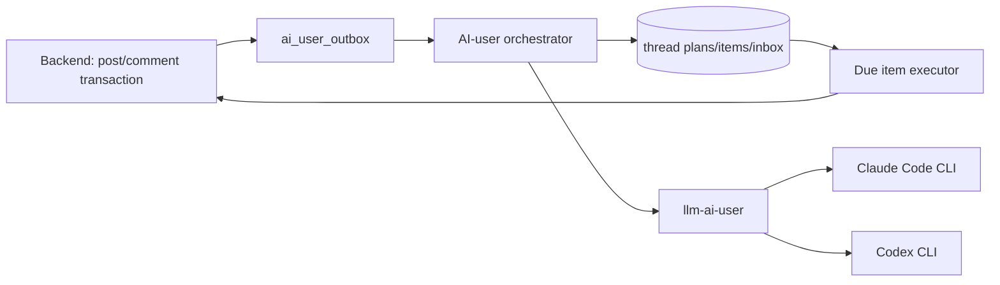

# AI User Thread Planning

## 목적과 적용 범위

`PLAN` 모드는 AI-user의 글·댓글·대댓글을 **생성 시점**과 **게시 시점**으로 분리한다. 한 게시글에 댓글이 30개라는 이유만으로 31회 LLM을 호출하지 않는다. 새 AI 게시글은 게시글 본문과 댓글/대댓글 후보 풀을 한 번의 구조화 LLM 요청으로 만들고, 사람 게시글은 저장 직후 비동기 한 번의 요청으로 후보 풀을 만든다. 실제 게시, 좋아요, 조회수, 투표는 데이터베이스에 저장된 계획을 따라 실행하며 추가 LLM을 쓰지 않는다.

이 문서는 PLAN 모드의 운영 SSOT다. legacy tick, paired-post, direct API, post analysis 및 self-critique는 전환 완료 전 호환 경로일 수 있으나 신규 PLAN 작업의 의존성이 아니다.

> **현재 상태 (2026-07-31)**: `posts.id`(VARCHAR)를 `Long`으로 파싱하려는 구조적 버그
> (2026-07-30 발견, `ThreadPlanGenerationService.planRequest` 등)를 수정 완료했다
> (comment/reply ID는 실제 BIGINT라 그대로 둠 — postId만 String 문제였다). 새
> `bundleTimeoutMs` 설정(기본값 240초)으로 LLM 응답 대기 시간도 확보했다.
> dev 검증(`ai-user-orchestrator-dev`, e2e-realbe 158 passed) 후 **prod에도
> 적용 완료** — `scheduler_mode='PLAN'`으로 운영 중이며, 새 글 생성 직후 댓글이
> 한꺼번에 몰리지 않고 예약 스케줄에 따라 분산 게시됨을 확인했다. 낮 시간
> 토큰 절약을 위해 workload provider를 새벽에만 `CLAUDE`로 켜는 배치가 크론으로
> 돈다. 상세: `docs/ai-user/operations.md` §8.

## 구성과 경계

- Backend는 게시글·댓글의 변경과 outbox event를 **같은 트랜잭션**에 기록한다. Spring in-process event만으로 외부 orchestrator 전달을 보장하지 않는다.
- `ai-user-orchestrator` (prod)와 `ai-user-orchestrator-dev` (dev 전용 신설)가 각각의 backend/DB에서 outbox를 소비해 plan/job/inbox를 만들고, due item을 lease해 backend API로 게시한다. 두 인스턴스는 공유 `llm-ai-user` 워커 컨테이너를 사용한다.
- `llm-ai-user`는 하나의 컨테이너다. Claude와 Codex CLI 바이너리를 함께 담지만 요청이 선택한 CLI 프로세스만 실행하고 매 요청 후 종료한다. 인증 디렉터리는 지속하되 대화 컨텍스트는 요청마다 격리한다.
- 사용자 원문·완성 prompt·LLM 원문은 일반 로그나 job 상세에 저장하지 않는다. 식별자, 길이, hash, failure code, latency만 운영 진단 기본값이다.

## workload별 LLM 계약

| workload | 입력 | 결과 | Claude | Codex |
|---|---|---|---|---|
| `AI_POST_BUNDLE` | topic/RAG, post persona, 참여 persona, 후보 수 | post + 댓글/대댓글 후보 | Sonnet | 5.6 Terra alias |
| `HUMAN_POST_PLAN` | 이미 저장된 사람 글, persona pool | 댓글/대댓글 후보 | Haiku | 5.6 Luna alias |
| `HUMAN_REPLY_BATCH` | 최대 10 post 또는 50 human interaction | 입력 comment ID별 1:1 AI reply | Haiku | 5.6 Luna alias |

실제 CLI model identifier는 `AI_POST_{CLAUDE,CODEX}_MODEL`, `AI_INTERACTION_{CLAUDE,CODEX}_MODEL`로 주입한다. 기본 Codex 값은 검증된 `gpt-5.6-terra`/`gpt-5.6-luna`이며, 모델 alias 변경에 대비해 환경변수로만 바꾼다.

각 job은 provider/model을 생성 시점에 snapshot한다. provider는 `CLAUDE`, `CODEX`, `OFF` 중 workload별로 고르며 `OFF`는 **새 job 생성만** 막는다. 같은 provider/model로 최대 한 번 재시도하고, 두 번째 실패는 `FAILED`이며 반대 provider 자동 전환은 금지한다. 관리자만 명시적으로 재시도할 수 있다.

## 계획과 후보 풀

기본 후보 풀은 최상위 댓글 14개와 대댓글 10개, 총 24개이며 운영 범위는 8~30개다. 그러나 dev 검증 결과, 기본 24개는 구조화 생성 시 LLM 응답이 5~10분 이상 지연되는 현상이 관찰되었다. 타임아웃 설정(bundleTimeoutMs)을 240초로 확대했으나 응답 시간 개선을 위해 **prod 전환 시 `candidate_pool_size=16`(최상위 14개 + 대댓글 2개)으로 설정할 것을 권고**한다. 후보 전체가 실제 게시되는 것은 아니다. 노출·사람 반응·시간대에 따라 통상 6~20개만 활성화한다.

검증 순서:

1. Claude `--json-schema`와 Codex `--output-schema`는 동일한 classpath JSON Schema를 사용한다. 이후 허용 persona ID, 길이, **item 단위 한국어/거절문**, 안전/중복을 다시 검증한다. JSON 봉투 자체는 언어 검사 면제 근거가 될 수 없다.
2. 부모 후보가 탈락하면 그 후보를 참조하는 대댓글도 탈락시킨다.
3. AI post bundle은 post가 유효하고 최상위 6개 이상, 전체 12개 이상일 때 부분 성공으로 수용한다.
4. 기준 미달이면 동일 모델로 한 번만 재시도한다. 개별 댓글을 채우는 추가 호출은 하지 않는다.
5. 검증된 candidate와 실행 metadata만 plan/item 테이블에 저장한다.

## 시간 배분과 수명

모든 계획은 실제 게시 시각 기준 최대 24시간(`absolute_expires_at`)만 유효하다. 고정 4/6/8시간 창을 강제하지 않는다. KST 기준 최근 28일의 **사람 활동**을 요일·시간별로 집계해 누적 유효 활동시간을 계산하고, 그 축에 candidate activation threshold를 배치한다.

- 새 글의 첫 일반 댓글은 보통 3~12분 뒤, reply는 부모가 게시된 뒤 최소 5분(일반적으로 10~60분) 뒤에만 가능하다.
- 관심은 초반에 가장 높고 이후 급격히 낮아진다. 새벽 02:00~06:00에는 일반 AI 글/댓글을 억제·재분배한다.
- 사람이 심야에 실제로 댓글을 남긴 경우 해당 상호작용에 대한 제한적 AI reply 1개는 15~90분에 허용할 수 있다. 일반 후보는 다음 활동 창으로 미룬다.
- 재시작 후 만료 전 item을 한 tick에 몰아 쓰지 않는다. 남은 exposure 구간에 다시 분산한다.

## 사람 상호작용

사람이 작성한 댓글/대댓글은 outbox를 통해 `ai_human_interaction_inbox`에 한 번만 들어간다. 30분 batch는 만료 전 `PENDING` 항목을 최대 10개 게시글 또는 50개 interaction으로 lease한다.

- 한 입력 comment ID는 하나의 reply 대상이다. 응답은 input comment ID와 1:1로 매핑한다.
- 일부 응답이 누락/실패하면 나머지는 저장하고 누락분만 다음 batch 후보로 남긴다.
- AI가 쓴 댓글·대댓글은 inbox에 넣지 않으므로 AI-to-AI 루프가 생기지 않는다.
- 사람이 AI 댓글에 답하면 해당 AI persona가 우선 답한다. AI 글의 사람 최상위 댓글은 post author persona가 우선이며, 사람 글에서는 후보 pool의 적합 persona를 선택한다.

## 수정, 신고, 삭제

- post title/body/category 변경 또는 partner answer 추가는 같은 post의 content revision으로 취급한다. 미게시 item을 취소하고 30분 debounce 후 새 revision으로 regenerate한다. 자동 replan 최대 횟수는 2회다. 이미 게시된 댓글은 보존한다.
- 신고 `PENDING`은 계획을 바꾸지 않는다. 관리자가 `BLOCKED` 처리하면 남은 관련 item을 취소한다.
- post delete/private는 plan 전체 취소, parent comment delete/block은 그 item과 자식을 취소한다.
- 사람/AI 여부와 무관하게 backend의 기존 notification event를 발생시킨다. AI 알림 집계나 억제는 하지 않는다.

## 실행 안전성

`ai_thread_plan_items.idempotency_key`는 unique이며 due executor는 DB lease를 획득한 뒤 실행한다. 실행 직전에 post/comment 공개 상태, 삭제/차단 상태, parent 완료, persona 활성 상태를 재확인한다. 내부 봇 게시 요청은 같은 값을 `Idempotency-Key` 헤더로 전송한다. backend의 `bot_request_dedup`은 synthetic JWT 요청에 한해 같은 키의 기존 target ID를 반환하므로 timeout처럼 성공 여부가 불명확한 경우에도 중복 없이 재시도한다.

운영 제어는 분리한다.

| 제어 | 의미 |
|---|---|
| workload provider `OFF` | 이후 해당 종류의 LLM job을 만들지 않음 |
| execution pause | 이미 만든 예약 item의 게시만 멈춤 |
| global kill switch | 새 plan/job과 예약 실행 모두 중단 |

## LLM 없는 engagement

조회수·좋아요·투표는 candidate 생성이나 post analysis를 호출하지 않는다. 기존 실제 수치를 절대 감소시키지 않고 점진적으로 목표에 접근한다.

- post like target: `views * 0.02 + total comments/replies * 0.6`
- comment like target: `post views * 0.002 + child replies * 1.0`, 최대 12
- reply like target: `post views * 0.001`, 최대 5
- 각 목표에는 ±20% jitter를 적용하되 자기 좋아요/중복 좋아요는 금지한다.
- view target: `12 + comments * 8 + votes * 6 + real human activity`; likes를 입력으로 쓰지 않아 순환을 막는다.

## 장애 코드와 관측

실패는 본문으로 게시하지 않는다. bridge와 orchestrator의 `LlmErrorSignature`/`ContentSafetyGuard`를 모두 통과한 결과만 저장·게시한다. 구조화 오류, 안전 오류, 인증 만료, timeout, provider unavailable, parent dependency, visibility changed는 failure code로 남긴다.

핵심 관측 값은 workload/provider별 job 수·latency·실패 코드, plan 상태, due item lease/게시/만료, batch input/output/누락, outbox 지연이다. 실제 콘텐츠나 prompt는 metric label에 넣지 않는다.
