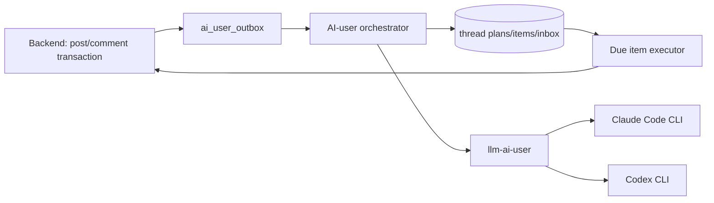

# AI User Thread Planning

## 목적과 적용 범위

`PLAN` 모드는 AI-user의 글·댓글·대댓글을 **생성 시점**과 **게시 시점**으로 분리한다. 한 게시글에 댓글이 30개라는 이유만으로 31회 LLM을 호출하지 않는다. 새 AI 게시글은 게시글 본문과 댓글/대댓글 후보 풀을 한 번의 구조화 LLM 요청으로 만들고, 사람 게시글은 저장 직후 비동기 한 번의 요청으로 후보 풀을 만든다. 실제 게시, 좋아요, 조회수, 투표는 데이터베이스에 저장된 계획을 따라 실행하며 추가 LLM을 쓰지 않는다.

이 문서는 PLAN 모드의 운영 SSOT다. legacy tick, paired-post, direct API, post analysis 및 self-critique는 전환 완료 전 호환 경로일 수 있으나 신규 PLAN 작업의 의존성이 아니다.

> **현재 상태 (2026-07-31)**: `posts.id`(VARCHAR)를 `Long`으로 파싱하려는 구조적 버그
> (2026-07-30 발견, `ThreadPlanGenerationService.planRequest` 등)를 수정 완료했다
> (comment/reply ID는 실제 BIGINT라 그대로 둠 — postId만 String 문제였다). 새
> `bundleTimeoutMs` 설정(기본값 240초)으로 LLM 응답 대기 시간도 확보했다.
> dev 검증(`ai-user-orchestrator-dev`, e2e-realbe 158 passed) 후 **prod에도
> 적용 완료** — `scheduler_mode='PLAN'`으로 운영 중이며, 새 글 생성 직후 댓글이
> 한꺼번에 몰리지 않고 예약 스케줄에 따라 분산 게시됨을 확인했다.
>
> **단, `AiPostBundleService.generateAndPublish()` 자체는 생성 즉시 발행이다** —
> 글(post) 수준에서는 "새벽에 만들면 새벽에 올라옴" 문제가 여전히 남아 있었다.
> 2026-07-31에 `generateAndHold()` + `ai_scheduled_posts` + `ScheduledPostPublisher`를
> 추가해 글 발행 자체도 생성과 분리했다. 새벽 배치는 이제 `generateAndHold`만
> 쓴다. 상세: `docs/ai-user/operations.md` §8.

## 구성과 경계

- Backend는 게시글·댓글의 변경과 outbox event를 **같은 트랜잭션**에 기록한다. Spring in-process event만으로 외부 orchestrator 전달을 보장하지 않는다.
- `ai-user-orchestrator` (prod)와 `ai-user-orchestrator-dev` (dev 전용 신설)가 각각의 backend/DB에서 outbox를 소비해 plan/job/inbox를 만들고, due item을 lease해 backend API로 게시한다. 두 인스턴스는 공유 `llm-ai-user` 워커 컨테이너를 사용한다.
- `llm-ai-user`는 하나의 컨테이너다. Claude와 Codex CLI 바이너리를 함께 담지만 요청이 선택한 CLI 프로세스만 실행하고 매 요청 후 종료한다. 인증 디렉터리는 지속하되 대화 컨텍스트는 요청마다 격리한다.
- 사용자 원문·완성 prompt·LLM 원문은 일반 로그나 job 상세에 저장하지 않는다. 식별자, 길이, hash, failure code, latency만 운영 진단 기본값이다.

## workload별 LLM 계약

| workload | 입력 | 결과 | Claude | Codex |
|---|---|---|---|---|
| `AI_POST_BUNDLE` | topic/RAG, post persona, 참여 persona, 후보 수 | post + 댓글/대댓글 후보 | Sonnet | 5.6 Terra alias |
| `HUMAN_POST_PLAN` | 이미 저장된 사람 글, persona pool | 댓글/대댓글 후보 | Haiku | 5.6 Luna alias |
| `HUMAN_REPLY_BATCH` | 최대 10 post 또는 50 human interaction | 입력 comment ID별 1:1 AI reply | Haiku | 5.6 Luna alias |

실제 CLI model identifier는 `AI_POST_{CLAUDE,CODEX}_MODEL`, `AI_INTERACTION_{CLAUDE,CODEX}_MODEL`로 주입한다. 기본 Codex 값은 검증된 `gpt-5.6-terra`/`gpt-5.6-luna`이며, 모델 alias 변경에 대비해 환경변수로만 바꾼다.

각 job은 provider/model을 생성 시점에 snapshot한다. provider는 `CLAUDE`, `CODEX`, `OFF` 중 workload별로 고르며 `OFF`는 **새 job 생성만** 막는다. 같은 provider/model로 최대 한 번 재시도하고, 두 번째 실패는 `FAILED`이며 반대 provider 자동 전환은 금지한다. 관리자만 명시적으로 재시도할 수 있다.

## 계획과 후보 풀

기본 후보 풀은 최상위 댓글 14개와 대댓글 10개, 총 24개이며 운영 범위는 8~30개다. 그러나 dev 검증 결과, 기본 24개는 구조화 생성 시 LLM 응답이 5~10분 이상 지연되는 현상이 관찰되었다. 타임아웃 설정(bundleTimeoutMs)을 240초로 확대했으나 응답 시간 개선을 위해 **prod 전환 시 `candidate_pool_size=16`(최상위 14개 + 대댓글 2개)으로 설정할 것을 권고**한다. 후보 전체가 실제 게시되는 것은 아니다. 노출·사람 반응·시간대에 따라 통상 6~20개만 활성화한다.

검증 순서:

1. Claude `--json-schema`와 Codex `--output-schema`는 동일한 classpath JSON Schema를 사용한다. 이후 허용 persona ID, 길이, **item 단위 한국어/거절문**, 안전/중복을 다시 검증한다. JSON 봉투 자체는 언어 검사 면제 근거가 될 수 없다.
2. 부모 후보가 탈락하면 그 후보를 참조하는 대댓글도 탈락시킨다.
3. AI post bundle은 post가 유효하고 최상위 6개 이상, 전체 12개 이상일 때 부분 성공으로 수용한다.
4. 기준 미달이면 동일 모델로 한 번만 재시도한다. 개별 댓글을 채우는 추가 호출은 하지 않는다.
5. 검증된 candidate와 실행 metadata만 plan/item 테이블에 저장한다.

## 시간 배분과 수명

모든 계획은 실제 게시 시각 기준 최대 24시간(`absolute_expires_at`)만 유효하다. 고정 4/6/8시간 창을 강제하지 않는다. KST 기준 최근 28일의 **사람 활동**을 요일·시간별로 집계해 누적 유효 활동시간을 계산하고, 그 축에 candidate activation threshold를 배치한다.

- 새 글의 첫 일반 댓글은 보통 3~12분 뒤, reply는 부모가 게시된 뒤 최소 5분(일반적으로 10~60분) 뒤에만 가능하다.
- 관심은 초반에 가장 높고 이후 급격히 낮아진다. 새벽 02:00~06:00에는 일반 AI 글/댓글을 억제·재분배한다.
- 사람이 심야에 실제로 댓글을 남긴 경우 해당 상호작용에 대한 제한적 AI reply 1개는 15~90분에 허용할 수 있다. 일반 후보는 다음 활동 창으로 미룬다.
- 재시작 후 만료 전 item을 한 tick에 몰아 쓰지 않는다. 남은 exposure 구간에 다시 분산한다.

## 사람 상호작용

사람이 작성한 댓글/대댓글은 outbox를 통해 `ai_human_interaction_inbox`에 한 번만 들어간다. 30분 batch는 만료 전 `PENDING` 항목을 최대 10개 게시글 또는 50개 interaction으로 lease한다.

- 한 입력 comment ID는 하나의 reply 대상이다. 응답은 input comment ID와 1:1로 매핑한다.
- 일부 응답이 누락/실패하면 나머지는 저장하고 누락분만 다음 batch 후보로 남긴다.
- AI가 쓴 댓글·대댓글은 inbox에 넣지 않으므로 AI-to-AI 루프가 생기지 않는다.
- 사람이 AI 댓글에 답하면 해당 AI persona가 우선 답한다. AI 글의 사람 최상위 댓글은 post author persona가 우선이며, 사람 글에서는 후보 pool의 적합 persona를 선택한다.

## 수정, 신고, 삭제

- post title/body/category 변경 또는 partner answer 추가는 같은 post의 content revision으로 취급한다. 미게시 item을 취소하고 30분 debounce 후 새 revision으로 regenerate한다. 자동 replan 최대 횟수는 2회다. 이미 게시된 댓글은 보존한다.
- 신고 `PENDING`은 계획을 바꾸지 않는다. 관리자가 `BLOCKED` 처리하면 남은 관련 item을 취소한다.
- post delete/private는 plan 전체 취소, parent comment delete/block은 그 item과 자식을 취소한다.
- 사람/AI 여부와 무관하게 backend의 기존 notification event를 발생시킨다. AI 알림 집계나 억제는 하지 않는다.

## 실행 안전성

`ai_thread_plan_items.idempotency_key`는 unique이며 due executor는 DB lease를 획득한 뒤 실행한다. 실행 직전에 post/comment 공개 상태, 삭제/차단 상태, parent 완료, persona 활성 상태를 재확인한다. 내부 봇 게시 요청은 같은 값을 `Idempotency-Key` 헤더로 전송한다. backend의 `bot_request_dedup`은 synthetic JWT 요청에 한해 같은 키의 기존 target ID를 반환하므로 timeout처럼 성공 여부가 불명확한 경우에도 중복 없이 재시도한다.

운영 제어는 분리한다.

| 제어 | 의미 |
|---|---|
| workload provider `OFF` | 이후 해당 종류의 LLM job을 만들지 않음 |
| execution pause | 이미 만든 예약 item의 게시만 멈춤 |
| global kill switch | 새 plan/job과 예약 실행 모두 중단 |

## LLM 없는 engagement

조회수·댓글/대댓글 좋아요는 candidate 생성이나 post analysis를 호출하지 않는다.
현재 값보다 낮아지는 방향으로는 절대 안 움직이고(`deficit = max(0, target - current)`),
목표에 점진적으로만 접근한다. **구현: `PlanEngagementDispatcher`**
(`ai-user/orchestrator/.../service/engagement/`, 2026-07-31~) — LEGACY
`BehaviorEngine.tick()`이 삭제된 뒤에도 완전히 독립적으로 5분 cron
(`AI_USER_ENGAGEMENT_CRON`)으로 돈다. 게이트는 `ai_user_runtime.enabled`가
**아니라** `AI_USER_ENGAGEMENT_ENABLED` + `ai_user_kill_switch`/
`schedule_execution_paused`.

- comment like target: `post views * 0.025 + child replies * 1.0`, 최대 12
- reply like target: `post views * 0.012`, 최대 5
- **2026-07-31 재조정**: 최초 계수(`0.002`/`0.001`)는 조회수가 수천 단위일 걸
  가정한 값이었다. 실제 PLAN 모드 글의 조회수는 74~207(평균 ~139) 수준이라
  이 규모에서는 지터를 최대로 잡아도(`round(views*coef*1.19)`) 대댓글은
  거의 항상 0으로 수렴하고, 최상위 댓글도 `child replies` 항이 없으면 0에
  머물러 "좋아요가 한두 개만 보임" 현상의 실제 원인이었다. 실측 조회수 대비
  타깃이 1~6(댓글)/1~3(대댓글) 범위에 들어오도록 `commentLikePerView`를
  12.5배(`0.025`), `replyLikePerView`를 12배(`0.012`)로 올렸다. 바닥값(floor)은
  두지 않는다 — 새 댓글이 0에서 시작해 스레드가 채워지며(=조회수가 자연히
  올라가며) 점진적으로 붙는 게 자연스럽다.
- 지터는 **결정적**이다(대상 id의 CRC32 기반, `Math.random()` 아님) — 문서 초안 단계의
  "±20% jitter" 표현은 부정확했다. 5분마다 재평가하는 수렴형 구조라 지터가 매번
  달라지면 타깃이 계속 흔들려 좋아요가 무한 누적될 수 있어서, 대상마다 고정된
  값을 쓴다(`EngagementTargetCalculator.jitter`, `ViewDispatcher`와 동일 기법).
- 매 실행마다 조회수(`ViewDispatcher.dispatchViews()`)를 먼저 갱신한 뒤 그 값으로
  좋아요 타깃을 계산한다 — `ViewDispatcher`가 의도적으로 좋아요를 조회수 공식에서
  빼는 것과 짝을 이뤄 순환 증폭을 막는다.
- **post like target: `views * 0.02 + comments/replies * 0.6`.** 2026-07-31까지는
  이 디스패처가 다루지 않고 `service/threadplan/VoteLikeBatchService.java`
  (`provider_vote_like` 게이트, 글로벌 일일 쿼터)가 별도로 담당했으나, **그
  서비스는 삭제됐다.** 원인: `provider_vote_like`가 prod에서 계속 `'OFF'`였고
  — 새벽 배치 스크립트(`env/scripts/nightly-ai-user-batch.sh`)는 LLM provider
  3종만 켜고 이 컬럼은 건드리지 않아서 — 투표·글 좋아요가 완전히 0에
  수렴했다(실측: `persona_action_log` VOTE 7/27~29 일 14~28건 → 7/31 **2건**,
  LIKE 동 기간 13~26건 → **0건**). 이제 `PlanEngagementDispatcher`가 흡수해
  `postLikeTarget()`을 직접 호출한다. 좋아요는 토글이라 이미 누른 페르소나가
  재선택되면 오히려 깎이므로, 후보에서 `alreadyLikedPostAuthorIds(postId)`와
  글 작성자(`snapshot.authorId()`) 제외가 필수다. 예산은 댓글/대댓글 좋아요와
  `maxLikeCallsPerRun`을 공유한다(같은 토글 성격·같은 위험).
- **투표(vote) target: `views * 0.15`, 최대 80.** 익명 투표는 실사용자가 댓글보다
  훨씬 활발히 참여한다는 판단(사용자 확정, 2026-07-31)으로 댓글 계수보다 훨씬
  큰 15%를 쓴다(조회수 139 → 17~25표, 현재 댓글 6~14개의 약 1.5~2배). 이것도
  `VoteLikeBatchService` 삭제로 흡수된 기능이다. 그 서비스의 구조적 결함
  두 가지도 같이 해결됐다:
  - **A:B 편향**: 옛 서비스는 항상 `voteOptions.get(0)`만 찍어 100:0으로
    쏠렸다. 지금은 글마다 결정적 목표 A(작성자측) 비율을
    `EngagementTargetCalculator.voteAShare(postId, min, max)`로 구하고(기본
    `[0.44, 0.80]`, prod 자연 분포 실측치), `chooseVoteOptionIndex(currentA,
    currentB, targetAShare)`로 그 목표에 못 미치는 쪽에만 표를 얹는다 — 표를
    **추가만** 하므로 사람이 이미 던진 표를 뒤집지 않는다. `voteAShare`는
    `jitter()`와 **다른 솔트**(`"ashare:"+postId`)로 해시한다 — 같은 해시를
    쓰면 표 목표량과 A-비율이 완전히 상관돼 "표 많은 글은 항상 A 편중"이라는
    부자연스러운 패턴이 생긴다.
  - **중복 투표 방지**: `votes` 테이블의 `UNIQUE(post_id, voter_user_id)` 때문에
    같은 페르소나가 같은 글에 두 번 투표하면 백엔드가 409를 던진다. 디스패치
    전 `alreadyVotedUserIds(postId)`로 반드시 걸러낸다.
  - **예산 분리**: 투표는 `maxVoteCallsPerRun`(기본 40)이라는 별도 카운터를
    쓴다 — 댓글 좋아요 backfill이 `maxLikeCallsPerRun`을 다 먹으면 투표가
    영구히 굶는 걸 막기 위함이다. `maxVotesPerPostPerRun`(기본 8)으로 한 글이
    페르소나 풀을 통째로 소진해 나머지 글의 투표를 굶기는 것도 막는다 — 미달분은
    다음 5분 실행이 DB에서 deficit을 다시 읽어 이어받는다.
  - **페르소나 풀 60으로 상향**(기존 30): 투표는 UNIQUE 제약상 한 페르소나가
    한 글에 1표뿐이라, cap 12인 댓글 좋아요와 달리 풀보다 큰 투표 타깃(최대
    80, 실무 최대 ~37)에 쉽게 걸린다. warm 우선 선발이라 풀이 작으면 매 실행
    거의 같은 인원이 뽑히고 그 인원이 1회차에 전부 투표하면 2회차부터 후보가
    `coldLoginBudget`(3)만큼만 남는다. 60은 상한일 뿐이라 로그인 부하는
    늘지 않는다.
- `ai_thread_plan_items`(`item_type = POST_LIKE/COMMENT_LIKE/REPLY_LIKE/VIEW`)를
  쓰지 않는다 — 발행 파이프라인(`lockDueItems`/`ThreadPlanPublisher.publish()`)이
  타입 필터가 없어 핫패스를 건드려야 하고, `idempotency_key` UNIQUE 제약이
  "같은 대상을 다시 좋아요"라는 수렴형 재평가와 맞지 않는다. 4개 enum 상수는
  선언만 남아있고 아무도 만들거나 소비하지 않는다.
- `ai_user_runtime.daily_global_cap`을 공유하지 않는다 — LEGACY tick 전용
  카운터라 공유하면 그 캡 도달 시 engagement가 조용히 멈춘다. 대신 실행당
  상한(`maxPostsPerRun`, `maxLikeCallsPerRun`)만 둔다.
- 백필과 평상시 운영은 같은 코드다(`reconcile(lookbackDays, ...)`) — 차이는
  `lookbackDays` 뿐. `POST /admin/trigger/reconcile-engagement?dryRun=true`로
  실제 반영 없이 부족분만 먼저 확인할 수 있다.
- **댓글/대댓글 좋아요 디스패치용 페르소나 풀은 실행(run)당 한 번만 구성한다
  (2026-07-31~).** prod의 로그인 레이트리밋(`security.rate-limit.auth-per-minute`
  기본값 **분당 5회/IP**, `RateLimitFilter.java`, dev만 1000으로 override)을
  orchestrator의 모든 봇 로그인이 공유한다. 계수 재조정으로 디스패치 시도량이
  대폭 늘면서, 매 댓글마다 활성 페르소나 전체(~150명)를 다시 섞어 후보로 쓰는
  기존 방식은 한 번의 5분 실행 안에서 서로 다른 페르소나가 대거 처음 로그인을
  시도하게 만들어 이 레이트리밋에 걸렸다(실측 COMMENT_LIKE 실패율 43%). 지금은
  `reconcile()` 시작부에서 `BotTokenCache`에 유효 토큰이 이미 있는("warm")
  페르소나를 우선 채우고, 모자란 만큼만 새로 로그인할("cold") 페르소나를
  `coldLoginBudget`(기본 3) 한도 안에서 추가해 `personaPoolSize`(기본 30)
  풀을 만들고, 이 풀을 실행 전체의 댓글 반복문에서 재사용한다. 자기 좋아요/
  중복 좋아요 제외 로직은 그대로 이 풀 위에서 동작한다. 토큰 TTL이 24시간이라
  전체 페르소나가 warm해지고 나면(수 시간 내) 실행당 로그인 0회에 수렴한다.
- `planModePostIds`가 `created_at DESC`로 정렬해 반환하고 `maxLikeCallsPerRun`
  소진 시 즉시 끊기던 구조는 캡을 다 채우는 실행마다 가장 오래된 글부터
  영원히 처리되지 않는 편향을 만들었다. `reconcile()`이 매번 post 목록을
  받은 뒤 셔플해서 이 편향을 없앤다. `maxLikeCallsPerRun`도 `300→500`으로
  올렸다(전체 수렴에 필요한 총량보다는 낮게 유지 — 여러 회차에 걸쳐 점진적으로
  채워지는 게 급격한 스파이크보다 자연스럽다).
- **cold 페르소나 로그인 실패는 즉시 풀에서 제거한다.** 배포 직후 실측:
  `ActionExecutor.execute()`는 JWT 획득 실패 시 예외 없이 조용히 no-op하는데,
  실패한 cold 페르소나가 이 사실을 모른 채 남은 댓글들의 후보로 계속 재선택되면
  같은 페르소나 하나가 한 실행 안에서 수십 번 다시 로그인을 시도해 429를
  반복 유발했다(실측: 밀리초 단위로 같은 personaId 재시도). 지금은 `execute()`
  직후 `botTokenCache.hasValidToken(persona.getId())`로 실제 로그인 성공 여부를
  확인해 실패 시 그 실행의 `personaPool`에서 즉시 제거한다 — cold 페르소나당
  실패는 실행마다 최대 1회로 확정 상한이 걸린다.

## 장애 코드와 관측

실패는 본문으로 게시하지 않는다. bridge와 orchestrator의 `LlmErrorSignature`/`ContentSafetyGuard`를 모두 통과한 결과만 저장·게시한다. 구조화 오류, 안전 오류, 인증 만료, timeout, provider unavailable, parent dependency, visibility changed는 failure code로 남긴다.

핵심 관측 값은 workload/provider별 job 수·latency·실패 코드, plan 상태, due item lease/게시/만료, batch input/output/누락, outbox 지연이다. 실제 콘텐츠나 prompt는 metric label에 넣지 않는다.
