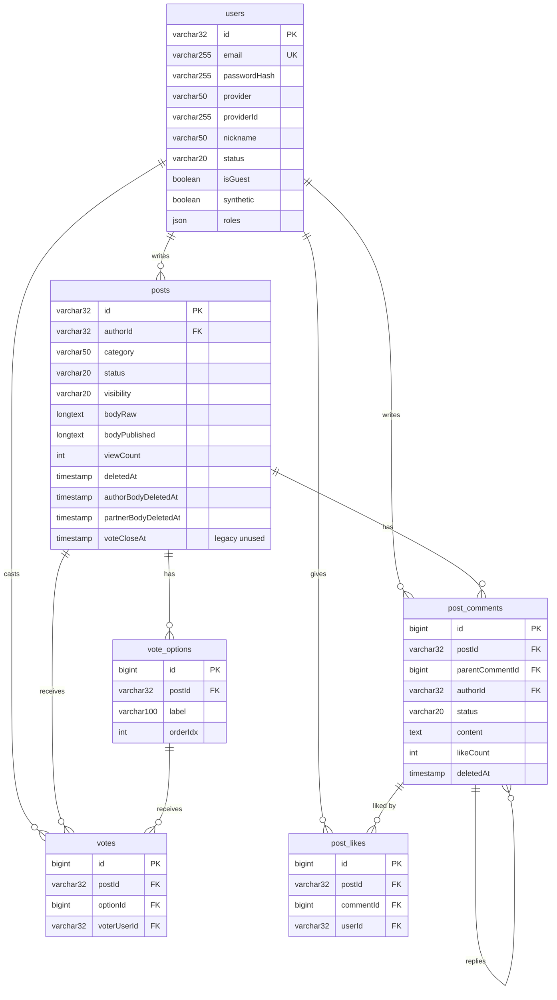

# 데이터베이스 스키마 (MariaDB 11)

> last-verified: 2026-09-01 · code-ref: `backend/src/main/resources/db/migration/V48~V124.sql` · `backend/.../domain/community/` · `backend/.../domain/marketing/` · `ai-user/orchestrator/src/main/resources/db/migration/V1~V13.sql`
>
> 충돌 시 Flyway 마이그레이션 SQL이 우선. 이 ER은 코드 기준 현행 상태 반영.

**주의**: 2026-06-02 커뮤니티 광장 피벗 완료. V56 = `DROP TABLE sessions, turns, messages, reports` (구 중재 모델 제거).

## 핵심 도메인 ER 다이어그램

<!-- last-verified: 2026-08-31 -->
<!-- code-ref: backend/src/main/resources/db/migration -->


> UNIQUE 제약: `votes(postId, voterUserId)` — 사용자 1인 1투표.

## Source of truth

| 항목 | 위치 |
|---|---|
| Flyway 마이그레이션 | `backend/src/main/resources/db/migration/V*.sql` |
| AI-user Flyway 마이그레이션 | `ai-user/orchestrator/src/main/resources/db/migration/V*.sql` |
| JPA 엔티티 | `backend/src/main/java/com/againspring/domain/**` |
| AI-user JPA 엔티티 | `ai-user/orchestrator/src/main/java/com/againspring/aiuser/orchestrator/domain/**` |
| Repository | `backend/src/main/java/com/againspring/repository/**` |

코드와 문서가 충돌하면 **마이그레이션 SQL이 옳습니다**.

## 환경

| 환경 | 호스트 | DB 이름 | 컨테이너 |
|---|---|---|---|
| local | localhost:3306 | `againspring` | `againspring-mariadb` |
| dev | dev 서버 internal + 호스트:3309 | `againspring_dev` | `againspring-mariadb-dev` |
| prod | prod 서버 internal only | `againspring` | `againspring-mariadb-prod` |

설정: `backend/src/main/resources/application*.yml` + `env/.env.{dev,prod}.example`  
CHARSET: `utf8mb4` / COLLATION: `utf8mb4_unicode_ci` / TIMEZONE: `UTC`

## 현재 테이블 (광장형)

### 핵심 엔티티

| 테이블 | 역할 | PK | 추가 정보 |
|---|---|---|---|
| `users` | 회원/게스트 계정 | VARCHAR(32) | V1~V24, ULID-style |
| `posts` | 커뮤니티 광장 게시글 | BIGINT auto | **V48** 신규 |
| `vote_options` | 투표 선택지 (작성자/상대방) | BIGINT auto | **V49** 신규 |
| `votes` | 사용자 투표 기록 | BIGINT auto | **V49** 신규 |
| `post_comments` | 게시글 댓글 | BIGINT auto | **V50** 신규 |
| `post_likes` | 좋아요 | BIGINT auto | **V50** 신규 |
| `community_reports` | 신고 | BIGINT auto | **V52** 신규, 게시글/댓글 신고 |
| `notifications` | 알림 | BIGINT auto | **V53** 신규, 댓글/좋아요 알림 |

### 마케팅 테이블 (V15+, dev 전용)

| 테이블 | 역할 | PK |
|---|---|---|
| `marketing_source_stories` | 사연 수집·승인 | BIGINT auto |
| `marketing_simulations` | 시뮬레이션 실행 기록 | BIGINT auto |
| `marketing_contents` | 플랫폼별 콘텐츠 | BIGINT auto |
| `marketing_usage_logs` | LLM 비용 기록 | BIGINT auto |
| `marketing_audit_logs` | 콘텐츠 감사 이력 | BIGINT auto |
| `marketing_hashtag_library` | 해시태그 풀 | BIGINT auto |
| `marketing_content_templates` | 카피 템플릿 | BIGINT auto |

### 지원 테이블

| 테이블 | 역할 | PK |
|---|---|---|
| `feedbacks` | 사용자 피드백 | BIGINT auto |
| `daily_stats` | 일별 PMF 집계 | BIGINT auto |
| `email_verifications` | 이메일 인증 코드 | BIGINT auto |
| `password_reset_tokens` | 비밀번호 재설정 | BIGINT auto |
| `revoked_tokens` | JWT 블랙리스트 | BIGINT auto |
| `encrypted_secret` | 앱 시크릿 AES-GCM vault (마케팅 제외) | `secret_key` VARCHAR(128) **V101** |
| `marketing_holding` | 마케팅 대기 보드 (초안·순위 스냅샷) | `post_id` VARCHAR(32) PK **V102** |
| `marketing_job` | ASM 마케팅 잡 | BIGINT auto · `requested_by` VARCHAR(128) · 품질 진단/재생성 추적 **V115** · 구조화 실패 계약 **V116** · `scheduled_publish_at` NOT NULL **V117** |
| `marketing_generation_trace` | LLM 생성 기록 (프롬프트·응답·시봄이 선택) | BIGINT auto **V119** |
| `marketing_publication_stats` | 플랫폼 참여 스냅샷 (X/IG/YT best-effort) | BIGINT auto **V110** |
| `marketing_stats_event` | 통계 탭 활동 타임라인 (수집·제안·확정) | BIGINT auto **V111** |
| `visit_events` | 방문 계측 (경로·UTM·referrer·봇 판정·고유방문자) | BIGINT auto · 유입 귀속 확장 **V120** |
| `marketing_holding_exclusion` | 홀딩 풀 콘텐츠 가드 제외 사유 (조용한 누락 방지) | `post_id` VARCHAR(32) PK **V121** |
| `x_ops_action` | X 성장 루프 원장 (ritual / inbound / outbound) | BIGINT auto |
| `x_persona_example` | Justant-Bot 말투 코퍼스 (TIMELINE gold / DELETED_AUTO avoid) | BIGINT auto **V123** · 드릴 행 삭제 **V124** |

### AI-user 운영 테이블

| 테이블 | 역할 | PK |
|---|---|---|
| `personas` | AI-user 행동 주체 프로필 | VARCHAR(32) |
| `persona_relationships` | 페르소나 관계 그래프 | BIGINT auto |
| `persona_seen_posts` | 조회/행동 이력 캐시 | 복합 PK |
| `persona_action_log` | 행동 실행 로그 | BIGINT auto |
| `ai_user_runtime` | global kill-switch / cap | INT(1 row) |
| `persona_history_entries` | 글/댓글 재주입용 history | BIGINT auto |
| `persona_life_state` | casual streak / ongoing situation | VARCHAR(32) |
| `ai_user_outbox` | backend transaction에서 기록하는 AI-user lifecycle event | CHAR(36) UUID | V87, orchestrator 전달 보장 |
| `ai_llm_jobs` | provider/model snapshot과 제한 재시도를 기록하는 LLM job | BIGINT auto | V87, prompt/content 원문 미저장 |
| `ai_thread_plans` | 게시글 revision별 candidate plan | VARCHAR(36) UUID | AI-user Flyway V6가 소유 |
| `ai_thread_plan_items` | candidate와 due/lease/idempotency 실행 상태 | VARCHAR(36) UUID | AI-user Flyway V6가 소유. V8 `stance`/`source_example_id`, **V15 `human_author_id`**(human-reply 예산 범위), **V19 `stance` VARCHAR(64)** (자유 라벨; 구 16은 LLM 라벨 truncate로 persist 실패) |
| `ai_human_interaction_inbox` | 사람 댓글/대댓글의 30분 batch 입력 · attempt/error ledger | VARCHAR(36) UUID | source comment unique; V14 attempt_count/last_error_code/schema_version |
| `ai_post_interested_personas` | post별 human-reply 관심 persona pool | BIGINT auto | AI-user Flyway V13. loose refs, UNIQUE(post_id, persona_id) |
| `bot_request_dedup` | synthetic bot 게시 요청의 `Idempotency-Key`와 결과 target 매핑 | VARCHAR(160) | V88, timeout 재시도 중복 게시 방지 |
| `ai_user_generation_config` | AI 유저 생성 정책 싱글톤(id=1) — 일일 목표량·PLAN provider·**bundle_timeout_ms·nightly_*** | INT(1 row) | V70, backend 소유·orchestrator는 읽기 전용 미러. **V90** 레거시 삭제 + `provider_vote_like`. **V91** `hr_*`. **V100** 타임아웃·새벽 배치 슬롯 |


---

## 핵심 테이블 상세

### `users` (V1 + V2 + V11 + V13 + V17 + V20~V24)

| 컬럼 | 타입 | Flyway | 비고 |
|---|---|---|---|
| `id` | VARCHAR(32) PK | V1 | ULID-style |
| `email` | VARCHAR(255) | V1/V2 | nullable (소셜 가입 시) |
| `password_hash` | VARCHAR(255) | V1/V2 | nullable (소셜/게스트) |
| `nickname` | VARCHAR(100) | V1 | 필수 |
| `provider` | VARCHAR(50) | V2 | google/kakao/naver/null |
| `provider_id` | VARCHAR(255) | V2 | OAuth provider user id |
| `is_guest` | BIT(1) | V21 | 게스트 계정 여부 |
| `roles` | JSON | V1 | `["USER"]` 기본. 가능 값: USER/TESTER/ADMIN |
| `communication_style` | VARCHAR(50) | V1 | wave/mountain/flame/leaf/moon/star |
| `onboarding_completed_at` | DATETIME(6) | V21 | NULL이면 온보딩 미완료 |
| `mbti_type` | VARCHAR(8) | **V11** | 16유형 (선택, nullable) |
| `mbti_profile` | JSON | **V13** | 4축 비율 `{e_i,s_n,t_f,j_p}` 0~100 |
| `terms_agreed_at` | DATETIME(6) | **V17** | 이용약관 동의 시각 |
| `privacy_agreed_at` | DATETIME(6) | **V17** | 개인정보 처리방침 동의 시각 |
| `disclaimer_agreed_at` | DATETIME(6) | **V17** | 면책 고지 동의 시각 |
| `marketing_agreed_at` | DATETIME(6) | **V17** | 마케팅 수신 동의 (선택) |
| `must_change_password` | BOOLEAN | **V20** | 임시 비밀번호 강제 변경 플래그 |
| `tutorial_completed_at` | TIMESTAMP | **V24** | 30초 튜토리얼 완료 시각. NULL=미완료 |
| `acquisition_source` | VARCHAR(100) | (기존) | 유입 채널 first-touch (youtube/x/instagram). **2026-08-29까지 엔티티 매핑·기록 코드가 없어 전 행 NULL이었다** — `AcquisitionAttribution`이 `as_utm` 쿠키에서 채운다 |
| `acquisition_campaign` | VARCHAR(100) | (기존) | 유입 캠페인 (`story_{jobId}`). 사연 단위 성과 역추적 키 |
| `deleted_at` | TIMESTAMP(3) | V1 | 소프트 삭제 |
| `created_at`, `updated_at` | TIMESTAMP(3) | V1 | |

---

### `posts` (V48~V56, V85, V87, V89, V92, V94, **V97**, **V98**, **V99**, **V105**, **V106**, **V107**, **V108**; 검색 인덱스 → V93 `post_search_ngrams`)

| 컬럼 | 타입 | Flyway | 비고 |
|---|---|---|---|
| `id` | BIGINT auto PK | V48 | |
| `author_id` | VARCHAR(32) FK | V48 | 작성자 |
| `title` | VARCHAR(255) | V48 | 제목 |
| `promo_title` | VARCHAR(500) | **V92**, 상한 **V96** | **SNS 마스터 훅**(도발적). IG 패킹용 `\n` 허용. 원제 복제 아님. PLAN/`PromoTitleService` |
| `hook_emotion` | VARCHAR(16) | **V108** | 마스터 훅 감정. `shock\|anger\|tension\|sad\|hype` only. null=미생성/폴백 |
| `capture_split_after_line` | INT | **V94** (deprecated) | 구 단일 컷. 읽기 폴백만 |
| `capture_split_after_lines` | JSON | **V98** | X/IG 캡쳐 컷 배열(1-based, 각 장 마지막 블록; 마지막 장 제외). null=1장/휴리스틱 |
| `partner_capture_split_after_lines` | JSON | **V98** | 상대 본문 캡쳐 컷(동일 의미) |
| `content` | MEDIUMTEXT | V48 | 본문 (**30일 후 NULL**) |
| `relationship_type` | VARCHAR(32) | V48 | RelationType enum (couple/marriage/friend/family/parent_child) |
| `category` | JSON | V48 | `{major, middle, minor, customMinor?}` |
| `published` | BOOLEAN | V48 | 공개 여부 |
| `partner_token` | VARCHAR(64) | V54 | 투표 초대 링크 토큰 |
| `partner_user_id` | VARCHAR(32) FK | V54 | 초대 수락 사용자 |
| `three_way_partner_id` | VARCHAR(32) FK | V54 | 3자 중재 파트너 |
| `publish_mode` | VARCHAR(32) | V54 | runtime: `PUBLISH_NOW` \| `WAIT_FOR_PARTNER` (후자는 API 호환·동작=즉시 PUBLIC). **V97** 데이터 정리 |
| `vote_duration_hours` | INT | V54 | **legacy / unused (2026-08-11~)** — 시한부 투표 제거. API에서 ignore |
| `vote_close_at` | TIMESTAMP | V54~ | **legacy / unused (2026-08-11~)** — 신규 쓰기 중지. 공감 투표는 상시. 컬럼은 후속 drop 후보 |
| `expires_at` | TIMESTAMP(3) | V48 | 게시글 만료 시각 (선택) |
| `empathy_ratio` | DECIMAL(5,2) | V48 | 공감 비율 (0.0~1.0, 동적 계산) |
| `source_example_id` | BIGINT | **V85** | 원본 사례 예제 ID (nullable) |
| `source_community` | VARCHAR(64) | **V85** | 원본 커뮤니티명 (nullable) |
| `source_url` | VARCHAR(1024) | **V85** | 원본 URL (nullable) |
| `source_original_title` | VARCHAR(512) | **V85** | 원본 제목 (nullable) |
| `source_original_body` | LONGTEXT | **V85** | 원본 본문 (nullable) |
| `created_at`, `updated_at` | TIMESTAMP(3) | V48 | |
| `content_revision` | INT UNSIGNED | V87 | 내용 변경마다 증가. AI thread plan이 참조한 글 revision과 비교하는 optimistic revision |
| `created_by_admin` | BOOLEAN | **V89** | 관리자가 통합 콘텐츠관리 화면에서 수동 생성한 글 여부. 공개 API 미노출, 어드민 전용 표시(배지)용 |
| `metaphor_id` | VARCHAR(64) | **V99** | 대표(1순위) 메타포 일러스트 ID. `post_metaphors`에 랭크 0으로 중복 저장(하위호환). **영상 경로에서는 무시**(시봄이 shortlist로 대체, 컬럼 보존) |
| `sibom_candidates` | JSON | **V112** | 시봄이 캐릭터 이미지 id 숏리스트(≤12). 사연 본문 keyword 스코어(코드, LLM 없음). soft-fill 풀은 미저장. Spec: `docs/shared/marketing/70-policy/sibom-video-insertion.md` |
| `author_body_deleted_at` | TIMESTAMP(6) | **V107** | 작성자 본문 tombstone. 상대 ACTIVE면 제목·상대 유지; 양쪽 tombstone이면 `deleted_at` soft full-delete |
| `partner_body_deleted_at` | TIMESTAMP(6) | **V107** | 상대 본문 tombstone. 토큰 유지·재작성 가능 |

### `post_metaphors` (**V105**)

사연당 3~5개 메타포 랭크 목록(적합도 순). **레거시** — Shorts/Reels 영상 경로에서는 사용하지 않음(시봄이 `sibom_candidates`/`sibom_plan`으로 대체). DB·API는 하위호환용으로 보존.

| 컬럼 | 타입 | 비고 |
|---|---|---|
| `post_id` | VARCHAR(32) FK, PK | `posts.id`, `ON DELETE CASCADE` |
| `metaphor_id` | VARCHAR(64), PK | 메타포 일러스트 ID (예: `empty-chair`) |
| `rank` | INT | 0=대표(=`posts.metaphor_id`와 동기화), 1+ = 본문 삽입 순 |

인덱스: `PRIMARY(post_id, metaphor_id)`, `idx_pm_rank(rank)`. `Post.metaphorIds`(`@ElementCollection`, `@OrderColumn(name="rank")`)로 매핑, `MetaphorCatalog.sanitizeList`가 카탈로그 검증+dedup+최소 3개 패딩+최대 5개 cap 후 저장.

### `post_search_ngrams` (**V93**)

MariaDB는 MySQL `FULLTEXT … WITH PARSER ngram` 미지원. 광장 검색용 문자 바이그램을 BTREE로 유지.

| 컬럼 | 타입 | 비고 |
|---|---|---|
| `post_id` | VARCHAR(32) PK | posts.id |
| `gram` | VARCHAR(8) PK | utf8mb4_bin 바이그램 (제목+본문≤4k자에서 추출) |

인덱스: `PRIMARY(post_id, gram)`, `idx_post_search_ngrams_gram(gram)`. 게시/본문수정 시 재색인, 기동 시 미적재분 백필(`againspring.search.ngram-backfill-on-startup`).

---

### `post_comments` (V50, V87, V89)

| 컬럼 | 타입 | 비고 |
|---|---|---|
| `id` | BIGINT auto PK | |
| `post_id` | BIGINT FK | posts ON DELETE CASCADE |
| `author_id` | VARCHAR(32) FK | users |
| `parent_id` | BIGINT FK | NULL이면 최상위 댓글, 값이면 대댓글 |
| `content` | MEDIUMTEXT | **30일 후 NULL** |
| `is_deleted` | BOOLEAN | 논리적 삭제 플래그 |
| `content_revision` | INT UNSIGNED | 댓글/대댓글 내용 변경마다 증가. 사람 interaction inbox의 stale 처리 기준 |
| `created_by_admin` | BOOLEAN | **V89** 관리자 수동 생성 여부. 공개 API 미노출 |
| `created_at`, `updated_at` | TIMESTAMP(3) | |

---

### `vote_options` (V49)

| 컬럼 | 타입 | 비고 |
|---|---|---|
| `id` | BIGINT auto PK | |
| `post_id` | BIGINT FK | posts |
| `label` | VARCHAR(100) | "공감하는 사람", "상대방 입장 이해" 등 |
| `display_order` | INT | 표시 순서 |

---

### `votes` (V49)

| 컬럼 | 타입 | 비고 |
|---|---|---|
| `id` | BIGINT auto PK | |
| `post_id` | BIGINT FK | posts |
| `user_id` | VARCHAR(32) FK | users |
| `vote_option_id` | BIGINT FK | vote_options |
| `created_at` | TIMESTAMP(3) | |

---

### `community_reports` (V52)

| 컬럼 | 타입 | 비고 |
|---|---|---|
| `id` | BIGINT auto PK | |
| `post_id` | BIGINT FK | posts (nullable) |
| `comment_id` | BIGINT FK | post_comments (nullable) |
| `reporter_id` | VARCHAR(32) FK | users |
| `reason` | VARCHAR(100) | 신고 사유 |
| `status` | VARCHAR(20) | pending / reviewed / approved / rejected |
| `created_at` | TIMESTAMP(3) | |

---

### `notifications` (V53)

| 컬럼 | 타입 | 비고 |
|---|---|---|
| `id` | BIGINT auto PK | |
| `user_id` | VARCHAR(32) FK | users |
| `type` | VARCHAR(32) | comment / like / report 등 |
| `ref_id` | BIGINT | 참조 엔티티 ID (post/comment) |
| `is_read` | BOOLEAN | 읽음 여부 |
| `created_at` | TIMESTAMP(3) | |

읽은 알림은 30일 후 자동 삭제 (retention).

---

### `ai_content_corrections` (V68, V74, V86)

| 컬럼 | 타입 | Flyway | 비고 |
|---|---|---|---|
| `id` | BIGINT auto PK | V68 | |
| `target_type` | VARCHAR(16) | V68 | POST \| COMMENT |
| `target_id` | VARCHAR(64) | V68 | 게시글/댓글 ID (문자열화) |
| `persona_id` | VARCHAR(32) FK | V68 | users.id (AI 페르소나) |
| `category` | VARCHAR(50) | V68 | 글 카테고리 (nullable, 예제뱅크 환류 시 사용) |
| `original_text` | LONGTEXT | V68 | 첨삭 전 본문 |
| `corrected_text` | LONGTEXT | V68 | 관리자 수정본 |
| `persona_caution` | TEXT | V68 | 확정된 페르소나 주의사항 (nullable) |
| `admin_id` | VARCHAR(32) FK | V68 | 처리한 관리자 users.id |
| `applied_live` | BIT(1) | V68 | 라이브 글 교체 완료 여부 |
| `pushed_to_bank` | BIT(1) | V68 | 예제뱅크 환류 여부 |
| `source_original_text` | LONGTEXT | **V86** | 원본 비교 시 원본 본문 (nullable) |
| `created_at` | TIMESTAMP(3) | V68 | |

---

### `ai_global_rules` (V68)

| 컬럼 | 타입 | 비고 |
|---|---|---|
| `id` | BIGINT auto PK | |
| `rule_text` | VARCHAR(500) | 규칙 텍스트 (예: "~하지 말 것" 형식) |
| `scope` | VARCHAR(16) | POST \| COMMENT \| ALL \| RECONSTRUCTION |
| `source_correction_id` | BIGINT FK | ai_content_corrections.id (nullable, 수동 추가 시 NULL) |
| `active` | BIT(1) | 활성화 여부 |
| `created_by` | VARCHAR(32) FK | 생성한 관리자 users.id |
| `created_at` | TIMESTAMP(3) | |

### `persona_history_entries` (AI-user orchestrator V5)

| 컬럼 | 타입 | 비고 |
|---|---|---|
| `id` | BIGINT auto PK | |
| `persona_id` | VARCHAR(32) FK | personas.id |
| `entry_type` | VARCHAR(16) | `POST` \| `COMMENT` |
| `target_post_id` | VARCHAR(32) | backend posts.id 문자열 |
| `category` | VARCHAR(32) | 글 history일 때 광장 카테고리 |
| `content_hash` | CHAR(64) | legacy import / 중복 방지 |
| `content` | LONGTEXT | 실제 본문 |
| `created_at` | DATETIME(3) | 생성 시각 |

### `persona_life_state` (AI-user orchestrator V5)

| 컬럼 | 타입 | 비고 |
|---|---|---|
| `persona_id` | VARCHAR(32) PK/FK | personas.id |
| `casual_streak` | INT | 연속 CASUAL 글 수 |
| `ongoing_situation` | VARCHAR(255) | 진행 중 상황 요약 |
| `updated_at` | DATETIME(3) | 마지막 갱신 시각 |

---

### `encrypted_secret` (**V101**)

비마케팅 앱 시크릿 보관. 마스터키는 env `AS_SECRET_MASTER_KEY`만 (DB에 저장 금지).

| 컬럼 | 타입 | 설명 |
|---|---|---|
| `secret_key` | VARCHAR(128) PK | 논리 키 (`jwt.secret`, `github.pat.<user>` 등) |
| `enc_blob` | TEXT | Base64(`iv \|\| ciphertext \|\| gcm_tag`) — `AesGcmCipher` |
| `updated_at` | TIMESTAMP(3) | 자동 갱신 |

기동 로더: `EncryptedSecretEnvironmentPostProcessor`. 시딩: `scripts/seed_encrypted_secrets_from_env.py`. GitHub PAT는 `scripts/git-credential-as-vault`.

### `visit_events` (**V120** 유입 계측 확장)

방문 1건 = 1행. `PublicVisitController`가 저장하고 `AcquisitionFunnelService`가 집계한다.

| 컬럼 | 타입 | Flyway | 비고 |
|---|---|---|---|
| `id` | BIGINT PK | (기존) | auto |
| `occurred_at` | TIMESTAMP | (기존) | 방문 시각 |
| `path` | VARCHAR(500) | (기존) | 쿼리스트링 제외 경로 |
| `utm_source/medium/campaign/content` | VARCHAR(100) | (기존) | **2026-08-29까지 FE가 snake_case로 전송해 전량 유실됐다** (DTO는 camelCase). `visits.ts` 참조 |
| `referrer` | VARCHAR(500) | (기존) | `document.referrer` |
| `session_key` | VARCHAR(64) | (기존) | sessionStorage 단위. 같은 이유로 100% NULL이었음 |
| `visitor_key` | VARCHAR(64) | **V120** | 1년 쿠키(`as_vid`). 고유 방문자·재방문 |
| `user_agent` | VARCHAR(300) | **V120** | 봇 판정 근거 보존 — 규칙 변경 시 재분류용 |
| `is_bot` | TINYINT(1) | **V120** | `VisitorClassifier` 판정. **집계는 항상 `is_bot=0` 필터** |
| `country` | VARCHAR(8) | **V120** | `CF-IPCountry` 헤더 |
| `device_type` | VARCHAR(16) | **V120** | mobile/tablet/desktop/unknown |
| `user_id` | VARCHAR(32) | **V120** | 로그인·게스트 상태면 기록 (방문→투표→가입 연결) |

인덱스: `visitor_key` · `(is_bot, occurred_at)` · `(utm_source, occurred_at)` · users `(acquisition_source, created_at)`

---

### `marketing_holding_exclusion` (**V121**)

`MarketingHoldingContentGuard`가 홀딩 풀 적재에서 후보를 걸러낼 때 사유를 남긴다.
2026-08-29 X 상위 노출 5건 중 2건이 갈등 사연이 아니었던 데서 출발했다
("덕혜옹주…고종 독살", "여초회사 1년 근무자가 쓰는 장단점").

| 컬럼 | 타입 | 비고 |
|---|---|---|
| `post_id` | VARCHAR(32) PK | posts.id. post당 1행 — 최초 감지 사유만 유지 |
| `reason` | VARCHAR(64) | `YEAR_TRIVIA_PATTERN` · `PROS_CONS_LISTICLE` |
| `detected_at` | TIMESTAMP(3) | 최초 감지 시각 |

제외는 삭제가 아니다. 오탐이 미탐보다 비싸므로 판정은 의도적으로 좁고, 걸린 글이
여기 남아야 나중에 오탐을 SELECT로 검증하고 되돌릴 수 있다.

---

### `marketing_holding` (**V102**)

사연당 1행 대기 보드. T+24h 전 초안·점수/순위 스냅샷 · soft-reserve 핀 · 확정(`COMMITTED`)/탈락(`DROPPED`).  
런타임: `MarketingHoldingService` · `MarketingHoldingCommitService` · Admin `/api/admin/marketing/holding*` · `/completed*`.

| 컬럼 | 타입 | 설명 |
|---|---|---|
| `post_id` | VARCHAR(32) PK FK→posts | 사연 |
| `status` | VARCHAR(20) | `IN_POOL` \| `PINNED` \| `OUT_OF_CUT` \| `COMMITTED` \| `DROPPED` |
| `pin_format` | VARCHAR(10) NULL | `VIDEO` \| `TEXT` (PINNED일 때 soft-reserve 포맷) |
| `draft_json` | JSON NULL | BriefDto형 마케팅 초안 |
| `score_snapshot` | DOUBLE NULL | 마지막 가중 점수 |
| `rank_snapshot` | INT NULL | 마지막 투영 순위 |
| `platform_rank_snapshot` | JSON NULL | T+24h 자동 선정 때 실제 선택된 플랫폼별 1-based 순위 (`{"youtube_shorts":1}`); 핀/강제 확정은 빈 값 |
| `locked_at` | TIMESTAMP(3) NULL | COMMITTED 시 잠금 (이후 draft 읽기 전용) |
| `created_at` / `updated_at` | TIMESTAMP(3) | |

### `feedbacks` (V16)

| 컬럼 | 타입 | 비고 |
|---|---|---|
| `id` | BIGINT auto PK | |
| `user_id` | VARCHAR(32) FK | nullable (익명 제출) |
| `post_id` | BIGINT FK | nullable (세션 연동) |
| `category` | VARCHAR(50) | praise / bug / suggestion / other / crisis |
| `content` | TEXT | 피드백 본문 (최소 10자) |
| `contact_consent` | BOOLEAN | 연락 동의 여부 |
| `contact_email` | VARCHAR(255) | consent=true 시만 저장 |
| `page_url` | VARCHAR(500) | nullable |
| `user_agent` | VARCHAR(500) | nullable |
| `status` | VARCHAR(20) | pending / reviewed / resolved |
| `created_at`, `updated_at` | DATETIME(6) | |

---

## 마이그레이션 요약 (V1~V90 + AI-user V1~V14)

| 범위 | 설명 |
|---|---|
| **V1~V27** | 구 중재 모델 (sessions, turns, messages, reports) |
| **V28~V39** | 마케팅 테이블 (V15+ dev 전용) |
| **V40~V47** | (미사용) |
| **V48~V55** | 광장형 신규 (posts, votes, comments, notifications 등) |
| **V56** | **DROP TABLE sessions, turns, messages, reports** |
| **V57~V67** | 마케팅 기능 확장 (ASM 이관 관련) |
| **V68~V74** | AI 첨삭 학습 시스템 (corrections, global_rules) |
| **V75~V76** | 마케팅 ENUM 정규화 |
| **V77~V84** | (마케팅/운영 기능) |
| **V85** | posts 테이블에 원본 비교 컬럼 추가 (source_example_id, source_community, source_url, source_original_title, source_original_body) |
| **V86** | ai_content_corrections 테이블에 source_original_text 컬럼 추가 |
| **V87** | `posts`/`post_comments` content revision, backend `ai_user_outbox`, `ai_llm_jobs`, PLAN 운영 config 추가 |
| **V88** | `bot_request_dedup` 추가. synthetic 봇 글/댓글의 내부 멱등성 보장 |
| **V89** | `posts`/`post_comments`에 `created_by_admin` 추가. 관리자 콘텐츠관리 통합테이블 수동 생성 표시용 |
| **V90** | `ai_user_generation_config`에서 레거시 스케줄러 필드(scheduler_mode/backend_post·comment·reply/prompt_caching/daily_token_budget) 삭제, `provider_vote_like` 추가 — AI 생성관제 PLAN 모드 일원화 |
| **AI-user V1~V4** | personas / relationships / runtime / action log / seen posts |
| **AI-user V5** | `persona_history_entries`, `persona_life_state` 추가 (legacy file history DB 이관) |
| **AI-user V6** | `ai_thread_plans`, `ai_thread_plan_items`, `ai_human_interaction_inbox` 추가 (별도 Flyway history) |
| **AI-user V7~V12** | scheduled posts · stance · persona history/facts/capsules · match audits |
| **AI-user V13** | `ai_post_interested_personas` — post별 관심 persona pool (PLAN_CAST seed at READY; MATCHER/MANUAL later) |
| **AI-user V14** | `ai_human_interaction_inbox`에 `attempt_count` · `last_error_code` · `schema_version` (자동 재시도 원장) |
| **AI-user V15** | `ai_thread_plan_items.human_author_id` — human-reply 예산을 (post, human) 대화 단위로 분리. 없으면 한 게시글의 첫 사용자가 3×5=15 예산을 독점 |
| **AI-user V19** | `ai_thread_plan_items.stance` VARCHAR(16)→**64** — LLM 자유 라벨(`concerned_supportive` 등) STRICT insert 실패 방지 |
| **V91** | `ai_user_generation_config`에 `hr_*` 7컬럼 — 댓글 생성량 설정(SSOT: `/admin/ai-user`). 대화 총상한은 저장하지 않고 `hr_distinct_personas_max × hr_replies_per_persona_max` 파생 |
| **V93** | `post_search_ngrams` — 광장 검색용 문자 바이그램 (MariaDB ngram FULLTEXT 대체) |
| **V94** | `posts.capture_split_after_line` — X/IG 캡쳐 전반부 끝 개행 블록(1-based) |
| **V97** | `WAIT_FOR_PARTNER` private-until-partner 폐기 데이터 정리: `PRIVATE + WAIT_FOR_PARTNER` 중 `created_at` >30일 → `deleted_at` soft-delete; 나머지 → `PUBLIC` (+ 당시 `vote_close_at` 보정; **이후 시한부 투표 제거로 미사용**) |
| **V98** | `posts.capture_split_after_lines` / `partner_capture_split_after_lines` JSON — N장 캡쳐 컷 |
| **V100** | `ai_user_generation_config`에 `bundle_timeout_ms`·`nightly_paired_share`·`nightly_slot_*` — 구조화 LLM 타임아웃·새벽 배치 슬롯/양면 비율 (SSOT: `/admin/ai-user`, 저장 즉시 반영) |
| **V101** | `encrypted_secret` — 앱 시크릿 AES-GCM vault (마케팅 자격증명 제외) |
| **V102** | `marketing_holding` — 24h 대기 보드 (초안·핀 soft-reserve·점수/순위 스냅샷·COMMITTED/DROPPED) |
| **V104** | `marketing_job.requested_by` VARCHAR(32)→128 — 강제 배포 `admin:force:`+JWT UUID(≈48) 저장 |
| **V106** | AI jury 제거 — `DROP TABLE jurors`, `posts.juror_count` 컬럼 삭제 |
| **V107** | `posts.author_body_deleted_at` / `partner_body_deleted_at` — 쪽별 본문 tombstone (상대 초대 소유권·삭제) |
| **V108** | `posts.hook_emotion` VARCHAR(16) — SNS 마스터 훅 감정(`shock\|anger\|tension\|sad\|hype`). `promo_title`=도발적 마스터 훅(원제 복제 아님) |
| **V109** | `system_setting` 시드 — Phase 2 플랫폼별 cap(`marketing.cap.*` 기본 3) + score weights(`marketing.score.weights.{platform}.*`, plan §3). legacy text/video cap은 fallback |
| **V110** | `marketing_publication_stats` — 발행 후 플랫폼 통계 스냅샷(`job_id`,`post_id`,`platform`,`metrics_json`,partial). SSOT=AS; 수집기는 ASM. `system_setting` `marketing.score.auto_adjust` 기본 `false` |
| **V111** | `marketing_stats_event` — 통계 탭 append-only 이벤트(`event_type`,`platform`,`payload_json`,`created_at`). 타입: `COLLECT_*` · `PROPOSE` · `APPLY` · `SHADOW_TOGGLE` |
| **V112** | `posts.sibom_candidates` JSON — 시봄이 이미지 id 숏리스트(≤12). 본문 keyword 스코어(코드). soft-fill 미저장 |
| **V115** | `marketing_job.failure_code`, `generation_diagnostics` JSON, `actual_duration_ms`, `retry_of_job_id`, `generation_attempt` — 영상 품질 실패 원인·실제 길이·재생성 계보. 진단에는 원 프롬프트/LLM 원출력을 저장하지 않음 |
| **V116** | `marketing_job.failure_stage`, `retryable`, `error_summary` — ASM/WaggleBot의 구조화 실패 단계·재시도 가능 여부·정제된 운영자 요약 |
| **V114** | `marketing_holding.platform_rank_snapshot` JSON — T+24h 자동 선정의 실제 플랫폼별 순위 잠금 |
| **V117** | `marketing_job.scheduled_publish_at` **NOT NULL** 승격(2026-08-15) — 슬롯 조회 실패 시 폴백 로직으로 항상 값을 채우도록 코드가 먼저 바뀐 뒤 승격. 잔여 NULL 행은 `created_at`으로 백필 |
| **V119** | `marketing_generation_trace` — 영상 변형 단계에서 LLM 호출·시봄이 선택 이력 저장(프롬프트·응답·가드 로그 포함). **사연 본문은 30일 후 NULL이지만 trace에 영구 보관** |

### `marketing_generation_trace` (**V119**)

Video variant 및 promo title 생성 시 LLM 프롬프트·응답·시봄이 가드 로직을 감사·디버깅 목적으로 저장.
Phase 1 = VIDEO_VARIANT 스테이지(instagram_reels/youtube_shorts). Phase 2+ 향후 PROMO_TITLE, WaggleBot 이펙트음 확장 예정.

**데이터 보존 정책**: 사연 `posts.content`는 30일 후 NULL 처리되지만, 이 테이블의 `llm_prompt`에 본문이 포함되어 있어 사실상 **사연 본문은 영구 보관된다**. 오너(마케팅팀)가 LLM 호출 원문 추적을 목적으로 명시적으로 이를 선택했으므로 의도된 동작이다. 민감한 콘텐츠 관리 필요 시 별도 보존 정책 재검토.

| 컬럼 | 타입 | 설명 |
|---|---|---|
| `id` | BIGINT auto PK | |
| `job_id` | BIGINT FK | marketing_job.id, ON DELETE CASCADE |
| `post_id` | VARCHAR(32) FK | posts.id |
| `platform` | VARCHAR(32) NOT NULL | `instagram_reels` \| `youtube_shorts` |
| `stage` | VARCHAR(32) NOT NULL | `VIDEO_VARIANT` \| `PROMO_TITLE` (향후) |
| `render_profile` | VARCHAR(64) | 마케팅 렌더 프로필 (`marketing_fast`, `marketing_v2` 등) |
| `llm_model` | VARCHAR(64) | `claude-haiku-4-5-20251001` 등. 재시도 후 폴백 모델명 가능 |
| `llm_prompt` | LONGTEXT | LLM 호출 시 전송된 완전 프롬프트(**사연 본문 포함, 영구 보관**) |
| `llm_response` | LONGTEXT | LLM 응답 원문 (파싱 전) |
| `llm_attempt` | INT | 시도 번호 (1기반, 재시도 후 증가) |
| `llm_result` | VARCHAR(64) | 결과 코드 (`OK`, `PARSE_ERROR`, `TRUNCATED_JSON`, `LLM_ERROR`, `TIMEOUT` 등) |
| `llm_duration_ms` | BIGINT | LLM 호출 소요 시간 (밀리초) |
| `final_hook` | VARCHAR(1000) | 최종 hook 문구 (TTS 마지막 가드 통과 후) |
| `final_script` | LONGTEXT | 최종 영상 대본 (TTS 입력) |
| `sibom_scores` | JSON | 시봄이 후보 점수 리스트 — `ScoredCandidate[]`: `{id, score, matchedKeywords, matchedTriggers}` |
| `sibom_plan_llm` | JSON | LLM 생성 원안 시봄이 플랜 — 가드 전 |
| `sibom_plan_final` | JSON | 가드 통과 후 최종 시봄이 플랜(렌더링 입력) |
| `sibom_guard_log` | JSON | 가드 실행 로그 — `GuardLogEntry[]`: `{action, imageId, reason}` |
| `created_at` | TIMESTAMP(3) | |

인덱스: `idx_mgt_job_id(job_id)`, `idx_mgt_platform_stage(platform, stage)`.

### `marketing_stats_event` (**V111**)

통계 탭 타임라인. 수집·테마 제안/확정·shadow 토글 이력을 append-only로 저장.  
런타임: `MarketingStatsEventService` · Admin `GET /api/admin/marketing/stats/events`.

| 컬럼 | 타입 | 설명 |
|---|---|---|
| `id` | BIGINT auto PK | |
| `event_type` | VARCHAR(32) NOT NULL | `COLLECT_STARTED` \| `COLLECT_COMPLETED` \| `COLLECT_FAILED` \| `PROPOSE` \| `APPLY` \| `SHADOW_TOGGLE` |
| `platform` | VARCHAR(32) NULL | 관련 채널 (`x_thread` 등) |
| `payload_json` | TEXT NULL | 요약 페이로드 |
| `created_at` | TIMESTAMP(3) | 인덱스 `idx_mse_created_at` |

### `x_ops_action` (성장 루프 원장)

ritual / inbound / outbound 작문·게시 결과. 어드민 REST 없음 — 일일·글당 cap·중복 답글 조회용 내부 원장.

| 컬럼 | 타입 | 설명 |
|---|---|---|
| `id` | BIGINT auto PK | |
| `kind` | VARCHAR | `RITUAL` \| `INBOUND` \| `OUTBOUND` |
| `target_tweet_id` | VARCHAR | 답글 대상 트윗. 이미 처리했는지 조회 |
| `parent_tweet_id` | VARCHAR | 스레드 부모 (outbound 대댓글) |
| `our_post_tweet_id` | VARCHAR | 우리 글(inbound 글당 cap) |
| `posted_tweet_id` | VARCHAR | 우리가 게시한 트윗 ID (`POSTED`일 때) |
| `body` | TEXT | 게시 본문 |
| `status` | VARCHAR | `POSTED` \| `SKIPPED` \| `FAILED` |
| `skip_reason` | VARCHAR(32) | `VIDEO` \| `UNSURE` \| `TOO_LONG` \| `LAUGH_SPAM` \| `ECHO` \| `SAFETY` \| `VISION_FAIL` \| `NO_VOICE` \| `LLM_ERROR` \| `CAP` \| `DISABLED` \| `DEV_LLM_OFF` \| `PUBLISH_FAILED` \| `ASM_ERROR` |
| `created_at` | TIMESTAMP | 일일 cap·글당 cap 집계 |

인덱스: `idx_xoa_kind_created(kind, created_at)` (일일 cap), `idx_xoa_target(target_tweet_id)` (중복 스킵), `idx_xoa_our_post_created(our_post_tweet_id, created_at)` (글당 inbound).

### `x_persona_example` (Justant-Bot 말투 코퍼스) **V123** · **V124**

운영자가 X에서 직접 단 댓글만 gold. 파이프·학습 상세 [`justant-bot-x-ops.md`](../shared/marketing/70-policy/justant-bot-x-ops.md). `source=TIMELINE`은 새벽 FxTwitter 수집(부모 글 텍스트 없을 수 있음). Justant-Bot이 올린 댓글 id(`x_ops_action.posted_tweet_id`)는 gold에서 제외. 최근 3일 POSTED 선댓글·대댓글이 타임라인에 없으면 `DELETED_AUTO`. Telegram 드릴(`DRILL`)은 V124에서 삭제. `tweet_id` unique.

| 컬럼 | 타입 | 설명 |
|---|---|---|
| `id` | BIGINT auto PK | |
| `source` | VARCHAR(16) | `TIMELINE` \| `DELETED_AUTO` (`DRILL` 잔존 enum만) |
| `tweet_id` | VARCHAR(64) UNIQUE | 우리 댓글 status id |
| `post_text` | TEXT | TIMELINE은 null 가능. DELETED_AUTO는 대상 트윗 id |
| `has_photo` | TINYINT(1) | 사진 유무 |
| `operator_body` | TEXT | gold=운영자 한 줄. DELETED_AUTO=지운 자동댓글 본문 |
| `created_at` | TIMESTAMP(3) | |

인덱스: `uk_xpe_tweet(tweet_id)`, `idx_xpe_source_created(source, created_at)`.

---

## 데이터 보존 정책

| 대상 | 보존 기간 | 책임 |
|---|---|---|
| `posts.content` | 30일 후 NULL | retention |
| `post_comments.content` | 30일 후 NULL | retention |
| `post_comments` (is_deleted=true) | 30일 후 NULL | retention |
| `notifications` (읽음) | 30일 후 DELETE | retention |
| `notifications` (미읽) | 영구 보관 | — |
| `users` (탈퇴) | 소프트 삭제 (deleted_at 설정) | 사용자 요청 |
| 마케팅 테이블 | 별도 정책 | — |

자세한 정책: [`../shared/70-policy/data-retention.md`](../shared/70-policy/data-retention.md)

---

## 마이그레이션 추가 절차

```bash
# 다음 버전 번호 확인 (현재 V56 → 다음 V57)
ls backend/src/main/resources/db/migration/

# V57__<descriptive_name>.sql 작성
$EDITOR backend/src/main/resources/db/migration/V57__add_xxx.sql

# dev에서 검증
cd env
docker compose -f docker-compose.dev.yml up -d --build
docker logs againspring-backend-dev | grep -i flyway
```

규칙:
- 파일명: `V<n>__<snake_case>.sql` (밑줄 두 개)
- ROLLBACK은 별도 마이그레이션으로 (Flyway Community는 undo 미지원)
- ALTER TABLE 시 `IF EXISTS` 또는 idempotent 패턴 사용
- **dev 프로파일은 Flyway 비활성** — dev에서 테이블 확인 후 prod 배포 전 반드시 Flyway 실행 검증
