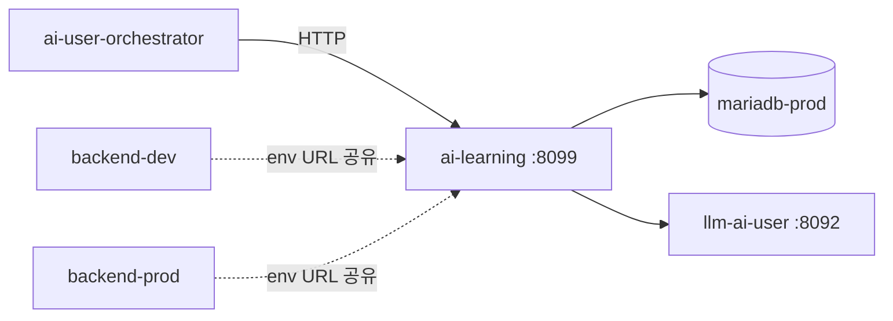

# Backend AI Learning Integration

backend와 orchestrator가 shared `ai-learning` 서비스와 연결되는 지점을 설명한다.

## 현재 구조

- learning 서비스는 `env/docker-compose.ai-user.yml`의 `againspring-ai-learning` 하나다.
- 포트는 `8099`이고, host health 체크가 가능하다.
- DB는 prod MariaDB를 사용한다.
- scheduler는 env flag로 제어된다.

권위본은 [`../ai-user/README.md`](../../ai-user/10-context.md)와 런타임 코드다.

## 주요 사실

| 항목 | 현재 동작 |
|---|---|
| 서비스명 | `againspring-ai-learning` |
| compose | `env/docker-compose.ai-user.yml` |
| 기본 URL | `http://againspring-ai-learning:8099` |
| DB 대상 | `againspring-mariadb-prod` |
| host 노출 | `8099:8099` |

## scheduler gate

| 변수 | 의미 |
|---|---|
| `AI_LEARNING_ENABLED` | false면 scheduler 자체를 시작하지 않음 |
| `AI_LEARNING_CRAWL_ENABLED` | false면 crawl/strengthen/topic 일일 작업을 등록하지 않음 |

중요:

- API 엔드포인트는 컨테이너가 떠 있는 한 응답할 수 있다.
- scheduler 비활성은 background job 등록을 멈추는 의미다.

## 호출 관계



## 주요 API 성격

세부 endpoint는 learning 코드와 ai-user 문서를 우선하되, 현재 구조상 다음 범주가 중요하다.

- `/health`
- `/examples/*`
- `/crawl/*`
- `/strengthen/*`
- `/topics/*`

orchestrator는 예시 검색, 스타일 샘플, 토픽 관련 기능을 learning에 의존한다.

## backend에서 알아야 할 점

- `backend-dev`, `backend-prod`는 둘 다 `AI_LEARNING_URL`을 shared learning으로 가리킨다.
- runtime write source는 prod이므로, learning이 저장하는 데이터도 운영 기준으로 해석해야 한다.
- dev에서 보는 learning 관련 결과는 shared 서비스 기준일 수 있고, dev DB 자체와 일치하지 않을 수 있다.

## 운영 체크

```bash
curl http://localhost:8099/health
docker compose -f env/docker-compose.ai-user.yml --env-file env/.env.ai-user logs -f ai-learning
```

## 관련 문서

- [`../ai-user/learning.md`](../../ai-user/30-components/learning.md)
- [`../ai-user/operations.md`](../../ai-user/60-runtime/operations.md)
- [`../env/environment-variables.md`](../../env/environment-variables.md)
