# AI Learning System — 자기진화 문서

> **목적**: AI 유저가 한국 커뮤니티 데이터를 지속적으로 학습해 인간과 분간 불가능한 수준의 글·댓글을 생성하도록 진화하는 시스템.

---

## 1. 시스템 개요

현재 AI 유저는 생성 시마다 동일한 정적 few-shot 예시와 프롬프트만 사용한다. 이 시스템은 세 가지 레이어로 자기진화를 구현한다.

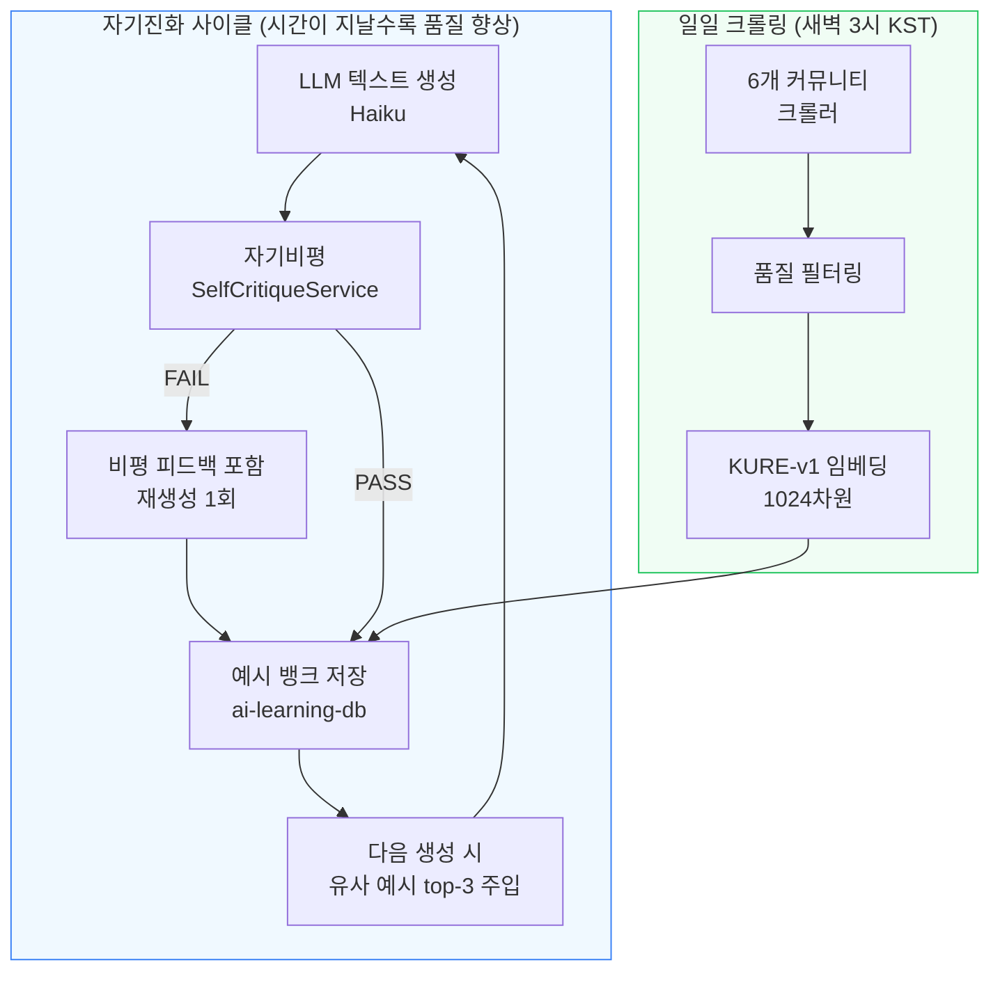

### 핵심 제약
- **Claude 파인튜닝 불가** → "학습" = RAG(유사 예시 동적 주입) + 자기비평 루프로 구현
- **공식 API 우선** (Naver/Daum), Playwright 크롤링은 공개 콘텐츠만
- **IP 차단 방지**: 사이트별 2~7초 지터, UA 로테이션, 403/429 감지 즉시 중단

---

## 2. 아키텍처

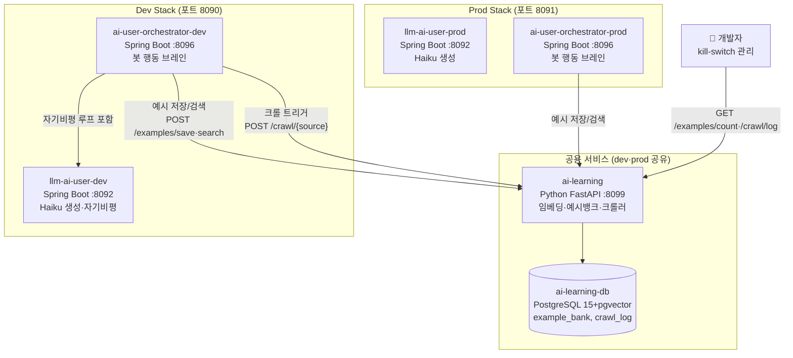

---

## 3. 컨테이너 배포 구조

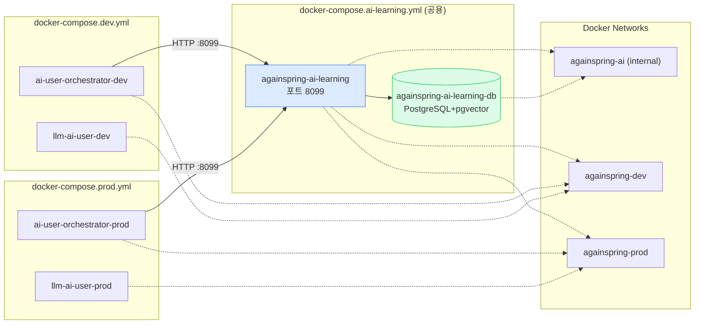

---

## 4. Phase 1 — 자기비평 루프 (Self-Critique Loop)

### 4.1 흐름도

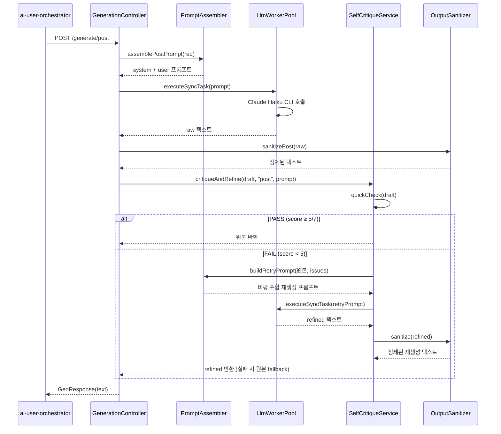

### 4.2 채점 루브릭 (KatFishNet 기반, 7점 만점)

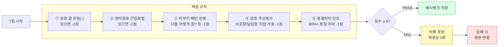

### 4.3 환경변수

| 변수 | 기본값 | 설명 |
|---|---|---|
| `SELF_CRITIQUE_ENABLED` | `false` | 자기비평 루프 활성화 |
| `SELF_CRITIQUE_THRESHOLD` | `5` | PASS 기준 점수 (7점 만점) |

---

## 5. Phase 2 — 예시 뱅크 + RAG

### 5.1 데이터 흐름

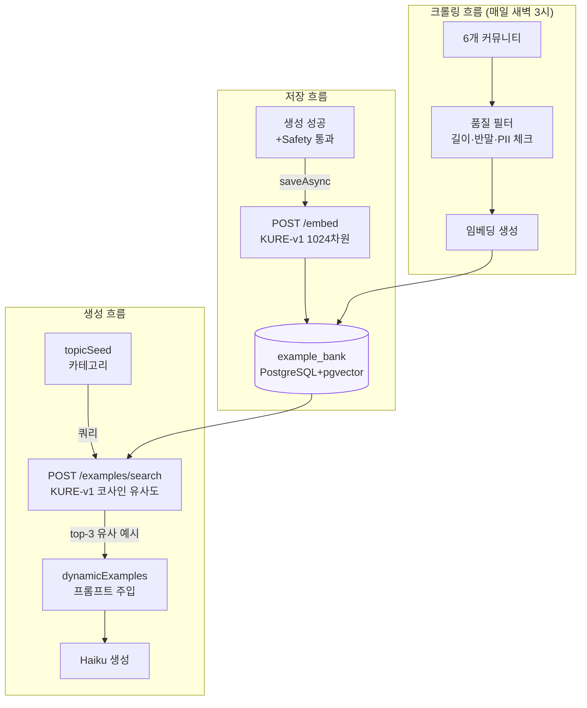

### 5.2 예시뱅크 데이터 모델

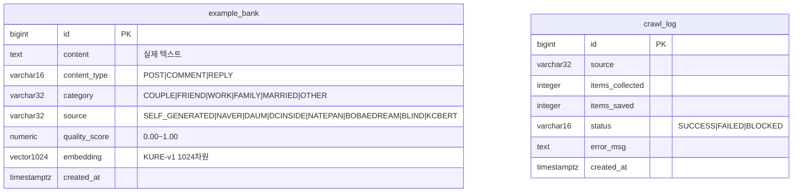

### 5.3 벡터 검색 쿼리 (pgvector)

```sql
-- 코사인 유사도 기반 top-K 검색
SELECT id, content, source,
       1 - (embedding <=> CAST(:vec AS vector)) AS similarity
FROM example_bank
WHERE content_type = :ctype
  AND (:cat IS NULL OR category = :cat)
ORDER BY embedding <=> CAST(:vec AS vector)
LIMIT :k;
```

---

## 6. Phase 3 — 커뮤니티 크롤링 파이프라인

### 6.1 크롤러 아키텍처

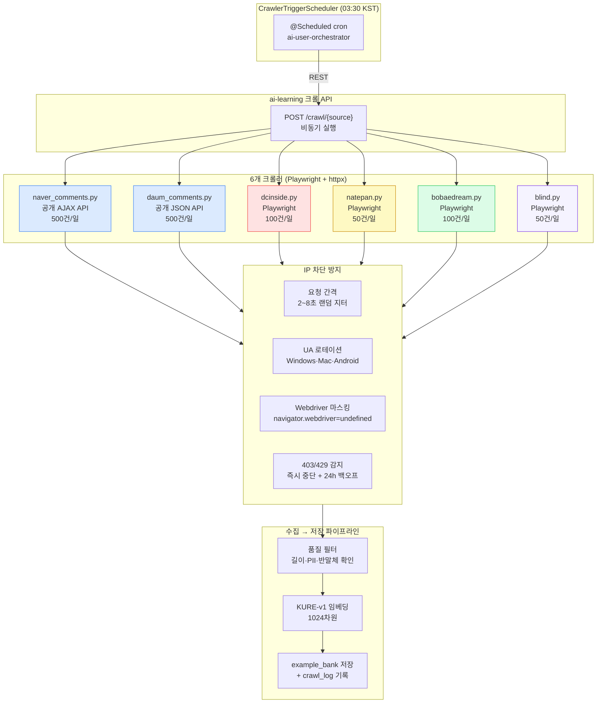

### 6.2 소스별 수집 전략

| 소스 | 방식 | URL | 일일 한도 | 말투 특성 |
|---|---|---|---|---|
| **네이버 뉴스 댓글** | AJAX API (httpx) | `apis.naver.com/commentBox/...` | 500건 | 다양한 연령, 정치성 |
| **다음 뉴스 댓글** | JSON API (httpx) | `comment.daum.net/apis/...` | 500건 | 중장년층 비중 |
| **디시인사이드** | Playwright | `gall.dcinside.com` 인생갤·연애갤 | 100건 | 거친 반말, ㅋㅋ |
| **네이트판** | Playwright | `pann.nate.com/talk/board/g` | 50건 | 감성 반말, ^^ 냉소 |
| **보배드림** | Playwright | `bobaedream.co.kr` 자유게시판 | 100건 | 남성 감정글, 말줄임 |
| **블라인드** | Playwright | `teamblind.com/kr/topics` | 50건 | 냉소적 직장 은어 |

### 6.3 품질 필터 기준

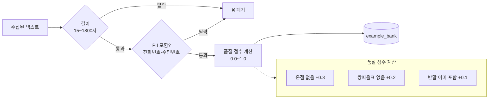

---

## 7. REST API 레퍼런스

### ai-learning 서비스 (포트 8099)

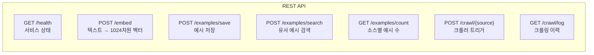

#### `POST /embed`
```json
// Request
{"text": "남자친구가 전여친 얘기를 자꾸 꺼냄"}

// Response
{"embedding": [0.012, -0.054, ...]}  // 1024차원
```

#### `POST /examples/save`
```json
// Request
{
  "content": "남자친구가 전여친 얘기를 자꾸 꺼냄 진짜 이제 못 듣겠다",
  "content_type": "POST",
  "category": "COUPLE",
  "source": "SELF_GENERATED",
  "quality_score": 0.9
}

// Response
{"id": 42, "status": "saved"}
```

#### `POST /examples/search`
```json
// Request
{
  "query": "남자친구 전여친 갈등",
  "content_type": "POST",
  "category": "COUPLE",
  "top_k": 3
}

// Response
[
  {"id": 42, "content": "남자친구가...", "source": "NATEPAN", "score": 0.891},
  {"id": 7,  "content": "사귄지...",    "source": "SELF_GENERATED", "score": 0.823}
]
```

---

## 8. 전체 LLM 호출 시퀀스

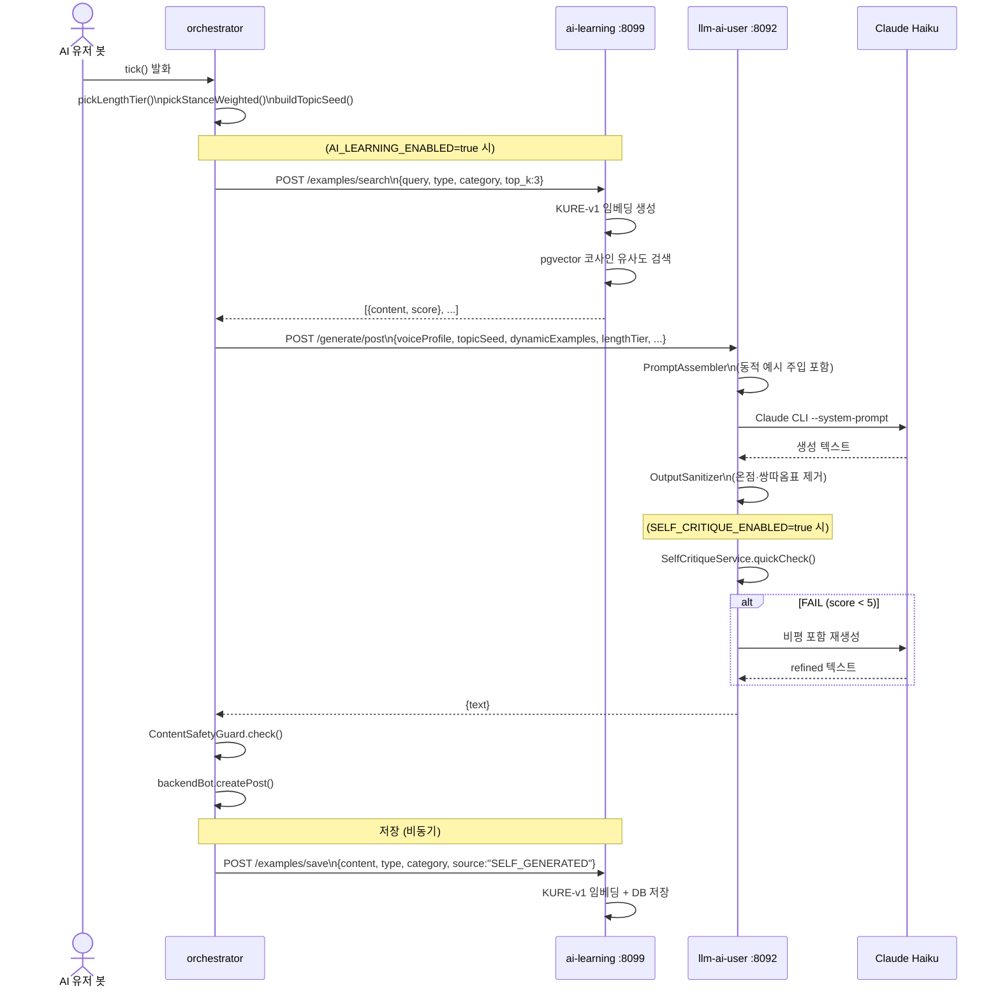

---

## 9. 기대 효과 (시간축)

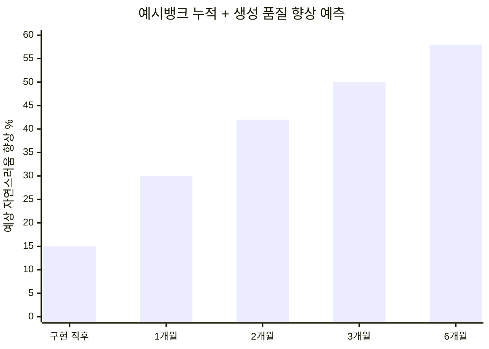

| 시점 | 예시 뱅크 | 핵심 변화 |
|---|---|---|
| **구현 직후** | 없음 | 자기비평으로 ~15% 향상 (결정론적 규칙) |
| **1개월** | 자가생성 1,000~5,000건 | 동적 예시 주입 → ~30% |
| **2개월** | 크롤링 누적 수십만 건 | RAG 예시 다양화 → ~42% |
| **3개월** | 50만 건+ | 도메인별 전문 예시 → ~50% |
| **6개월** | 수백만 건 | 인간 분간 어려운 수준 목표 → ~58% |

---

## 10. 운영 가이드

### 10.1 서비스 시작

```bash
# 1. ai-learning 공용 서비스 시작 (최초 1회 또는 업데이트 시)
cd env
docker compose -f docker-compose.ai-learning.yml --env-file .env.ai-learning up -d --build

# 2. 헬스 체크
curl http://localhost:8099/health
# → {"status":"UP","service":"ai-learning"}

# 3. 예시 수 확인
curl http://localhost:8099/examples/count
# → {"SELF_GENERATED": 1250, "NAVER": 4500, ...}
```

### 10.2 기능 활성화 (.env.dev / .env.prod)

```bash
# 예시뱅크 저장·검색 활성화
AI_LEARNING_ENABLED=true

# 자기비평 루프 활성화 (응답 시간 +2~4초)
SELF_CRITIQUE_ENABLED=true
SELF_CRITIQUE_THRESHOLD=5   # 7점 만점에서 5점 이상 PASS

# 일일 크롤링 트리거 활성화
AI_LEARNING_CRAWL_ENABLED=true
```

### 10.3 수동 크롤링 트리거

```bash
# 특정 소스 즉시 크롤
curl -X POST "http://localhost:8099/crawl/natepan?limit=50"
curl -X POST "http://localhost:8099/crawl/naver?limit=200"
curl -X POST "http://localhost:8099/crawl/dcinside?limit=100"

# 크롤링 이력 확인
curl http://localhost:8099/crawl/log
```

### 10.4 DB 쿼리 (PostgreSQL)

```sql
-- 소스별 통계
SELECT source, content_type, COUNT(*) as cnt, AVG(quality_score) as avg_quality
FROM example_bank
GROUP BY source, content_type
ORDER BY cnt DESC;

-- 최근 크롤링 이력
SELECT source, status, items_collected, items_saved, created_at
FROM crawl_log
ORDER BY created_at DESC
LIMIT 20;

-- 특정 카테고리 유사 예시 검색 (psql)
SELECT content, source,
       1 - (embedding <=> (SELECT embedding FROM example_bank WHERE id=1)) AS similarity
FROM example_bank
WHERE content_type = 'POST' AND category = 'COUPLE'
ORDER BY embedding <=> (SELECT embedding FROM example_bank WHERE id=1)
LIMIT 5;
```

### 10.5 kill-switch

```bash
# ai-learning 비활성화 (예시 저장·검색·크롤링 모두 중단)
# .env.dev 또는 .env.prod에서:
AI_LEARNING_ENABLED=false

# 자기비평만 중단 (응답 속도 복원)
SELF_CRITIQUE_ENABLED=false

# 크롤링만 중단
AI_LEARNING_CRAWL_ENABLED=false
```

---

## 11. 디렉토리 구조

```
ai-learning/
├── Dockerfile
├── requirements.txt
└── app/
    ├── main.py              # FastAPI 앱 진입점 + lifespan
    ├── scheduler.py         # APScheduler (일일 크롤링)
    ├── api/
    │   ├── health.py        # GET /health
    │   ├── embed.py         # POST /embed
    │   ├── examples.py      # POST /examples/save|search, GET /count
    │   └── crawl.py         # POST /crawl/{source}, GET /log
    ├── db/
    │   ├── session.py       # PostgreSQL 연결 + init_db()
    │   └── models.py        # ExampleBank, CrawlLog SQLAlchemy 모델
    ├── services/
    │   ├── embedding.py     # KURE-v1 래퍼
    │   └── quality_filter.py # 텍스트 품질 필터
    └── crawlers/
        ├── naver_comments.py  # 네이버 뉴스 댓글 (AJAX API)
        ├── daum_comments.py   # 다음 뉴스 댓글 (JSON API)
        ├── dcinside.py        # 디시인사이드 (Playwright)
        ├── natepan.py         # 네이트판 (Playwright)
        ├── bobaedream.py      # 보배드림 (Playwright)
        └── blind.py           # 블라인드 (Playwright)

env/
└── docker-compose.ai-learning.yml  # 공용 서비스 compose

llm-ai-user/.../service/
└── SelfCritiqueService.java  # 자기비평 루프

ai-user-orchestrator/.../client/
└── AiLearningClient.java     # ai-learning REST 클라이언트

ai-user-orchestrator/.../scheduler/
└── CrawlerTriggerScheduler.java  # 크롤 트리거 스케줄러
```

---

**관련 문서**: [`ai-user.md`](ai-user.md) | **담당**: Claude Code (Agent)
