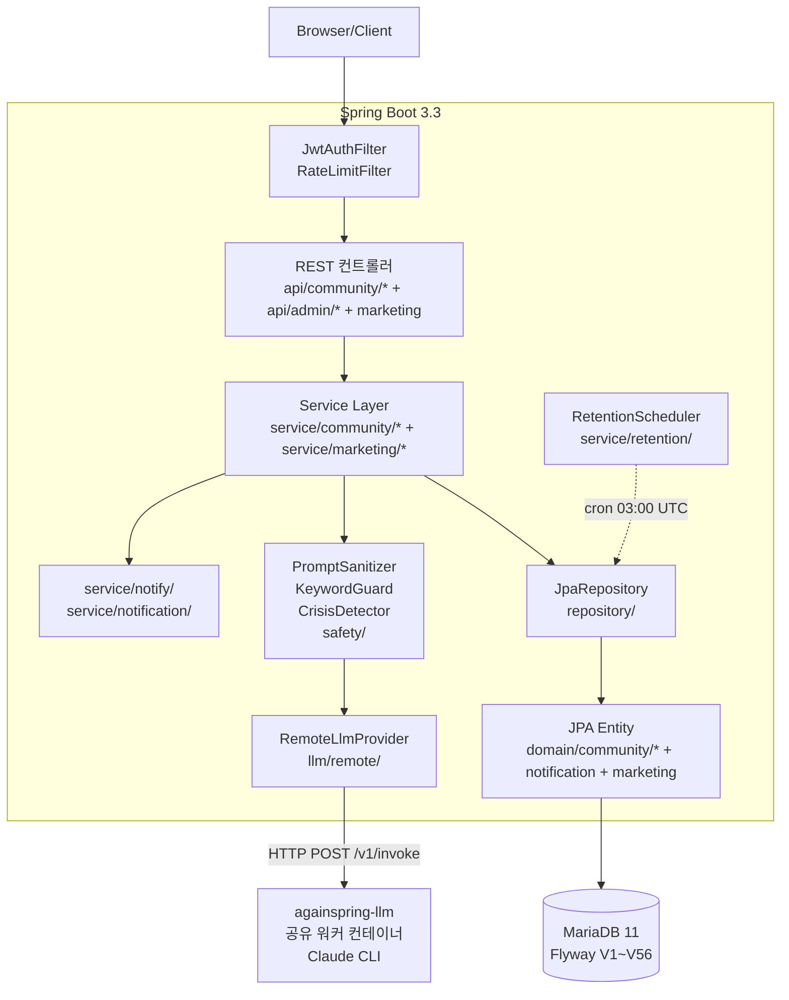
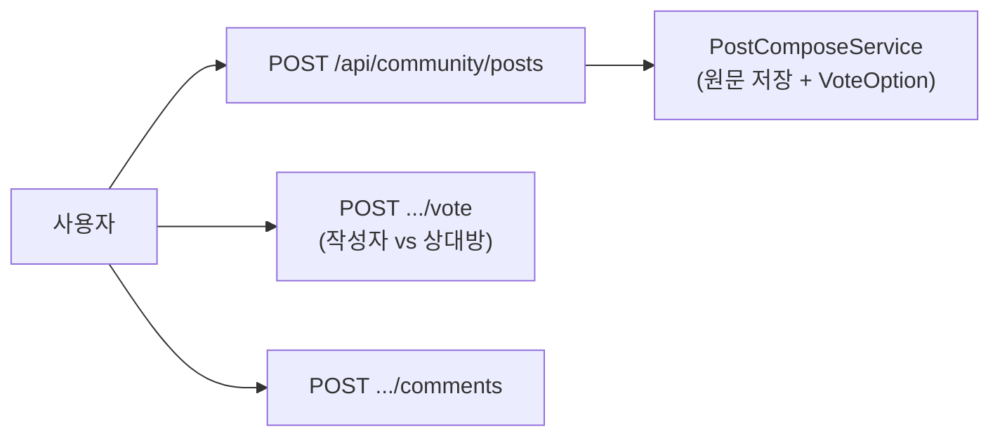

# 아키텍처

## 기술 스택

| 영역 | 기술 |
|---|---|
| 언어 | Java 21 (Eclipse Temurin) |
| 프레임워크 | Spring Boot 3.3 |
| 빌드 | Gradle 8.5 (Kotlin DSL) |
| DB | MariaDB 11 LTS (utf8mb4, UTC) |
| ORM | Spring Data JPA (Hibernate) |
| 마이그레이션 | Flyway 10 (V1~V56) |
| 인증 | Spring Security + JWT (jjwt 0.12.5) |
| 메일 | Spring Mail (Gmail SMTP) |
| API 문서 | springdoc-openapi 2.6 (Swagger UI) |
| Rate Limit | bucket4j 7.6 |
| 직렬화 | Jackson 2.17, SnakeYAML 2.0 |
| 테스트 | JUnit 5, Mockito, Testcontainers 1.20.4, H2 |
| LLM | 모든 호출: `againspring-llm` 워커 (Claude Code CLI remote) |
| LLM HTTP | RestClient → `againspring-llm` 워커 `/v1/invoke` endpoint |

## 레이어 흐름



```
HTTP Request
   │
   ▼  Spring Security (JwtAuthFilter, RateLimitFilter)
@RestController (api/community/*, api/admin/*, marketing/*)
   │
   │  request DTO 검증 (Bean Validation)
   ▼
@Service (service/community/*, service/marketing/*)
   │
   │  비즈니스 로직 + @Transactional 경계
   │  ├── safety/* (KeywordGuard, PromptSanitizer, CrisisDetector)
   │  └── llm/remote/* (RemoteLlmProvider → llm-worker HTTP)
   │
   │  자세한 설명: llm-bridge.md 참조
   ▼
@Repository (Spring Data JPA)
   │
   ▼
MariaDB (Flyway V1~V56 관리 스키마)
```

## 트랜잭션 정책

- 기본: `@Transactional(readOnly = true)` Service 메서드 (조회)
- 변경 메서드: `@Transactional` (write)
- LLM 호출은 트랜잭션 **밖**에서 수행 — 60s 타임아웃 동안 DB 커넥션 점유 방지
- 패턴:
  ```java
  @Transactional
  public Post savePost(...) { /* DB 저장 */ }
  
  // 트랜잭션 밖에서 LLM 호출 (RemoteLlmProvider)
  LLMResponse response = remoteLlmProvider.invoke(request);
  
  @Transactional
  public void persistNormalized(...) { /* 결과 저장 */ }
  ```

## 커뮤니티 광장 흐름

`CommunityPostController` + `PostComposeService` + `VoteService`가 제품 경로의 핵심이다.



**핵심 엔티티**:
- `Post` — 사연 게시글 (title/userTitle, bodyRaw/bodyPublished, category, author)
- `PostComment` — 댓글
- `Vote` / `VoteOption` — 작성자 vs 상대방 공감 투표

**흐름**:
1. 사용자가 갈등 사연 작성 → `POST /api/community/posts`
2. `PostComposeService`가 원문 그대로 DB 저장 + VoteOption(작성자/상대방) 생성 (게시 시 LLM 미호출)
3. 커뮤니티가 투표/댓글 → `POST .../vote`, `POST .../comments`
4. 공개 글은 `ai_user_outbox`로 AI-user 반응이 이어질 수 있음

역사적 피벗 결정은 ADR-0001·0002 참고.

## 이벤트 흐름

| 이벤트 | 발행 | 리스너 | 효과 |
|---|---|---|---|
| `SafetyTriggerEvent` | KeywordGuard 위반 시 | `SafetyAuditLogger` | safety 감사 로그 (마스킹) |
| `CrisisDetectedEvent` | CrisisDetector 발동 시 (게시글/댓글) | 관리자 알림 | crisis_alerts 로깅 |

`AsyncConfig`로 일부 리스너는 비동기 처리 — main thread 막지 않음.

## 스케줄러

| 빈 | cron | 동작 |
|---|---|---|
| `RetentionScheduler.purgeExpiredContent` | `0 0 3 * * *` (매일 03:00 UTC) | 30일 경과 세션의 `messages.content` NULL 처리 |
| `RevokedTokenCleanupScheduler.cleanup` | `0 0 4 * * *` (매일 04:00 UTC) | 만료된 `revoked_tokens` 행 삭제 |
| `DailyStatsAggregator` | `0 0 0 * * *` (자정 UTC) | 전날 세션·사용자 통계 → `daily_stats` 집계 |
| `GuestSessionCleanupScheduler` | `0 0 2 * * *` (매일 02:00 UTC) | 만료 게스트 세션 정리 |
| `SessionHealthCheckJob` *(dev, marketing.enabled)* | `0 0 3 * * *` (매일 03:00) | X·Instagram 세션 유효성 확인 + 피드 방문으로 쿠키 갱신 → DB 저장 |

`SchedulingConfig`의 `@EnableScheduling` 활성. 테스트 프로파일에서는 비활성.

## 프로파일별 설정 차이

| 키 | dev | prod | test |
|---|---|---|---|
| `spring.jpa.hibernate.ddl-auto` | `update` | `validate` | `create-drop` |
| `spring.flyway.enabled` | `false` | `true` | `false` |
| `springdoc.swagger-ui.enabled` | `true` | `false` | (N/A) |
| `management.endpoints.web.exposure.include` | `health,info,metrics` | `health` only | (N/A) |
| `logging.level.com.againspring` | `DEBUG` | `WARN` | `DEBUG` |
| `llm.compose.provider` | `remote` (CLI) | `remote` (CLI) | `mock` |
| `llm.remote.base-url` | `http://againspring-llm:8090` | `http://againspring-llm:8090` | (N/A) |
| DB | MariaDB 3306 (host) / 컨테이너 | MariaDB internal | H2 in-memory (MariaDB mode) |

## DTO 컨벤션

- request DTO: `*Request` 접미사 + Bean Validation 어노테이션 (`@NotNull`, `@Size`, `@Email`)
- response DTO: `*Response` 접미사 + `@Builder` 패턴
- 도메인 → DTO 변환은 Controller에서 수행 (Service는 도메인 객체만 반환)
- JSON 컬럼 매핑은 `@Convert(converter = JpaJsonConverter.class)` 또는 Jackson String

## 보안 컴포넌트

| 컴포넌트 | 역할 | 정책 문서 |
|---|---|---|
| `JwtAuthFilter` | 모든 요청에서 토큰 검증 + 폐기 확인 | [`shared/policies/auth.md`](../shared/policies/auth.md) |
| `RateLimitFilter` | bucket4j 기반 IP/유저별 제한 | [`shared/policies/auth.md`](../shared/policies/auth.md) |
| `KeywordGuard` | 금지어 검사 (입력+응답 양방향) | [`shared/policies/forbidden-words.md`](../shared/policies/forbidden-words.md) |
| `CrisisDetector` | 위기 키워드 감지 → 관리자 알림 | `docs/shared/policies/forbidden-words.md` |
| `PromptSanitizer` | LLM 입력 inject 방지 | `docs/backend/llm-bridge.md` |
| `RatioEnforcer` | 공감 비율 범위 강제 (0~100%) | `docs/shared/policies/forbidden-words.md` |
| `SafetyAuditLogger` | 모든 safety 이벤트 마스킹 후 DB | — |

## 예외 처리

`GlobalExceptionHandler`(`@RestControllerAdvice`)가 모든 예외를 표준 응답으로 변환:

```jsonc
{
  "error": {
    "code": "SESSION_NOT_FOUND",
    "message": "세션을 찾을 수 없어요",
    "timestamp": "2026-04-26T10:30:00Z"
  }
}
```

코드 매핑은 `docs/shared/api/rest-spec.md` 에러 코드 표 참조.

도메인 예외는 모두 `BusinessException(errorCode, message)` 또는 그 하위. 서비스에서 Bean Validation 실패는 `MethodArgumentNotValidException`으로 자동 처리.

## 헬스체크

- `GET /api/health` — 단순 200 응답 (커스텀 컨트롤러)
- `GET /actuator/health` — Spring Actuator (DB connectivity 포함)
- prod에서 nginx는 `/actuator/health`만 노출 (`env/nginx/prod.conf`)

## 비기능 요구

| 요구사항 | 구현 |
|---|---|
| LLM 동시성 제한 | `ClaudeCodeWorkerPool.semaphore = 3` (변경: `CLAUDE_POOL_SIZE` env) |
| LLM 타임아웃 | 60s (변경: `claude-code.default-timeout-ms`) |
| DB 풀 크기 | dev 10/2, prod 20/5 (HikariCP) |
| Rate limit | RateLimitFilter (bucket4j) |
| 로깅 | logback-spring.xml + Lombok @Slf4j |
| 트레이싱 | `correlationId` (UUID, X-Request-ID 헤더) — `LLMCallLogger` 등에 전파 |

---
