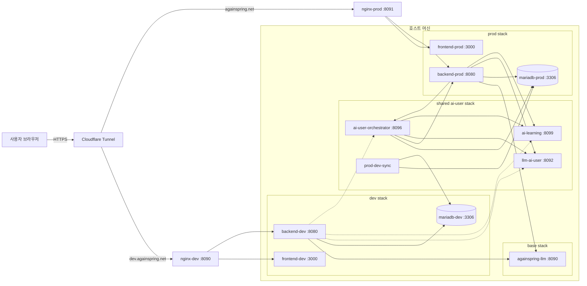

# 배포 아키텍처

다시봄 인프라의 전체 구조와 컴포넌트 간 통신을 설명한다.

## 고수준 개요

- `frontend`와 `backend`는 dev·prod를 분리한다.
- `againspring-llm`은 base 스택에서 dev·prod가 공유한다.
- `ai-user`는 `env/docker-compose.ai-user.yml` 하나를 공통으로 사용한다.
- shared ai-user의 source of truth는 prod DB와 prod backend다.
- dev DB는 `prod-dev-sync`가 하루 1회 비식별 upsert를 수행한다.

<!-- last-verified: 2026-08-31 -->
<!-- code-ref: env/docker-compose.dev.yml, env/docker-compose.prod.yml -->


## Compose 단위

| compose | 목적 | 주요 서비스 |
|---|---|---|
| `docker-compose.yml` | base 공유 스택 | `againspring-llm`, `mariadb` |
| `docker-compose.dev.yml` | dev 웹/DB 스택 | `nginx-dev`, `frontend-dev`, `backend-dev`, `mariadb-dev` |
| `docker-compose.prod.yml` | prod 웹/DB 스택 | `nginx-prod`, `frontend-prod`, `backend-prod`, `mariadb-prod` |
| `docker-compose.ai-user.yml` | 공통 ai-user 스택 | `llm-ai-user`, `ai-learning`, `ai-user-orchestrator`, `prod-dev-sync` |

## 호스트 포트

| 포트 | 서비스 | 설명 |
|---|---|---|
| `3306` | `againspring-mariadb` | 로컬 개발용 DB |
| `3309` | `againspring-mariadb-dev` | dev DB host 접근 |
| `8090` | `againspring-nginx-dev` | dev 외부 진입점 |
| `8091` | `againspring-nginx-prod` | prod 외부 진입점 |
| `8099` | `againspring-ai-learning` | learning health/API |

내부 전용 포트:

- `againspring-llm:8090`
- `againspring-llm-ai-user:8092`
- `againspring-ai-user-orchestrator:8096`
- `againspring-backend-{dev,prod}:8080`
- `againspring-frontend-{dev,prod}:3000`

## 네트워크 구성

| 네트워크 | 연결 서비스 | 목적 |
|---|---|---|
| `againspring` | base + backend-dev + backend-prod + shared ai-user 일부 | 공유 LLM와 공통 서비스 접근 |
| `againspring-dev` | dev stack + `prod-dev-sync` | dev 웹/DB 분리 |
| `againspring-prod` | prod stack + shared ai-user | prod 웹/DB와 ai-user 런타임 연결 |

주의점:

- `ai-learning`, `ai-user-orchestrator`는 `againspring`과 `againspring-prod`에 연결된다.
- `llm-ai-user`는 `againspring`에만 연결된다(2026-09, DB 미접속 무상태화로 `againspring-prod` 소속 제거).
- `prod-dev-sync`만 `againspring-prod`와 `againspring-dev`를 동시에 사용한다.
- dev와 prod는 서로의 DB에 직접 쓰지 않는다. 예외는 sync 컨테이너의 읽기/쓰기 경로뿐이다.

## 컨테이너 책임

### Frontend

- `frontend-dev`, `frontend-prod`
- 내부 포트 `3000`
- 사용자 UI와 admin UI 제공

### Backend

- `backend-dev`, `backend-prod`
- 내부 포트 `8080`
- REST API, 인증, DB access, base LLM access 담당
- 두 환경 모두 shared ai-user 서비스 URL을 env로 참조

### Base LLM

- `againspring-llm`
- 내부 포트 `8090`
- base LLM 요청 처리 (`RemoteLlmProvider` 경로; 제품 사람글 경로에서는 미사용)
- 실행 제한은 600초이며, timeout·취소 시 Claude CLI 부모와 자식 프로세스를 함께 종료한다.

### Shared AI-user

- `llm-ai-user`
  - 내부 포트 `8092`
  - AI-user 글/댓글/대댓글 생성
  - DB 미접속(무상태) — guide는 요청 `promptOverrides`(orchestrator의 `PromptTemplateCache`가 `ai_prompt_template`을 읽어 전달) 또는 classpath에서만 읽는다(2026-09)
- `ai-learning`
  - 포트 `8099`
  - example bank, topic, strengthen, crawl
- `ai-user-orchestrator`
  - 내부 포트 `8096`
  - prod DB 기준 tick과 행동 실행
- `prod-dev-sync`
  - 스케줄러 전용
  - prod DB를 읽고 dev DB로 비식별 upsert

### Nginx

- `nginx-dev`, `nginx-prod`
- 접근/에러 로그는 `env/logs/nginx/{dev,prod}/` 호스트 bind mount로 영속화 (컨테이너 내부 `/var/log/nginx`).
  이전에는 docker stdout에만 남아 로그 드라이버 순환으로 18일치만 존재했다.
- 로그 포맷은 nginx 기본 `main`(`$remote_addr`·`$http_referer`·`$http_user_agent` 포함).
  prod는 `real_ip_header CF-Connecting-IP`로 Cloudflare 뒤에서도 실 클라이언트 IP가 `$remote_addr`에 들어온다.
- 보존 90일, 호스트 cron + `logrotate`로 회전 (사이드카 컨테이너 아님 — 근거·설정: `env/nginx/logrotate.conf`).
  운영 절차: `docs/env/60-runtime/deployment.md`.

## 운영 사실

- `AI_USER_ENABLED=false`면 orchestrator 스케줄러와 tick이 바로 멈춘다.
- `AI_USER_ENV`(`prod`|`dev`)는 compose가 서비스별로 고정 주입하며, `EnvironmentGuard`가 DB·backend 호스트명과 불일치 시 기동을 거부한다.
- `ai_user_generation_config.ai_user_kill_switch`는 DB 기반 2차 kill-switch다.
- `AI_LEARNING_ENABLED=false`면 learning scheduler가 올라오지 않는다.
- `AI_LEARNING_CRAWL_ENABLED=false`면 learning의 일일 crawl/strengthen/topic 작업이 등록되지 않는다.
- `SYNC_CRON` 기본값은 `30 5 * * *`, timezone 기본값은 `Asia/Seoul`이다.
- `prod-dev-sync`는 기동 시 1회 동기화 후 cron으로 매일 반복한다. dev에 없는 테이블은 prod DDL로 생성한다.

## 기동 순서

```bash
cd env
docker compose up -d --build
docker compose -f docker-compose.dev.yml --env-file .env.dev up -d --build
docker compose -f docker-compose.prod.yml --env-file .env.prod up -d --build
docker compose -f docker-compose.ai-user.yml --env-file .env.ai-user up -d --build
```

## 검증 포인트

```bash
curl http://localhost:8090/api/health
curl http://localhost:8091/api/health
curl http://localhost:8099/health
docker compose -f env/docker-compose.ai-user.yml --env-file env/.env.ai-user config --services
```

## 상세 문서

- [docker.md](docker.md)
- [environment-variables.md](../40-data.md)
- [deployment.md](../60-runtime/deployment.md)
- [cloudflare.md](../60-runtime/cloudflare.md)
- [local-dev.md](../60-runtime/local-dev.md)

## 포트 표 (system.md L3)

compose가 권위본이다.

| 서비스 | 스택 | 호스트 포트 | 컨테이너 포트 | 비고 |
|---|---|---|---|---|
| `nginx-dev` | dev | `8090` | `80` | `dev.againspring.net` |
| `nginx-prod` | prod | `8091` | `80` | `againspring.net` |
| `againspring-mariadb` | base | `3306` | `3306` | 로컬 직접 개발용 |
| `againspring-mariadb-dev` | dev | `3309` | `3306` | dev DB 접근용 |
| `againspring-ai-learning` | shared ai-user | `8099` | `8099` | host 공개 |

내부 전용: `againspring-llm:8090`, `llm-ai-user:8092`, `ai-user-orchestrator:8096`, backend/frontend 컨테이너 포트.

## 볼륨 마운트 (이동 금지)

| 경로 (호스트) | 컨테이너 경로 | 읽기 모드 | 용도 |
|---|---|---|---|
| `docs/shared/prompts/` | `/app/shared/docs/prompts` | `:ro` | LLM 프롬프트 |
| `docs/shared/templates/` | `/app/shared/docs/templates` | `:ro` | 템플릿 |
| `docs/shared/categories.yml` | `/app/shared/docs/categories.yml` | `:ro` | 카테고리 마스터 |
| `docs/shared/policies/user-permissions.json` | `/app/shared/docs/policies/user-permissions.json` | `:ro` | 권한 정책 |
| `docs/shared/policies/llm-error-signatures.json` | `/app/shared/docs/policies/llm-error-signatures.json` | `:ro` | LLM 오류 시그니처 SSOT (backend·llm-ai-user·orchestrator·ai-learning) |
| `ai-user/docs/personas/` | `/app/personas` | `:rw` | persona corpus |
