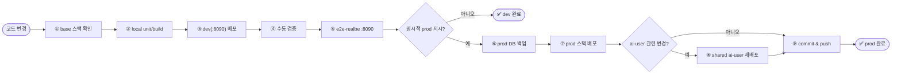

# 배포 절차

> ⚠️ **PROD 배포 절대 규칙**: 사용자가 명시적으로 "prod에 배포해줘"라고 요청한 경우에만 prod를 배포한다.
>
> **dev/prod 완전 격리**: 일상 배포·수동 검증·e2e는 **dev(:8090)만**. prod(:8091)에서 e2e·직접 반영 금지.
> `prod-dev-sync` = **5분 콘텐츠** + **24h full**. **dev LLM 금지(L3)**.

## 표준 흐름



prod는 반드시 `main` 기준으로만 배포한다. **prod 배포 전 dev e2e 전체 통과가 전제**다.

## 0단계: base 스택

```bash
cd env
docker compose up -d --build
```

## 1단계: dev 배포 (기본 작업면)

```bash
cd env
docker compose -f docker-compose.dev.yml --env-file .env.dev up -d --build
curl http://localhost:8090/api/health
```

server-dev는 compose에서 `SPRING_FLYWAY_ENABLED=true` · `SPRING_JPA_HIBERNATE_DDL_AUTO=none` ·
`LLM_ENABLED=false` · **againspring(LLM) 네트워크 미연결(L3)** 로 올린다.
(local `bootRun`의 `application-dev.yml`은 편집용으로 별도.)

## 2단계: e2e 검증 (dev:8090)

```bash
cd frontend
curl http://localhost:8090/api/health
E2E_BASE_URL=http://localhost:8090 npm run test:e2e:realbe
```

## 3단계: prod 배포 (명시 지시 시만)

```bash
cd env
BACKUP_DIR=/home/justant/backups
mkdir -p "$BACKUP_DIR"
docker exec againspring-mariadb-prod sh -c \
  'mariadb-dump -uroot -p"$MARIADB_ROOT_PASSWORD" --single-transaction --routines "$MARIADB_DATABASE"' \
  > "$BACKUP_DIR/prod-$(date +%Y%m%d-%H%M%S).sql"

docker compose -f docker-compose.prod.yml --env-file .env.prod up -d --build
curl http://localhost:8091/api/health
```

## 4단계: shared ai-user / prod-dev-sync

```bash
cd env
docker compose -f docker-compose.ai-user.yml --env-file .env.ai-user up -d --build
docker logs -f againspring-prod-dev-sync
```

- `prod-dev-sync`: 기동 시 full+content → **5분 콘텐츠** (`SYNC_CONTENT_CRON`) + **매일 full** (`SYNC_CRON`)
- `ai-user-orchestrator-dev`: 기본 미기동 (`profiles: [ai-user-dev]`, `AI_USER_DEV_ENABLED=false`)
- 네트워크: sync만 `againspring-prod` + `againspring-dev` (유일한 교차 쓰기 경로)
- backend-dev는 `againspring`(LLM) 네트워크에 **연결하지 않음** (L3)

## prod 사전 체크리스트

- [ ] local unit / lint / build 통과
- [ ] **dev(:8090) 배포·수동 검증 완료**
- [ ] **e2e-realbe (`localhost:8090`) 전체 통과**
- [ ] 명시적 prod 배포 지시 확인
- [ ] `mariadb-prod` 백업 완료
- [ ] prod(:8091) 배포·헬스 확인
- [ ] `main` push 완료

## 환경 격리 원칙

- **검증·e2e면** = dev (`:8090`, `mariadb-dev`) — **LLM 토큰 0 (L3)**
- **운영면** = prod (`:8091`, `mariadb-prod`) — 명시 배포만 · AI 생성 SoT
- 서로의 DB에 직접 쓰지 않는다. 예외는 `prod-dev-sync`뿐
- e2e는 `:8090`만 (E3 — prod URL이면 스크립트/설정/DB 가드 실패)
