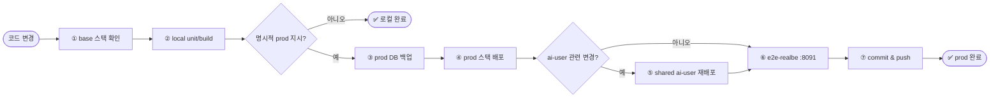

# 배포 절차

> ⚠️ **PROD 배포 절대 규칙**: 사용자가 명시적으로 "prod에 배포해줘"라고 요청한 경우에만 prod를 배포한다.
>
> **미공개(prelaunch)**: 실서버 검증·e2e는 **prod(:8091)만**. `docker-compose.dev.yml`(:8090)은 휴면 보관 — 명시 요청 전 배포·검증 금지.

## 표준 흐름 (미공개)



prod는 반드시 `main` 기준으로만 배포한다.

## 0단계: base 스택

```bash
cd env
docker compose up -d --build
```

base는 `againspring-llm`과 로컬용 `mariadb`를 제공한다.

## 1단계: prod 배포 (명시 지시 시)

```bash
cd env
cp .env.prod.example .env.prod
$EDITOR .env.prod

BACKUP_DIR=/home/justant/backups
mkdir -p "$BACKUP_DIR"
docker exec againspring-mariadb-prod sh -c \
  'mariadb-dump -uroot -p"$MARIADB_ROOT_PASSWORD" --single-transaction --routines "$MARIADB_DATABASE"' \
  > "$BACKUP_DIR/prod-$(date +%Y%m%d-%H%M%S).sql"

docker compose -f docker-compose.prod.yml --env-file .env.prod up -d --build
docker compose -f docker-compose.prod.yml ps
curl http://localhost:8091/api/health
```

## 2단계: shared ai-user 배포 (관련 변경 시)

shared ai-user는 prod SoT 공통 스택이다. 아래 조건이 필요하다.

- `againspring` network 존재
- `againspring-prod` network 존재
- prod DB / prod backend 기동 완료

```bash
cd env
cp .env.ai-user.example .env.ai-user
$EDITOR .env.ai-user
bash ./rebuild-stacks.sh ai-user
docker compose -f docker-compose.ai-user.yml --env-file .env.ai-user ps
curl http://localhost:8099/health
```

shared ai-user는 다음을 수행한다.

- `ai-user-orchestrator`: prod DB 기준 행동 실행
- `llm-ai-user`: 생성 워커
- `ai-learning`: example bank와 일일 학습 작업
- `prod-dev-sync`: **미공개 기간 유지보수 금지** (dev 휴면). 명시 요청 전 손대지 않음.

## 3단계: e2e 검증 (prod:8091)

```bash
cd frontend
curl http://localhost:8091/api/health
E2E_BASE_URL=http://localhost:8091 npm run test:e2e:realbe
```

## 4단계: commit & push

```bash
git status
git add -A
git commit -m "feat: <변경 요약>"
git push origin main
```

## prod 사전 체크리스트

- [ ] local unit / lint / build 통과 (필요 범위)
- [ ] `.env.prod`와 `.env.ai-user` 실제 값 반영
- [ ] `mariadb-prod` 백업 완료
- [ ] prod(:8091) 배포·헬스 확인
- [ ] e2e-realbe (`localhost:8091`) 전체 통과
- [ ] 호스트 `~/.claude` 세션 유효
- [ ] Cloudflare Tunnel 정상
- [ ] `main` push 완료

## 휴면: dev 스택

`docker-compose.dev.yml` + `.env.dev` + nginx `:8090`은 **복구용으로만 보관**. 미공개 기간에는 배포·e2e·동기화하지 않는다. 정식 공개 후 dual-env 복귀 시 이 섹션을 되살린다.

```bash
# 필요 시(명시 요청)만
# docker compose -f docker-compose.dev.yml --env-file .env.dev up -d --build
# curl http://localhost:8090/api/health
```

## 2026-07-30 PLAN-first 배포 이력

- 배포 commit: `d5de80db` (`feat: add plan-first ai user generation`)
- prod DB backup: `/home/justant/backups/againspring-prod-20260730-123713.sql`
- prod API와 shared `llm-ai-user`/`ai-user-orchestrator`/`ai-learning` health를 확인했다.
- 구형 `*-prod` AI-user 세 컨테이너는 중지했다. 새 공통 스택만 운영한다.
- PLAN gate와 workload provider는 기본 비활성 상태로 유지했다. 이는 배포 과정에서 승인되지 않은 실콘텐츠 생성이 일어나지 않도록 하기 위함이다.

## 헬스 체크

```bash
curl http://localhost:8091/api/health
curl http://localhost:8099/health
docker compose -f env/docker-compose.ai-user.yml --env-file env/.env.ai-user ps
```

## 롤백

```bash
docker compose -f docker-compose.prod.yml down
git revert <bad-commit-sha>
git push origin main
docker compose -f docker-compose.prod.yml --env-file .env.prod up -d --build
docker compose -f docker-compose.ai-user.yml --env-file .env.ai-user up -d --build
```

DB 복원이 필요하면 최근 백업을 사용한다.

## 환경 격리 원칙 (미공개)

- **활성 실서버** = prod만 (`:8091`, `mariadb-prod`).
- **dev 스택** = 휴면 보관 (파일 삭제 금지).
- ai-user 런타임은 공통 스택 하나만 둔다 (prod SoT).
- local FE/BE는 편집용이며 배포 게이트가 아니다.
