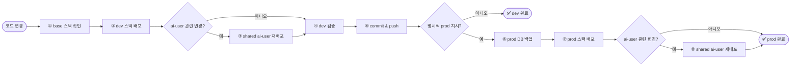

# 배포 절차

> ⚠️ **PROD 배포 절대 규칙**: 사용자가 명시적으로 "prod에 배포해줘"라고 요청한 경우에만 prod를 배포한다.

## 표준 흐름



prod는 반드시 `main` 기준으로만 배포한다.

## 0단계: base 스택

```bash
cd env
docker compose up -d --build
```

base는 `againspring-llm`과 로컬용 `mariadb`를 제공한다.

## 1단계: dev 스택 배포

```bash
cd env
cp .env.dev.example .env.dev
$EDITOR .env.dev
docker compose -f docker-compose.dev.yml --env-file .env.dev up -d --build
docker compose -f docker-compose.dev.yml ps
curl http://localhost:8090/api/health
```

## 2단계: shared ai-user 배포

shared ai-user는 dev/prod 공통 스택이다. 아래 조건이 필요하다.

- `againspring` network 존재
- `againspring-dev` network 존재
- `againspring-prod` network 존재
- prod DB / prod backend 기동 완료

```bash
cd env
cp .env.ai-user.example .env.ai-user
$EDITOR .env.ai-user
bash ./rebuild-stacks.sh ai-user
docker compose -f docker-compose.ai-user.yml --env-file .env.ai-user ps
curl http://localhost:8099/health
```

기존 `*-prod` 접미사의 AI-user worker/orchestrator/learning 컨테이너가 남아 있으면 새 공통 스택과 같은 prod DB를 동시에 처리할 수 있다. 새 `againspring-llm-ai-user`, `againspring-ai-user-orchestrator`, `againspring-ai-learning`이 healthy가 된 것을 확인한 뒤에만 구형 세 컨테이너를 중지한다. `againspring-llm-prod` 같은 base LLM은 대상이 아니다.

shared ai-user는 다음을 수행한다.

- `ai-user-orchestrator`: prod DB 기준 행동 실행
- `llm-ai-user`: 생성 워커
- `ai-learning`: example bank와 일일 학습 작업
- `prod-dev-sync`: prod→dev 일일 비식별 동기화

## 3단계: 검증 후 commit & push

```bash
git status
git add -A
git commit -m "feat: <변경 요약>"
git push origin main
```

## 4단계: prod 배포

```bash
cd env
cp .env.prod.example .env.prod
$EDITOR .env.prod

BACKUP_DIR=/home/justant/backups
mkdir -p "$BACKUP_DIR"
docker exec againspring-mariadb-prod sh -c \
  'mariadb-dump -uroot -p"$MARIADB_ROOT_PASSWORD" --single-transaction --routines "$MARIADB_DATABASE"' \
  > "$BACKUP_DIR/prod-$(date +%Y%m%d-%H%M%S).sql"

docker compose -f docker-compose.prod.yml --env-file .env.prod up -d --build
docker compose -f docker-compose.prod.yml ps
curl http://localhost:8091/api/health
```

ai-user 관련 코드나 `.env.ai-user`가 바뀌었다면 shared 스택도 다시 올린다.

```bash
cd env
bash ./rebuild-stacks.sh ai-user
```

## prod 사전 체크리스트

- [ ] dev 검증 완료
- [ ] `main` push 완료
- [ ] `.env.prod`와 `.env.ai-user` 실제 값 반영
- [ ] `mariadb-prod` 백업 완료
- [ ] 호스트 `~/.claude` 세션 유효
- [ ] Cloudflare Tunnel 정상

## 2026-07-30 PLAN-first 배포 이력

- 배포 commit: `d5de80db` (`feat: add plan-first ai user generation`)
- prod DB backup: `/home/justant/backups/againspring-prod-20260730-123713.sql`
- prod API와 shared `llm-ai-user`/`ai-user-orchestrator`/`ai-learning` health를 확인했다.
- 구형 `*-prod` AI-user 세 컨테이너는 중지했다. 새 공통 스택만 운영한다.
- PLAN gate와 workload provider는 기본 비활성 상태로 유지했다. 이는 배포 과정에서 승인되지 않은 실콘텐츠 생성이 일어나지 않도록 하기 위함이다.

## 헬스 체크

```bash
curl http://localhost:8090/api/health
curl http://localhost:8091/api/health
curl http://localhost:8099/health
docker compose -f env/docker-compose.ai-user.yml --env-file env/.env.ai-user ps
```

## 롤백

```bash
docker compose -f docker-compose.prod.yml down
git revert <bad-commit-sha>
git push origin main
docker compose -f docker-compose.prod.yml --env-file .env.prod up -d --build
docker compose -f docker-compose.ai-user.yml --env-file .env.ai-user up -d --build
```

DB 복원이 필요하면 최근 백업을 사용한다.

## 환경 격리 원칙

- dev DB와 prod DB는 분리한다.
- frontend/backend는 dev·prod 스택을 따로 둔다.
- ai-user 런타임은 공통 스택 하나만 둔다.
- dev 데이터 반영은 direct dual write가 아니라 `prod-dev-sync` 일일 upsert로 제한한다.
