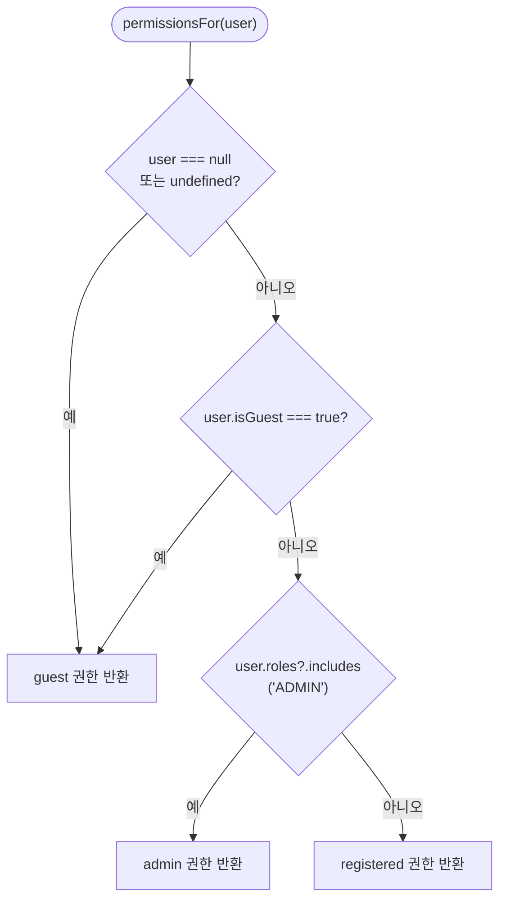
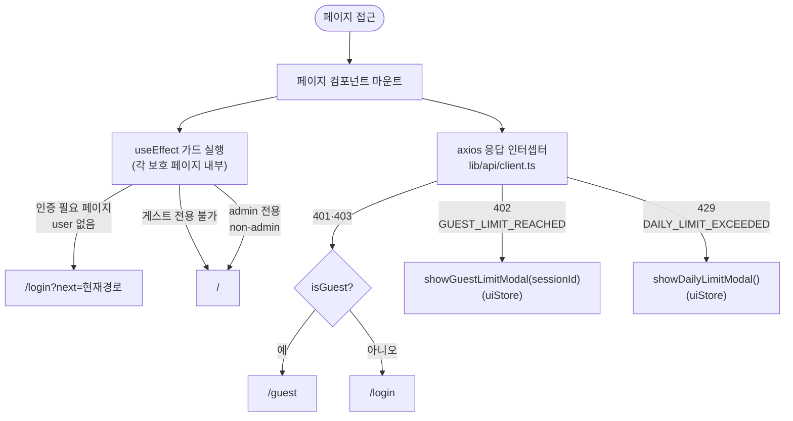

# 권한 및 라우트 가드

**위치**: `docs/frontend/ux/flows/02-permissions.md`  
**자매 문서**: [README.md](./README.md) · [01-auth.md](./01-auth.md) · [../principles.md](../../70-policy/principles.md)  
**기준일**: 2026-05-16  
**성격**: as-is 현행 기준

---

## permissionsFor() 결정 트리

근거: `lib/constants/userPermissions.ts:246-253`

3-tier: `guest` / `registered` / `admin`. 동일 함수로 판별 (`lib/constants/userPermissions.ts` `permissionsFor()`).

---

## 권한 상세 (3-tier)

출처: `lib/constants/userPermissions.ts` `USER_PERMISSIONS`

### auth

| 항목 | guest | registered | admin |
|---|---|---|---|
| 토큰 만료 | 7200s (2시간) | 86400s (24시간) | 86400s (24시간) |
| 이메일 인증 | X | O | O |
| 온보딩 필수 | X | O | X |
| 비밀번호 변경 | X | O | O |

### community

| 항목 | guest | registered | admin |
|---|---|---|---|
| 피드 열람 | O | O | O |
| 사연 게시 | X | O | O |
| 투표 | X | O | O |
| 댓글 작성 | X | O | O |
| 파트너 초대 | X | O | O |
| 신고 | X | O | O |

### profile

| 항목 | guest | registered | admin |
|---|---|---|---|
| 닉네임 편집 | X | O | O |
| 커뮤니케이션 스타일 편집 | X | O | O |
| 온보딩 완료 | X | O | O |
| MBTI 설정 | X | O | O |
| 이력 조회 | X | O | O |
| 계정 삭제 | O (비번 불필요) | O (비번 필요) | O (비번 필요) |

### data (보존 기간)

| 항목 | guest | registered | admin |
|---|---|---|---|
| 메시지 내용 | 7일 | 30일 | 30일 |
| 세션 | 30일 | 180일 | 180일 |
| 리포트 | 30일 | 무제한 | 무제한 |

### ui

| 항목 | guest | registered | admin |
|---|---|---|---|
| 이력 메뉴 | X | O | X |
| 프로필 편집 | X | O | O |
| 동의 재확인 모달 | X | O | O |
| 한도 도달 업그레이드 모달 | O | X | X |
| 게스트 배지 | O | X | X |
| 관리자 진입 버튼 | X | X | O |
| 랜딩 채팅 진입 버튼 | O | O | X |
| 커뮤니케이션 스타일 섹션 | X | O | X |

### admin

| 항목 | guest | registered | admin |
|---|---|---|---|
| 대시보드 접근 | X | X | O |
| 전체 사용자 조회 | X | X | O |
| 의견함 수정 | X | X | O |
| 사용자 익명화 | X | X | O |
| 위기 모니터 조회 | X | X | O |
| 시스템 헬스 조회 | X | X | O |

---

## TESTER role

- **정의**: tier가 아닌 `user.roles` 배열의 값. `permissionsFor()` 결과에 영향 없음.
- `TESTER`를 가진 사용자는 `permissionsFor()` 기준 `registered` tier로 분류됨.
- **사용처 1**: `components/chat/ChatLayout.tsx:33` — `isTester = currentUser?.roles?.includes('TESTER') ?? false`
  - Solo 패널: 초대 버튼은 `isTester`일 때만 표시
  - Duo 세션: `isTester`이면 SwipeContainer+PartnerPanel, 아니면 Solo 패널 fallback
- **사용처 2**: `app/(admin)/admin/page.tsx` — 사용자 관리의 TESTER role 토글 버튼

---

## 라우트 가드 구조

Next.js middleware 없음. 모든 가드는 클라이언트 측에서 처리.

근거: `lib/api/client.ts:19-51`

---

## 전역 모달 게이트

`app/layout.tsx` 에서 조건부 렌더. 각 모달은 해당 조건이 참이면 자동 표시.

| 모달 | 표시 조건 | 닫기 방법 |
|---|---|---|
| `OnboardingModal` (30초 튜토리얼) | `!!user && !isGuest && tutorialCompleted === false` | 슬라이드 완료 또는 닫기 버튼 |
| `ConsentReconfirmModal` | `registered/admin && (!termsAgreedAt \|\| !privacyAgreedAt \|\| !disclaimerAgreedAt)` | 동의 완료 |
| `ForcePasswordChangeModal` | 임시 비밀번호로 로그인 + `forcePasswordChange === true` | 비밀번호 변경 완료 |
| `GuestUpgradeModal` | `uiStore.guestLimitModalVisible === true` | 닫기 또는 가입하기 |
| `DailyLimitModal` | `uiStore.dailyLimitModalVisible === true` | 닫기 |

---

## 근거 파일

- `lib/constants/userPermissions.ts` — 권한 정의 + `permissionsFor()`
- `lib/api/client.ts` — 응답 인터셉터 (401/403/402/429 처리)
- `lib/store/uiStore.ts` — `showGuestLimitModal()` · `showDailyLimitModal()`
- `app/layout.tsx` — 전역 모달 게이트
- `components/chat/ChatLayout.tsx` — TESTER role 분기
- `app/(admin)/admin/page.tsx` — admin 3중 가드
