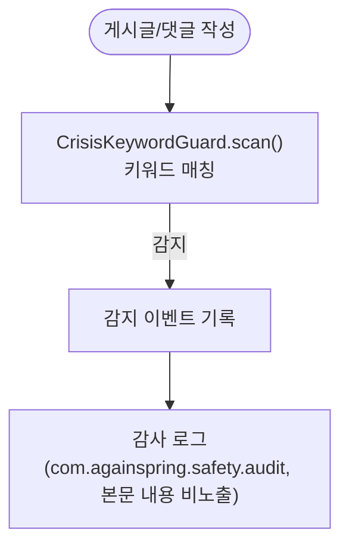

# 위기 처리 흐름

**위치**: `docs/frontend/ux/flows/08-crisis.md`  
**자매 문서**: [README.md](./README.md) · [09-admin.md](./09-admin.md)  
**기준일**: 2026-09-03

---

## 광장형 위기 정책 개요

다시봄 광장형 모델에서 **사용자 입력(게시글·댓글)에는 어떤 표현 필터도 적용하지 않습니다.**
사용자가 쓴 텍스트의 표현 책임은 사용자에게 있으며, 플랫폼은 입력을 차단하지 않습니다.

`PostComposeService`·`CommentService`는 `CrisisKeywordGuard.scan`으로 위기 키워드(자살·자해·폭력)를
감지하면 `CrisisDetectedEvent`만 남기고 **게시는 계속**합니다. AI-user 본문에는 이 관제도 적용하지 않습니다.

위기 상황 대응은 다음 한 가지 수단뿐입니다:

- **자동 위기 감지 + 감사 로그** — `CrisisKeywordGuard.scan`(키워드 매칭)이 위기 신호를 감지하면 게시는 그대로 진행하고 감사 로그(`com.againspring.safety.audit`, 본문 내용 비노출)만 남긴다. `/admin/crisis` 백엔드 엔드포인트는 존재하지 않는다.

**클라이언트 위기 모달은 없습니다.** 과거 존재하던 `CrisisResourceModal`(SOS 버튼·crisisFlag 게시글 진입 시 표시되는
상시 핫라인 모달)은 어떤 화면에서도 트리거되지 않는 죽은 컴포넌트였다 — import 0건이 확인되어 2026-09-03 삭제됨
(Phase 3 리뷰 지적). 핫라인 데이터셋 `lib/constants/crisisResources.ts`는 코드에 남아 있으나 현재 어떤 컴포넌트도
참조하지 않는다.

---

## (A) 자동 위기 감지 흐름

근거: `safety/CrisisKeywordGuard.java`, `app/(admin)/admin/crisis/`

<!-- last-verified: 2026-09-03 -->
<!-- code-ref: frontend/app/community/[id]/page.tsx -->

- 위기 모니터 본문 비노출: 프라이버시 정책 준수
- 수동 "위기 마크" 설정 UI는 존재하지 않는다 — 감지는 전적으로 자동(키워드 매칭)이며 감사 로그 `com.againspring.safety.audit`로만 기록된다(2026-09-03 grep 확인: `/admin/crisis` 백엔드 엔드포인트는 존재하지 않는다. 과거 이 문서가 서술하던 `AdminCommunityController` 기반 수동 마크 PATCH 엔드포인트는 존재한 적이 없거나 이미 삭제된 죽은 참조였음 — 2026-07-30 확인)
- 배선(게시/댓글 서비스가 실제로 이벤트를 발행하는지)은 `PostComposeServicePlazaPolicyTest`·`CommentServiceTest`의 위기 감지 케이스로 고정되어 있다.

---

## 근거 파일

- `safety/CrisisKeywordGuard.java` — 키워드 매칭 스캐너
- `safety/CrisisDetectedEvent.java` — 감사 로그용 이벤트
- `lib/constants/crisisResources.ts` — 핫라인 데이터 (현재 미사용 — 참조 컴포넌트 없음)
- `app/(admin)/admin/crisis/` — 위기 감지 관제 UI
