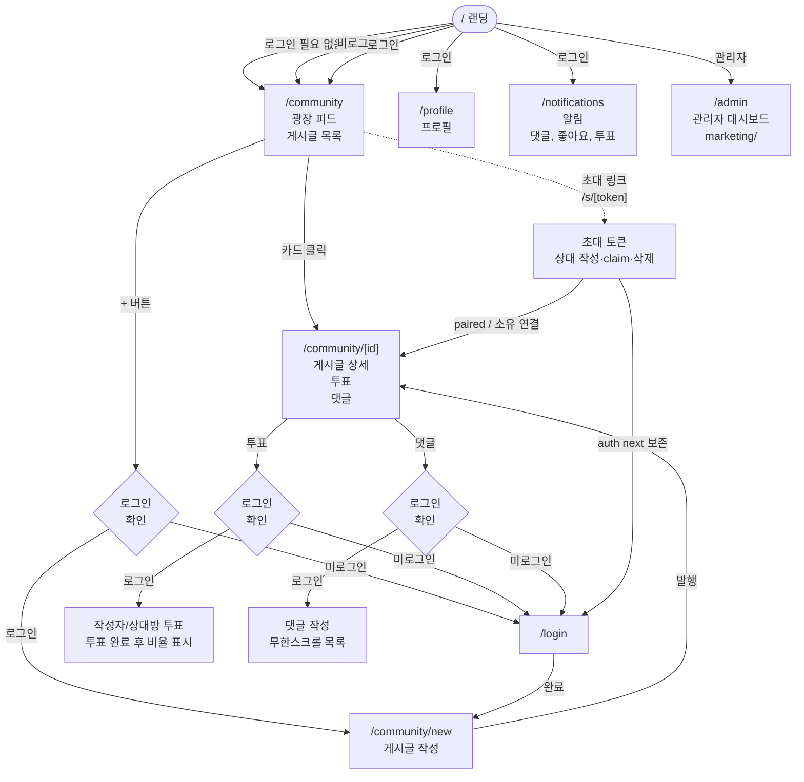

# UX 흐름 인덱스 — 광장형

**위치**: `docs/frontend/ux/flows/README.md`  
**자매 문서**: [../principles.md](../../70-policy/principles.md) · [../../architecture.md](../../30-components/architecture.md)  
**성격**: as-is 현행 기준 — 광장 사연 + 커뮤니티 공감 투표.

---

## 문서 현황

### 현존하는 문서 (광장형 기준)

| 파일 | 주제 | 상태 |
|---|---|---|
| [01-auth.md](./01-auth.md) | 가입·로그인·게스트·OAuth (`next=/s/{token}` 보존) | ✅ 유지 |
| [02-permissions.md](./02-permissions.md) | 권한 시스템 (3-tier, TESTER role) | ✅ 유지 |
| [08-crisis.md](./08-crisis.md) | 위기 감지·CrisisResourceModal | 🔄 전면 재작성 필요 |
| [09-admin.md](./09-admin.md) | 관리자 대시보드 | 🔄 전면 재작성 필요 |
| [09-partner-invite-ownership.md](./09-partner-invite-ownership.md) | 상대 초대 소유권·claim·삭제 tombstone·시한부 투표 제거 | ✅ SSOT (2026-08-11) |

### 삭제된 문서 (구 모델)

| 파일 | 이유 |
|---|---|
| `03-onboarding.md` | 온보딩 페이지 삭제됨 (광장형 모델) |
| `04-mbti.md` | MBTI 테스트 삭제됨 |
| `05-session-chat.md` | 세션 기반 채팅 삭제됨 |
| `06-duo.md` | Duo 모드 (파트너 초대) 삭제됨 |
| `07-report.md` | Solo/Duo 리포트 삭제됨 |

---

## 전체 진입 지도 (광장형)

---

## 권한 매트릭스

출처: `lib/constants/userPermissions.ts`

| 권한 | Guest | User | TESTER | Admin |
|---|---|---|---|---|
| **피드 열람** | ✅ | ✅ | ✅ | ✅ |
| **게시글 작성** | ❌ | ✅ | ✅ | ✅ |
| **투표** | ❌ | ✅ | ✅ | ✅ |
| **댓글** | ❌ | ✅ | ✅ | ✅ |
| **프로필** | ❌ | ✅ | ✅ | ✅ |
| **알림** | ❌ | ✅ | ✅ | ✅ |
| **커뮤니티 관리** | ❌ | ❌ | ❌ | ✅ |
| **마케팅 대시보드** | ❌ | ❌ | ❌ | ✅ |
| **관리자 액세스** | ❌ | ❌ | (조회 전용) | ✅ |

**TESTER role**: `user.roles[]` 배열의 값. 관리자에게 테스트 기능 노출용.

---

## 페이지별 흐름

### 1. 피드 (`/community`)
1. 로그인 여부 무관 열람 가능
2. 무한스크롤 또는 페이지네이션
3. 카테고리 필터 (선택 안 함도 가능)

### 2. 게시글 작성 (`/community/new`)
1. 로그인 필수 (미로그인 → 로그인 모달)
2. 제목·본문·카테고리 작성
3. 원문 게시 (사람글 경로 LLM 미호출)
4. 상대방 초대 링크는 별도 흐름(`/s/[token]`)에서 가능

### 3. 게시글 상세 (`/community/[id]`)
1. 투표 버튼 (작성자/상대방, 로그인 필요) — **마감/시한부 없음**(상시 공감 투표)
2. 댓글 무한스크롤 (로그인 필요)
3. 위기 컨텐츠: CrisisResourceModal 표시
4. 쪽별 tombstone / 완전 삭제 시 「삭제된 게시글」+ 광장 CTA — [09-partner-invite-ownership.md](./09-partner-invite-ownership.md)

### 3b. 상대 초대 (`/s/[token]`)
1. 미로그인 → 로그인/가입 후 **`next=/s/{token}` 복귀**
2. 답변 작성 · claim · 수정/삭제(tombstone) — SSOT 동일 문서

### 4. 알림 (`/notifications`)
- 댓글, 좋아요, 투표 알림
- 읽음 처리 후 30일 자동 삭제

---

## 현존하는 흐름 문서

### [01-auth.md](./01-auth.md)
- 게스트 진입 (`/guest`)
- 일반 로그인 (`/login`)
- 가입 (`/signup`)
- OAuth 콜백 (`/auth/callback/[provider]`)
- 비밀번호 재설정

### [02-permissions.md](./02-permissions.md)
- guest/registered/admin 3-tier
- TESTER role
- 라우트 게이트
- 401/403/402/429 에러 처리

### [08-crisis.md](./08-crisis.md) — 전면 재작성 필요
**현행**: 사용자 입력 필터 미적용 → 자동 위기 감지(`CrisisDetector`) + `/admin/crisis` 관제

### [09-admin.md](./09-admin.md) — 전면 재작성 필요
- `(admin)/admin/reports/` — 신고 처리
- `(admin)/admin/marketing/**` — 마케팅 대시보드

### [09-partner-invite-ownership.md](./09-partner-invite-ownership.md) — SSOT
- `/s/{token}` → 가입/로그인 후 **같은 URL 복귀** (`next=/s/{token}`)
- unowned 상대 본문: 토큰 capability로 수정·삭제·재작성; 「내 계정으로 연결」claim
- 한쪽 tombstone / 양쪽·미작성 시 완전 삭제
- **시한부 투표 제거** (`voteCloseAt` legacy) — 공감 투표(VoteBar)는 유지

---

## 기술 변경 사항

| 항목 | 구 모델 | 신 모델 |
|---|---|---|
| **라우트 구조** | `session/` 중심 | `community/` 중심 |
| **상태 관리** | sessionStore, communityStore | uiStore (통합) |
| **상호작용** | 6턴 chat | 커뮤니티 공감 투표 + 댓글 |
| **API 엔드포인트** | `/api/sessions/*` | `/api/community/posts/**` |
| **결과 페이지** | `/session/result/[id]` | 게시글 상세에 통합 |
| **온보딩** | 10문항 + 선택 | 제거됨 |
