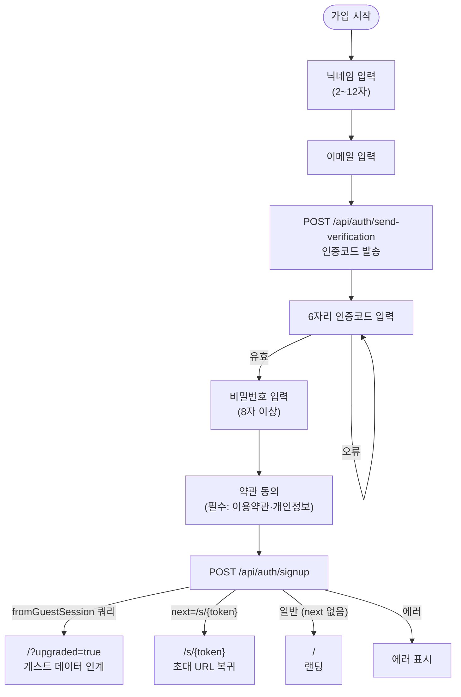
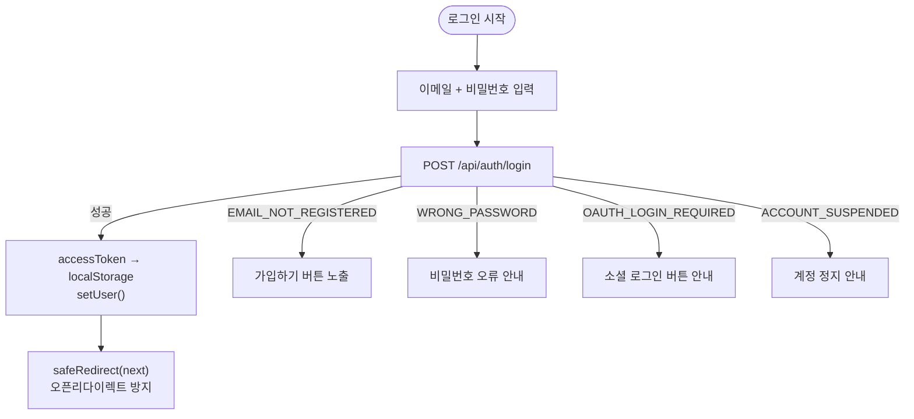
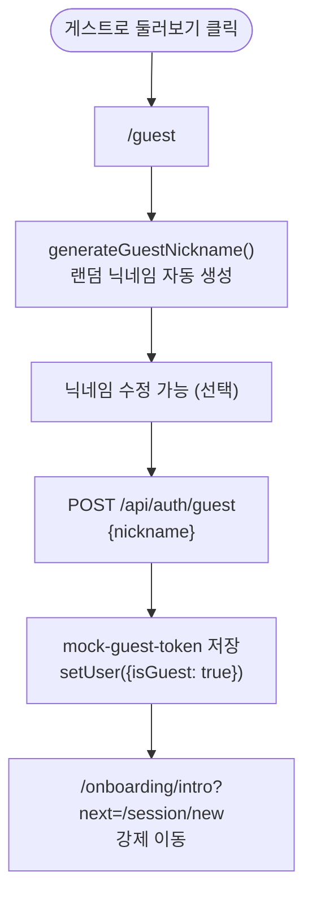
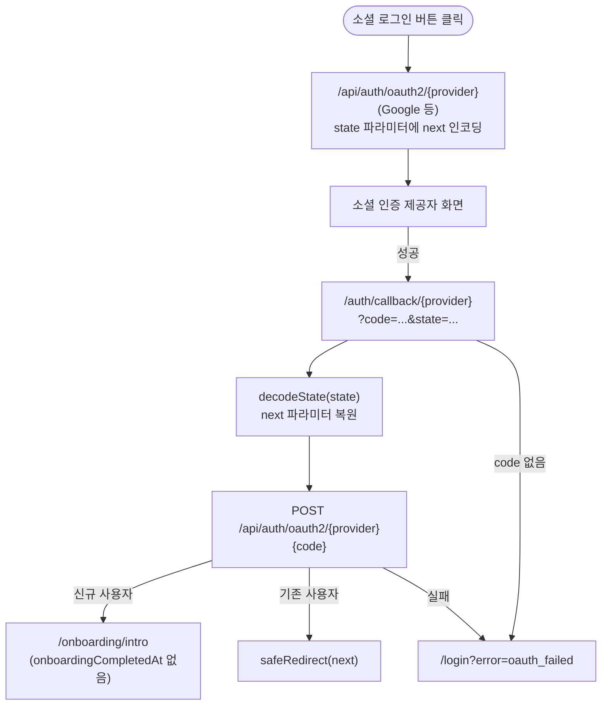
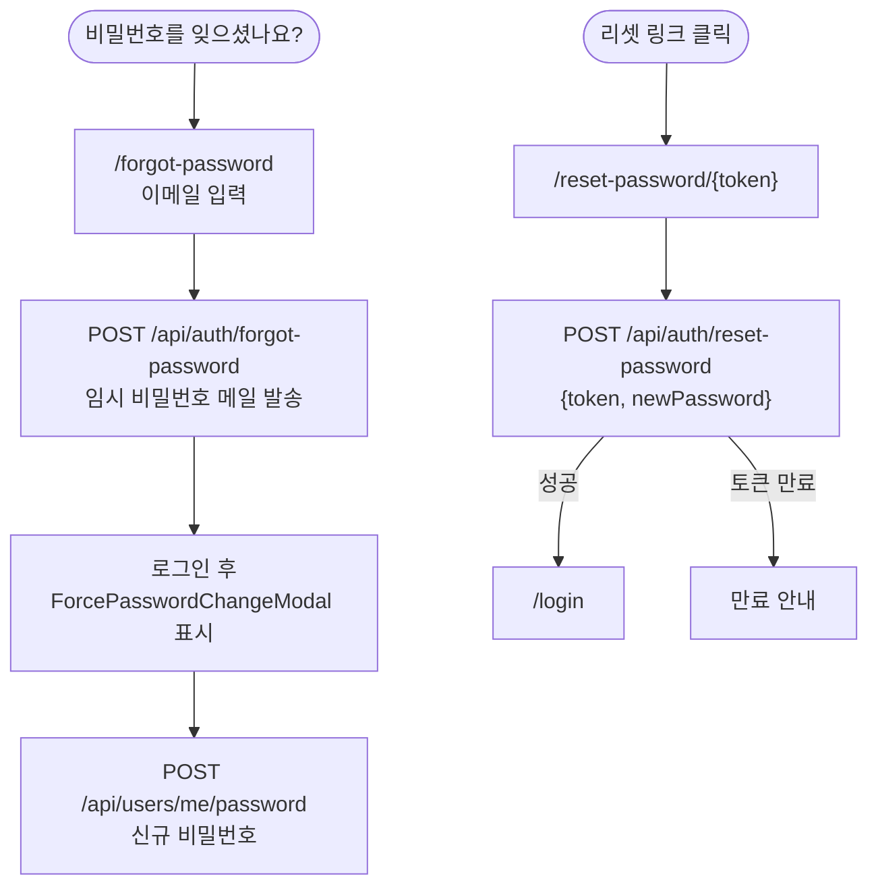

# 인증 흐름

**위치**: `docs/frontend/ux/flows/01-auth.md`  
**자매 문서**: [README.md](./README.md) · [02-permissions.md](./02-permissions.md) · [09-partner-invite-ownership.md](./09-partner-invite-ownership.md) · [../principles.md](../principles.md)  
**기준일**: 2026-08-11  
**성격**: as-is 현행 기준

---

## 진입점

| 경로 | 설명 |
|---|---|
| `/` | 랜딩 — 로그인 상태에 따라 분기 |
| `/login` | 이메일 로그인 (`?next=` 지원) |
| `/signup` | 이메일 회원가입 (`?next=` 지원) |
| `/guest` | 게스트 닉네임 입력 |
| `/auth/callback/[provider]` | OAuth 콜백 처리 |
| `/forgot-password` | 비밀번호 재설정 요청 |
| `/reset-password/[token]` | 비밀번호 재설정 실행 |
| `/s/[token]` | 상대 초대 — 미로그인 시 로그인/가입으로 보내고 **`next=/s/{token}`으로 복귀** |

---

## 초대 URL `next` 보존 (2026-08-11)

상대 초대 `/s/{token}`에서 가입·로그인·OAuth·게스트 승격(GuestUpgrade)을 탈 때 **항상 같은 초대 URL로 복귀**한다. 홈(`/`)·광장(`/community`)으로 보내면 안 된다.

| 경로 | 계약 |
|---|---|
| `/login?next=/s/{token}` | 성공 후 `safeRedirect(next)` → `/s/{token}` |
| `/signup?next=/s/{token}` | 성공 후 동일 (게스트 업그레이드 포함) |
| OAuth `state` | `next=/s/{token}` 인코딩 → 콜백에서 복원 |
| GuestUpgradeModal | `redirect`/`next`에 `/s/{token}` 유지 |

근거: `safeRedirect()` · [09-partner-invite-ownership.md](./09-partner-invite-ownership.md).

---

## 가입 흐름

근거: `app/(auth)/signup/page.tsx`

**검증 에러 6종**:
- `NICKNAME_TAKEN` — 닉네임 중복
- `EMAIL_TAKEN` — 이메일 중복
- `EMAIL_VERIFICATION_FAILED` — 인증코드 불일치
- `EMAIL_VERIFICATION_EXPIRED` — 인증코드 만료
- `WEAK_PASSWORD` — 비밀번호 강도 미달
- `TERMS_NOT_AGREED` — 필수 약관 미동의

---

## 로그인 흐름

근거: `app/(auth)/login/page.tsx`, `lib/api/client.ts`

`safeRedirect()`: `next` 파라미터가 동일 도메인(상대 경로)인지 검증 후 push. 외부 도메인이면 `/`로 fallback.  
초대 플로우에서는 `next=/s/{token}`이 반드시 살아 있어야 한다(홈·광장 fallback 금지).

---

## 게스트 진입

근거: `app/(auth)/guest/page.tsx`

`generateGuestNickname()`: `lib/utils/guestNickname.ts` — 형용사+명사 랜덤 조합.  
게스트 토큰은 `again-spring-token` key로 localStorage 저장. 만료 2시간.

---

## OAuth 콜백

근거: `app/auth/callback/[provider]/page.tsx`, `lib/auth/oauth.ts`

지원 provider: Google. Kakao·Naver는 클라이언트 ID 환경변수 있으나 BE 구현 여부 별도 확인 필요.

---

## 비밀번호 재설정

근거: `app/(auth)/forgot-password/page.tsx`, `app/(auth)/reset-password/[token]/page.tsx`

`ForcePasswordChangeModal`: 임시 비밀번호로 로그인한 사용자에게 강제 표시. 닫기·ESC 불가 (UX 안전 정책).

---

## 근거 파일

- `app/(auth)/signup/page.tsx`
- `app/(auth)/login/page.tsx`
- `app/(auth)/guest/page.tsx`
- `app/(auth)/forgot-password/page.tsx`
- `app/(auth)/reset-password/[token]/page.tsx`
- `app/auth/callback/[provider]/page.tsx`
- `lib/auth/oauth.ts`
- `lib/utils/guestNickname.ts`
