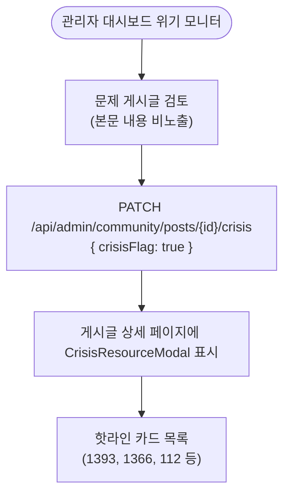
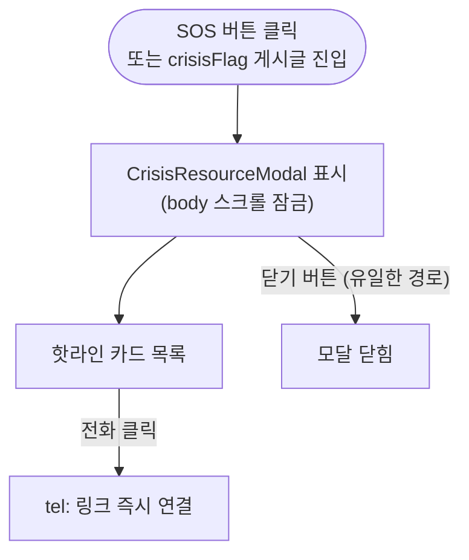

# 위기 처리 흐름

**위치**: `frontend/docs/ux/flows/08-crisis.md`  
**자매 문서**: [README.md](./README.md) · [09-admin.md](./09-admin.md)  
**기준일**: 2026-06-03

---

## 광장형 위기 정책 개요

다시봄 광장형 모델에서 **사용자 입력(게시글·댓글)에는 금지어·위기 키워드 필터를 적용하지 않습니다.**  
사용자가 쓴 텍스트의 표현 책임은 사용자에게 있으며, 플랫폼은 입력을 차단하지 않습니다.

대신 다음 두 가지 수단으로 위기 상황에 대응합니다:

1. **관리자 위기 마크** — 관리자가 위기로 판단한 게시글에 `crisisFlag`를 설정
2. **상시 핫라인 리소스** — `CrisisResourceModal` 언제든 접근 가능

---

## 절대 불변 규칙

> `CrisisResourceModal`은 **ESC·바깥 클릭으로 닫히지 않는다.**  
> backdrop onClick 핸들러·ESC keydown handler 추가 금지. 닫기 버튼 단일 경로.

---

## (A) 관리자 위기 마크 흐름

근거: `app/(admin)/admin/community/`, `CommunityPostController`

- 위기 모니터 본문 비노출: 프라이버시 정책 준수
- `crisisFlag = true` 설정 시 게시글 상세(`/community/[id]`)에서 CrisisResourceModal 자동 표시

---

## (B) 상시 핫라인 접근

근거: `components/shared/CrisisResourceModal.tsx`, `lib/constants/crisisResources.ts`

---

## 핫라인 목록

출처: `lib/constants/crisisResources.ts`

| 번호 | 기관 | 운영 |
|---|---|---|
| 1393 | 자살예방상담전화 | 24시간 |
| 1366 | 여성긴급전화 | 24시간 |
| 132 | 경찰 여성·청소년 상담 | — |
| 112 | 경찰 신고 | 24시간 |
| 1388 | 청소년 상담 | — |
| 1577-0199 | 학교폭력 신고 | — |

`tel:` 링크로 즉시 전화 연결. `sms:` 링크도 제공.

---

## 근거 파일

- `components/shared/CrisisResourceModal.tsx` — 핫라인 모달 (ESC/바깥클릭 없음)
- `lib/constants/crisisResources.ts` — 핫라인 데이터
- `lib/constants/forbiddenWords.ts` — CRISIS_KEYWORDS, WARNING_KEYWORDS (관리자 판단 참고용, 사용자 입력 차단 아님)
- `app/(admin)/admin/community/` — 관리자 위기 마크 UI
