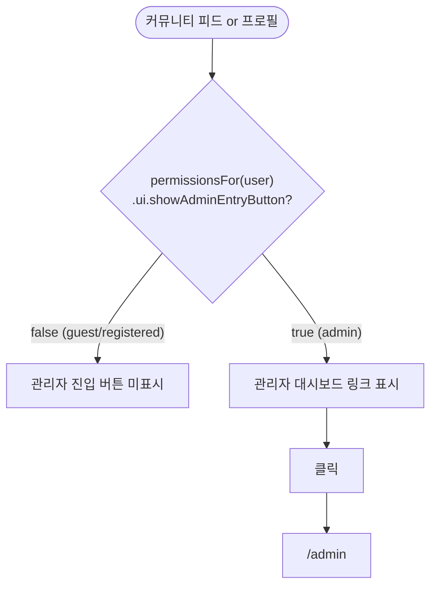
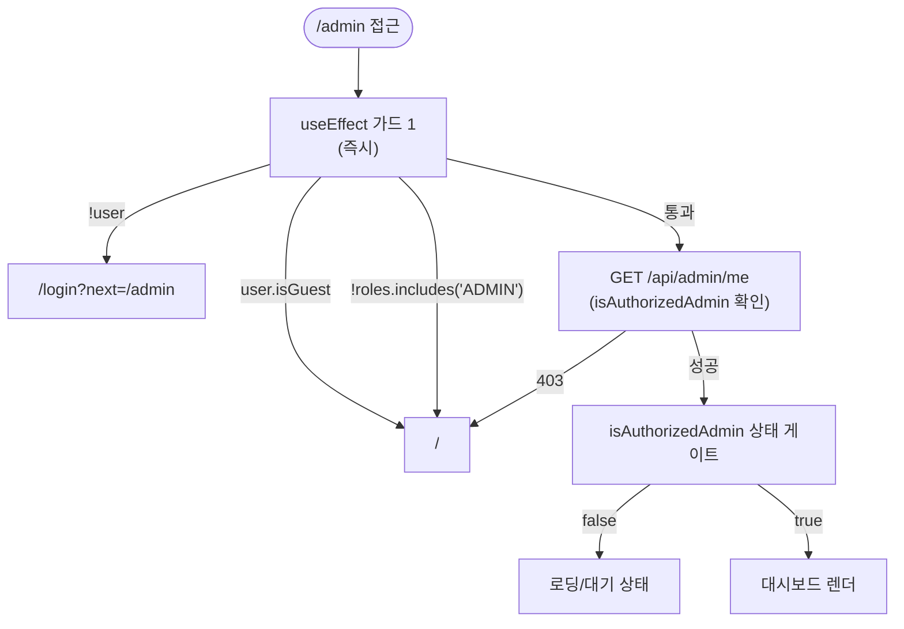
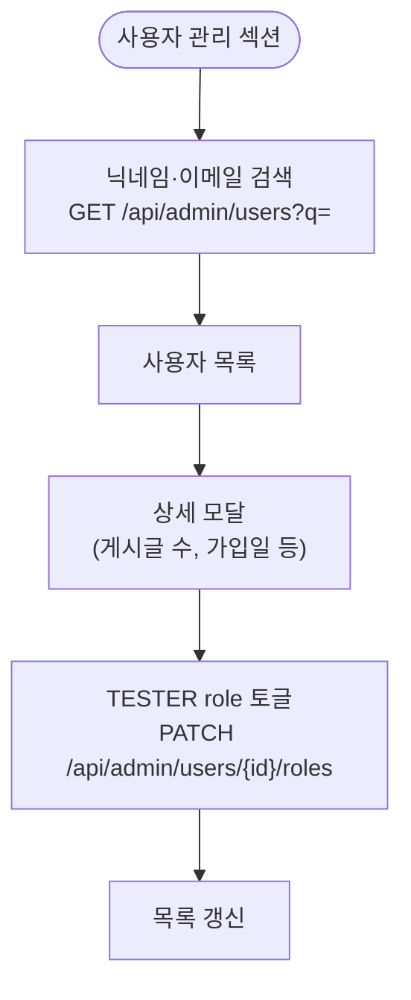

# 관리자 흐름

**위치**: `docs/frontend/ux/flows/09-admin.md`  
**자매 문서**: [README.md](./README.md) · [02-permissions.md](./02-permissions.md) · [../principles.md](../principles.md)  
**기준일**: 2026-06-03

---

## 진입

근거: `lib/constants/userPermissions.ts`

---

## 3중 가드

근거: `app/(admin)/admin/page.tsx`

가드 1 (useEffect): 클라이언트 상태 기반 즉시 리다이렉트.  
가드 2 (데이터): BE `/api/admin/me` 응답으로 실제 admin 권한 확인.  
가드 3 (렌더): `isAuthorizedAdmin === false`이면 대시보드 렌더 차단.

---

## 대시보드 섹션

근거: `app/(admin)/admin/page.tsx`

| 섹션 | 내용 | 폴링 |
|---|---|---|
| SystemHealth | CPU·메모리·DB·LLM 헬스 | — |
| 오늘 요약 | 오늘 게시글 수·사용자 수·위기 건수 | — |
| 추세 차트 | 일별 게시글·사용자 추이 | — |
| 위기 모니터 | 위기 플래그 게시글 목록 (본문 비노출) | 30초 |
| 의견함 | 사용자 피드백 목록, 상태 필터 (received/reviewed/closed) | — |
| 사용자 관리 | 검색 + TESTER role 토글 + 상세 모달 | — |

**위기 모니터 본문 비노출**: 프라이버시 정책 준수.  
**TESTER 토글**: `PATCH /api/admin/users/{id}/roles` — roles 배열에 'TESTER' 추가/제거.

---

## 광장 관리 (`/admin/community`)

근거: `app/(admin)/admin/community/`

- 게시글 목록 조회 + 위기 플래그(`crisisFlag`) 설정/해제
- 게시글 숨김·삭제 (규정 위반)
- 신고 처리: `GET /api/admin/community/reports`, `PATCH .../reports/{id}/status`

---

## 마케팅 관리 (`/admin/marketing`)

근거: `app/(admin)/admin/marketing/`

> dev 전용 (prod 미지원). `MARKETING_ENABLED` 환경변수로 활성화.

| 서브경로 | 기능 |
|---|---|
| `/marketing/stories` | SNS 스토리 생성·관리 |
| `/marketing/contents` | 마케팅 콘텐츠 관리 |
| `/marketing/templates` | 콘텐츠 템플릿 관리 |
| `/marketing/simulations` | 마케팅 시뮬레이션 |
| `/marketing/hashtags` | 해시태그 라이브러리 |
| `/marketing/calendar` | 발행 캘린더 |
| `/marketing/costs` | 비용 추적 |
| `/marketing/settings` | 소셜 계정 연결 등 설정 |

---

## 사용자 관리 흐름

---

## 근거 파일

- `app/(admin)/admin/page.tsx` — 대시보드 전체 (3중 가드 + 섹션)
- `app/(admin)/admin/community/` — 광장 관리 (위기 마크, 신고 처리)
- `app/(admin)/admin/marketing/` — 마케팅 관리 (dev 전용)
- `lib/constants/userPermissions.ts` — admin tier 권한 정의
