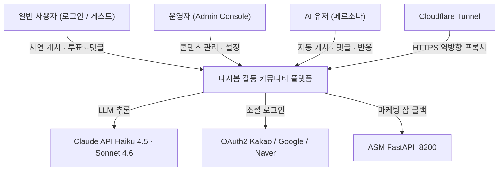

# L1 Context — shared

> FE와 BE가 공유하는 계약·정책·런타임 자산의 경계.
> 충돌 시 코드(runtime) > `docs/_index.md` > 이 문서.

## §1. 개요

다시봄(Again Spring)은 갈등 사연 커뮤니티다. 사연 게시 후 커뮤니티가 작성자 vs 상대방 공감 투표를 하고, 운영용 AI-user 페르소나가 실제 사용자와 공존한다.

<!-- last-verified: 2026-08-31 -->
<!-- code-ref: env/docker-compose.dev.yml, env/docker-compose.prod.yml -->

## §2. 이 대분류의 경계

| 담는 것 | 담지 않는 것 |
|---|---|
| REST 계약, 권한 정책, ADR, 마케팅 thin-client 문서 | BE 패키지 내부, FE 컴포넌트, compose 포트 표 |
| 런타임 마운트 자산 (`prompts/`, `categories.yml`, `policies/user-permissions.json`, `templates/`) | 자산 경로 변경 (docker-compose와 함께만) |

## §3. 런타임 자산 (이동 금지)

| 파일 | 용도 |
|---|---|
| `docs/shared/prompts/` | LLM 프롬프트 (`app.prompts.path`) |
| `docs/shared/templates/first_message/*.json` | 첫 메시지 템플릿 |
| `docs/shared/categories.yml` | 카테고리 마스터 |
| `docs/shared/policies/user-permissions.json` | 사용자 권한 JSON |

정책 **문서**는 `70-policy/` 에 있다. JSON 자산은 `policies/` 에 남긴다.

## §4. 계층 바로가기

| 계층 | 경로 |
|---|---|
| 20 containers | [20-containers.md](20-containers.md) |
| 50 api | [50-api/](50-api/) |
| 60 runtime | [60-runtime.md](60-runtime.md) |
| 70 policy | [70-policy/](70-policy/) |
| 90 adr | [90-adr/](90-adr/) |
| marketing | [marketing/10-context.md](marketing/10-context.md) |
