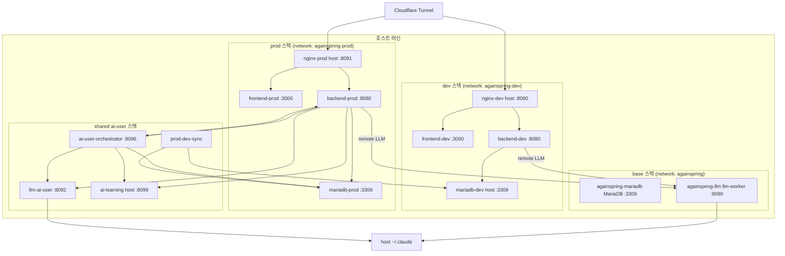
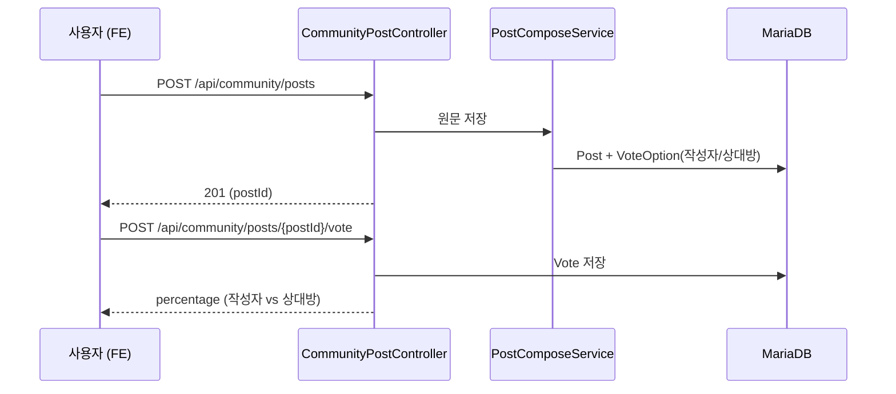

# L2 Containers — 배포 토폴로지

> 실행 단위·프로세스. 포트·볼륨 표의 권위는 `docs/env/20-containers/` (재편 후) / `env/docker-compose*.yml`.

## 배포 토폴로지 (system.md L2)

<!-- last-verified: 2026-08-31 -->
<!-- code-ref: env/docker-compose.dev.yml, env/docker-compose.prod.yml, env/docker-compose.yml -->



### 운영 원칙

- frontend/backend는 dev와 prod를 **완전 분리**한다. 검증·수동 테스트·e2e는 **dev(:8090)만**.
- prod(:8091) 배포·반영은 명시적 "prod에 배포해줘" 지시 시에만. **prod에서 e2e 금지.**
- base `againspring-llm`은 요청 실행을 최대 600초 허용하고, timeout·취소·종료 시 Claude CLI 프로세스 트리를 2초 정상 종료 후 강제 종료한다.
- ai-user 런타임은 `env/docker-compose.ai-user.yml` 하나를 공통으로 사용한다.
- PLAN-first 경로: outbox → orchestrator(plan/hold/inbox) → CLI 구조화 생성 → `ai_scheduled_posts` 홀딩 → 슬롯 도래 시 REST 게시 → due item 댓글.
- orchestrator와 learning의 실제 주력 대상은 prod DB와 prod backend다.
- `llm-ai-user`는 DB 미접속(무상태, 2026-09) — guide는 orchestrator가 실어 보내는 요청 `promptOverrides` 또는 classpath에서만 읽는다.
- `prod-dev-sync`는 5분 콘텐츠 + 24h full, prod→dev 비식별 upsert.

포트·볼륨 표는 `docs/env/` (compose 권위본)에 둔다.

---

**주의**: docs는 현재 런타임과 일치해야 한다. 역사적 피벗·삭제 기록은 ADR만 참조한다 (ADR-0001 등).

## 한 장 다이어그램

<!-- last-verified: 2026-08-31 -->
<!-- code-ref: backend/src/main/java/com/againspring/service/community/PostComposeService.java, env/docker-compose.dev.yml -->

```mermaid
flowchart TB
    Browser[Browser SPA<br/>Next.js 14]
    subgraph Backend["Spring Boot 3.3"]
        API[REST Controller<br/>/api/community/{posts,votes,comments}]
        Auth[Security / JWT]
        PostService[PostComposeService<br/>원문 게시]
        VoteService[VoteService<br/>작성자 vs 상대방]
        LLMProvider["RemoteLlmProvider<br/>(CLI 경로, 제품 사람글 미사용)"]
        Safety[PromptSanitizer<br/>CrisisKeywordGuard]
        Retention[RetentionScheduler]
    end
    subgraph AIUser["shared ai-user"]
        ORC[ai-user-orchestrator]
        LLMAI[llm-ai-user]
    end
    DB[(MariaDB 11<br/>posts, post_comments<br/>votes, vote_options<br/>+ ai_user_*)]

    Browser -->|HTTPS + JWT| API
    API --> Auth
    Auth --> PostService
    Auth --> VoteService
    PostService --> DB
    VoteService --> DB
    PostService -.->|PUBLIC outbox| ORC
    ORC --> LLMAI
    ORC -->|REST publish| API
    LLMProvider -.optional residual.-> Safety
```

### 배포 토폴로지:

```
사용자 브라우저
      │ HTTPS
      ▼
┌─────────────────────┐
│  Cloudflare Tunnel  │  dev.againspring.net  → :8090
│   (cloudflared)     │  againspring.net      → :8091
└─────────┬───────────┘  www.againspring.net  → :8091
          │ HTTP (호스트)
          ▼
┌─────────────────────┐
│  nginx 컨테이너      │  /api/, /actuator/, /swagger-ui/  → backend:8080
│  (dev/prod)         │  /                                 → frontend:3000
└──┬──────────────┬───┘
   │              │
   ▼              ▼
┌────────────┐  ┌──────────────────┐  ┌────────────────────┐
│ frontend   │  │  backend         │  │  llm-worker        │
│ Next.js 14 │  │  Spring Boot 3.3 │  │  (base, optional)  │
│ :3000      │  │  :8080           │  │  :8090             │
└──────┬─────┘  └─────────┬────────┘  └────────┬───────────┘
       │ axios            │ Spring Data JPA    │
       │ Bearer JWT       │                    │
       └──────► /api/...  ├────────────────────┤
                          ▼                    │
                ┌──────────────────┐           │
                │ MariaDB 11       │           │
                │ Flyway           │           │
                └──────────────────┘           │
                          ▲                    │
                ai-user-orchestrator ──────────┘
                + llm-ai-user (주력 생성)
```

## 흐름별 설명

### 1) HTTP 요청 흐름 (커뮤니티 광장)

1. 브라우저 → `https://dev.againspring.net/api/community/posts` 또는 `/comments` / `/vote`
2. Cloudflare Tunnel → 호스트 `localhost:8090` (dev) / `8091` (prod)
3. `againspring-nginx-{dev,prod}` (`env/nginx/`):
   - `/api/` 매치 → `http://againspring-backend-{dev,prod}:8080`
4. `CommunityPostController` / `CommunityCommentController` / `NotificationController` 진입
5. 사람글 게시는 `PostComposeService`가 원문 저장 (LLM 미호출)
6. 공개 글은 outbox → AI-user orchestrator가 댓글·반응 등을 이어갈 수 있음

### 2) 인증 흐름

| 단계 | 처리 |
|---|---|
| 회원가입 | `POST /api/auth/send-verification` → 이메일 코드 → `POST /api/auth/signup` |
| 로그인 | `POST /api/auth/login` → access token (JWT 24h) |
| OAuth | `POST /api/auth/oauth2/{provider}` (Google · Kakao · Naver) |
| 게스트 | `POST /api/auth/guest` → 임시 토큰 (1h) |
| 인증 검증 | `JwtAuthFilter` → `JwtService` + `RevokedTokenRepository` |
| 로그아웃 | `LogoutService` → JTI를 `revoked_tokens`에 추가 |

FE의 axios 인터셉터(`frontend/lib/api/client.ts`)가 `localStorage.again-spring-token`을 `Authorization: Bearer ...` 헤더로 자동 주입.

### 3) 게시글 & 공감 투표 흐름

<!-- last-verified: 2026-08-31 -->
<!-- code-ref: backend/src/main/java/com/againspring/service/community/PostComposeService.java -->



### 4) AI-user 생성 흐름

주력 LLM은 `llm-ai-user`다. PLAN 홀딩·발행 상세는 `docs/ai-user/` · `docs/shared/50-api/flows.md`.

### 5) 데이터 보존

- 게시글·댓글 원문 → retention 정책에 따라 만료 처리
- 자세한 정책: [data-retention.md](70-policy/data-retention.md)

## 컴포넌트 책임 요약

| 컴포넌트 | 책임 | 상호작용 |
|---|---|---|
| Cloudflare Tunnel | 외부 도메인 → 호스트 포트 | nginx 8090/8091 |
| nginx | 경로 분기 + 헤더 주입 | backend, frontend |
| Next.js (FE) | UI · 라우팅 · 상태 | axios → BE |
| Spring Boot (BE) | API · 도메인 · 보안 · 투표 | MariaDB, outbox |
| ai-user-orchestrator | 페르소나 글/댓글 계획·발행 | BE REST, llm-ai-user |
| llm-ai-user | AI-user 구조화 생성 | Claude/Codex CLI |
| MariaDB | 영속 저장소 | BE, orchestrator |

