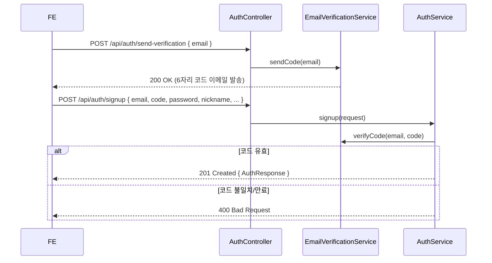
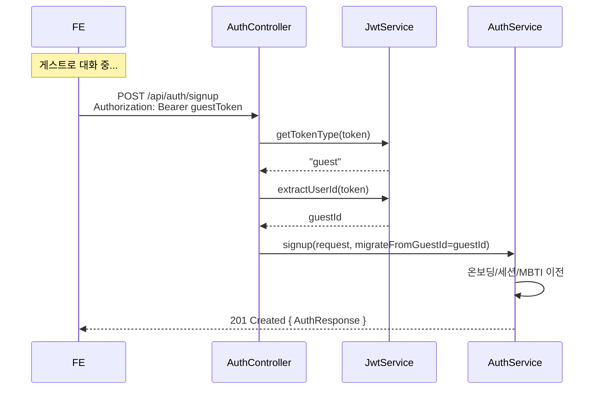
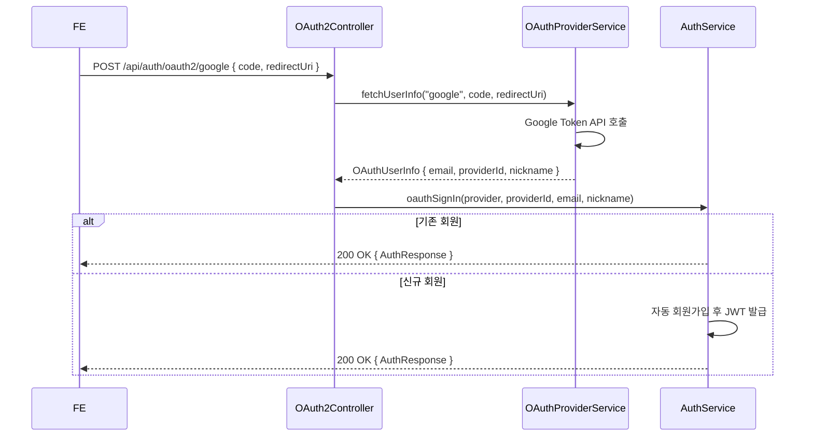
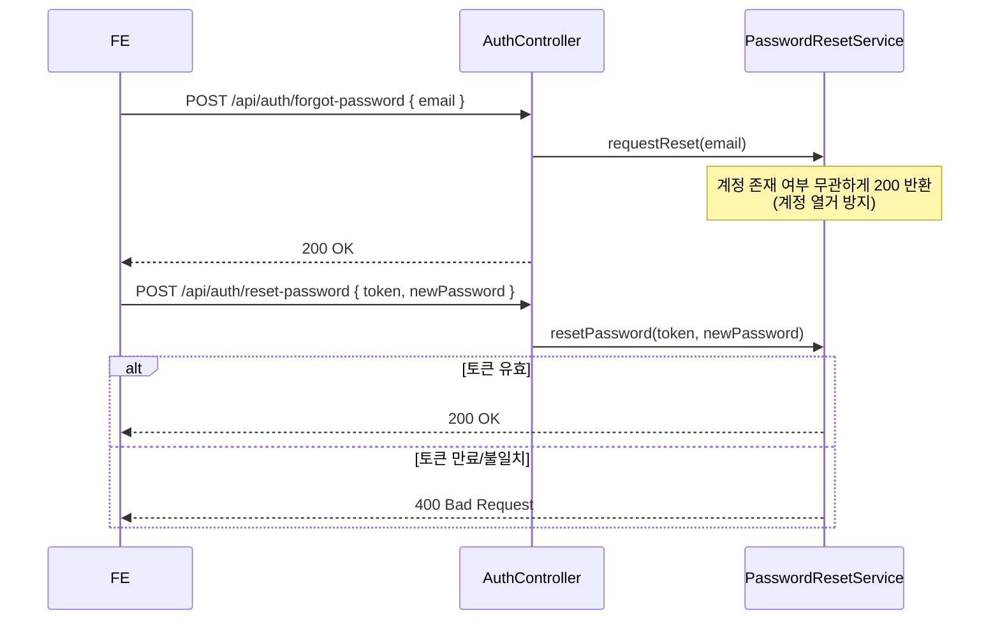

# Auth API — 인증 · 소셜 로그인

> 회원가입·로그인·게스트 토큰 발급·비밀번호 초기화·소셜 로그인(OAuth2)을 담당하는 API.
> 대부분의 엔드포인트는 공개(인증 불필요). `/agree` 만 JWT 필요.

## Source of truth

| 항목 | 위치 |
|---|---|
| 컨트롤러 | `backend/src/main/java/com/againspring/api/AuthController.java` |
| OAuth2 컨트롤러 | `backend/src/main/java/com/againspring/api/OAuth2Controller.java` |
| 요청 DTO | `backend/src/main/java/com/againspring/api/dto/request/` (Auth* / OAuth*) |
| 응답 DTO | `backend/src/main/java/com/againspring/api/dto/response/AuthResponse.java` |
| 서비스 | `backend/src/main/java/com/againspring/service/AuthService.java` |
| JWT | `backend/src/main/java/com/againspring/security/JwtService.java` |
| 이메일 인증 | `backend/src/main/java/com/againspring/service/EmailVerificationService.java` |
| 비밀번호 초기화 | `backend/src/main/java/com/againspring/service/PasswordResetService.java` |

## 엔드포인트

| Method | Path | Auth | 요청 | 응답 | 상태코드 |
|---|---|---|---|---|---|
| `POST` | `/api/auth/send-verification` | 공개 | `SendVerificationRequest` | — | 200 / 400 |
| `POST` | `/api/auth/signup` | 공개 (게스트 마이그레이션 선택) | `SignupRequest` + `Authorization?` 헤더 | `AuthResponse` | 201 / 400 / 409 |
| `POST` | `/api/auth/login` | 공개 | `LoginRequest` | `AuthResponse` | 200 / 400 / 401 |
| `POST` | `/api/auth/guest` | 공개 | `GuestRequest` | `AuthResponse` | 200 |
| `POST` | `/api/auth/logout` | 공개 (토큰 폐기) | `Authorization?` 헤더 | — | 204 |
| `POST` | `/api/auth/forgot-password` | 공개 | `ForgotPasswordRequest` | — | 200 |
| `POST` | `/api/auth/reset-password` | 공개 | `ResetPasswordRequest` | — | 200 / 400 |
| `GET` | `/api/auth/check-nickname` | 공개 | `?nickname=` | `{ available: bool }` | 200 |
| `POST` | `/api/auth/agree` | **JWT 필수** | `AgreeReconfirmRequest` | — | 200 / 400 |
| `POST` | `/api/auth/oauth2/{provider}` | 공개 | `OAuthCallbackRequest` | `AuthResponse` | 200 / 400 / 401 |

### AuthResponse 형식

```json
{
  "accessToken": "eyJ...",
  "tokenType": "Bearer",
  "userId": "usr_xxxxx",
  "nickname": "홍길동",
  "isGuest": false,
  "roles": ["USER"],
  "mustChangePassword": false,
  "tutorialCompleted": true,
  "onboardingCompleted": true
}
```

## 이메일 회원가입 흐름



## 게스트 → 회원 마이그레이션 흐름



## OAuth2 소셜 로그인 흐름



## 비밀번호 초기화 흐름



## 보안 주의사항

- `forgot-password` 는 계정 존재 여부와 무관하게 항상 200 반환 (anti-enumeration)
- 게스트 토큰 유효 시간: **2시간** (`UserPermissionsConfig.guest.auth.tokenExpirationSeconds`)
- 일반 회원 토큰 유효 시간: **24시간** (`jwt.expiration-ms`)
- 토큰 폐기: `revoked_tokens` 테이블 기록 → `JwtAuthFilter` 에서 차단
- `mustChangePassword=true` 이면 비밀번호 변경 전 다른 API 호출 제한 (FE 게이팅)
