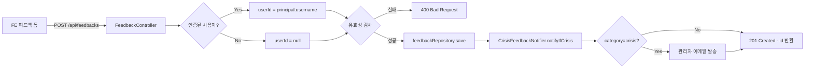

# Feedback API — 사용자 피드백 제출

> 사용자가 서비스 이용 후 피드백을 제출하는 API.
> 인증 여부와 무관하게 제출 가능 (익명 허용).

## Source of truth

| 항목 | 위치 |
|---|---|
| 컨트롤러 | `backend/src/main/java/com/againspring/api/FeedbackController.java` |
| 요청 DTO | `backend/src/main/java/com/againspring/api/dto/request/SubmitFeedbackRequest.java` |
| 도메인 | `backend/src/main/java/com/againspring/domain/Feedback.java` |
| 서비스 | `backend/src/main/java/com/againspring/service/FeedbackService.java` |
| DB 테이블 | `feedbacks` (V16 마이그레이션) |

## 엔드포인트

| Method | Path | Auth | 요청 | 응답 | 상태코드 |
|---|---|---|---|---|---|
| `POST` | `/api/feedbacks` | 공개 (principal 선택) | `SubmitFeedbackRequest` | `{ "id": Long }` | 201 / 400 |

### POST /api/feedbacks — 피드백 제출

```json
// 요청 (SubmitFeedbackRequest)
{
  "postId": "123",                   // nullable — 게시글 연동 시
  "category": "praise",              // praise | bug | suggestion | other | crisis
  "content": "공감 투표 결과가 도움이 됐어요.",  // 최소 10자
  "contactConsent": true,            // 연락 동의 여부
  "contactEmail": "user@example.com",// contactConsent=true 일 때만 저장
  "pageUrl": "/community/posts/123",      // nullable
  "userAgent": "Mozilla/5.0 ..."     // nullable
}

// 응답 (201 Created)
{ "id": 42 }

// 오류 (400 Bad Request)
{ "code": "VALIDATION_ERROR", "message": "content는 10자 이상이어야 합니다." }
```

**주요 동작:**

- 로그인 사용자: `userId` = 현재 사용자 ID 자동 저장
- 게스트/익명: `userId = null`
- `contactConsent = false` 이면 `contactEmail` 은 DB에 저장되지 않음 (개인정보 보호)
- category가 `crisis` 이면 `CrisisFeedbackNotifier` 가 관리자 알림 발송
- category 허용값: `praise`, `bug`, `suggestion`, `other`, `crisis` (그 외 400)
- 유효하지 않은 카테고리 또는 content 10자 미만 → `IllegalArgumentException` → 400

## 흐름도



## 변경 시 절차

- 카테고리 추가 시: `FeedbackService` 허용 목록 + FE 드롭다운 + `docs/shared/50-api/feedback.md` 동시 수정
- 관리자용 피드백 조회·상태 관리: [`admin.md#admin-feedbacks`](admin.md)
