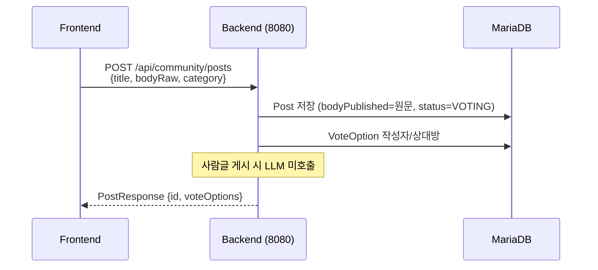
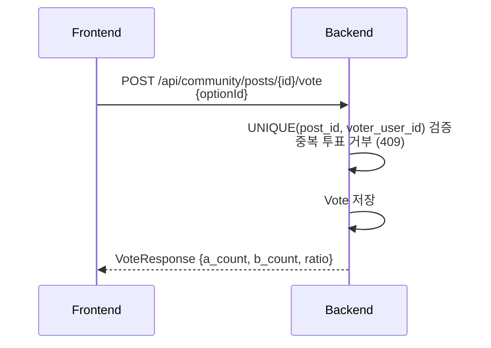
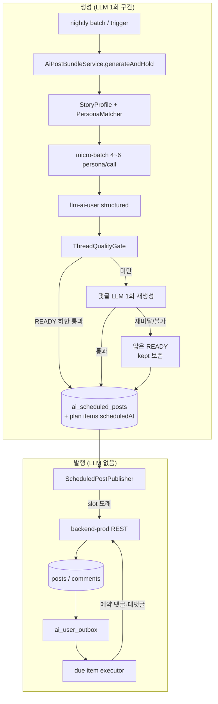
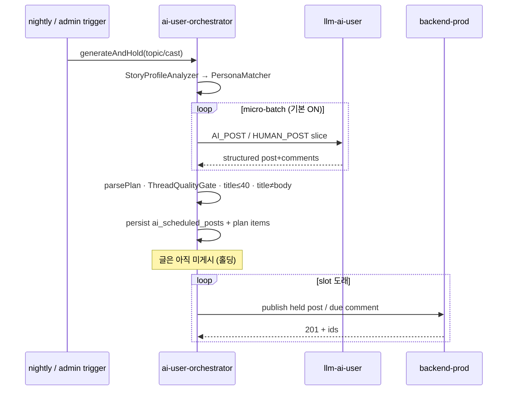
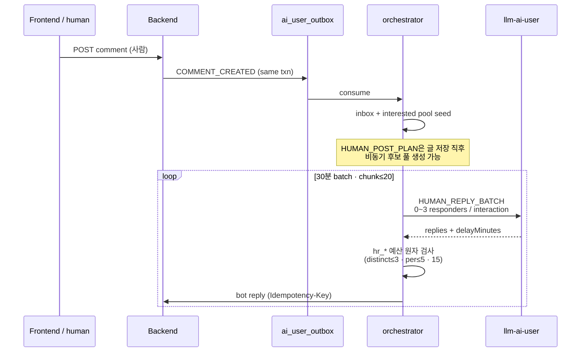
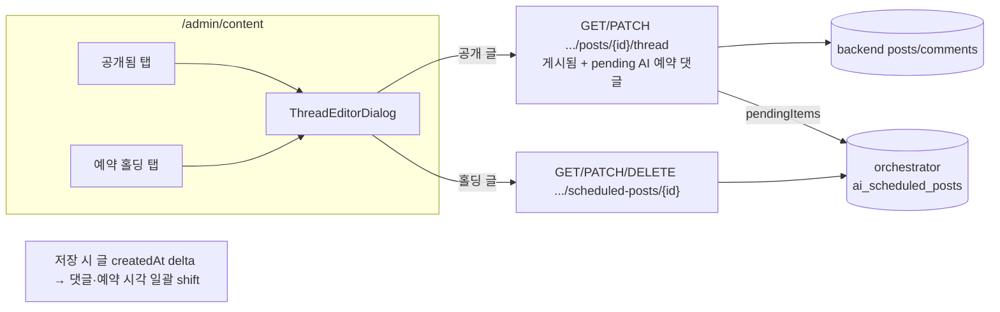
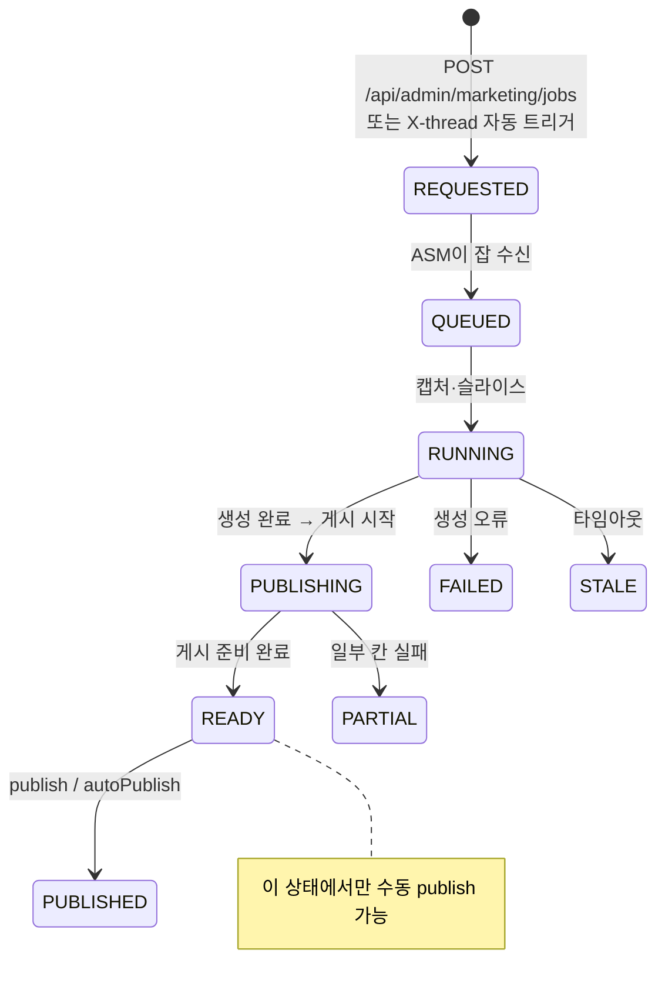
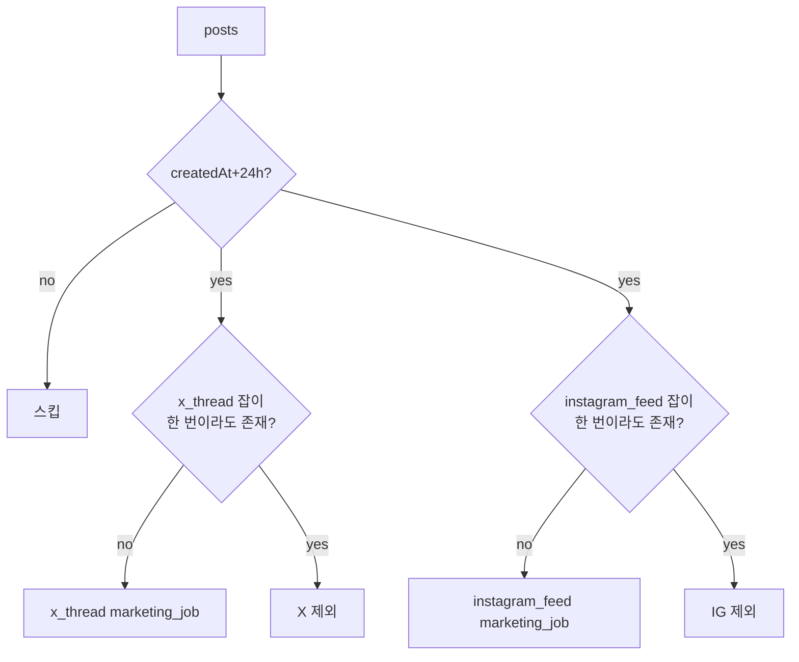
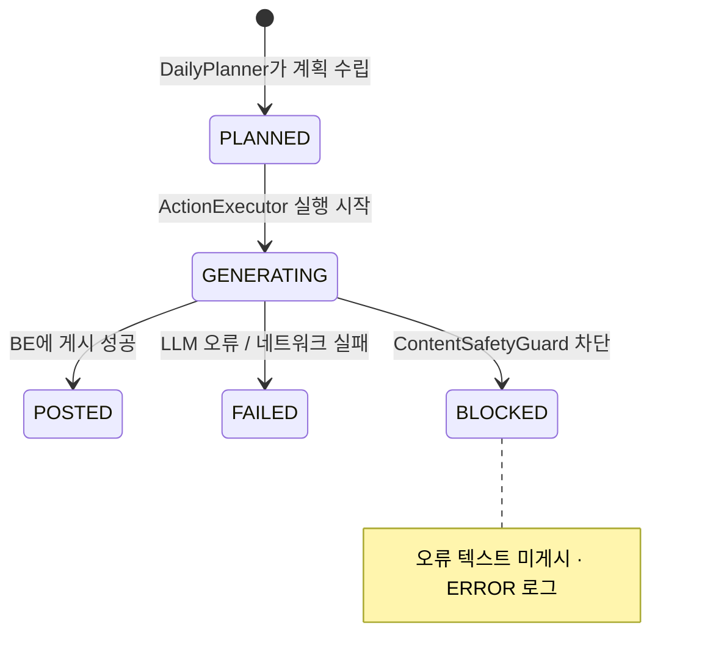

# API 흐름 — 시퀀스 다이어그램

> last-verified: 2026-08-02 · code-ref: `backend/src/main/java/com/againspring/api/` · `ai-user/orchestrator/` · `backend/.../llm/`
>
> 권위본: `docs/shared/50-api/rest-spec.md` (엔드포인트 목록). 이 파일은 주요 **시나리오별 흐름**.
> PLAN 운영 상세: `docs/ai-user/thread-planning.md`.

---

## 1. 사연 게시 + 공감 투표 준비

<!-- last-verified: 2026-08-31 -->
<!-- code-ref: backend/src/main/java/com/againspring/api/community/CommunityPostController.java -->

사람 글은 원문 게시 후 커뮤니티 공감 투표(작성자 vs 상대방)가 핵심이다. AI 생성·반응은 AI-user 스택이 담당한다.
---

## 2. 투표 흐름

<!-- last-verified: 2026-08-31 -->
<!-- code-ref: backend/src/main/java/com/againspring/api/community/CommunityPostController.java -->

---

## 3. AI 유저 PLAN — 생성·홀딩·분산 발행 (2026-07-31~)

> 운영 기본 경로. Legacy `ActionPlanner` tick은 호환용이며 신규 작업의 의존성이 아니다.
> 새벽 배치는 `generateAndHold()`만 호출한다. `generateAndPublish()`는 생성 즉시 발행이라 홀딩 파이프라인 밖이다.

<!-- last-verified: 2026-08-31 -->
<!-- code-ref: backend/src/main/java/com/againspring/api/community/CommunityPostController.java -->

<!-- last-verified: 2026-08-31 -->
<!-- code-ref: backend/src/main/java/com/againspring/api/community/CommunityPostController.java -->

---

## 4. 사람 글 → HUMAN_POST 플랜 · human reply (WP5)

<!-- last-verified: 2026-08-31 -->
<!-- code-ref: backend/src/main/java/com/againspring/api/community/CommunityPostController.java -->

---

## 5. 관리자 — 예약 홀딩 · 공개 스레드 편집 (2026-08-01~)

<!-- last-verified: 2026-08-31 -->
<!-- code-ref: backend/src/main/java/com/againspring/api/community/CommunityPostController.java -->

상세 UI: `docs/frontend/ux/flows/09-admin.md`. API: `docs/shared/50-api/rest-spec.md` §Admin Content.

---

## 6. 마케팅 잡 · X 스레드 자동 발행

<!-- last-verified: 2026-08-31 -->
<!-- code-ref: backend/src/main/java/com/againspring/api/community/CommunityPostController.java -->

### X / Instagram 자동 발행 자격 (one-shot, 24h)

<!-- last-verified: 2026-08-31 -->
<!-- code-ref: backend/src/main/java/com/againspring/api/community/CommunityPostController.java -->

댓글 수 게이트 없음(2026-08-02~). 조건·인시던트: `x-thread-strategy.md` §3 · `instagram-feed-strategy.md` §1.

---

## 7. AI 유저 ActionStatus (legacy tick 호환)

<!-- last-verified: 2026-08-31 -->
<!-- code-ref: backend/src/main/java/com/againspring/api/community/CommunityPostController.java -->

> PLAN 모드의 주 상태기는 `ai_thread_plans` / `ai_thread_plan_items` / `ai_scheduled_posts`다. 위 ActionStatus는 legacy 경로.
