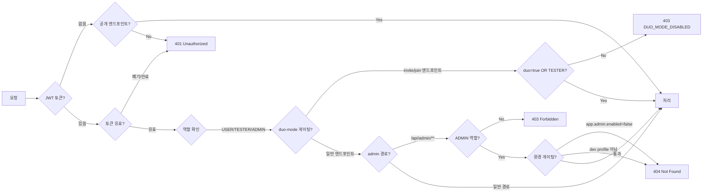

# REST API 전체 명세 — 다시봄

> 공통 규약, 에러코드, 전체 마스터 표, 인증 매트릭스를 기술합니다.
> 도메인별 상세(시퀀스 다이어그램·요청/응답 예시)는 각 도메인 문서를 참조하세요.
> 
> **주의**: 2026-06-02 커뮤니티 광장 피벗. 구 Session/Turn/Message 모델 삭제 (ADR-0001 참조).

## Source of truth

| 항목 | 위치 |
|---|---|
| 컨트롤러 | `backend/src/main/java/com/againspring/api/**/*Controller.java` |
| DTO | `backend/src/main/java/com/againspring/api/dto/{request,response}/` |
| 에러 처리 | `backend/src/main/java/com/againspring/common/exception/GlobalExceptionHandler.java` |
| Swagger UI (dev) | `http://localhost:8080/swagger-ui.html` |
| Swagger UI (서버 dev) | `https://dev.againspring.net/swagger-ui/` |
| OpenAPI JSON (dev) | `http://localhost:8080/v3/api-docs` |

코드와 문서가 충돌하면 **코드가 옳습니다**. Swagger 자동생성 스펙이 이 문서보다 항상 우선합니다.

---

## 공통 규약

| 항목 | 값 |
|---|---|
| Base URL | `/api/...` (nginx → backend 라우팅) |
| Content-Type | `application/json` |
| 시간 형식 | ISO-8601 UTC (`2026-04-26T10:30:00Z`) |
| 인증 헤더 | `Authorization: Bearer {JWT}` |
| 에러 형식 | `{ "code": "...", "message": "..." }` |

---

## 에러코드 (`GlobalExceptionHandler`)

| 코드 | HTTP | 설명 |
|---|---|---|
| `VALIDATION_ERROR` | 400 | Bean Validation 실패 (`@Valid`) |
| `INVALID_ROLE` | 400 | 허용되지 않는 역할 (admin 역할 변경 시도) |
| `UNAUTHORIZED` | 401 | 인증 실패 / 토큰 만료 / 폐기된 토큰 |
| `FORBIDDEN` | 403 | 권한 없음 (비ADMIN 등) |
| `NOT_FOUND` | 404 | 리소스 없음 |
| `EMAIL_ALREADY_EXISTS` | 409 | 이메일 중복 (회원가입) |
| `FORBIDDEN_WORD_DETECTED` | 422 | 금지어 감지 (게시글/댓글 작성) |
| `COMMENT_DEPTH_EXCEEDED` | 400 | 대댓글의 대댓글(depth≥2) 작성 시도 — UI는 최상위+직계 대댓글만 지원 |
| `USER_NOT_FOUND` | 404 | 사용자 없음 (admin 조회) |
| `LLM_UNAVAILABLE` | 503 | Claude CLI 불가 (fallback 응답 반환) |
| `INTERNAL_ERROR` | 500 | 서버 내부 오류 |

---

## 인증 · 권한 매트릭스

<!-- last-verified: 2026-08-31 -->
<!-- code-ref: backend/src/main/java/com/againspring/api/community/CommunityPostController.java -->


---

## 전체 엔드포인트 마스터 표

### 1. Auth / OAuth2

| Method | Path | Auth | 상태코드 | 상세 문서 |
|---|---|---|---|---|
| POST | `/api/auth/send-verification` | 공개 | 200 | [auth.md](auth.md) |
| POST | `/api/auth/signup` | 공개 | 201 / 400 / 409 | [auth.md](auth.md) |
| POST | `/api/auth/login` | 공개 | 200 / 401 | [auth.md](auth.md) |
| POST | `/api/auth/guest` | 공개 | 200 | [auth.md](auth.md) |
| POST | `/api/auth/logout` | 공개 | 204 | [auth.md](auth.md) |
| POST | `/api/auth/forgot-password` | 공개 | 200 | [auth.md](auth.md) |
| POST | `/api/auth/reset-password` | 공개 | 200 / 400 | [auth.md](auth.md) |
| GET | `/api/auth/check-nickname` | 공개 | 200 | [auth.md](auth.md) |
| POST | `/api/auth/agree` | **JWT** | 200 / 400 | [auth.md](auth.md) |
| POST | `/api/auth/oauth2/{provider}` | 공개 | 200 / 400 / 401 | [auth.md](auth.md) |

### 2. Community — Posts · Comments · Voting

| Method | Path | Auth | 상태코드 | 설명 |
|---|---|---|---|---|
| POST | `/api/community/posts` | **JWT** | 200 / 400 / 409 / 422 | 게시글 작성 (synthetic bot은 내부 멱등성 헤더 지원) |
| GET | `/api/community/posts` | 공개 | 200 | 게시글 목록. 항목에 `authorPct`/`partnerPct`(Integer, nullable) — 표>0이면 작성자(orderIdx=0) raw 비율, 표 없으면 null. `commentCount`=공개 2단만(최상위+직계 대댓글; depth≥2·고아 제외) |
| GET | `/api/community/posts/search` | 공개 | 200 | 키워드 검색 (`?q=`, `category=`, `page=`, `size≤50`). `q` 정규화 후 2글자 미만이면 빈 페이지. 매칭=`post_search_ngrams` 문자 바이그램 AND(미색인 글은 LIKE 폴백). 정렬=제목 exact 티어 → `(2×votes+comments)×반감기14일`(바닥 0.05). MariaDB는 MySQL ngram FULLTEXT 미지원 → BTREE 바이그램 테이블로 대체. 목록과 동일하게 `authorPct`/`partnerPct` |
| GET | `/api/community/posts/counts` | 공개 | 200 | 광장별 글 수 (`{"":.., "COUPLE":.., ...}`) |
| GET | `/api/community/posts/{id}` | 공개 | 200 / 404 | 게시글 상세. soft-delete면 **200 + `{ deleted: true }`**(본문 생략 가능) 또는 기존 404 — FE는 deleted 플래그 우선. 응답에 `authorBodyDeleted` / `partnerBodyDeleted` boolean |
| PATCH | `/api/community/posts/{id}` | **JWT** | 200 / 403 / 404 | 게시글 수정 (작성자만; 작성자 본문 tombstone 후 재작성 경로 포함) |
| DELETE | `/api/community/posts/{id}` | **JWT(author)** | 200 / 403 / 404 | 작성자 삭제 — **상대 ACTIVE면 작성자 본문만 tombstone**(`author_body_deleted_at`, 200+상세 플래그); 상대 NONE/미작성 또는 양쪽 tombstone이면 **완전 soft-delete**(`deleted_at`) + 댓글 hard delete → 200 `{deleted:true,id}`. 상세: [09-partner-invite-ownership.md](../../frontend/60-runtime/flows/09-partner-invite-ownership.md) |
| POST | `/api/community/posts/{id}/comments` | **JWT** | 200 / 400 / 409 / 422 | 댓글 작성 (synthetic bot은 내부 멱등성 헤더 지원). `parentCommentId`가 이미 대댓글이면 `400 COMMENT_DEPTH_EXCEEDED` (UI 2단만) |
| GET | `/api/community/posts/{id}/comments` | 공개 | 200 | 댓글 목록. 최상위·대댓글 모두 `createdAt DESC`(최신순). `?page=&size=`는 최상위만 페이지네이션 |
| PATCH | `/api/community/posts/{postId}/comments/{id}` | **JWT** | 200 / 403 / 404 | 댓글 수정 (작성자만) |
| DELETE | `/api/community/posts/{postId}/comments/{id}` | **JWT** | 204 / 403 / 404 | 댓글 삭제 (작성자만) |
| POST | `/api/community/posts/{id}/vote` | **JWT** | 200 / 403 | 투표 생성 (작성자 vs 상대방, 가중치는 §2.0.2). PUBLIC·미삭제면 **상시** — `voteCloseAt`/`CLOSED` 잠금 **legacy 미사용** |
| DELETE | `/api/community/posts/{id}/vote` | **JWT** | 200 / 403 | 투표 취소 |
| POST | `/api/community/posts/{postId}/comments/{id}/like` | **JWT** | 201 / 204 | 댓글 좋아요 |
| POST | `/api/community/posts/{id}/like` | **JWT** | 201 / 204 | 게시글 좋아요 |
| POST | `/api/community/posts/{postId}/comments/{id}/report` | **JWT** | 202 | 댓글 신고 |
| POST | `/api/community/posts/{id}/view` | 공개 | 200 / 400 | 조회수 기록 (deviceId 기준 중복 방지) |

#### 2.0.1 Internal synthetic-bot write idempotency

`POST /api/community/posts` 및 `POST /api/community/posts/{postId}/comments`는 **synthetic=1 봇 계정의 인증 JWT**에 한해 `Idempotency-Key` 헤더를 해석한다. 일반 사용자·익명 요청의 같은 헤더는 무시되며, 공개 사용자 API의 멱등성 계약으로 확장하지 않는다.

- 키는 오케스트레이터 plan item의 기존 `idempotency_key`를 그대로 사용한다(1~160자, `A-Za-z0-9._:-`).
- 최초 요청은 글/댓글을 작성하고 내부 `bot_request_dedup`에 `key → target type/id, bot user`를 같은 트랜잭션으로 저장한다.
- 같은 봇이 같은 종류의 키로 재시도하면 기존 글/댓글을 `200`으로 반환하고, 알림·outbox도 다시 발생시키지 않는다.
- 다른 봇 또는 다른 target type으로 키를 재사용하면 `409 IDEMPOTENCY_KEY_CONFLICT`; 손상된 매핑은 `409 IDEMPOTENCY_TARGET_*`로 실패한다.

#### 2.0.2 공감 비율(투표) 가중치 (2026-07-31~)

`GET /api/community/posts/{id}`, `POST/.../vote`, `DELETE/.../vote` 응답의 옵션별 `percentage`는 사람표와 AI 유저(`users.synthetic=1`)표를 동일 가중치로 세지 않는다. AI 유저 투표는 "커뮤니티가 비어 보이지 않게 하는 시딩" 목적이며, 실제 사람 투표가 쌓일수록 결과에 대한 영향력이 줄어든다.

```
weight_ai   = 1 / (1 + humanVoteCount)   // humanVoteCount=0이면 1(풀 가중치)
weight_human = 1 (고정)
percentage(option) = (humanCount(option)×1 + aiCount(option)×weight_ai) / (humanTotal×1 + aiTotal×weight_ai) × 100
```

표시되는 절대 투표 개수(`count`)는 사람표+AI표 단순 합산이며 가중치는 `percentage`에만 적용된다. 구현: `backend/.../service/community/VoteService.java`, `CommunityPostController.castVote/cancelVote`, `PostDetailResponse.from()`.

### 2.1. Partner Invite API

> **계약 (2026-08-04~)**: 작성자 글은 **항상 즉시 PUBLIC**(투표·댓글 가능). `private-until-partner`는 폐기.
> `PublishMode.WAIT_FOR_PARTNER` enum은 API 호환용으로 유지하되 동작은 `PUBLISH_NOW`와 동일(즉시 PUBLIC).
> 파트너 답변은 이미 공개된 글에 상대 본문만 붙인다 — **첫 PUBLIC 게이트가 아니다**.
> 마이그레이션 **V97**: 잔존 `PRIVATE + WAIT_FOR_PARTNER` 중 비공개 **>30일** → soft-delete(`deleted_at`), 그 외 → PUBLIC.
>
> **소유권·삭제 (2026-08-11~)**: UX/API SSOT = [`docs/frontend/ux/flows/09-partner-invite-ownership.md`](../../frontend/60-runtime/flows/09-partner-invite-ownership.md).
> 게스트/익명 상대 본문 = 토큰 capability; 「내 계정으로 연결」claim 후에만 회원 소유.
>
> **시한부 투표 제거 (2026-08-11~)**: `voteCloseAt` / `voteDurationHours` / `PostStatus.CLOSED` 잠금은 **제품 동작에서 제거(legacy)**.
> 공감 투표(VoteBar A/B)는 PUBLIC·미삭제 글에서 **상시** 가능. API 필드는 하위호환으로 남을 수 있으나 **무시·미설정**.

| Method | Path | Auth | 상태코드 | 설명 |
|---|---|---|---|---|
| POST | `/api/community/posts/{id}/invite` | **JWT(등록 회원)** | 201 / 403 / 404 | 초대 토큰 생성(미답변 시 **동일 토큰 재복사**). 응답: {inviteToken, inviteUrl}. 게스트 차단 |
| GET | `/api/s/{token}` | 공개 (JWT optional) | 200 / 400 / 404 | 토큰 프리뷰. 확장 응답: `{postId, userTitle, authorBodyPublished, category, deleted, partnerState: NONE\|ACTIVE\|TOMBSTONE, ownership: UNOWNED\|OWNED\|OWNED_BY_OTHER\|AUTHOR, partnerBodyPublished?, canWrite, canEdit, canDelete, canClaim}`. `deletedAt != null` → `deleted: true`. 작성자 본인 → `ownership=AUTHOR`(작성·claim 불가) |
| POST | `/api/s/{token}/answer` | 공개 (JWT optional) | 201 / 400 / 403 / 404 / 409 | 파트너 답변. 본문: {userTitle?, bodyRaw, captureSplitAfterLines?}. 작성자 → 403 `AUTHOR_CANNOT_BE_PARTNER`. ACTIVE+owned → 409. tombstone/NONE 재·신규 작성 허용. 회원 제출 → 즉시 OWNED; 게스트 → UNOWNED |
| POST | `/api/s/{token}/claim` | **JWT(회원)** | 200 / 403 / 404 / 409 | 미연결(unowned) 상대 본문을 현재 회원에 연결(`partnerUserId`=회원). 작성자·이미 owned → 403/409 |
| PATCH | `/api/s/{token}/answer` | 토큰 또는 소유 JWT | 200 / 403 / 404 | 상대 본문 수정. unowned=토큰(또는 게스트); owned=소유자만. tombstone 재작성은 POST answer |
| DELETE | `/api/s/{token}/answer` | 토큰 또는 소유 JWT | 204 / 403 / 404 | 상대 본문 tombstone(`partner_body_deleted_at` + body clear). 작성자 본문도 tombstone이면 **완전 삭제**. 토큰 유지(재작성용) |
| PATCH | `/api/community/posts/{id}/publish-mode` | **JWT(author)** | 200 / 403 / 404 | 발행 모드. 본문: {mode: PUBLISH_NOW\|WAIT_FOR_PARTNER, voteDurationHours?: …}. `WAIT_FOR_PARTNER`≡`PUBLISH_NOW`(즉시 PUBLIC). **`voteDurationHours` deprecated — 무시** |
| POST | `/api/community/posts/{id}/publish-now` | **JWT(author)** | 200 / 403 / 404 | 즉시 광장 공개(visibility=PUBLIC). **`voteCloseAt` 설정 중지**(legacy 필드 미사용) |

**GET /api/community/posts/{id} 응답에 추가된 필드:**
- `paired` (Boolean): 파트너 답변 도착 여부
- `partnerAnsweredAt` (String, nullable): 파트너 답변 도착 시각 (ISO-8601 UTC)
- `partnerBodyPublished` (String, nullable): 파트너 본문 (tombstone이면 null)
- `authorBodyDeleted` / `partnerBodyDeleted` (Boolean, **2026-08-11~**): 쪽별 tombstone
- `deleted` (Boolean, optional): 포스트 soft-delete 시 true (`deletedAt != null` — 이 경우 본문 필드 생략)
- `inviteToken` (String, nullable): 초대 토큰 (작성자 본인만 조회 가능)
- `promoTitle` (String, nullable, **2026-08-02~**, **V96→VARCHAR(500)·개행**, **의미 변경 2026-08-11~**): SNS **마스터 훅**(도발적). 원제 복제 아님. IG 패킹용 `\n`(줄≤10). 생성 시 PLAN 전달 또는 `PromoTitleService` 비동기(제목+본문). 목록/상세 공통.
- `hookEmotion` (String, nullable, **2026-08-11~**, **V108**): 마스터 훅 감정. `shock` \| `anger` \| `tension` \| `sad` \| `hype` only. PLAN 전달 또는 `PromoTitleService`와 동시 생성. 무효값·폴백 시 null.
- `metaphorId` (String, nullable, **2026-08-05~**, **V99**): 레거시 메타포 일러스트 ID. **영상 경로에서는 무시**(시봄이 shortlist로 대체). 컬럼·필드 하위호환 유지.
- `metaphorIds` (String[], nullable, **2026-08-09~**, **V105 `post_metaphors`**): 레거시 메타포 랭크 목록. **영상 경로에서는 무시**.
- `sibomCandidates` (String[], nullable, **2026-08-12~**, **V112**): 시봄이 캐릭터 이미지 id 숏리스트(≤12). 사연 본문(+제목) keyword 스코어로 **코드가** 저장(LLM 없음). soft-fill 풀은 미포함. Spec: `docs/shared/marketing/70-policy/sibom-video-insertion.md`.
- `voteCloseAt` / `voteDurationHours` (**legacy, 미사용**): 응답에 남을 수 있으나 FE는 투표 마감 UI에 쓰지 않음

**목록(`GET /posts`, `/search`, `/mine`, `/voted`) 응답 필드 (`PostResponse`):**
- `authorPct` / `partnerPct` (Integer, nullable, **2026-08-11~**): 표가 1표 이상일 때 작성자(orderIdx=0) raw 투표 비율과 `100-authorPct`. 표 없으면 null — FE는 `resolveAuthorPct`로 중립 50만 적용. 상세의 가중 `voteResult.options[].percentage`와는 별개(목록은 raw).

소유권·tombstone UX SSOT: `docs/frontend/ux/flows/09-partner-invite-ownership.md`

`POST /api/community/posts` 성공 시(신규 생성만) optional `promoTitle`(+optional `hookEmotion`)이 있으면 저장하고, `promoTitle`이 없으면 `PromoTitleService.generateAsync`가 훅+감정을 1회 생성한다. 마케팅 brief는 개행 포함 `promo_title`을 전달한다.
봇(AI-user) 생성 요청은 optional `captureSplitAfterLines`(1-based 개행 블록 컷 배열)과 optional `metaphorId`/`metaphorIds`(배열, 최대 5개, **레거시·영상 미사용**)를 보낼 수 있다 — X/IG 캡쳐 N장 분할(장당 ≤8, 진영당 ≤4). 구 `captureSplitAfterLine` 단일 값은 길이1 배열로 승격. 없거나 짧은 본문이면 null 저장 후 마케팅 잡 생성 시 휴리스틱으로 보완. 파트너 답변(`POST /api/s/{token}/answer`)도 optional `captureSplitAfterLines`를 `partner_capture_split_after_lines`에 저장한다. 사연 생성·작성자 본문 갱신 시 `SibomCandidateService`가 `sibom_candidates`를 본문 keyword 스코어로 채운다(시봄이 전용 LLM 없음).
### 3. User

| Method | Path | Auth | 상태코드 | 상세 문서 |
|---|---|---|---|---|
| GET | `/api/users/me` | **JWT** | 200 / 404 | [user.md](user.md) |
| PATCH | `/api/users/me` | **JWT** | 200 | [user.md](user.md) |
| POST | `/api/users/me/password` | **JWT** | 200 / 401 | [user.md](user.md) |
| DELETE | `/api/users/me` | **JWT** | 204 / 401 | [user.md](user.md) |
| POST | `/api/users/me/tutorial/complete` | **JWT** | 204 | [user.md](user.md) |

### 4. Feedback

| Method | Path | Auth | 상태코드 | 상세 문서 |
|---|---|---|---|---|
| POST | `/api/feedbacks` | 공개 | 201 / 400 | [feedback.md](feedback.md) |

### 5. Health

| Method | Path | Auth | 상태코드 | 설명 |
|---|---|---|---|---|
| GET | `/api/health` | 공개 | 200 | Liveness probe (status=UP, DB 미확인) |
| GET | `/api/health/deep` | 공개 | 200 / 503 | Readiness probe — DB 연결까지 확인. 200: `{status:"UP",db:"ok",dbLatencyMs,checkedAt}` / 503: `{status:"DOWN",db:"fail",checkedAt}`. 내부 오류 정보 비노출 |

### 6. Admin — Dashboard

| Method | Path | Auth | 상태코드 | 상세 문서 |
|---|---|---|---|---|
| GET | `/api/admin/dashboard/summary` | **JWT + ADMIN** | 200 | [admin.md](admin.md) |
| GET | `/api/admin/dashboard/daily-stats` | **JWT + ADMIN** | 200 | [admin.md](admin.md) |
| GET | `/api/admin/dashboard/retention` | **JWT + ADMIN** | 200 | [admin.md](admin.md) |
| GET | `/api/admin/dashboard/crisis-recent` | **JWT + ADMIN** | 200 | [admin.md](admin.md) |
| GET | `/api/admin/dashboard/llm-failure-rate` | **JWT + ADMIN** | 200 | [admin.md](admin.md) |

### 7. Admin — Users

| Method | Path | Auth | 상태코드 | 상세 문서 |
|---|---|---|---|---|
| GET | `/api/admin/users/search` | **JWT + ADMIN** | 200 | [admin.md](admin.md) |
| GET | `/api/admin/users` | **JWT + ADMIN** | 200 | [admin.md](admin.md) |
| GET | `/api/admin/users/{id}` | **JWT + ADMIN** | 200 / 404 | [admin.md](admin.md) |
| DELETE | `/api/admin/users/{id}/data` | **JWT + ADMIN** | 200 | [admin.md](admin.md) |
| PATCH | `/api/admin/users/{id}/roles` | **JWT + ADMIN** | 200 / 400 / 404 | [admin.md](admin.md) |

### 8. Admin — Health

| Method | Path | Auth | 상태코드 | 상세 문서 |
|---|---|---|---|---|
| GET | `/api/admin/health/system` | **JWT + ADMIN** | 200 | [admin.md](admin.md) |

### 8.1. Admin — Crawl Status (크롤 신선도)

| Method | Path | Auth | 상태코드 | 상세 문서 |
|---|---|---|---|---|
| GET | `/api/admin/crawl-status` | **JWT + ADMIN** | 200 | [admin.md](admin.md) |

### 9. Admin — Feedbacks

| Method | Path | Auth | 상태코드 | 상세 문서 |
|---|---|---|---|---|
| GET | `/api/admin/feedbacks` | **JWT + ADMIN** | 200 | [admin.md](admin.md) |
| PATCH | `/api/admin/feedbacks/{id}` | **JWT + ADMIN** | 200 / 400 / 404 | [admin.md](admin.md) |

### 10. Admin — AI User Generation (AI 유저 생성 정책·진행 현황)

| Method | Path | Auth | 상태코드 | 상세 문서 |
|---|---|---|---|---|
| GET | `/api/admin/ai-user/generation-config` | **JWT + ADMIN** | 200 | [admin.md](admin.md) |
| PUT | `/api/admin/ai-user/generation-config` | **JWT + ADMIN** | 200 | [admin.md](admin.md) |
| GET | `/api/admin/ai-user/generation-status` | **JWT + ADMIN** | 200 | [admin.md](admin.md) |
| POST | `/api/admin/ai-user/cleanup/reduce-ㅠ` | **JWT + ADMIN** | 200 | [admin.md](admin.md) |
| POST | `/api/admin/ai-user/backfill-comment-likes` | **JWT + ADMIN** | 202 | [admin.md](admin.md) |
| POST | `/api/admin/ai-user/kill` | **JWT + ADMIN** | 200 | [admin.md](admin.md) |

> **2026-07-31~**: `generation-config` GET/PUT에서 레거시 필드(`backendPost`/`backendComment`/`backendReply`/`promptCaching`/`dailyTokenBudget`/`schedulerMode`)가 삭제되고 PLAN 모드로 일원화됐다. 기존 3개 provider(`providerAiPostBundle`/`providerHumanPostPlan`/`providerHumanInteraction`)에 `providerVoteLike`(`"CLAUDE"|"CODEX"|"OFF"`)가 추가되어 AI 투표·좋아요 생성도 PLAN 파이프라인으로 이관됨. `kill`은 이제 4개 provider 전부를 OFF로 설정한다.

### 10.1. Admin — Prompts (app.admin.enabled=true)

| Method | Path | Auth | 상태코드 | 상세 문서 |
|---|---|---|---|---|
| POST | `/api/admin/prompts/reload` | **JWT + ADMIN** | 200 / 500 | [admin.md](admin.md) |

### 11. Admin — Content Management (AI 콘텐츠 조회·첨삭)

| Method | Path | Auth | 상태코드 | 설명 |
|---|---|---|---|---|
| GET | `/api/admin/content/posts` | **JWT + ADMIN** | 200 | AI 게시글 목록 (`?status=VOTING&page=&size=`) — `synthetic`·`createdByAdmin`·`commentCount` 필드 포함 |
| GET | `/api/admin/content/posts/{postId}` | **JWT + ADMIN** | 200 / 404 | 단일 게시글 원문 조회 |
| GET | `/api/admin/content/posts/{postId}/thread` | **JWT + ADMIN** | 200 / 404 | **(2026-08-01~)** 글+댓글/대댓글 타임라인 + **미게시 AI 예약 댓글**. 응답 items: 게시됨 `{id,pending:false,createdAt,…}` · 예약 `{planItemId,pending:true,scheduledAt,status,parentPlanItemId,…}`. `pendingCount` 포함 |
| PATCH | `/api/admin/content/posts/{postId}/thread` | **JWT + ADMIN** | 200 / 400 / 404 / 502 | **(2026-08-01~)** 스레드 일괄 수정. Body: `{title?,body?,category?,status?,viewCount?,createdAt?,items?[{id,body?,authorId?,createdAt?}],pendingItems?[{planItemId,body?,personaId?,scheduledAt?,cancel?}]}`. items에 없는 기존 댓글 soft-delete. pendingItems에 없는 예약 후보 CANCELLED |
| GET | `/api/admin/content/posts/{postId}/source-comparison` | **JWT + ADMIN** | 200 / 404 | 원본 비교 조회. 응답: `{synthetic, hasSource, source{community,url,title,body}, generated{title,body}}` |
| PATCH | `/api/admin/content/posts/{postId}` | **JWT + ADMIN** | 200 / 404 | 게시글 수정. Body: `{title?, bodyRaw?, partnerBodyRaw?, status?, category?, viewCount?}`. `title` 수정 시 `title`과 `userTitle`을 함께 동기화. `viewCount`는 단순 컬럼이라 직접 값 지정 가능 (2026-07-31~) |
| DELETE | `/api/admin/content/posts/{postId}` | **JWT + ADMIN** | 204 / 404 | 게시글 soft delete (`deleted_at`, `deleted_by_admin_id`) |
| POST | `/api/admin/content/posts/{postId}/block` | **JWT + ADMIN** | 200 / 404 | 게시글 상태를 `BLOCKED`로 변경 |
| POST | `/api/admin/content/posts/{postId}/unblock` | **JWT + ADMIN** | 200 / 404 | 게시글 상태를 `VOTING`으로 복구 |
| POST | `/api/admin/content/posts` | **JWT + ADMIN** | 200 | **(2026-07-31~)** 게시글 수동 생성. Body: `{title, bodyRaw, category, authorId}`. `authorId`는 자유 텍스트(존재 여부 미검증, FK 없음). `createdByAdmin=true`로 저장 |
| POST | `/api/admin/content/posts/{postId}/likes/adjust` | **JWT + ADMIN** | 200 / 400 / 409 | **(2026-07-31~)** 좋아요 수 증가/감소. Body: `{delta: 1\|-1}`. `post_likes`가 조인테이블 집계라 정확한 값 지정은 불가 — delta=1은 아직 좋아요 안 누른 AI 유저를 골라 행 추가, delta=-1은 AI 유저 소유 행만 삭제(실사용자 좋아요 보존). 후보 없으면 409 |
| GET | `/api/admin/content/comments` | **JWT + ADMIN** | 200 | AI 댓글 목록 (`?status=ACTIVE&page=&size=`) — `synthetic`·`createdByAdmin` 필드 포함 |
| PATCH | `/api/admin/content/comments/{commentId}` | **JWT + ADMIN** | 200 / 404 | 댓글 수정. Body: `{body}` |
| DELETE | `/api/admin/content/comments/{commentId}` | **JWT + ADMIN** | 204 / 404 | 댓글 soft delete |
| POST | `/api/admin/content/comments/{commentId}/block` | **JWT + ADMIN** | 200 / 404 | 댓글 상태를 `BLOCKED`로 변경 |
| POST | `/api/admin/content/comments/{commentId}/unblock` | **JWT + ADMIN** | 200 / 404 | 댓글 상태를 `ACTIVE`로 복구 |
| POST | `/api/admin/content/comments` | **JWT + ADMIN** | 200 | **(2026-07-31~)** 댓글/대댓글 수동 생성. Body: `{postId, parentCommentId?, body, authorId}`. `authorId` 자유 텍스트. `createdByAdmin=true`로 저장 |
| POST | `/api/admin/content/comments/{commentId}/likes/adjust` | **JWT + ADMIN** | 200 / 400 / 409 | **(2026-07-31~)** 좋아요 수 증가/감소. Body: `{delta: 1\|-1}`. `PostComment.likeCount` 컬럼과 `post_likes` 조인테이블을 함께 갱신(동기화) |
| GET | `/api/admin/content/scheduled-posts` | **JWT + ADMIN** | 200 / 502 | **(2026-08-01~)** AI 예약 홀딩 목록. Query: `status` 기본 `SCHEDULED` (`ALL_PENDING`=`SCHEDULED,FAILED,PUBLISHING`). orchestrator `ai_scheduled_posts` 프록시 |
| GET | `/api/admin/content/scheduled-posts/{id}` | **JWT + ADMIN** | 200 / 404 / 502 | 홀딩 상세 — title/body/slot + items(`ref`,`parentRef`,`personaId`,`body`,`type`,`scheduledAt`) |
| PATCH | `/api/admin/content/scheduled-posts/{id}` | **JWT + ADMIN** | 200 / 400 / 409 / 502 | `SCHEDULED`만 수정. Body: `{title?, body?, category?, scheduledPublishAt?, items?}`. items 미포함 시 슬롯 변경은 후보 시각 delta-shift |
| DELETE | `/api/admin/content/scheduled-posts/{id}` | **JWT + ADMIN** | 200 / 409 / 502 | `SCHEDULED` → `CANCELLED` |
| POST | `/api/admin/content/corrections/save` | **JWT + ADMIN** | 201 / 404 | LLM 없이 즉시 PENDING 저장. `applyLive=true`이면 본문도 교체. Body: `{targetType, targetId, correctedText, applyLive, adminOpinion?}` |
| POST | `/api/admin/content/corrections/analyze` | **JWT + ADMIN** | 200 / 404 | 단건 LLM 분석 (DB 미변경). Body: `{targetType, targetId, correctedText}` |
| POST | `/api/admin/content/corrections/commit` | **JWT + ADMIN** | 200 / 404 | 분석 결과 확정 저장. Body: `{targetType, targetId, correctedText, personaCaution?, globalRules[], applyLive}` |
| POST | `/api/admin/content/corrections/reconstruction/analyze` | **JWT + ADMIN** | 200 / 404 | 재구성 규칙 분석 (LLM). Body: `{personaId, generatedText}`. 응답: `{personaId, generatedText, suggestedReconstructionRules}` |
| POST | `/api/admin/content/corrections/reconstruction/commit` | **JWT + ADMIN** | 200 / 404 | 재구성 규칙 적용. Body: `{correctionId, appliedLive, rulesCreated, cautionApplied}`. 응답: `{appliedLive, rulesCreated, cautionApplied}` |

> `adminOpinion` (TEXT, nullable): 관리자가 첨삭 시 남긴 수정 의도·방향. 일괄 분석 MAP 프롬프트에 입력 신호로 사용됨 (V74 추가, 2026-06-08).

### 12. Admin — AI Rules (전역 금지 규칙·페르소나 주의사항·첨삭 이력·일괄 분석)

#### 12-A. 전역 금지 규칙

| Method | Path | Auth | 상태코드 | 설명 |
|---|---|---|---|---|
| GET | `/api/admin/ai-rules/global` | **JWT + ADMIN** | 200 | 목록 (`?page=&size=&active=`) |
| POST | `/api/admin/ai-rules/global` | **JWT + ADMIN** | 201 | 추가. Body: `{ruleText, scope: ALL\|POST\|COMMENT\|RECONSTRUCTION}` |
| PATCH | `/api/admin/ai-rules/global/{id}` | **JWT + ADMIN** | 200 / 404 | 활성/비활성 토글. Body: `{active}` |
| DELETE | `/api/admin/ai-rules/global/{id}` | **JWT + ADMIN** | 204 / 404 | 삭제 |

#### 12-B. 페르소나 주의사항

| Method | Path | Auth | 상태코드 | 설명 |
|---|---|---|---|---|
| GET | `/api/admin/ai-rules/cautions` | **JWT + ADMIN** | 200 | 목록 (`?page=&size=&personaId=`) |
| PATCH | `/api/admin/ai-rules/cautions/{corrId}` | **JWT + ADMIN** | 200 | 토글. Body: `{active}` |
| DELETE | `/api/admin/ai-rules/cautions/{corrId}` | **JWT + ADMIN** | 204 | 삭제 |

#### 12-C. 첨삭 이력

| Method | Path | Auth | 상태코드 | 설명 |
|---|---|---|---|---|
| GET | `/api/admin/ai-rules/history` | **JWT + ADMIN** | 200 | 목록 (`?page=&size=&status=PENDING\|PROCESSED\|SKIPPED`). 응답 항목에 `adminOpinion` 포함 |
| POST | `/api/admin/ai-rules/history/{id}/analyze` | **JWT + ADMIN** | 200 / 404 | 단건 Sonnet 분석 (저장 미변경) |
| POST | `/api/admin/ai-rules/history/{id}/apply` | **JWT + ADMIN** | 200 / 404 | 단건 분석 결과 적용. Body: `{scope, personaCaution?, globalRules[], pushToBank}` |
| PATCH | `/api/admin/ai-rules/history/{id}/skip` | **JWT + ADMIN** | 204 / 404 | SKIPPED 처리 |

#### 12-D. 일괄 분석 map-reduce (비동기 job)

> MAP=Sonnet(청크별 패턴 추출) + REDUCE=Opus(통합·scope 판정). CLI 전용(API 키 미사용). (2026-06-08 추가)

| Method | Path | Auth | 상태코드 | 설명 |
|---|---|---|---|---|
| POST | `/api/admin/ai-rules/history/analyze-batch` | **JWT + ADMIN** | 202 | PENDING 전체 일괄 분석 시작. 응답: `{jobId, queued, message}`. LLM 트리거(no-llm 가드레일 대상) |
| GET | `/api/admin/ai-rules/history/analyze-batch/{jobId}` | **JWT + ADMIN** | 200 / 404 | 작업 상태 폴링. 응답: `{jobId, status: RUNNING\|READY\|FAILED, pendingCount, chunksDone, chunksTotal, plan?, error?}` |
| POST | `/api/admin/ai-rules/history/apply-batch-plan` | **JWT + ADMIN** | 200 / 400 | 관리자 승인 플랜 적용(LLM 없음). Body: `{globalRules[], personaCautions[], pushToBank}`. 응답: `{rulesCreated, cautionsApplied, corrProcessed}` |

**BatchPlan 스키마:**
```json
{
  "globalRules":    [{"ruleText":"…","scope":"ALL|POST|COMMENT","sourceCorrIds":[…],"rationale":"…"}],
  "personaCautions":[{"personaId":"…","cautionText":"…","sourceCorrIds":[…],"rationale":"…"}],
  "allSourceCorrIds":[…]
}
```

**job TTL**: 30분(인메모리). 백엔드 재시작 시 유실 → 재실행으로 복구.

#### 12-E. 프롬프트 템플릿

| Method | Path | Auth | 상태코드 | 설명 |
|---|---|---|---|---|
| GET | `/api/admin/ai-rules/prompts` | **JWT + ADMIN** | 200 | 전체 목록 |
| GET | `/api/admin/ai-rules/prompts/{key}` | **JWT + ADMIN** | 200 / 404 | 단건 조회 |
| PUT | `/api/admin/ai-rules/prompts/{key}` | **JWT + ADMIN** | 200 / 404 | 내용 수정. Body: `{content}` |

---

### 13. Admin — Test (@Profile dev only)

| Method | Path | Auth | 상태코드 | 상세 문서 |
|---|---|---|---|---|
| POST | `/api/admin/test/reset` | JWT | 200 | [admin.md](admin.md) |

### Marketing API (Admin — AS thin client)

| Method | Path | Auth | 상태코드 | 설명 |
|---|---|---|---|---|
| GET | `/api/admin/marketing/quota` | **JWT + ADMIN** | 200 | Phase 2 플랫폼별 일일 cap + 오늘(KST) 사용량. 응답: `{platforms:{x_thread:{cap,usedToday,remaining},…}, dailyTextCap, dailyVideoCap, videosToday, textsToday, remainingPool}`. `dailyTextCap`/`dailyVideoCap`은 텍스트/영상 플랫폼 cap **합**(deprecated 파생). 사용량 = COMMITTED + 해당 플랫폼 job targets |
| PUT | `/api/admin/marketing/quota` | **JWT + ADMIN** | 200 / 400 | Body: `{xThread,instagramFeed,instagramReels,youtubeShorts}` (각 0–50) 또는 legacy `{dailyTextCap,dailyVideoCap}`(분배 저장). 키 `marketing.cap.{platform}`. legacy `marketing.daily_text_cap`/`daily_video_cap`은 플랫폼 키 없을 때 fallback |
| GET | `/api/admin/marketing/x-ops` | **JWT + ADMIN** | 200 | X 운영 설정. `{morningTime,nightTime,storyScoopsPerDay,outboundDailyCap,outboundPerTick,inboundDailyCap,inboundPerPostCap,inboundPerTick,hotMinReplies,hotMaxAgeHours,ritualEnabled,inboundEnabled,outboundEnabled,personaLearningEnabled,personaLearnAt,personaEvalEnabled,originalPostEnabled,originalPostDailyCap,personaLastStatus,personaLastNewCount,personaLastLearnedAt,personaSummary,mimicryAvg28d,mimicrySampleCount,deleteRate28d,gatePassed}`. 읽기 전용: personaLast* · mimicry* · deleteRate28d · gatePassed. 키 `marketing.x.*` (`system_setting`). 권위본 `docs/shared/marketing/70-policy/justant-bot-x-ops.md`. 발행 스위치 폴백 **false**. 페르소나 학습·채점 폴백 **true**. 원글 폴백 **false**·한도 1. 원장 `x_ops_action` · 코퍼스 `x_persona_example` · 채점 `x_persona_eval` |
| PUT | `/api/admin/marketing/x-ops` | **JWT + ADMIN** | 200 / 400 | 부분 갱신. DB만 바뀌고 다음 틱에 반영(커밋 불필요). 시각 `HH:mm`(KST). 행 없을 때 폴백: 아침 07:30 / 밤 22:00 / 사연 2 / 선댓글 20·틱당 1 / 대댓글 40·글당 12·틱당 3 / 최소댓글 3(0=제한없음)·6h / 학습 04:30 / 채점 on / 원글 off·한도 0–5 |
| POST | `/api/admin/marketing/x-ops/learn` | **JWT + ADMIN** | 200 / 400 | 지금 학습. 타임라인에서 **운영자 수동 댓글·원글**만 gold(`TIMELINE`/`TIMELINE_POST`), 원장 자동 게시 id는 제외. 지운 자동댓글은 avoid. 증류 모델 **Sonnet**. 실패·sanity 거부 시 프로필 무변경(`DISTILL_REJECTED`). 학습 스위치 off면 400. **dev는 LLM 미호출**(L3, `INGESTED_LLM_DISABLED`). e2e에서 호출하지 않음 |
| POST | `/api/admin/marketing/x-ops/outbound` | **JWT + ADMIN** | 204 / 400 | 지금 선댓글 틱 1회(후보 조회+`outboundPerTick`건까지 게시). 네이티브 영상(`hasVideo`)은 스킵 후 다음 후보. 선댓글 스위치 off면 400. Playwright가 길 수 있음. e2e에서 호출하지 않음 |
| GET | `/api/internal/marketing/persona-export` | **ASM_CALLBACK_TOKEN** (Bearer, JWT 아님) | 200 / 401 | 페르소나 볼트 증분 export. Query `sinceExampleId` · `sinceEvalId`. 응답 `{generatedAt,profile,profilePrev,lastStatus,lastLearnedAt,lastNewCount,metrics,examples[],evals[]}`. 호스트 cron 05:00이 `.temp/x-justant-bot/`에 기록. 컨테이너는 `.temp`에 쓰지 않음. 형제: `POST /api/internal/marketing/callback` · `POST /api/internal/marketing/redrive` (동일 토큰). 상세 [`marketing/50-api.md`](../marketing/50-api.md) §2.6 |
| GET | `/api/admin/marketing/score-weights` | **JWT + ADMIN** | 200 | 인기 점수 가중치. 응답: `{weightViews, weightComments, weightVotes, platforms?, autoAdjust}` (Phase 2 platforms + Phase 2.7 autoAdjust 기본 false) |
| PUT | `/api/admin/marketing/score-weights` | **JWT + ADMIN** | 200 / 400 | 가중치 저장. Body: `platforms` 맵 및/또는 legacy flat + optional `autoAdjust`. 키 `marketing.score.weights.{platform}.*` · `marketing.score.auto_adjust` |
| GET | `/api/admin/marketing/publish-slots` | **JWT + ADMIN** | 200 | 레거시 수동 예약 슬롯 설정 조회. T+24h 자동 선정에는 적용하지 않음 |
| PUT | `/api/admin/marketing/publish-slots` | **JWT + ADMIN** | 200 / 400 | 레거시 수동 예약 슬롯 저장. Body: `{instagramFeed, instagramReels, youtubeShorts, xThread}` 각 `HH:mm`(24h). 자동 선정 잡은 이 설정을 무시하고 READY 즉시 발행 |
| GET | `/api/admin/marketing/platforms` | **JWT + ADMIN** | 200 | 전체 플랫폼 auto on/off. 응답: `[{platform, autoEnabled, runtimeSupported, warning?}]`. `system_setting` 키 `marketing.platform.{id}.auto_enabled`. 기본: 런타임 지원 ON / 미지원 OFF |
| PUT | `/api/admin/marketing/platforms/{platform}/auto` | **JWT + ADMIN** | 200 / 400 | Body: `{enabled: boolean}`. 미지원+enabled=true도 저장 성공, 응답에 `warning` (발행 시 `resolveTargets`가 제외). 준비중 배지 없음 |
| GET | `/api/admin/marketing/holding` | **JWT + ADMIN** | 200 | 대기 보드: 24h 미만 N-top(최대 20) + **T+24h 경과·미확정**(IN_POOL/PINNED/OUT_OF_CUT, `overdue=true`, 최대 20)을 앞에 붙임. 컷라인 N=`remainingPool - softReservedPool`. 영상 밴드=`min(dailyVideoCap - videosToday - pinnedVideos, N)`. `projectedFormat`=`VIDEO\|TEXT\|OUT_OF_CUT`. 동시 새로고침은 single-flight(+1020 재시도). 응답: `{items[{postId,status,pinFormat,projectedFormat,overdue?,platformRankSnapshot?,…}], meta{remainingPool, cutlineN, dailyTextCap, dailyVideoCap, videosToday, textsToday, weightViews, weightComments, weightVotes}}` |
| PATCH | `/api/admin/marketing/holding/{postId}/draft` | **JWT + ADMIN** | 200 / 400 / 404 | Body: `{draft: object}` → `draft_json` 교체. `locked_at != null`이면 400 |
| POST | `/api/admin/marketing/holding/{postId}/pin` | **JWT + ADMIN** | 200 / 400 / 404 | Body: `{format: VIDEO\|TEXT}`. 핀+soft reserve. 잔여 풀/영상 슬롯이 다른 핀·커밋으로 소진되면 400. 컷라인 축소 시 최하위 비핀 자동 후보 `OUT_OF_CUT`(Q8) |
| DELETE | `/api/admin/marketing/holding/{postId}/pin` | **JWT + ADMIN** | 200 / 400 / 404 | 핀 해제·예약 반환. 새 컷라인 기준 `IN_POOL` 또는 `OUT_OF_CUT` |
| GET | `/api/admin/marketing/completed` | **JWT + ADMIN** | 200 | COMMITTED·DROPPED 홀딩 + 잡 요약. Query: `status`, `limit`(기본 50). Item: `title`, `committedFormat`(VIDEO\|TEXT), `jobs[].publications[{platform,state,url}]` |
| POST | `/api/admin/marketing/completed/{postId}/force` | **JWT + ADMIN** | 200 / 400 / 404 | Body: `{mode: VIDEO_AND_TEXT\|TEXT_ONLY}`. 상한 무시 강제 COMMITTED + 잡 생성. COMMITTED 재호출 시 미생성 채널만 추가(전부 있으면 400) |
| POST | `/api/admin/marketing/jobs/{id}/regenerate` | **JWT + ADMIN** | 201 / 409 | `SIBOM_*`·`VARIANT_*`·`DURATION_*`·`LAYOUT_*` 품질 실패 영상 잡만 새 자식 잡으로 재생성한다. 자식은 `autoPublish=true`; 성공 시 즉시 게시. 응답 Job에 `failureCode`, `generationDiagnostics`, `actualDurationMs`, `retryOfJobId`, `generationAttempt`가 추가된다. |
| POST | `/api/admin/marketing/jobs/redrive` | **JWT + ADMIN** | 200 / 400 | 실패한 마케팅 잡 일괄 재구동(regenerate 또는 recreate). 요청 직후 반환(폴링 진행중). Body: `{jobIds: [1, 2, ...] \| null, filter: {status, since}, skipExisting: bool}`. 응답: `{requested: N, results: [{sourceId, targetId?, action, reason?, platformStates?}]}`. 상세: [marketing/api.md §1.6](../marketing/50-api.md) |
| POST | `/api/admin/marketing/stats/collect` | **JWT + ADMIN** | 202 | Phase 2.6: 비동기 수집 시작. Query: `jobIds?`, `lookbackDays`(기본14), `limit`(기본40). 응답 `{runId,status,startedAt}`. ASM `skip_slow=true`(X Playwright 생략) |
| GET | `/api/admin/marketing/stats/collect/{runId}` | **JWT + ADMIN** | 200 | 수집 폴링. `{runId,status,summary?,error?}`. status=`RUNNING\|COMPLETED\|FAILED` |
| GET | `/api/admin/marketing/stats/dashboard` | **JWT + ADMIN** | 200 | Phase 3: 통계 탭 대시보드. Query: `platform?`, `weeksAgo`(기본0), `rangeDays`(7\|14\|28), `primaryMetric?`. 응답 `{weekStart,weekEnd,prevWeek*,platforms[{platform,primaryMetric,value,prevValue,deltaPct,series}],utm,health,unknownCounts,todoHints}` |
| GET | `/api/admin/marketing/stats/theme-matrix` | **JWT + ADMIN** | 200 / 400 | Phase 3: 감정×카테고리 히트맵. Query: `platform`(필수), `weeksAgo`. 응답 `{platform,emotions,categories,cells[{emotion,category,n,score,delta,boost,locked}],proposals,rolledProposals,unknownHints}` |
| POST | `/api/admin/marketing/stats/theme-matrix/propose` | **JWT + ADMIN** | 200 / 400 | Phase 3: 제안 재계산(미저장). Query: `platform`, `weeksAgo`. 응답 `Proposal[]`. `marketing_stats_event` PROPOSE 기록 |
| POST | `/api/admin/marketing/stats/theme-matrix/apply` | **JWT + ADMIN** | 200 / 400 | Phase 3: 배수 확정. Body `{platform,changes:[{emotion,category,boost}],confirm:true}`. 응답 `{applied,before,after,cooldownUntil}`. 쿨다운·Δ±0.05·[0.7,1.3] 위반 시 400. APPLY 이벤트 |
| GET | `/api/admin/marketing/stats/theme-boosts` | **JWT + ADMIN** | 200 / 400 | Phase 3: 저장 배수 맵. Query `platform`. 응답 `{platform,matrix,shadow,cooldownUntil,canApplyNow}` |
| GET | `/api/admin/marketing/stats/events` | **JWT + ADMIN** | 200 | Phase 3: 타임라인. Query `limit`(기본50). `[{id,eventType,platform,payloadJson,createdAt}]` |
| GET | `/api/admin/marketing/weekly-report` | **JWT + ADMIN** | 200 | Phase 2.7: 주간 리포트. Query `weeksAgo`(기본0). top/bottom 사연 · byEmotion · byCategory · utmInflow(`visit_events` utm_campaign=`story_%`) |
| POST | `/api/admin/marketing/score-weights/auto-adjust/run` | **JWT + ADMIN** | 200 | Phase 2.7: 주간 가중치 보정 1회. `auto_adjust=false`면 applied=false(report-only). 델타 캡 ±5%/±0.05. 프롬프트 패치 없음(M4) |
| GET/POST/… | `/api/admin/marketing/jobs*` · `/credentials*` · `/performance` · `/timeline` | **JWT + ADMIN** | — | 잡·자격증명·통계 (ASM 프록시). 상세: [platforms.md](../marketing/70-policy/platforms.md) |
| PUT | `/api/admin/marketing/jobs/{id}/artifacts/{platform}/thumbnail` | **JWT + ADMIN** | 204 / 400 / 404 | 멀티파트 `file`(image/png\|jpeg, ≤2MB). `platform`=`youtube_shorts`\|`instagram_reels`. ASM `PUT /api/v1/jobs/{jobId}/artifacts/{name}` 프록시. 상세: [marketing/api.md §2.4.1](../marketing/50-api.md) |
| GET | `/api/admin/secrets` | **JWT + ADMIN** | 200 | `encrypted_secret` vault 키 존재 여부만 반환 (평문 없음) |
| POST | `/api/admin/secrets/{key}` | **JWT + ADMIN** | 200 | Body: `{value: string}`. AES-GCM 암호화해 vault에 저장/갱신. 응답에 평문 미포함 |

24h 자동 분배 규칙(홀딩 확정·배분 C·1사연=1칸·피드⊥릴스): [`platforms.md`](../marketing/70-policy/platforms.md). ASM 잡 API는 Again-Spring-Marketing 문서 참조.

---

## 변경 시 절차

1. 컨트롤러에 엔드포인트 추가/변경
2. 해당 도메인 `.md` 파일 업데이트 (예: `auth.md`, `session-chat.md`)
3. 이 문서(rest-spec.md) 마스터 표 및 에러코드 업데이트
4. `admin.md` 또는 `docs/shared/admin-dashboard.md` (admin 엔드포인트인 경우)
5. `database-schema.md` (스키마 변경 있는 경우)
6. Swagger 어노테이션(`@Operation`, `@ApiResponse`) 컨트롤러에 반영
