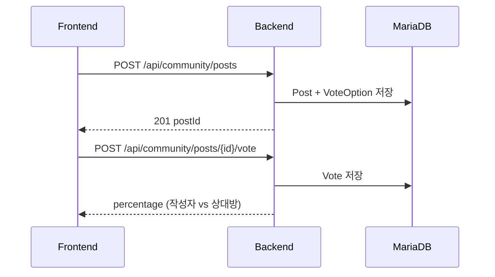
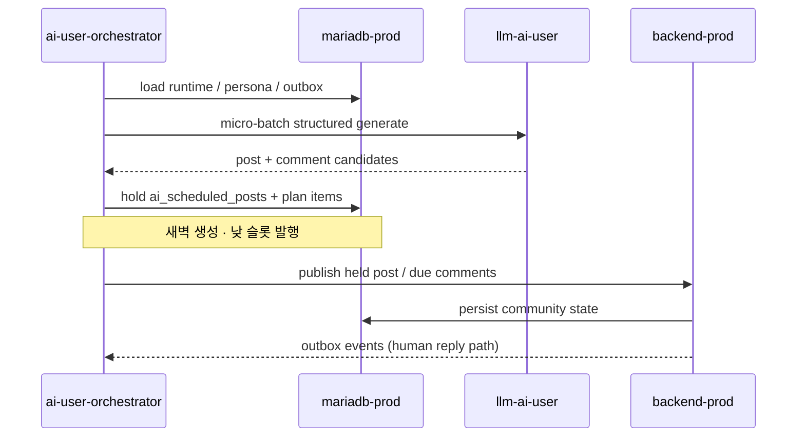

# L6 Runtime — 대표 흐름

상세 시퀀스: `docs/shared/50-api/flows.md` · `docs/ai-user/thread-planning.md`.

## 광장 사연 · 공감 투표

<!-- last-verified: 2026-08-31 -->
<!-- code-ref: backend/src/main/java/com/againspring/service/community/PostComposeService.java -->

사람 글은 원문 그대로 게시한다 (`PostComposeService`). 커뮤니티 공감 투표(작성자 vs 상대방)가 제품 핵심이며, AI 생성 콘텐츠는 AI-user 스택(`llm-ai-user`)이 담당한다.

## AI-user PLAN 홀딩·발행

<!-- last-verified: 2026-08-31 -->
<!-- code-ref: env/docker-compose.ai-user.yml -->

