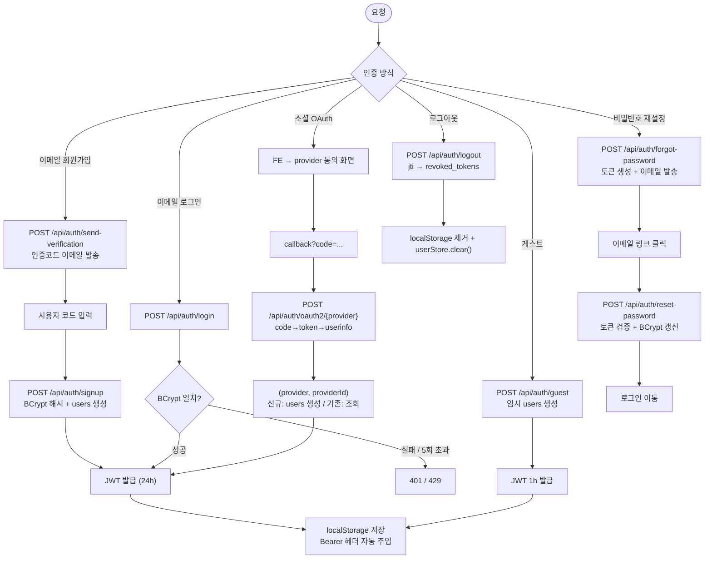

# 인증 정책

3가지 인증 경로: 이메일 회원가입 · 게스트 토큰 · 소셜 OAuth (Google/Kakao/Naver). 모두 동일한 JWT 발급으로 수렴.

## Source of truth

- BE 컨트롤러: `backend/.../api/AuthController.java`, `OAuth2Controller.java`
- 서비스: `backend/.../service/AuthService.java`, `EmailVerificationService.java`, `LogoutService.java`, `PasswordResetService.java`, `oauth/OAuthProviderService.java`
- 보안: `backend/.../security/{JwtService, JwtAuthFilter, SecurityConfig, RateLimitFilter, UserDetailsServiceImpl}.java`
- DB: `users`, `email_verifications`, `password_reset_tokens`, `revoked_tokens`, `guest_sessions` (Flyway V1, V2, V3, V4)
- FE: `frontend/lib/api/client.ts` (Bearer interceptor), `frontend/lib/store/userStore.ts` (token persist)
- FE 페이지: `frontend/app/auth/{login,signup,guest,callback,forgot-password}/`

## 인증 흐름 개요

<!-- last-verified: 2026-08-31 -->
<!-- code-ref: backend/src/main/java/com/againspring/security/JwtAuthFilter.java -->


## JWT

| 항목 | 값 |
|---|---|
| 알고리즘 | HS256 |
| 비밀 | `JWT_SECRET` (≥256bit) |
| 유효기간 (회원) | 24시간 |
| 유효기간 (게스트) | 1시간 |
| 발급자 | `AuthService` |
| 검증 | `JwtAuthFilter` (모든 요청 1회) |
| 로그아웃 처리 | `LogoutService` → `revoked_tokens.jti` 추가 → `JwtAuthFilter`가 검사 |
| 만료 토큰 정리 | `RevokedTokenCleanupScheduler` (cron `0 0 4 * * *`) |

토큰은 FE의 `localStorage.again-spring-token`에 저장. axios 인터셉터가 자동 주입.

## 1) 이메일 회원가입

```
POST /api/auth/send-verification
{ "email": "user@example.com" }
  ↓
EmailVerificationService → email_verifications 행 생성 (6자리 코드, 만료 10분)
  ↓
사용자가 코드 확인
  ↓
POST /api/auth/signup
{ "email", "password", "code", "nickname" }
  ↓
AuthService → BCrypt 해시 → users 행 생성 → JWT 발급
```

비밀번호 정책: 영문+숫자+특수문자 ≥ 8자. (BE는 길이만 검증, 강도는 FE에서)

## 2) 로그인

```
POST /api/auth/login { "email", "password" }
  ↓
AuthService → BCrypt 비교 → JWT 발급
```

실패 시 `401 UNAUTHORIZED`. 5회/분/IP 초과 시 RateLimitFilter가 `429`.

## 3) 게스트 토큰

```
POST /api/auth/guest { "nickname": "게스트" }
  ↓
AuthService → 임시 User 생성 (guest_id 형식: "Guest-XXXXXX") → 1h JWT 발급
```

세션 초대 링크로 들어온 게스트는 `guest_sessions` 테이블에 invite_token + guest_id 매핑 저장 (재방문 시 동일 ID 유지).

## 4) Google / Kakao / Naver OAuth

```
FE: window.location → {provider}/oauth?client_id=...&redirect_uri=APP_URL/auth/callback/{provider}
  ↓
사용자 동의
  ↓
{provider} → APP_URL/auth/callback/{provider}?code=...
  ↓
FE: POST /api/auth/oauth2/{provider} { "code": "..." }
  ↓
OAuth2Controller → OAuthProviderService:
  1. code → access_token (provider 토큰 엔드포인트)
  2. access_token → userinfo (provider userinfo 엔드포인트)
  3. (provider, providerId) 조회 → 신규면 users 행 생성, 기존이면 가져옴
  4. JWT 발급
```

지원 provider:

| Provider | Token endpoint | UserInfo endpoint |
|---|---|---|
| google | `oauth2.googleapis.com/token` | `googleapis.com/oauth2/v3/userinfo` |
| kakao | `kauth.kakao.com/oauth/token` | `kapi.kakao.com/v2/user/me` |
| naver | `nid.naver.com/oauth2.0/token` | `openapi.naver.com/v1/nid/me` |

DB 매핑: `users.provider` (google/kakao/naver/null), `users.provider_id` (provider의 user id), unique key `(provider, provider_id)`.

`APP_URL`은 환경별 다름 — `env/.env.{dev,prod}.example` 참조.

FE의 build-time ARG (`NEXT_PUBLIC_{GOOGLE,KAKAO,NAVER}_CLIENT_ID`)로 클라이언트 ID 정적 인라인.

## 5) 비밀번호 재설정

```
POST /api/auth/forgot-password { "email" }
  ↓
PasswordResetService → password_reset_tokens 생성 (32 byte 토큰, 만료 30분) → 이메일 발송
  ↓
사용자가 이메일 링크 클릭 → /auth/reset-password/{token}
  ↓
POST /api/auth/reset-password { "token", "newPassword" }
  ↓
PasswordResetService → 토큰 검증 → BCrypt 갱신 → 토큰 used=true
```

## 6) 로그아웃

```
POST /api/auth/logout
  ↓
LogoutService → 현재 토큰의 jti를 revoked_tokens에 추가
  ↓
이후 같은 토큰은 JwtAuthFilter에서 거부
```

FE는 추가로 `localStorage.again-spring-token` 제거 + `userStore.clear()`.

## 인증 필요 여부

| 엔드포인트 | 인증 |
|---|---|
| `POST /api/auth/{signup,login,guest,send-verification,forgot-password,reset-password}` | ✗ |
| `POST /api/auth/logout` | ✓ |
| `POST /api/auth/oauth2/{provider}` | ✗ |
| `GET /api/users/me`, `POST .../onboarding`, `DELETE` | ✓ |
| `POST /api/sessions`, `GET /api/sessions/me` | ✓ |
| `POST /api/sessions/join/{token}` | ✗ (토큰 검증 후 게스트 발급도 가능) |
| `POST /api/sessions/{id}/turns` | ✓ |
| `POST /api/sessions/{id}/report`, `GET /api/reports/{id}` | ✓ |
| `GET /api/users/me/relationships*` | ✓ |
| `GET /api/health`, Swagger | ✗ |

## Rate Limit (RateLimitFilter, bucket4j)

| 엔드포인트 | 제한 |
|---|---|
| `/api/auth/{signup,login,send-verification,forgot-password}` | 5/분/IP |
| `/api/sessions` POST | 10/시간/사용자 |
| `/api/sessions/*/turns` | 30/분/세션 |
| 기타 | 60/분/사용자 |

초과 시 `429 Too Many Requests` + `Retry-After` 헤더.

## 게스트 → 회원 승격

게스트가 세션 진행 중 회원가입하면:
1. 새 User 생성
2. 게스트 토큰의 user_id로 연결된 sessions / turns / reports의 owner를 새 user_id로 이전
3. `guest_sessions` 행 삭제
4. 새 회원 JWT 발급 (24h)

## v2 결정 흡수

- 결과 후 회원가입 게이트 (commit 003557a) — 온보딩 결과 카드 본 후 가입 유도
- Google OAuth만 운영 활성, Kakao/Naver는 환경변수 채우면 자동 활성

## 변경 시 절차

1. 새 OAuth provider 추가: `OAuthProviderService` + `OAuthUserInfo` + 환경변수 추가 + FE OAuth 헬퍼 갱신
2. JWT 만료 시간 변경: `application.yml` `jwt.expiration` 값 + 본 문서
3. Rate limit 변경: `RateLimitFilter` + 본 문서
